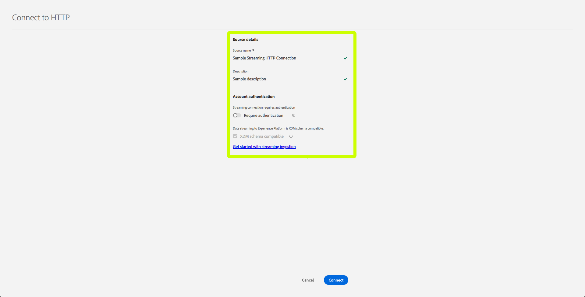

# 使用UI建立串流連線

本UI指南將協助您使用Adobe Experience Platform建立串流連線。

## 快速入門

若要開始串流資料至， [!DNL Experience Platform]您必須先建立串流HTTP連線。 建立串流連線時，您需要提供關鍵詳細資料，例如串流資料來源，以及您是否要從受信任（已驗證）或不受信任（未驗證）來源傳送資料。

在註冊串流連線後，您將擁有可用來串流資料的唯一URL [!DNL Platform]。

請注意，為了完成本指南，您需要存取Adobe Experience Platform。 如果您沒有存取權，請先與 [!DNL Platform]系統管理員聯絡，再繼續。

## 建立串流連線

登入UI後，按一 [!DNL Experience Platform] 下「來源 **** 」以開啟「 **[!UICONTROL 目錄]** 」標籤。 此頁面將可用的來源類型顯示為個別卡片，每張卡片都包含泡泡，顯示從串流連線到資料集所建立的資料流數。

在「來 **[!UICONTROL 源]** 」頁面上，按一下 **[!UICONTROL HTTP API]**，然後按 **[!UICONTROL 一下「連線來源」]**。

出現 **[!UICONTROL 「Connect to HTTP]** （連接到HTTP）」螢幕。 在「 **[!UICONTROL 服務詳細資]**」下，提供新串流連 **[!UICONTROL 線的名稱]****[!UICONTROL 和說明]** 。

在「 **[!UICONTROL 帳戶驗證]**」下，為串流連線選取下列組態屬性：

- **[!UICONTROL 驗證]:** 無論串流連線是否需要驗證。 驗證可確保從受信任的來源收集資料。 如果處理個人識別資訊(PII)，建議開啟此功能。
- **[!UICONTROL XDM模式相容性]:** 此串流連線是否會傳送與XDM架構相容的事件。 依預設，此屬性會 **開啟**。

選擇完配置屬性後，按一下「連 **[!UICONTROL 接」]**。 您的串流HTTP連線現在已建立，現在可在「來源」工作區的「瀏 **[!UICONTROL 覽]** 」標籤下 **[!UICONTROL 檢視]** 。

在「瀏 **[!UICONTROL 覽]** 」標籤中，您可以按一下新建立的串流HTTP連線，並檢視該連線的詳細資訊。

按一下連線名稱的超連結，您就可以透過設定所連接的資料集，來選取要顯示的資料，方法是按一下「選 **[!UICONTROL 取資料」]**。

您可以建 [立新資料集](#create-a-new-dataset) , [或使用現有資料集](#use-an-existing-dataset)。

### 建立新資料集

若要建立新資料集，請提 **[!UICONTROL 供資料集的]** Name **[!UICONTROL 、Description]**，以及 **[!UICONTROL 目標Schema]** 。

插入所有詳細資訊並按一下「下 **[!UICONTROL 一步]**」後，您可以先檢視所提供的詳細資訊，再按一下「完成 **** 」將資料集連接至您的串流HTTP連線。

### 使用現有資料集

若要使用現有資料集，請選取「輸 **[!UICONTROL 出資料集名稱」]**。

按一下「 **[!UICONTROL 下一步]**」後，您可以先檢閱詳細資訊，再按一下「完成 **** 」，將選取的資料集連接至您的串流HTTP連線。

## 後續步驟

在本教學課程中，您已建立串流HTTP連線，讓您使用串流端點來存取各種 [!DNL Data Ingestion] API。 如需在API中建立串流連線的指示，請閱讀建立串 [流連線教學課程](../tutorials/create-streaming-connection.md)。
