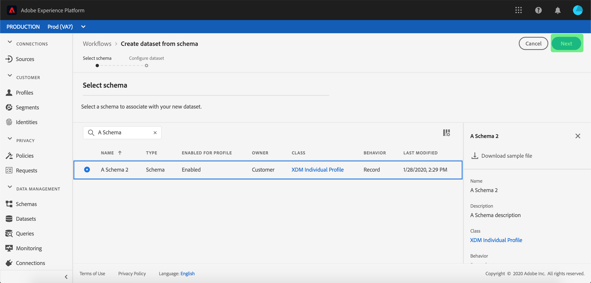

# 將資料擷取至 Adobe Experience Platform

Adobe Experience Platform可讓您輕鬆將資料匯入 [!DNL Platform] 作為批次檔案。 要擷取的資料範例可能包括來自CRM系統中平面檔案（例如Parquet檔案）的設定檔資料，或是符合已知的資料 [!DNL Experience Data Model] (XDM)結構描述。

## 快速入門

若要完成本教學課程，您必須擁有 [!DNL Experience Platform]. 如果您無權存取中的組織 [!DNL Experience Platform]，請在繼續之前聯絡您的系統管理員。

如果您偏好使用資料擷取API來擷取資料，請先閱讀 [批次擷取開發人員指南](../batch-ingestion/api-overview.md).

## 資料集工作區

內的資料集工作區 [!DNL Experience Platform] 可讓您檢視和管理貴組織建立的所有資料集，以及建立新的資料集。

按一下以檢視資料集工作區 **[!UICONTROL 資料集]** 左側導覽中的。 資料集工作區包含資料集清單，包括顯示名稱、建立日期（日期和時間）、來源、結構描述和上次批次狀態，以及上次更新資料集的日期和時間的欄。

>[!NOTE]
>
>按一下搜尋列旁的篩選圖示，即可使用篩選功能，只檢視針對以下專案啟用的資料集： [!DNL Profile].

## 建立資料集

若要建立資料集，請按一下 **[!UICONTROL 建立資料集]** 資料集工作區的右上角。

於 **[!UICONTROL 建立資料集]** 畫面，選擇您是否要&quot;[!UICONTROL 從結構描述建立資料集]「或」[!UICONTROL 從CSV檔案建立資料集]「。

在本教學課程中，將使用結構描述來建立資料集。 按一下 **[!UICONTROL 從結構描述建立資料集]** 以繼續。

## 選取資料集結構描述

於 **[!UICONTROL 選取結構描述]** 熒幕上，按一下您要使用之綱要旁的單選按鈕來選擇綱要。 在本教學課程中，將使用忠誠會員結構描述建立資料集。 使用搜尋列篩選結構描述是尋找確切結構描述的實用方法。

選取要使用的綱要旁的單選按鈕後，請按一下 **[!UICONTROL 下一個]**.

## 設定資料集

於 **[!UICONTROL 設定資料集]** 畫面中，您必須為資料集命名，並可能提供資料集的說明。

**資料集名稱附註：**

- 資料集名稱應簡短且具有描述性，以便日後在程式庫中輕鬆找到資料集。
- 資料集名稱必須是唯一的，這表示資料集名稱也應足夠具體，以便將來不會重複使用。
- 最佳實務是使用說明欄位來提供資料集的額外資訊，因為這樣可協助其他使用者日後區分資料集。

資料集有了名稱和說明後，請按一下 **[!UICONTROL 完成]**.

## 資料集活動

現在已建立空白的資料集，且您已返回 **[!UICONTROL 資料集活動]** 資料集工作區中的「 」索引標籤。 您應該會在工作區的左上角看到資料集的名稱，同時會看到「尚未新增任何批次」的通知。 這是正常現象，因為您尚未將任何批次新增至此資料集。

在資料集工作區的右側，您會看到 **[!UICONTROL 資訊]** 索引標籤內含與新資料集相關的資訊，例如資料集ID、名稱、說明、表格名稱、結構、串流和來源。 「資訊」索引標籤也包含資料集的建立時間及其上次修改日期的相關資訊。

另外，在「資訊」標籤中為  **[!UICONTROL 設定檔]** 用於啟用您的資料集以搭配使用的切換按鈕 [!DNL Real-Time Customer Profile]. 使用此切換開關，以及 [!DNL Real-Time Customer Profile]，將於下一節中更詳細地說明。

## 啟用資料集 [!DNL Real-Time Customer Profile]

資料集是用來將資料擷取到 [!DNL Experience Platform]，而這些資料最終可用來識別個人，並將來自多個來源的資訊彙整在一起。 將資訊拼接在一起稱為 [!DNL Real-Time Customer Profile]. 為了 [!DNL Platform] 以得知哪些資訊應包含在 [!DNL Real-Time Profile]，資料集可以使用以下專案標籤為包含： **[!UICONTROL 設定檔]** 切換。

依預設，此切換為關閉。 如果您選擇開啟 [!DNL Profile]，所有內嵌至資料集的資料，都會用於協助識別個人並將其 [!DNL Real-Time Profile].

若要深入瞭解 [!DNL Real-Time Customer Profile] 並使用身分，請檢閱 [Identity Service](../../identity-service/home.md) 說明檔案。

啟用資料集的方式 [!DNL Real-Time Customer Profile]，按一下 **[!UICONTROL 設定檔]** 切換至 **[!UICONTROL 資訊]** 標籤。

系統會顯示一個對話方塊，要求您確認要啟用資料集 [!DNL Real-Time Customer Profile].

按一下 **[!UICONTROL 啟用]** 而且切換會變成藍色，表示已開啟。

## 新增資料到資料集

資料可以透過多種不同方式新增到資料集中。 您可以選擇使用 [!DNL Data Ingestion] API或ETL合作夥伴，例如 [!DNL Unifi] 或 [!DNL Informatica]. 在本教學課程中，將會使用將資料新增至資料集 **[!UICONTROL 新增資料]** UI中的索引標籤。

若要開始將資料新增至資料集，請按一下 **[!UICONTROL 新增資料]** 標籤。 您現在可以拖放檔案，或瀏覽電腦尋找要新增的檔案。

>[!NOTE]
>
>Platform支援兩種檔案型別以進行資料擷取：Parquet或JSON。 您一次最多可以新增5個檔案，每個檔案的最大檔案大小為1 GB。

## 上傳檔案

拖放（或瀏覽並選取）您要上傳的Parquet或JSON檔案後， [!DNL Platform] 將立即開始處理檔案，並 **[!UICONTROL 正在上傳]** 對話方塊將顯示在 **[!UICONTROL 新增資料]** 標籤中顯示的檔案上傳進度。

## 資料集量度

檔案上傳完成後， **[!UICONTROL 資料集活動]** 索引標籤不再顯示「未新增任何批次」。 取而代之的是 **[!UICONTROL 資料集活動]** 索引標籤現在會顯示資料集量度。 在此階段，所有量度都會顯示「0」，因為批次尚未載入。

標籤底部有一個清單，顯示 **[!UICONTROL 批次識別碼]** 剛從擷取的資料中 [「新增資料至資料集」](#add-data-to-dataset) 程式。 也包括與批次相關的資訊，包括擷取日期、擷取的記錄數以及目前的批次狀態。

## 批次詳細資料

按一下 **[!UICONTROL 批次識別碼]** 若要檢視 **[!UICONTROL 批次總覽]**，顯示批次的其他詳細資訊。 批次載入完成後，批次的相關資訊將會更新，以顯示擷取的記錄數量和檔案大小。 狀態也會變更為「成功」或「失敗」。 如果批次失敗 **[!UICONTROL 錯誤代碼]** 區段將包含有關擷取期間任何錯誤的詳細資訊。

如需有關批次擷取的詳細資訊和常見問題，請參閱 [批次擷取疑難排解指南](../batch-ingestion/troubleshooting.md).

若要返回 **[!UICONTROL 資料集活動]** 畫面中，按一下資料集的名稱(**[!UICONTROL 熟客方案細節]**)中。

## 預覽資料集

資料集準備就緒後，將有一個選項可 **[!UICONTROL 預覽資料集]** 顯示在上方 **[!UICONTROL 資料集活動]** 標籤。

按一下 **[!UICONTROL 預覽資料集]** 以開啟顯示資料集內範例資料的對話方塊。 如果資料集是使用結構描述建立的，則資料集結構描述的詳細資料將顯示在預覽的左側。 您可以使用箭頭來展開結構描述，以檢視結構描述結構。 預覽資料中的每個欄標題都代表資料集中的欄位。

## 後續步驟和其他資源

現在您已建立資料集並成功將資料內嵌至 [!DNL Experience Platform]，您可以重複這些步驟來建立新資料集，或將更多資料擷取至現有資料集。

若要進一步瞭解批次擷取，請閱讀 [批次擷取概觀](../batch-ingestion/overview.md) 並透過觀看以下影片來補充您的學習。

>[!WARNING]
>
>此 [!DNL Platform] 以下影片中顯示的UI已過期。 請參閱上述檔案，瞭解最新的UI熒幕擷取畫面及功能。

>[!VIDEO](https://video.tv.adobe.com/v/27269?quality=12&learn=on)
