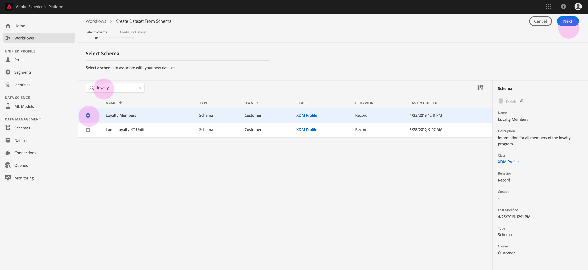

# 將資料內嵌至Adobe Experience Platform

Adobe Experience Platform可讓您輕鬆將資料匯入成批 [!DNL Platform] 次檔案。 要提取的資料示例可以包括來自CRM系統中的平面檔案（如鑲木地板檔案）的概要檔案資料或符合模式註冊表中的已知 [!DNL Experience Data Model] (XDM)模式的資料。

## 快速入門

若要完成本教學課程，您必須擁有存取權 [!DNL Experience Platform]。 如果您無權存取中的IMS組織，請先與您的系 [!DNL Experience Platform]統管理員聯絡，然後再繼續。

如果您想要使用Data Ingestion API來擷取資料，請先閱讀 [Batch Ingestion開發人員指南](../batch-ingestion/api-overview.md)。

## 資料集工作區

Datasets工作區 [!DNL Experience Platform] 可讓您檢視和管理IMS組織建立的所有資料集，並建立新的資料集。

按一下左側導覽中的「資 **[!UICONTROL 料集]** 」，檢視「資料集」工作區。 「資料集」清單包含 _Name_、Created _（日期和時間）、Created_ (Source Date and Time)、 ________ Source Chema Last Batch Status、As as the Date and time the date ad Last Jodat Jadepated Last Plast.

>[!NOTE]
>
>按一下搜尋列旁的篩選圖示，使用篩選功能僅檢視已啟用的資料集 [!DNL Profile]。

## 建立資料集

若要建立資料集，請按一 **[!UICONTROL 下「資料集]** 」工作區右上角的「建立資料集」。

在「建 **[!UICONTROL 立資料集]** 」畫面上，選取您要「從架構建立資料集[!UICONTROL 」還是「從CSV檔案]建立資料集」。

在本教學課程中，將使用模式來建立資料集。 按一 **[!UICONTROL 下「從架構建立資料集]** 」以繼續。

## 選擇資料集模式

在「選 **[!UICONTROL 擇方案]** 」螢幕上，按一下要使用的方案旁邊的單選按鈕選擇方案。 在本教學課程中，資料集將使用「忠誠度成員」架構建立。 使用搜尋列來篩選結構描述是找到您所尋找的精確結構描述的有用方式。

在選擇了要使用的方案旁邊的單選按鈕後，按一下「下 **[!UICONTROL 一步]**」。

## 設定資料集

在「設 **[!UICONTROL 定資料集]** 」畫面上，您必須為資料集指定名稱 **[!UICONTROL ，並且可能也會提供資料集]** 的說明 **** 。

**資料集名稱的附註：**

- 資料集名稱應簡短且具說明性，以便稍後在資料庫中輕鬆找到資料集。
- 資料集名稱必須是唯一的，這表示資料集名稱也應足夠具體，以免日後重複使用。
- 最好使用說明欄位來提供資料集的其他相關資訊，因為這可協助其他使用者在未來區隔資料集。

資料集有名稱和說明後，按一下「完 **[!UICONTROL 成]**」。

## 資料集活動

現在已建立空的資料集，您已返回「資料集」工作區 **[!UICONTROL 的「資料集活動]** 」標籤。 您應該會在工作區的左上角看到資料集名稱，以及「未新增任何批次」通知。 由於您尚未將任何批次新增至此資料集，因此預期會出現此情況。

在Datasets的右側，您會看到與新資料集相關的 **[!UICONTROL Info]**_Tab，例如_ Info _ID、AdSignDesignDesignDesignDesignDesignDatases,___________ DDDSigSiDSinasig。 「資訊」標籤也包含資料集何時建立及其「上 _次修改_ 」日 _期的相關資訊_ 。

另外，在「資訊」索引標籤中 _也有「設定檔_ 」切換，用於啟用您的資料集以搭配使用 [!DNL Real-time Customer Profile]。 此切換的使用， [!DNL Real-time Customer Profile]以及，將在後面的章節中詳細說明。

## 啟用資料集 [!DNL Real-time Customer Profile]

資料集會用來將資料收 [!DNL Experience Platform]入資料中，而資料最終會用來識別個人，並將來自多個來源的資訊結合在一起。 將資訊整合在一起的資訊稱為 [!DNL Real-Time Customer Profile]。 為了瞭解應 [!DNL Platform] 該在中包含哪些資訊， [!DNL Real-Time Profile]可使用「描述檔」切換來標籤要包 **[!UICONTROL 含的資料集]** 。

依預設，此切換為關閉。 如果您選擇開啟， [!DNL Profile]所有收錄到資料集的資料都將用來協助識別個人，並將其結合在一起 [!DNL Real-Time Profile]。

若要進一步瞭解 [!DNL Real-time Customer Profile] 及使用身分識別，請參閱 [Identity Service](../../identity-service/home.md) 檔案。

若要啟用資料集 [!DNL Real-time Customer Profile]，請按一下「資 **[!UICONTROL 訊]** 」標籤中的「設定 **[!UICONTROL 檔]** 」切換。

會出現對話方塊，要求您確認您要啟用即時客戶個人檔案的資料集。

按一 **[!UICONTROL 下「啟用]** 」，切換將會變成藍色，表示已開啟。

## 新增資料至資料集

資料可以多種不同的方式新增至資料集。 您可以選擇使用資料擷取API或ETL合作夥伴，例如Unifi或Informatica。 在本教學課程中，資料將會使用UI中的「新增資 **[!UICONTROL 料]** 」標籤新增至資料集。

若要開始將資料新增至資料集，請按一下「新增 **[!UICONTROL 資料]** 」標籤。 您現在可以拖放檔案，或瀏覽您的電腦以尋找您要新增的檔案。

>[!NOTE]
>
>[!DNL Platform] 支援兩種檔案類型以擷取資料，請拼字或JSON。 一次最多可以添加五個檔案，每個檔案的最大檔案大小為10 GB。

## 上傳檔案

在您拖放（或瀏覽並選取）想要上傳的鑲木地板或JSON檔案後，就會立即開始處理檔案，而「新增資料 [!DNL Platform]******** 」索引標籤上會出現「上傳」對話方塊，顯示檔案上傳的進度。

## 資料集度量

檔案上傳完成後，「資料集活 **[!UICONTROL 動]** 」標籤不會再顯示「未新增任何批次」。 現在，「資料集活動」標籤會顯示資料集度量。 由於批次尚未載入，所有量度在此階段會顯示「0」。

在標籤的底部有一個清單，其中顯示剛透過「新增資料至資料集」程式所擷取之 _資料的批次ID_ 。 另外還包括與批相關的資訊，包括「 _吸收日期_ 」、「吸收 _記錄數_」和當前批狀 _態_。

## 批次詳細資訊

按一下「批 _次ID_ 」以檢視「批 **[!UICONTROL 次概述」]**，顯示有關批次的其他詳細資訊。 在批次完成載入後，有關批次的資訊將會更新，以顯示「已收錄的記 _錄數_ 」和「檔 _案大小」_。 「狀 _態_ 」也會變更為「成功」或「失敗」。 如果批處理失敗，「錯 _誤代碼_ 」部分將包含有關接收過程中任何錯誤的詳細資訊。

如需有關批次擷取的詳細資訊和常見問題，請參閱批次擷取 [疑難排解指南](../batch-ingestion/troubleshooting.md)。

若要返回「資 **料集活動** 」畫面，請按一下網站導覽路徑標示中的資料集名稱(_Loyalty Details_)。

## 預覽資料集

資料集準備就緒後，「資料集活動」 **[!UICONTROL 標籤的頂端會顯示]** 「預覽資 **[!UICONTROL 料集」選項]** 。

按一 **[!UICONTROL 下「預覽資料集]** 」以開啟對話方塊，顯示資料集內的範例資料。 如果使用模式建立資料集，則資料集模式的詳細資料會顯示在預覽的左側。 可以使用箭頭展開模式以查看模式結構。 預覽資料中的每個欄標題代表資料集中的欄位。

## 後續步驟和其他資源

現在您已建立資料集並成功將資料擷取至中 [!DNL Experience Platform]，您可以重複這些步驟以建立新資料集或將更多資料擷取至現有資料集。

若要進一步瞭解批次擷取，請閱讀「批次擷取 [」概觀](../batch-ingestion/overview.md) ，並觀賞以下影片以補充您的學習。

>[!WARNING]
>
> 下 [!DNL Platform] 列視訊中顯示的UI已過時。 請參閱上述檔案以取得最新的UI螢幕擷取和功能。

>[!VIDEO](https://video.tv.adobe.com/v/27269?quality=12&learn=on)
