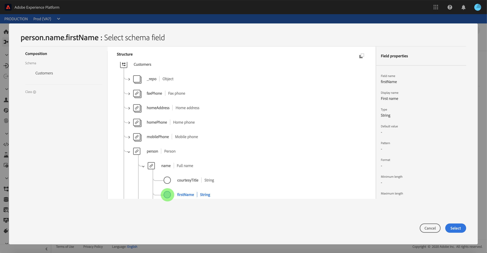
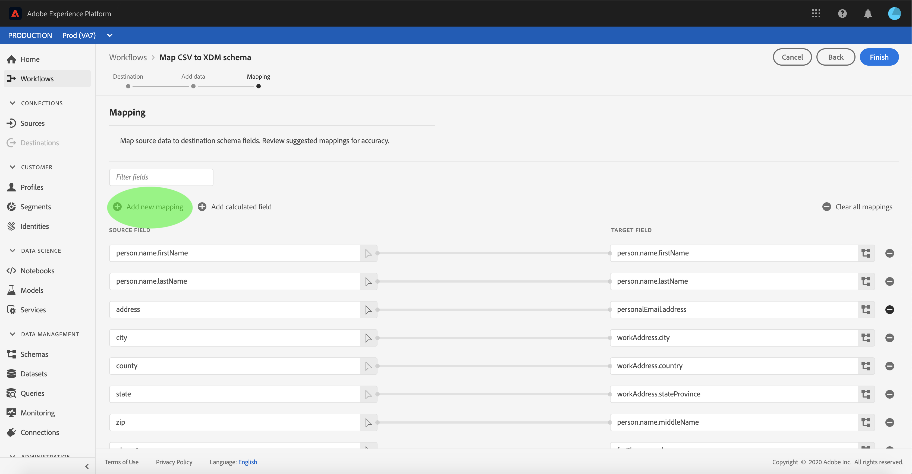

# 將CSV檔案對應至XDM架構

為了將CSV資料內嵌 [!DNL Adobe Experience Platform]至中，資料必須對應至 [!DNL Experience Data Model] (XDM)架構。 本教學課程介紹如何使用使用者介面將CSV檔案對應至XDM [!DNL Platform] 架構。

此外，本教學課程的附錄還提供有關使用映射功能的進 [一步資訊](#mapping-functions)。

## 快速入門

本教學課程需要有效瞭解下列元件 [!DNL Platform]:

- [!DNL Experience Data Model (XDM System)](../../xdm/home.md): 組織客戶體驗資料 [!DNL Platform] 的標準化架構。
- [!DNL Batch ingestion](../batch-ingestion/overview.md): 從用戶提供的數 [!DNL Platform] 據檔案中提取資料的方法。

本教學課程也要求您已建立資料集，以將CSV資料收錄至。 如需在UI中建立資料集的步驟，請參閱資料 [收錄教學課程](./ingest-batch-data.md)。

## 選擇目標

登入，然 [!DNL Adobe Experience Platform](https://platform.adobe.com) 後從左側導 **[!UICONTROL 覽列選取「工作流程]** 」以存取「工作 *[!UICONTROL 流程]* 」工作區。

在「工 **[!UICONTROL 作流程]** 」螢幕中，選擇 **[!UICONTROL 「]** Data ingestion **[!UICONTROL 」部分下的「將CSV映射到XDM模式」，然後選]******&#x200B;擇LaunchChec。

將 *[!UICONTROL CSV對應至XDM架構]* ，從「目標」步驟 *[!UICONTROL 開始]* 。 選擇要接收傳入資料的資料集。 您可以使用現有資料集或建立新資料集。

**使用現有資料集**

若要將CSV資料內嵌至現有資料集，請選取「使 **[!UICONTROL 用現有資料集」]**。 您可以使用搜尋函式或捲動面板中現有資料集的清單來擷取現有資料集。

若要將CSV資料內嵌至新資料集，請選取「 **[!UICONTROL Create new dataset]** 」（建立新資料集），並在提供的欄位中輸入資料集的名稱和說明。 使用搜索函式或滾動提供的方案清單來選擇方案。 選擇 **[!UICONTROL 下一步]** ，繼續。

## 新增資料

此時將 *[!UICONTROL 顯示「添加資料]* 」步驟。 將CSV檔案拖放至提供的空間，或選取「選 **[!UICONTROL 擇檔案]** 」以手動輸入CSV檔案。

上 *[!UICONTROL 傳檔案後]* ,「範例資料」區段就會出現，顯示前10列資料。 確認資料已如預期上傳後，請選取「下一 **[!UICONTROL 步」]**。

## 將CSV欄位對應至XDM結構欄位

此時將 *[!UICONTROL 顯示]* 「映射」步驟。 CSV檔案的欄位列在「來源欄位」 *[!UICONTROL 下]*，其對應的XDM架構欄位列在「目標欄位」 *[!UICONTROL 下]*。 未選取的目標欄位以紅色勾勒。 您可以使用篩選欄位選項來縮小可用來源欄位的清單。

要將CSV列映射到XDM欄位，請選擇該列相應目標欄位旁的架構表徵圖。

將出 *[!UICONTROL 現「選擇方案]* 」欄位窗口。 您可以在這裡導覽XDM架構的結構，並找出您要將CSV欄對應至的欄位。 按一下XDM欄位以選取它，然後按一下「選 **[!UICONTROL 取]**」。

「映 *[!UICONTROL 射]* 」畫面會重新出現，選取的XDM欄位現在會顯示在「目標 *[!UICONTROL 欄位」下]*。

如果您不想映射特定CSV欄，可以按一下目標欄位旁的「移 **除** 」圖示來移除映射。 您也可以通過選擇清除所有映射按鈕來 **[!UICONTROL 刪除所有映射]**。

如果要添加新映射，請選擇「源 **[!UICONTROL 欄位」清單頂部的]** 「添加 *[!UICONTROL 新映射]* 」。

在映射欄位時，您還可以包括函式，以便根據輸入源欄位計算值。 如需詳 [細資訊](#mapping-functions) ，請參閱附錄中的對應函式一節。

### 新增計算欄位

計算欄位允許根據輸入方案中的屬性建立值。 然後，這些值可以分配給目標方案中的屬性，並提供名稱和說明，以便更方便地引用。

選擇「添 **[!UICONTROL 加計算欄位]** 」按鈕以繼續。

此時將 **[!UICONTROL 出現「建立計算欄位]** 」面板。 左側對話方塊包含計算欄位中支援的欄位、函式和運算子。 選擇一個頁籤，開始向表達式編輯器添加函式、欄位或運算子。

| 定位 | 說明 |
| --------- | ----------- |
| 欄位 | 「欄位」頁籤列出了源方案中可用的欄位和屬性。 |
| 函數 | 函式頁籤列出了可用於轉換資料的函式。 |
| 運算子 | 運算子標籤會列出可用來轉換資料的運算子。 |

您可以使用中心的運算式編輯器手動新增欄位、函式和運算子。 選擇編輯器以開始建立表達式。

選擇「 **[!UICONTROL 保存]** 」繼續。

映射螢幕將重新顯示，並顯示新建立的源欄位。 應用相應的目標欄位並選擇 **[!UICONTROL 完成]** ，以完成映射。

## 監控資料流

一旦映射並建立CSV檔案後，您就可以監控透過它擷取的資料。 有關監視資料流的詳細資訊，請參見有關監視流資料流 [的教程](../../ingestion/quality/monitor-data-flows.md)。

## 後續步驟

在本教學課程中，您已成功將平面CSV檔案對應至XDM架構，並將它加入其中 [!DNL Platform]。 此資料現在可供下游服務 [!DNL Platform] 使用，例如 [!DNL Real-time Customer Profile]。 如需詳細資訊， [!DNL Real-time Customer Profile](../../profile/home.md) 請參閱總覽。

## 附錄

下節提供將CSV欄對應至XDM欄位的其他資訊。

### 映射函式

某些映射函式可用於根據在源欄位中輸入的內容計算和計算值。 若要使用函式，請在「來源欄位」下方輸入 *[!UICONTROL 函式]* ，並輸入適當的語法和輸入。

例如，若要串連 **城市****CSV和國家／地區** CSV欄位，並將它們指派至 **城市** XDM欄位，請將來源欄位設為 `concat(city, ", ", county)`。

下表列出所有支援的映射函式，包括範例運算式及其產生的輸出。

| 函數 | 說明 | 範例運算式 | 範例輸出 |
| -------- | ----------- | ----------------- | ------------- |
| concat | 串連指定的字串。 | concat(&quot;Hi, &quot;, &quot;there&quot;, &quot;!&quot;) | `"Hi, there!"` |
| 爆炸 | 根據規則運算式分割字串，並傳回部件陣列。 | explode(&quot;Hi, there!&quot;, &quot;) | `["Hi,", "there"]` |
| instr | 傳回子字串的位置／索引。 | instr(&quot;adobe.com&quot;, &quot;com&quot;) | 6 |
| replacestr | 如果原始字串中有搜尋字串，請取代該搜尋字串。 | replacestr(&quot;This is a string re test&quot;, &quot;re&quot;, &quot;replace&quot;) | &quot;這是字串替換測試&quot; |
| substr | 傳回指定長度的子字串。 | substr(&quot;This is a substring test&quot;, 7, 8) | &quot; a subst&quot; |
| lower / lcase | 將字串轉換為小寫。 | lower(&quot;HeLLo&quot;) lcase(&quot;HeLLo&quot;) | &quot;hello&quot; |
| upper / ucase | 將字串轉換為大寫。 | upper(&quot;HeLLo&quot;) ucase(&quot;HeLLo&quot;) | &quot;HELLO&quot; |
| split | 在分隔符上拆分輸入字串。 | split(&quot;Hello world&quot;, &quot; &quot;) | `["Hello", "world"]` |
| 加入 | 使用分隔符連接對象清單。 | `join(" ", ["Hello", "world"]`) | &quot;Hello world&quot; |
| 聚結 | 傳回指定清單中的第一個非空值物件。 | coalesce(null, null, null, &quot;first&quot;, null, &quot;second&quot;) | &quot;first&quot; |
| 解碼 | 給定一個鍵和一個作為陣列平面化的鍵值對清單，如果找到鍵，該函式將返回該值，如果在陣列中存在，則返回預設值。 | decode(&quot;k2&quot;, &quot;k1&quot;, &quot;v1&quot;, &quot;k2&quot;, &quot;v2&quot;, &quot;default&quot;) | &quot;v2&quot; |
| if | 評估給定的布爾表達式，並根據結果返回指定的值。 | if(&quot;s&quot;。equalsIgnoreCase(&quot;S&quot;), &quot;True&quot;, &quot;False&quot;) | &quot;True&quot; |
| min | 返回給定參數的最小值。 使用自然排序。 | min(3, 1, 4) | 1 |
| max | 返回給定參數的最大值。 使用自然排序。 | max(3, 1, 4) | 4 |
| first | 檢索第一個給定參數。 | first(&quot;1&quot;, &quot;2&quot;, &quot;3&quot;) | &quot;1&quot; |
| last | 檢索最後一個給定參數。 | last(&quot;1&quot;, &quot;2&quot;, &quot;3&quot;) | &quot;3&quot; |
| uuid / guid | 產生偽隨機ID。 | uuid() guid() | {UNIQUE_ID} |
| now | 檢索當前時間。 | now() | `2019-10-23T10:10:24.556-07:00[America/Los_Angeles]` |
| timestamp | 檢索當前Unix時間。 | timestamp() | 1571850624571 |
| 格式 | 根據指定的格式格式化輸入日期。 | format({DATE}, &quot;yyyy-MM-dd HH:mm:ss&quot;) | &quot;2019-10-23 11:24:35&quot; |
| dformat | 根據指定的格式將時間戳轉換為日期字串。 | dformat(1571829875, &quot;dd-MMM-yyyy hh:mm&quot;) | 「2019年10月23日11:24」 |
| 日期 | 將日期字串轉換為ZonedDateTime物件（ISO 8601格式）。 | date（&quot;2019年10月23日11:24&quot;） | &quot;2019-10-23T11:24:00+00:00&quot; |
| date_part | 擷取日期的部分。 支援下列元件值：   「y」d 「d&#39;d&#39; &#39;d&#39;「d&#39;d&#39;  &#39;d&#39;&#39;「d&#39;&#39;ww」「 」「 d」「  d」「                                  w」平日&quot;2h&quot;第二，&quot;第一，&quot;第二，&quot;第二，&quot;第二，&quot;第二，&quot;第二，&quot;第二，&quot;第二，&quot;第二，&quot;第二，&quot;第二，&quot;第二，&quot;第二，&quot;第二，&quot;第二，&quot;第二，&quot;第二，&quot;第二，&quot;第二，&quot;第二，&quot;。&quot;。&quot;。....................................................................................................................。 | date_part(date(&quot;2019-10-17 11:55:12&quot;), &quot;MM&quot;) | 10 |
| set_date_part | 在指定日期中替換元件。 接受下列元件：   &quot;year&quot; &quot;yyy&quot;月&quot; &quot;  yy&quot;yyy&quot;月 &quot;mm&quot; mm&quot;ddd&quot;ydd&quot;  dd&quot;hour&quot; &quot;hh&quot;mi&quot;&quot;&quot;n&quot;sond&quot;yyyy&quot;yyy&quot;yyy&quot;yyy&quot;yyyyy&quot;yyyy&quot;yym&quot;ym&quot;yd&quot;yd&quot;yd&quot;yd&quot;ddd&quot;d&quot;d&quot;yd&quot;yd&quot;d&quot;d&quot;d&quot;yd&quot;yd&quot;d&quot;h&quot;h&quot;h&quot;h&quot;            d&quot;h&quot; | set_date_part(&quot;m&quot;, 4, date(&quot;2016-11-09T11:44:44.797&quot;) | &quot;2016-04-09T11:44:44.797&quot; |
| make_date_time / make_timestamp | 從零件建立日期。 | make_date_time(2019、10、17、11、55、12、999、「America/Los_Angeles」) | `2019-10-17T11:55:12.0&#x200B;00000999-07:00[America/Los_Angeles]` |
| current_timestamp | 傳回目前的時間戳記。 | current_timestamp() | 1571850624571 |
| current_date | 傳回不含時間元件的目前日期。 | current_date() | 《2019年11月18日》 |