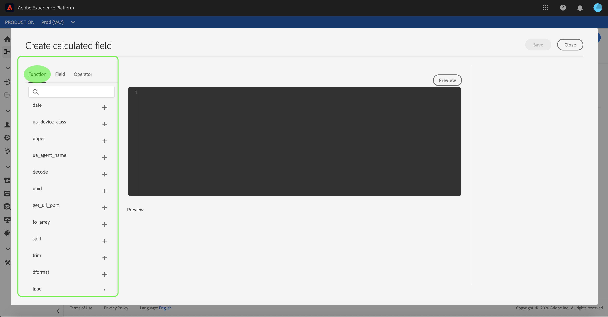

# 將CSV檔案映射到現有XDM架構

>[!NOTE]
>
>本文檔介紹如何將CSV檔案映射到現有XDM架構。 有關如何使用AI生成的架構建議工具（當前在測試版中）的資訊，請參見上的文檔 [使用機器學習建議來映射CSV檔案](./recommendations.md)。

為了將CSV資料 [!DNL Adobe Experience Platform]，資料必須映射到 [!DNL Experience Data Model] (XDM)架構。 本教程介紹如何使用 [!DNL Platform] 用戶介面。

## 快速入門

本教程需要對以下元件進行有效的瞭解 [!DNL Platform]:

- [[!DNL Experience Data Model (XDM System)]](../../../xdm/home.md):標準化框架 [!DNL Platform] 組織客戶體驗資料。
- [批量攝取](../../batch-ingestion/overview.md):方法 [!DNL Platform] 從用戶提供的資料檔案中接收資料。
- [Adobe Experience Platform資料準備](../../batch-ingestion/overview.md):一套功能，允許您映射和轉換所攝取的資料以符合XDM架構。 有關 [資料準備功能](../../../data-prep/functions.md) 與架構映射特別相關。

本教程還要求您已建立資料集，以將CSV資料插入。 有關在UI中建立資料集的步驟，請參見 [資料攝取教程](../ingest-batch-data.md)。

## 選擇目標

登錄到 [[!DNL Adobe Experience Platform]](https://platform.adobe.com) ，然後選擇 **[!UICONTROL 工作流]** 從左導航欄訪問 **[!UICONTROL 工作流]** 工作區。

從 **[!UICONTROL 工作流]** 螢幕，選擇 **[!UICONTROL 將CSV映射到XDM架構]** 下 **[!UICONTROL 資料接收]** ，然後選擇 **[!UICONTROL 啟動]**。

的 **[!UICONTROL 將CSV映射到XDM架構]** 工作流」(workflow)，從 **[!UICONTROL 目標]** 的子菜單。 為要接收到的入站資料選擇資料集。 可以使用現有資料集或建立新資料集。

**使用現有資料集**

要將CSV資料插入現有資料集，請選擇 **[!UICONTROL 使用現有資料集]**。 可以使用搜索函式或滾動面板中現有資料集清單來檢索現有資料集。

要將CSV資料插入新資料集，請選擇 **[!UICONTROL 建立新資料集]** 並在提供的欄位中輸入資料集的名稱和說明。 通過使用搜索函式或滾動查看提供的方案清單來選擇方案。 選擇 **[!UICONTROL 下一個]** 繼續。

## 添加資料

的 **[!UICONTROL 添加資料]** 的上界。 將CSV檔案拖放到提供的空間中，或選擇 **[!UICONTROL 選擇檔案]** 以手動輸入CSV檔案。

的 **[!UICONTROL 示例資料]** 上載檔案後，將顯示節，顯示前十行資料。 確認資料已按預期上載後，請選擇 **[!UICONTROL 下一個]**。

## 將CSV欄位映射到XDM架構欄位

的 **[!UICONTROL 映射]** 的上界。 CSV檔案的列列在 **[!UICONTROL 源欄位]**，其對應的XDM架構欄位列於 **[!UICONTROL 目標欄位]**。

[!DNL Platform] 根據所選的目標模式或資料集自動為自動映射欄位提供智慧建議。 您可以手動調整映射規則以適合您的使用情形。

要接受所有自動生成映射值，請選中標有「」的複選框[!UICONTROL 接受所有目標欄位]。

有時，源架構有多個建議。 當出現這種情況時，映射卡將顯示最突出的建議，然後顯示一個藍色圓圈，其中包含可用的其他建議數。 選擇燈泡表徵圖將顯示其他建議的清單。 通過選中要映射到的建議案旁邊的複選框，可以選擇其中一個備選建議案。

或者，您可以選擇手動將源架構映射到目標架構。 懸停在要映射的源架構上，然後選擇加號表徵圖。

的 **[!UICONTROL 將源映射到目標欄位]** 出現「popover（跨距）」。 在此處，您可以選擇要映射的欄位，然後 **[!UICONTROL 保存]** 的子菜單。

如果要刪除其中一個映射，請將滑鼠懸停在該映射上，然後選擇減號表徵圖。

### 添加計算欄位 {#add-calculated-field}

計算欄位允許根據輸入方案中的屬性建立值。 然後，可以將這些值分配給目標架構中的屬性，並提供名稱和說明，以便更容易地引用。

選擇 **[!UICONTROL 添加計算欄位]** 按鈕。

的 **[!UICONTROL 建立計算欄位]** 的子菜單。 左對話框包含計算欄位中支援的欄位、函式和運算子。 選擇一個頁籤，開始向表達式編輯器添加函式、欄位或運算子。

| 標記 | 說明 |
| --------- | ----------- |
| 欄位 | 「欄位」頁籤列出源架構中可用的欄位和屬性。 |
| 函式 | 「函式」頁籤列出了可用於轉換資料的函式。 要瞭解有關在計算欄位中可以使用的功能的詳細資訊，請閱讀上的指南 [使用資料準備（映射器）函式](../../../data-prep/functions.md)。 |
| 操作者 | 「運算子」(Operators)頁籤列出了可用於轉換資料的運算子。 |

可以使用中心的表達式編輯器手動添加欄位、函式和運算子。 選擇編輯器以開始建立表達式。

選擇 **[!UICONTROL 保存]** 繼續。

映射螢幕將隨新建立的源欄位重新出現。 應用相應的目標欄位並選擇 **[!UICONTROL 完成]** 完成映射。

## 監視資料內嵌

映射和建立CSV檔案後，您可以監視通過它接收的資料。 有關監視資料接收的詳細資訊，請參見上的教程 [監控資料接收](../../../ingestion/quality/monitor-data-ingestion.md)。

## 後續步驟

按照本教程，您已成功將平面CSV檔案映射到XDM架構，並將其插入 [!DNL Platform]。 此資料現在可供下游使用 [!DNL Platform] 服務，如 [!DNL Real-Time Customer Profile]。 請參閱的概述 [[!DNL Real-Time Customer Profile]](../../../profile/home.md) 的子菜單。
