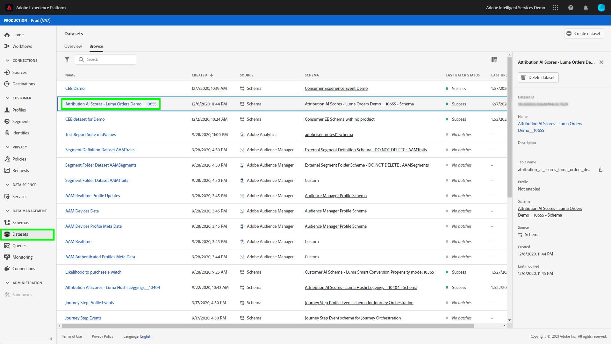
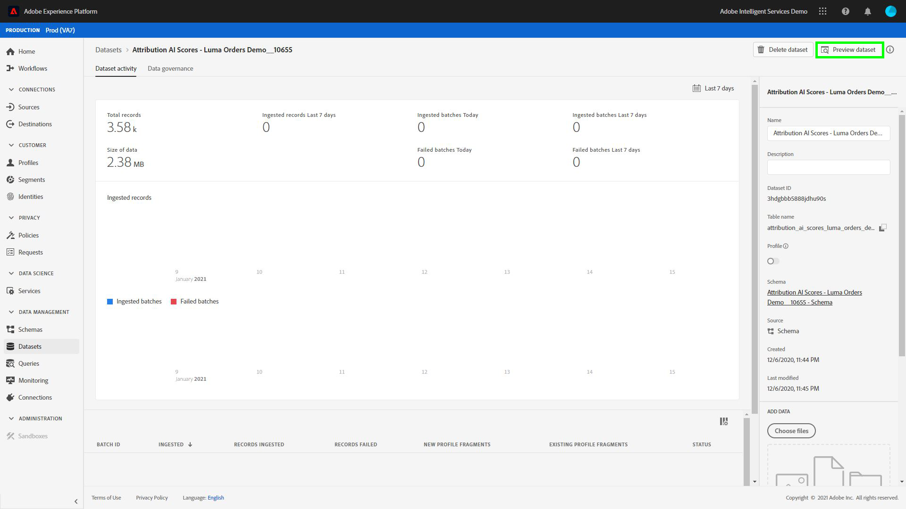

# 使用查詢服務分析歸因分數

資料中的每一列都代表一次轉換，其中相關接觸點的資訊會以結構陣列的形式儲存在 `touchpointsDetail` 欄。

| 接觸點資訊 | 欄 |
| ---------------------- | ------ |
| 接觸點名稱 | `touchpointsDetail. touchpointName` |
| 接觸點管道 | `touchpointsDetail.touchPoint.mediaChannel` |
| 接觸點Attribution AI演演算法分數 | <li>`touchpointsDetail.scores.algorithmicSourced`</li> <li> `touchpointsDetail.scores.algorithmicInfluenced` </li> |

## 尋找您的資料路徑

在Adobe Experience Platform UI中，選取 **[!UICONTROL 資料集]** 左側導覽列中。 此 **[!UICONTROL 資料集]** 頁面便會顯示。 接下來，選取 **[!UICONTROL 瀏覽]** 索引標籤並尋找您Attribution AI分數的輸出資料集。



選取您的輸出資料集。 資料集活動頁面隨即顯示。



在資料集活動頁面中，選取 **[!UICONTROL 預覽資料集]** 以預覽您的資料，並確定已如預期擷取資料。


預覽資料後，在右側邊欄中選取結構。 此時會出現一個彈出視窗，其中包含結構描述名稱和說明。 選取結構描述名稱超連結以重新導向至評分結構描述。


使用評分結構描述，您可以選取或搜尋值。 選取後， **[!UICONTROL 欄位屬性]** 側邊欄會開啟，讓您複製路徑以用於建立查詢。


## 存取查詢服務

若要從Platform UI記憶體取查詢服務，請從選取 **[!UICONTROL 查詢]** 在左側導覽中，然後選取 **[!UICONTROL 瀏覽]** 標籤。 會載入您先前儲存的查詢清單。


接下來，選取 **[!UICONTROL 建立查詢]** 右上角。 查詢編輯器載入。 使用查詢編輯器，您可以開始使用評分資料建立查詢。


如需查詢編輯器的詳細資訊，請造訪 [查詢編輯器使用手冊](../../query-service/ui/user-guide.md).

## 歸因評分分析的查詢範本

以下查詢可作為不同分數分析情況的範本。 您需要取代 `_tenantId` 和 `your_score_output_dataset` ，其中包含評分輸出結構描述中的適當值。

>[!NOTE]
>
> 根據您的資料擷取方式，以下使用的值包括 `timestamp` 可能使用其他格式。

### 驗證範例

**依轉換事件區分的轉換總數（在轉換期間內）**

```sql
    SELECT conversionName,
           SUM(scores.firstTouch) as total_conversions,
           SUM(scores.algorithmicSourced) as total_attributed_conversions
    FROM
        (SELECT
                _tenantId.your_score_output_dataset.conversionName
                    as conversionName,
                inline(_tenantId.your_score_output_dataset.touchpointsDetail),
                timestamp as conversion_timestamp
         FROM
                your_score_output_dataset
        )
    WHERE
        conversion_timestamp >= '2020-07-16'
      AND
        conversion_timestamp <  '2020-10-14'
    GROUP BY
        conversionName
```

**僅限轉換事件的總數（在轉換視窗中）**

```sql
    SELECT
        _tenantId.your_score_output_dataset.conversionName as conversionName,
        COUNT(1) as convOnly_cnt
    FROM
        your_score_output_dataset
    WHERE
        _tenantId.your_score_output_dataset.touchpointsDetail.touchpointName[0] IS NULL AND
        timestamp >= '2020-07-16' AND
        timestamp <  '2020-10-14'
    GROUP BY
        conversionName
```

### 趨勢分析範例

**每日轉換次數**

```sql
    SELECT conversionName,
           DATE(conversion_timestamp) as conversion_date,
           SUM(scores.firstTouch) as convertion_cnt
    FROM
        (SELECT
                _tenantId.your_score_output_dataset.conversionName as conversionName,
                inline(_tenantId.your_score_output_dataset.touchpointsDetail),
                timestamp as conversion_timestamp
         FROM
                your_score_output_dataset
        )
    GROUP BY
        conversionName, DATE(conversion_timestamp)
    ORDER BY
        conversionName, DATE(conversion_timestamp)
    LIMIT 20
```

### 分佈分析範例

**依定義的型別區分的轉換路徑上的接觸點數量（在轉換視窗內）**

```sql
    SELECT conversionName,
           touchpointName,
           COUNT(1) as tp_count
    FROM
        (SELECT
                _tenantId.your_score_output_dataset.conversionName as conversionName,
                inline(_tenantId.your_score_output_dataset.touchpointsDetail),
                timestamp as conversion_timestamp
         FROM
                your_score_output_dataset
        )
    WHERE
        conversion_timestamp >= '2020-07-16' AND
        conversion_timestamp < '2020-10-14' AND
        touchpointName IS NOT NULL
    GROUP BY
        conversionName, touchpointName
    ORDER BY
        conversionName, tp_count DESC
```

### 分析產生範例

**依接觸點和轉換日期劃分的增量單位（在轉換視窗中）**

```sql
    SELECT conversionName,
           touchpointName,
           DATE(conversion_timestamp) as conversion_date,
           SUM(scores.algorithmicSourced) as incremental_units
    FROM
        (SELECT
                _tenantId.your_score_output_dataset.conversionName as conversionName,
                inline(_tenantId.your_score_output_dataset.touchpointsDetail),
                timestamp as conversion_timestamp
         FROM
                your_score_output_dataset
        )
    WHERE
        conversion_timestamp >= '2020-07-16' AND
        conversion_timestamp < '2020-10-14'  AND
        touchpointName IS NOT NULL
    GROUP BY
        conversionName, touchpointName, DATE(conversion_timestamp)
    ORDER BY
        conversionName, touchpointName, DATE(conversion_timestamp)
```

**依接觸點和接觸點日期劃分的增量單位劃分（在轉換視窗中）**

```sql
    SELECT conversionName,
           touchpointName,
           DATE(touchpoint.timestamp) as touchpoint_date,
           SUM(scores.algorithmicSourced) as incremental_units
    FROM
        (SELECT
                _tenantId.your_score_output_dataset.conversionName as conversionName,
                inline(_tenantId.your_score_output_dataset.touchpointsDetail),
                timestamp as conversion_timestamp
         FROM
                your_score_output_dataset
        )
    WHERE
        conversion_timestamp >= '2020-07-16' AND
        conversion_timestamp < '2020-10-14'  AND
        touchpointName IS NOT NULL
    GROUP BY
        conversionName, touchpointName, DATE(touchpoint.timestamp)
    ORDER BY
        conversionName, touchpointName, DATE(touchpoint.timestamp)
    LIMIT 20
```

**所有評分模型（在轉換視窗中）的特定接觸點型別彙總分數**

```sql
    SELECT
           conversionName,
           touchpointName,
           SUM(scores.algorithmicSourced) as total_incremental_units,
           SUM(scores.algorithmicInfluenced) as total_influenced_units,
           SUM(scores.uShape) as total_uShape_units,
           SUM(scores.decayUnits) as total_decay_units,
           SUM(scores.linear) as total_linear_units,
           SUM(scores.lastTouch) as total_lastTouch_units,
           SUM(scores.firstTouch) as total_firstTouch_units
    FROM
        (SELECT
                _tenantId.your_score_output_dataset.conversionName as conversionName,
                inline(_tenantId.your_score_output_dataset.touchpointsDetail),
                timestamp as conversion_timestamp
         FROM
                your_score_output_dataset
        )
    WHERE
        conversion_timestamp >= '2020-07-16' AND
        conversion_timestamp < '2020-10-14'  AND
        touchpointName = 'display'
    GROUP BY
        conversionName, touchpointName
    ORDER BY
        conversionName, touchpointName
```

**進階 — 路徑長度分析**

取得每個轉換事件型別的路徑長度分佈：

```sql
    WITH agg_path AS (
          SELECT
            _tenantId.your_score_output_dataset.conversionName as conversionName,
            sum(size(_tenantId.your_score_output_dataset.touchpointsDetail)) as path_length
          FROM
            your_score_output_dataset
          WHERE
            _tenantId.your_score_output_dataset.touchpointsDetail.touchpointName[0] IS NOT NULL AND
            timestamp >= '2020-07-16' AND
            timestamp <  '2020-10-14'
          GROUP BY
            _tenantId.your_score_output_dataset.conversionName,
            eventMergeId
    )
    SELECT
        conversionName,
        path_length,
        count(1) as conversionPath_count
    FROM
        agg_path
    GROUP BY
        conversionName, path_length
    ORDER BY
        conversionName, path_length
```

**進階 — 轉換路徑分析上的不同接觸點數量**

取得每個轉換事件型別之轉換路徑上相異接觸點數目的分佈：

```sql
    WITH agg_path AS (
      SELECT
        _tenantId.your_score_output_dataset.conversionName as conversionName,
        size(array_distinct(flatten(collect_list(_tenantId.your_score_output_dataset.touchpointsDetail.touchpointName)))) as num_dist_tp
      FROM
        your_score_output_dataset
      WHERE
        _tenantId.your_score_output_dataset.touchpointsDetail.touchpointName[0] IS NOT NULL AND
        timestamp >= '2020-07-16' AND
        timestamp <  '2020-10-14'
      GROUP BY
        _tenantId.your_score_output_dataset.conversionName,
        eventMergeId
    )
    SELECT
        conversionName,
        num_dist_tp,
        count(1) as conversionPath_count
    FROM
     agg_path
    GROUP BY
        conversionName, num_dist_tp
    ORDER BY
        conversionName, num_dist_tp
```

### 結構描述平面化和爆炸範例

此查詢會將結構欄平面化為多個單數欄，並將陣列展開為多個列。 這有助於將歸因分數轉換為CSV格式。 此查詢的輸出具有一個轉換，以及每列中對應至該轉換的其中一個接觸點。

>[!TIP]
>
> 在此範例中，您需要取代 `{COLUMN_NAME}` 除了 `_tenantId` 和 `your_score_output_dataset`. 此 `COLUMN_NAME` 變數可採用在設定Attribution AI模型期間新增的可選傳遞欄名稱（報表欄）的值。 請檢閱您的評分輸出結構描述以尋找 `{COLUMN_NAME}` 完成此查詢所需的值。

```sql
SELECT 
  segmentation,
  conversionName,
  scoreCreatedTime,
  aaid, _id, eventMergeId,
  conversion.eventType as conversion_eventType,
  conversion.quantity as conversion_quantity,
  conversion.eventSource as conversion_eventSource,
  conversion.priceTotal as conversion_priceTotal,
  conversion.timestamp as conversion_timestamp,
  conversion.geo as conversion_geo,
  conversion.receivedTimestamp as conversion_receivedTimestamp,
  conversion.dataSource as conversion_dataSource,
  conversion.productType as conversion_productType,
  conversion.passThrough.{COLUMN_NAME} as conversion_passThru_column,
  conversion.skuId as conversion_skuId,
  conversion.product as conversion_product,
  touchpointName,
  touchPoint.campaignGroup as tp_campaignGroup, 
  touchPoint.mediaType as tp_mediaType,
  touchPoint.campaignTag as tp_campaignTag,
  touchPoint.timestamp as tp_timestamp,
  touchPoint.geo as tp_geo,
  touchPoint.receivedTimestamp as tp_receivedTimestamp,
  touchPoint.passThrough.{COLUMN_NAME} as tp_passThru_column,
  touchPoint.campaignName as tp_campaignName,
  touchPoint.mediaAction as tp_mediaAction,
  touchPoint.mediaChannel as tp_mediaChannel,
  touchPoint.eventid as tp_eventid,
  scores.*
FROM (
  SELECT
        _tenantId.your_score_output_dataset.segmentation,
        _tenantId.your_score_output_dataset.conversionName,
        _tenantId.your_score_output_dataset.scoreCreatedTime,
        _tenantId.your_score_output_dataset.conversion,
        _id,
        eventMergeId,
        map_values(identityMap)[0][0].id as aaid,
        inline(_tenantId.your_score_output_dataset.touchpointsDetail)
  FROM
        your_score_output_dataset
)
```
