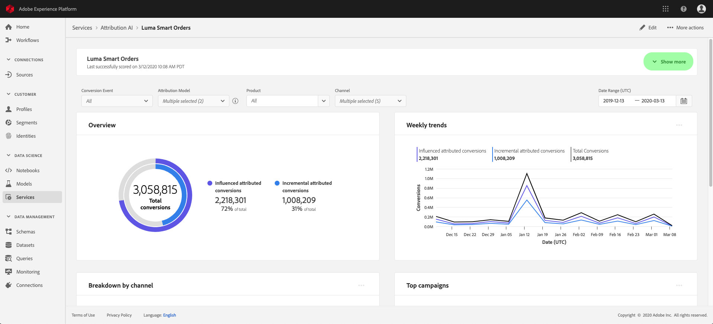

# 探索Attribution AI中的深入分析

Attribution AI服務例項提供深入分析，以協助您做出與行銷績效和投資報酬率相關的行銷決策，並加以衡量。 選取服務執行個體可提供視覺效果和篩選器，協助您瞭解客戶歷程每個階段中每個客戶互動的影響。

本檔案可作為AdobeIntelligent Services使用者介面中與服務執行個體深入分析互動的指南。

## 快速入門

若要運用Attribution AI的深入分析，您必須有具備成功執行狀態的服務執行個體。 若要建立新的服務執行個體，請瀏覽[Attribution AI使用者介面指南](./user-guide.md)。 如果您最近已建立服務執行個體，但仍在訓練和評分中，請等待24小時讓執行完成。

## 服務執行個體見解概觀

在[!DNL Adobe Experience Platform] UI中，選取左側導覽中的&#x200B;**[!UICONTROL 服務]**。 **[!UICONTROL 服務]**&#x200B;瀏覽器出現，並顯示可用的Adobe智慧型服務。 在Attribution AI的容器中，選取&#x200B;**[!UICONTROL 開啟]**。

便會顯示「Attribution AI服務」頁面。 此頁面列出Attribution AI的服務執行處理並顯示其相關資訊，包括執行處理名稱、轉換事件、執行處理的執行頻率，以及上次更新的狀態。 選取服務執行處理名稱以開始。

>[!NOTE]
>
>只能選取已完成成功評分回合的服務執行個體。

接著，該服務執行個體的深入分析頁面就會顯示，其中提供您視覺效果和多個篩選器，方便您與資料互動。 本指南會詳細說明視覺效果和篩選器。

### 服務執行個體詳細資訊

若要檢視服務執行個體的其他詳細資料，請選取右上方的&#x200B;**[!UICONTROL 顯示更多]**。

詳細清單隨即顯示。 如需任何所列屬性的詳細資訊，請瀏覽[Attribution AI使用手冊](./user-guide.md)。

### 編輯例項

若要編輯執行個體，請選取右上方導覽列中的&#x200B;**[!UICONTROL 編輯]**。

編輯對話方塊會出現，讓您編輯執行個體的名稱、說明和評分頻率。 如果執行個體狀態為停用，則無法編輯評分頻率。 若要確認變更並關閉對話方塊，請選取右下角的&#x200B;**[!UICONTROL 儲存]**。

### 更多動作 {#more-actions}

**[!UICONTROL 更多動作]**&#x200B;按鈕位於&#x200B;**[!UICONTROL 編輯]**&#x200B;旁的右上角導覽器中。 選取&#x200B;**[!UICONTROL 其他動作]**&#x200B;會開啟一個下拉式清單，讓您選取下列其中一個動作：

- **[!UICONTROL 複製]**：複製執行個體。
- **[!UICONTROL 刪除]**：刪除執行個體。
- **[!UICONTROL 下載摘要資料]**：下載包含摘要資料的CSV檔案。
- **[!UICONTROL 存取分數]**：選取&#x200B;**[!UICONTROL 存取分數]**&#x200B;會將您重新導向至Attribution AI教學課程的[存取分數](./download-scores.md)。
- **[!UICONTROL 檢視執行歷程記錄]**：顯示一個彈出視窗，其中包含與服務執行個體相關的所有評分執行清單。

## 篩選資料

Attribution AI深入分析可讓您篩選資料，並根據您選取的篩選器自動更新UI視覺效果。

### 轉換事件

當您在Attribution AI中建立新執行個體時，「轉換事件」是必填欄位之一。 轉換事件是識別行銷活動影響的業務目標，例如電子商務訂單、店內購買和網站造訪。

在執行個體中，**[!UICONTROL 轉換事件]**&#x200B;下拉式清單可讓您選取為執行個體定義的任何事件，以篩選您的資料。 選取特定事件會變更UI視覺效果，使其僅填入屬於這些事件的轉換。

### 歸因模型

選取&#x200B;**[!UICONTROL 歸因模型]**&#x200B;會開啟一個下拉式清單，其中包含所有可用的不同歸因模型。 您可以選取多個模型來比較結果。 如需不同歸因模型及其運作方式的詳細資訊，請造訪[Attribution AI](./overview.md)概觀，其中包含每個模型相關資訊的表格。

### 區域

>[!NOTE]
>
>只有在建立服務執行個體時，您執行了Attribution AI使用者介面指南中的選擇性步驟[以區域為基礎的模式](./user-guide.md#region-based-modeling-optional)時，才會出現此篩選器。

此篩選可讓您選取您在執行個體建立程式中設定的任何區域。

### 新增篩選器

您可以選取&#x200B;**篩選器**&#x200B;圖示以開啟&#x200B;**[!UICONTROL 新增篩選器]**&#x200B;彈出視窗，以新增其他篩選器。 **[!UICONTROL 新增篩選器]**&#x200B;彈出視窗可讓您依頻道、地理、媒體型別和產品來篩選。 彈出視窗只會填入服務執行個體的適用篩選器。 例如，如果您未提供地理資料或媒體型別，這些篩選屬性將無法用於您的執行個體。

- **[!UICONTROL 管道]：**&#x200B;選取管道屬性可讓您篩選任何可用的行銷管道。 您可以選取多個管道來比較。
- **[!UICONTROL 地理位置]：**&#x200B;選取地理位置屬性，可讓您根據地區型模型來篩選國家/地區代碼。 根據您的資料，此篩選器可能存在，也可能不存在。 國家/地區代碼長度為兩個字元。 在[這裡](https://datahub.io/core/country-list)檢視完整的國家代碼清單。
- **[!UICONTROL 媒體型別]：**&#x200B;選取媒體型別屬性可讓您篩選您定義的任何媒體型別。
- **[!UICONTROL 產品]：**&#x200B;選取產品屬性可讓您從建立執行個體時最初擷取的任何產品中進行篩選。

### 日期範圍

選取行事曆圖示以開啟日期範圍彈出視窗。 開始和結束轉換事件日期會決定UI中填入的資料量。 您可以選擇縮小或擴大日期範圍，以集中或增加填入的資料量。

## 您的資料概觀

**[!UICONTROL 總覽]**&#x200B;卡片會依歸因模型顯示您的總轉換。 總數的變化取決於您使用本檔案先前概述的篩選器進行搜尋的特定程度。 選取更多模型會在「概述」中新增其他圓圈，每個圓圈都有自己的顏色與圖例相對應。

## 每週趨勢

**[!UICONTROL 每週趨勢]**&#x200B;卡片會依您在篩選程式期間設定的日期範圍來劃分總轉換。

選取&#x200B;**每週趨勢**&#x200B;卡片右上角的省略符號會顯示下拉式清單，讓您選取每日、每週或每月趨勢。

將游標暫留在特定歸因模型的資料行上，會建立顯示該日期轉換總數的「彈出視窗」。

## 依管道劃分

**[!UICONTROL 依管道]**&#x200B;劃分卡片是用來判斷每個管道的轉換總數。 這張卡片可用來協助您決定每個管道的有效性及投資報酬率。

選取&#x200B;**[!UICONTROL 依管道劃分]**&#x200B;卡片右上方的省略符號會開啟下拉式清單，讓您根據接觸點填入資料。

## 熱門行銷活動

**[!UICONTROL 熱門行銷活動]**&#x200B;卡片會顯示行銷活動的概覽，以及行銷活動在每個管道中的執行方式。 此卡片可協助您的團隊瞭解特定頻道特定行銷活動的有效性，並提供諸如您應進一步投資哪些行銷活動等見解。

## 依接觸點位置劃分

選取&#x200B;**[!UICONTROL 路徑分析]**&#x200B;索引標籤會載入依接觸點位置&#x200B;]**和**[!UICONTROL &#x200B;排名最前的轉換路徑&#x200B;]**的**[!UICONTROL &#x200B;劃分。

依接觸點位置&#x200B;]**劃分的**[!UICONTROL &#x200B;圖表是依接觸點位置劃分的已歸因轉換，並與所有轉換路徑進行比較。 此圖表可協助您瞭解哪些接觸點在轉換路徑的不同階段中更有效率。 各階段包括入門者、玩家和接近者。

- **入門者：**&#x200B;表示此接觸點是轉換路徑中的首次接觸。
- **播放器：**&#x200B;表示接觸點不是導致轉換的第一次或最後一次接觸。
- **關閉者：**&#x200B;表示此接觸點是轉換前的最後一次接觸。

>
>
> 歸因模型在所有接觸點和位置的貢獻百分比總和應等於100。

## 排名在前的轉換路徑

**[!UICONTROL 排名最前的轉換路徑]**&#x200B;圖表顯示所選區域中排名最前的轉換路徑的影響分數和演演算法分數。 此圖表可讓您視覺化哪些接觸點對轉換有貢獻，以及每個接觸點的歸因分數。 您可以使用此資訊來檢視特定區域中最頻繁的路徑，並檢視不同接觸點集合之間是否有任何模式出現。

## 接觸點有效性

選取&#x200B;**[!UICONTROL 接觸點有效性]**&#x200B;標籤會載入&#x200B;**[!UICONTROL 接觸點有效性]**&#x200B;卡片。 此卡片使用Attribution AI的資料分佈，顯示每個接觸點的資訊。 此資料表的資料只會針對特定時段產生，如卡片右上角的&#x200B;**[!UICONTROL 截至]**&#x200B;日期所示。

您可以使用&#x200B;**[!UICONTROL 接觸點有效性]**&#x200B;卡片資訊來瞭解接觸點如何促成轉換。 您也可以透過下列效能度量瞭解每個接觸點的有效性：

**接觸的路徑**：此量度會顯示達成/未達成接觸點轉換的路徑百分比。 如果實現轉換的路徑與未實現轉換的路徑之間的比率（百分比）很高，您就會看到較高的已歸因轉換。

**效率量值**：此量度會以1到5的刻度顯示星星。 此比例代表接觸點對進行轉換的相對重要性。

>[!NOTE]
>
>接觸點數量越多並不保證效率測量值越高。

**總數量**：使用者接觸接觸點的彙總次數。 這包括出現在達成轉換的路徑上的接觸點，以及未產生轉換的路徑。

## 後續步驟

當您完成資料篩選並能夠顯示適當資訊後，您就可以選擇存取分數。 如需有關如何存取您分數的深入指南，請造訪Attribution AI](./download-scores.md)教學課程中的[存取分數。 此外，您也可以下載摘要資料，如[其他動作](#more-actions)所示。 選取「下載摘要資料」，即可下載依日期彙總的摘要資料。

## 其他資源

以下影片旨在協助您瞭解如何使用Attribution AI深入分析頁面，以瞭解行銷管道和行銷活動的投資報酬率。

>[!VIDEO](https://video.tv.adobe.com/v/32669?learn=on&quality=12)
