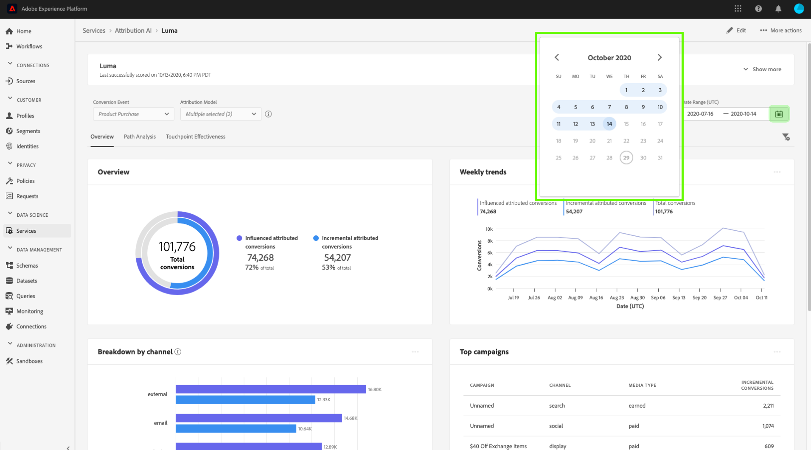

# 探索Attribution AI

Attribution AI服務例項提供深入分析，可協助您制定及衡量與行銷績效和投資報酬率相關的行銷決策。 選取服務例項可提供視覺效果和篩選條件，協助您了解客戶歷程各個階段中每個客戶互動的影響。

本檔案可做為在AdobeIntelligent Services使用者介面中與服務例項深入分析互動的指南。

## 快速入門

若要運用深入分析功能進行Attribution AI，您需要有一個可使用成功執行狀態的服務例項。 要建立新服務實例，請訪問[Attribution AI用戶介面指南](./user-guide.md)。 如果您最近建立了一個服務實例，但該實例仍在訓練和分數中，請允許24小時以完成運行。

## 服務執行個體分析概觀

在[!DNL Adobe Experience Platform] UI中，在左側導覽中選取&#x200B;**[!UICONTROL 服務]**。 出現&#x200B;**[!UICONTROL Services]**&#x200B;瀏覽器，並顯示可用的AdobeIntelligent Services。 在Attribution AI容器中，選擇&#x200B;**[!UICONTROL 開啟]**。

Attribution AI服務頁面隨即顯示。 此頁面會列出Attribution AI的服務例項，並顯示其相關資訊，包括例項名稱、轉換事件、執行例項的頻率，以及上次更新的狀態。 選擇要開始的服務實例名稱。

>[!NOTE]
>
>只能選擇已完成成功計分運行的服務實例。

接著會顯示該服務例項的前瞻分析頁面，提供視覺效果和數個篩選條件，供您與資料互動。 本指南會詳細說明視覺效果和篩選器。

### 服務實例詳細資訊

要查看服務實例的其他詳細資訊，請選擇右上角的&#x200B;**[!UICONTROL 顯示更多]**。

畫面上會顯示詳細清單。 有關所列任何屬性的詳細資訊，請訪問[Attribution AI使用手冊](./user-guide.md)。

### 編輯執行個體

要編輯實例，請在右上角的導航中選擇&#x200B;**[!UICONTROL Edit]**。

此時將出現「編輯」對話框，允許您編輯實例的名稱、說明和計分頻率。 如果實例狀態被禁用，則無法編輯計分頻率。 若要確認變更並關閉對話方塊，請選取右下角的&#x200B;**[!UICONTROL 儲存]**。

### 更多動作 {#more-actions}

**[!UICONTROL 更多操作]**&#x200B;按鈕位於&#x200B;**[!UICONTROL Edit]**&#x200B;旁的右上導航中。 選擇&#x200B;**[!UICONTROL 更多操作]**&#x200B;將開啟一個下拉清單，該下拉清單允許您選擇以下操作之一：

- **[!UICONTROL 原地複製]**:克隆實例。
- **[!UICONTROL 刪除]**:刪除例項。
- **[!UICONTROL 下載摘要資料]**:下載包含摘要資料的CSV檔案。
- **[!UICONTROL 存取分數]**:選取 **[!UICONTROL 存取]** 分數會將您重新導向至Attribution AI [教學課程的存取分數](./download-scores.md)。
- **[!UICONTROL 查看運行歷史記錄]**:此時會出現一個彈出視窗，其中包含與服務執行個體相關聯的所有計分執行清單。

## 篩選資料

Attribution AI前瞻分析可讓您篩選資料，並根據您選取的篩選器自動更新UI視覺效果。

### 轉換事件

在Attribution AI中建立新例項時，其中一個必填欄位是「轉換事件」。 轉換事件是可識別行銷活動（例如電子商務訂單、店內購買和網站造訪）影響的業務目標。

從例項內，**[!UICONTROL 轉換事件]**&#x200B;下拉式清單可讓您選取為例項定義的任何事件，以篩選您的資料。 選取特定事件會變更UI視覺效果，僅填入屬於這些事件的轉換。

### 歸因模型

選取&#x200B;**[!UICONTROL 歸因模型]**&#x200B;會開啟一個下拉式清單，其中提供所有不同的歸因模型。 您可以選取多個模型來比較結果。 如需不同歸因模型的詳細資訊及其運作方式，請造訪[Attribution AI](./overview.md)概觀，其中包含一個表格，內含各個模型的資訊。

### 地區

>[!NOTE]
>
>只有在建立服務實例時執行了Attribution AI用戶介面指南中的可選步驟[區域型建模](./user-guide.md#region-based-modeling-optional)時，才會顯示此篩選器。

此篩選器可讓您選取在執行個體建立程式中設定的任何區域。

### 新增篩選器

您可以選取&#x200B;**filter**&#x200B;圖示以開啟&#x200B;**[!UICONTROL 新增篩選器]**&#x200B;彈出視窗，以新增其他篩選器。 **[!UICONTROL 新增篩選器]**&#x200B;彈出式視窗可讓您依管道、地理、媒體類型和產品來篩選。 彈出式視窗只會填入服務例項的適用篩選器。 例如，如果您未提供地理位置資料或媒體類型，這些篩選屬性將無法供您的執行個體使用。

- **[!UICONTROL 管道]:** 選取管道屬性可讓您篩選任何可用的行銷管道。您可以選取多個管道來比較。
- **[!UICONTROL Geography]:** 選取地理屬性可讓您根據以地區為基礎的模型來篩選國家/地區代碼。根據您的資料，此篩選器可能存在，也可能不存在。 國家/地區代碼為兩個字元長。 請參閱[此處](https://datahub.io/core/country-list)的完整國家/地區代碼清單。
- **[!UICONTROL 媒體類型]:** 選取媒體類型屬性可讓您篩選任何已定義的媒體類型。
- **[!UICONTROL 產品]:** 選取產品屬性可讓您從建立執行個體時最初擷取的任何產品進行篩選。

### 日期範圍

選取日曆圖示以開啟日期範圍彈出視窗。 開始和結束轉換事件日期會決定UI中填入的資料量。 您可以選擇縮小或擴大日期範圍，以集中或擴展填入的資料量。

## 資料概觀

**[!UICONTROL 概述]**&#x200B;卡片會依歸因模型顯示轉換總數。 總數會根據您使用本檔案先前概述的篩選器進行搜尋的具體程度而改變。 選取更多模型會將其他圓圈新增至「概述」，每個圓圈的顏色都與圖例相對應。

## 每週趨勢

「**[!UICONTROL 每週趨勢]**」卡片會依您在篩選程式中設定的日期範圍來劃分轉換總數。

選取&#x200B;**每週趨勢**&#x200B;卡片右上方的點，下拉式清單隨即顯示，您可以選取每日、每週或每月趨勢。

將滑鼠指標暫留在特定歸因模型的資料列上，會建立彈出式視窗，顯示該日期的轉換總數。

## 依管道劃分

**[!UICONTROL 依管道劃分]**&#x200B;卡片用於決定與每個管道相關的轉換總數。 此卡片可協助您針對每個管道的效益和投資回報進行決策。

選取「**[!UICONTROL 依管道劃分」卡片右上角的點，會開啟下拉式清單，讓您根據接觸點填入資料。]**

## 熱門行銷活動

**[!UICONTROL 前行銷活動]**&#x200B;卡片顯示行銷活動的概觀，以及行銷活動在每個管道中的表現方式。 此資訊卡可協助您的團隊了解特定管道之特定促銷活動的成效，並提供您應進一步投資哪些促銷活動等深入分析。

## 依接觸點位置劃分

選取「**[!UICONTROL 路徑分析]**」標籤會載入「依接觸點位置劃分」]**和「**[!UICONTROL &#x200B;最上層轉換路徑&#x200B;]**」圖表。**[!UICONTROL 

**[!UICONTROL 依接觸點位置劃分]**&#x200B;圖表是依接觸點位置劃分的歸因轉換，並在所有轉換路徑間進行比較。 此圖表可協助您了解哪些接觸點在轉換路徑的不同階段更有效。 這些階段是開始階段、參與階段和接近階段。

- **入門者：** 指出接觸點是轉換路徑中的首次接觸。
- **播放器：** 指出接觸點不是導致轉換的首次或上次接觸。
- **關閉：** 指出接觸點是轉換前的上次接觸。

>!![NOTE]
所有接觸點和位置歸因模型的貢獻百分比總和應等於100。

## 最上層轉換路徑

**[!UICONTROL 最上層轉換路徑]**&#x200B;圖表顯示所選區域中最上層轉換路徑的影響和演算法分數。 此圖表可讓您視覺化哪些接觸點促成轉換，以及每個接觸點的歸因分數。 您可以使用此資訊來檢視特定區域中最頻繁的路徑，並查看不同接觸點集之間是否出現任何模式。

## 接觸點有效性

選取「**[!UICONTROL 接觸點有效性]**」標籤會載入「**[!UICONTROL 接觸點有效性]**」卡片。 此卡片使用Attribution AI的資料分佈來顯示每個接觸點的資訊。 此表格的資料僅會針對特定時段產生，如卡片右上方的&#x200B;**[!UICONTROL 截止]**&#x200B;日期所示。

您可以使用&#x200B;**[!UICONTROL 接觸點有效性]**&#x200B;卡片資訊來了解接觸點對轉換的貢獻。 您也可以透過下列效能量度，了解每個接觸點的有效性：

**接觸的路徑**:此量度會顯示達到/未達到接觸點轉換的路徑百分比。如果實現轉換的路徑與未實現轉換的路徑之比較高（百分比），您會看到較高的歸因轉換。

**效率衡量**:此量度會以1到5的比例顯示星形。比例會指出接觸點對進行轉換的相對重要性。

>[!NOTE]
較高的接觸點體積不能保證更高的效率測量。

**總量**:使用者接觸點的總次數。這包括顯示在達到轉換的路徑上的接觸點，以及不導致轉換的路徑。

## 後續步驟

篩選完資料並能顯示適當資訊後，您便可以選擇存取分數。 如需如何存取分數的深入指南，請造訪Attribution AI](./download-scores.md)教學課程中的[存取分數。 此外，您也可以下載摘要資料，如[更多動作](#more-actions)所示。 選取「下載摘要資料」會下載依日期匯總的摘要資料。

## 其他資源

以下影片旨在協助學習如何使用Attribution AI深入分析頁面來了解行銷管道和行銷活動的ROI。

>[!VIDEO](https://video.tv.adobe.com/v/32669?learn=on&quality=12)
