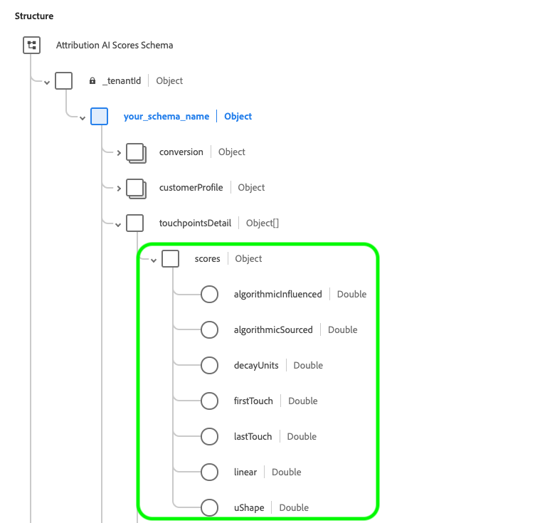

# [!DNL Attribution AI]中的輸入和輸出

以下檔案概述[!DNL Attribution AI]中使用的不同輸入和輸出。

## [!DNL Attribution AI]輸入資料

Attribution AI的運作方式是藉由分析以下資料集來計算演演算法分數：

- 使用[Adobe Analytics來源聯結器](../../sources/tutorials/ui/create/adobe-applications/analytics.md)的分析資料集
- Adobe Experience Platform結構描述中的Experience Event (EE)資料集
- 取用者體驗事件(CEE)資料集

如果每個資料集共用相同的身分型別（名稱空間） （例如ECID），您現在可以根據&#x200B;**身分對應** （欄位）從不同來源新增多個資料集。 在您選取身分和名稱空間後，會顯示「ID欄」完整度量度，用以指出要彙整的資料量。 若要進一步瞭解如何新增多個資料集，請瀏覽[Attribution AI使用手冊](./user-guide.md#identity)。

預設不會一律對應管道資訊。 在某些情況下，如果mediaChannel （欄位）為空白，則在您將欄位對應到mediaChannel之前，您將無法「繼續」，因為它是必填欄。 如果在資料集中偵測到頻道，預設會將它對應到mediaChannel。 其他資料行（例如&#x200B;**媒體型別**&#x200B;和&#x200B;**媒體動作**）仍是選用的。

對應管道欄位後，請繼續執行「定義事件」步驟，您可在此選取轉換事件、接觸點事件，然後從個別資料集選擇特定欄位。

>[!IMPORTANT]
>
>Adobe Analytics來源聯結器最多可能需要四週的時間才能回填資料。 如果您最近設定了聯結器，您應該確認資料集是否具備Attribution AI所需的最小資料長度。 請檢閱[歷史資料](#data-requirements)區段，確認您有足夠的資料來計算精確的演演算法分數。

如需設定[!DNL Consumer Experience Event] (CEE)結構描述的詳細資訊，請參閱[Intelligent Services資料準備](../data-preparation.md)指南。 如需對應Adobe Analytics資料的詳細資訊，請瀏覽[Analytics欄位對應](../../sources/connectors/adobe-applications/analytics.md)檔案。

並非所有[!DNL Consumer Experience Event] (CEE)結構描述中的資料行都是Attribution AI的必要專案。

您可以使用結構描述或選取的資料集中以下建議的任何欄位來設定接觸點。

| 建議的欄 | 需要 |
| --- | --- |
| 主要身分欄位 | 接觸點/轉換 |
| 時間戳記 | 接觸點/轉換 |
| 頻道。_type | 接觸點 |
| Channel.mediaAction | 接觸點 |
| Channel.mediaType | 接觸點 |
| Marketing.trackingCode | 接觸點 |
| Marketing.campaignname | 接觸點 |
| Marketing.campaigngroup | 接觸點 |
| Commerce | 轉換 |

歸因通常會在轉換欄上執行，例如「商務」下的訂單、購買和結帳。 「管道」和「行銷」欄是用來定義Attribution AI的接觸點（例如，`channel._type = 'https://ns.adobe.com/xdm/channel-types/email'`）。 為獲得最佳結果和深入分析，強烈建議您儘可能加入轉換和接觸點欄。 此外，上述欄也不受任何限制。 您可以將任何其他建議或自訂欄加入為轉換或接觸點定義。

體驗事件(EE)資料集不需要明確具有管道和行銷Mixin，只要與設定接觸點相關的管道或行銷活動資訊存在於Mixin或傳遞欄位中。

>[!TIP]
>
>如果您在CEE結構描述中使用Adobe Analytics資料，Analytics的接觸點資訊通常會儲存在`channel.typeAtSource` （例如`channel.typeAtSource = 'email'`）中。

## 歷史資料 {#data-requirements}

>[!IMPORTANT]
>
> Attribution AI運作所需的最小資料量如下：
> - 您需要提供至少3個月（90天）的資料，才能執行良好的模型。
> - 您至少需要1000次轉換。

Attribution AI需要歷史資料作為模型訓練的輸入。 所需的資料持續時間主要取決於兩個關鍵因素：訓練時段和回顧時段。 較短的訓練時段輸入對最近的趨勢比較敏感，而較長的訓練時段有助於產生更穩定和準確的模型。 使用最能代表您業務目標的歷史資料來模型化目標很重要。

[訓練時段組態](./user-guide.md#training-window)會根據發生時間，篩選設定為要納入模型訓練的轉換事件。 目前，最低訓練時段為1季（90天）。 [回顧期間](./user-guide.md#lookback-window)提供時段，指出應包含多少天之後與此轉換事件相關的轉換事件接觸點。 這兩個概念共同決定應用程式所需的輸入資料量（以天為單位測量）。

根據預設，Attribution AI將培訓時段定義為最近的2季（6個月），並將回顧時段定義為56天。 換言之，此模型會考慮過去2個季度發生的所有已定義轉換事件，並尋找在相關轉換事件前56天內發生的所有接觸點。

**公式**：

所需的最小資料長度=訓練時段+回顧時段

>[!TIP]
>
> 具有預設設定的應用程式所需的最小資料長度為：2季（180天） + 56天= 236天。

範例：

- 您想要歸因於過去90天（3個月）內發生的轉換事件，並追蹤在轉換事件之前4週內發生的所有接觸點。 輸入資料持續時間應跨越過去90天+ 28天（4週）。 培訓期間為90天，回顧期間為28天，共計118天。

## Attribution AI輸出資料

Attribution AI會輸出下列內容：

- [原始精細分數](#raw-granular-scores)
- [彙總分數](#aggregated-attribution-scores)

**範例輸出結構描述：**

### 原始精細分數 {#raw-granular-scores}

Attribution AI會儘可能以最精細的層級輸出歸因分數，因此您可以依任何分數欄來分解分數。 若要在UI中檢視這些分數，請閱讀[檢視原始分數路徑](#raw-score-path)上的區段。 若要使用API下載分數，請瀏覽[在Attribution AI](./download-scores.md)中下載分數。

>[!NOTE]
>
> 只有符合下列其中一項，您才能從分數輸出資料集的輸入資料集中看到任何想要的報告欄：
> - 報表欄會包含在設定頁面中，做為接觸點或轉換定義設定的一部分。
> - 報告欄包含在其他分數資料集欄中。

下表概述原始分數範例輸出中的結構描述欄位：

| 欄名稱（資料型別） | 可為空 | 說明 |
| --- | --- | --- |
| timestamp (DateTime) | False | 轉換事件或觀察發生的時間。  **範例：** 2020-06-09T00:01:51.000Z |
| identityMap （對應） | True | 與CEE XDM格式類似的使用者identityMap。 |
| eventType （字串） | True | 此時間序列記錄的主要事件型別。  **範例：** &quot;Order&quot;、&quot;Purchase&quot;、&quot;Visit&quot; |
| eventMergeId （字串） | True | 一個ID，用於將多個[!DNL Experience Events]關聯或合併在一起，這些基本上是相同事件或應該合併。 這是為了在擷取之前由資料製作者填入。  **範例：** 575525617716-0-edc2ed37-1aab-4750-a820-1c2b3844b8c4 |
| _id （字串） | False | 適用於時間序列事件的唯一識別碼。  **範例：** 4461-edc2ed37-1aab-4750-a820-1c2b3844b8c4 |
| _tenantId （物件） | False | 與您的暫時ID對應的最上層物件容器。  **範例：** _atsdsnrmsv2 |
| your_schema_name （物件） | False | 使用轉換事件對列進行評分，所有與其關聯的接觸點事件及其中繼資料。  **範例：** Attribution AI分數 — 模型名稱__2020 |
| 分段（字串） | True | 轉換區段，例如建立模型所根據的地理細分。 如果缺少區段，區段會與conversionName相同。  **範例：** ORDER_US |
| conversionName （字串） | True | 設定期間設定的轉換名稱。  **範例：**&#x200B;訂單，銷售機會，造訪 |
| 轉換（物件） | False | 轉換中繼資料欄。 |
| dataSource （字串） | True | 資料來源的全域唯一識別碼。  **範例：** Adobe Analytics |
| eventSource （字串） | True | 實際事件發生時的來源。  **範例：** Adobe.com |
| eventType （字串） | True | 此時間序列記錄的主要事件型別。  **範例：**&#x200B;訂單 |
| 地理（字串） | True | 轉換傳遞的地理位置`placeContext.geo.countryCode`。  **範例：** US |
| priceTotal （雙倍） | True | 透過轉換 取得的收入 **範例：** 99.9 |
| product （字串） | True | 產品本身的XDM識別碼。  **範例：** RX 1080 ti |
| productType （字串） | True | 針對此產品檢視向使用者展示的產品顯示名稱。  **範例：** Gpu |
| 數量（整數） | True | 轉換期間購買的數量。  **範例：** 1 1080 ti |
| receivedTimestamp (DateTime) | True | 已收到轉換的時間戳記。  **範例：** 2020-06-09T00:01:51.000Z |
| skuId （字串） | True | 庫存單位(SKU)，供應商所定義之產品的唯一識別碼。  **範例：** MJ-03-XS-Black |
| timestamp (DateTime) | True | 轉換的時間戳記。  **範例：** 2020-06-09T00:01:51.000Z |
| passThrough （物件） | True | 使用者在設定模型時指定的其他分數資料集欄。 |
| commerce_order_purchaseCity （字串） | True | 其他分數資料集欄。  **範例：**&#x200B;城市：聖荷西 |
| customerProfile （物件） | False | 用來建立模型的使用者身分詳細資訊。 |
| identity （物件） | False | 包含用來建置模型的使用者詳細資訊，例如`id`和`namespace`。 |
| id （字串） | True | 使用者的身分識別碼，例如Cookie ID、Adobe Analytics ID (AAID)或Experience CloudID （ECID，也稱為MCID或訪客ID）等。  **範例：** 17348762725408656344688320891369597404 |
| 名稱空間（字串） | True | 用來建置路徑進而建置模型的身分名稱空間。  **範例：** aaid |
| 接觸點詳細資料（物件陣列） | True | 導致轉換的接觸點詳細資訊清單，排序依據： | 接觸點發生次數或時間戳記。 |
| 接觸點名稱（字串） | True | 安裝期間設定的接觸點名稱。  **範例：** PAID_SEARCH_CLICK |
| 分數（物件） | True | 以此分數表示的接觸點對此轉換的貢獻。 如需此物件產生之分數的詳細資訊，請參閱[彙總歸因分數](#aggregated-attribution-scores)區段。 |
| 接觸點（物件） | True | 接觸點中繼資料。 如需此物件產生之分數的詳細資訊，請參閱[彙總分數](#aggregated-scores)區段。 |

### 檢視原始分數路徑(UI) {#raw-score-path}

您可以在UI中檢視原始分數的路徑。 首先，在Platform UI中選取&#x200B;**[!UICONTROL 結構描述]**，然後從&#x200B;**[!UICONTROL 瀏覽]**&#x200B;索引標籤中搜尋並選取您的Attribution AI分數結構描述。

接著，在UI的&#x200B;**[!UICONTROL 結構]**&#x200B;視窗中選取欄位，**[!UICONTROL 欄位屬性]**&#x200B;索引標籤會開啟。 在&#x200B;**[!UICONTROL 欄位屬性]**&#x200B;中，是對應至您原始分數的路徑欄位。

### 彙總歸因分數 {#aggregated-attribution-scores}

如果日期範圍少於30天，可以從Platform UI以CSV格式下載彙總分數。

Attribution AI支援兩種類別的歸因分數：演演算法分數和規則型分數。

Attribution AI會產生兩種不同型別的演演算法分數：累加分數和受影響的分數。 受影響的分數是每個行銷接觸點負責的轉換比例。 累加分數是行銷接觸點直接造成的邊緣影響量。 累加分數和受影響的分數之間的主要差異在於，累加分數會將基線影響納入考量。 我們不認為轉換完全是因為先前的行銷接觸點所導致。

以下是Adobe Experience Platform UI中的Attribution AI結構描述輸出範例：

請參閱下表，深入瞭解各個歸因分數：

| 歸因分數 | 說明 |
| ----- | ----------- |
| 受影響的（演演算法） | 受影響的分數是每個行銷接觸點負責的轉換比例。 |
| 增量（演演算法） | 增量分數是行銷接觸點直接造成的邊緣影響量。 |
| 首次接觸 | 規則型歸因分數，可將所有點數指派給轉換路徑上的初始接觸點。 |
| 上次接觸 | 規則型歸因分數，可將所有點數指派給最接近轉換的接觸點。 |
| 線性 | 規則型歸因分數，可將相等點數指派給轉換路徑上的每個接觸點。 |
| U形 | 規則型歸因分數，可將40%的點數指派給第一個接觸點，並將40%的點數指派給最後一個接觸點，其他接觸點則平分剩餘的20%。 |
| 時間耗損 | 規則型歸因分數，即離轉換較近的接觸點比離轉換較遠的接觸點獲得更多的評分。 |

**原始分數參考（歸因分數）**

下表將歸因分數對應至原始分數。 如果您想要下載原始分數，請瀏覽[在Attribution AI](./download-scores.md)中下載分數。

| 歸因分數 | 原始分數參考欄 |
| --- | --- |
| 受影響的（演演算法） | _tenantID.your_schema_name.element.touchpoint.algorithmicInffected |
| 增量（演演算法） | _tenantID.your_schema_name.touchpointsDetail.element.touchpoint.algorithmicInffected |
| 首次接觸 | _tenantID.your_schema_name.touchpointsDetail.element.touchpoint.firstTouch |
| 上次接觸 | _tenantID.your_schema_name.touchpointsDetail.element.touchpoint.lastTouch |
| 線性 | _tenantID.your_schema_name.touchpointsDetail.element.touchpoint.linear |
| U形 | _tenantID.your_schema_name.touchpointsDetail.element.touchpoint.uShape |
| 時間耗損 | _tenantID.your_schema_name.touchpointsDetail.element.touchpoint.decayUnits |

### 彙總分數 {#aggregated-scores}

如果日期範圍少於30天，可以從Platform UI以CSV格式下載彙總分數。 如需這些彙總資料欄的詳細資訊，請參閱下表。

| 欄名稱 | 限制 | 可為空 | 說明 |
| --- | --- | --- | --- |
| customerevents_date (DateTime) | 使用者定義與固定格式 | False | YYYY-MM-DD格式的客戶事件日期。  **範例**： 2016-05-02 |
| mediatouchpoints_date (DateTime) | 使用者定義與固定格式 | True | YYYY-MM-DD格式的媒體接觸點日期  **範例**： 2017-04-21 |
| 區段（字串） | 已計算 | False | 轉換區段，例如建立模型時所依據的地理細分。 如果沒有區段，則區段與conversion_scope相同。  **範例**： ORDER_AMER |
| conversion_scope （字串） | 已定義使用者 | False | 使用者設定的轉換名稱。  **範例**： ORDER |
| touchpoint_scope （字串） | 已定義使用者 | True | 使用者 設定的接觸點名稱 **範例**： PAID_SEARCH_CLICK |
| product （字串） | 已定義使用者 | True | 產品的XDM識別碼。  **範例**： CC |
| product_type （字串） | 已定義使用者 | True | 針對此產品檢視向使用者展示的產品顯示名稱。  **範例**： gpu，筆記型電腦 |
| 地理（字串） | 已定義使用者 | True | 轉換傳遞的地理位置(placeContext.geo.countryCode)   **範例**： US |
| event_type （字串） | 已定義使用者 | True | 此時間序列記錄 的主要事件型別 **範例**：付費轉換 |
| media_type （字串） | 列舉 | False | 說明媒體型別是否為付費、擁有或贏得。  **範例**：付費，擁有 |
| channel （字串） | 列舉 | False | `channel._type`屬性，用來提供在[!DNL Consumer Experience Event] XDM中具有類似屬性的管道的粗略分類。  **範例**：搜尋 |
| 動作（字串） | 列舉 | False | `mediaAction`屬性是用來提供體驗事件媒體動作的型別。  **範例**：按一下 |
| campaign_group （字串） | 已定義使用者 | True | 促銷活動群組名稱，多個促銷活動會聚集在一起，例如，「50%_DISCOUNT」。  **範例**：商業 |
| campaign_name （字串） | 已定義使用者 | True | 用於識別「50%_DISCOUNT_USA」或「50%_DISCOUNT_ASIA」之類的行銷活動的行銷活動名稱。  **範例**：感恩節促銷 |

**原始分數參考（彙總）**

下表將彙總分數對應至原始分數。 如果您想要下載原始分數，請瀏覽[在Attribution AI](./download-scores.md)中下載分數。 若要從UI檢視原始分數路徑，請瀏覽此檔案的[檢視原始分數路徑](#raw-score-path)區段。

| 欄名稱 | 原始分數參考欄 |
| --- | --- |
| customerevents_date | 時間戳記 |
| mediatouchpoints_date | _tenantID.your_schema_name.touchpointsDetail.element.touchpoint.timestamp |
| 區段 | _tenantID.your_schema_name.segmentation |
| conversion_scope | _tenantID.your_schema_name.conversion.conversionName |
| 接觸點範圍 | _tenantID.your_schema_name.touchpointsDetail.element.touchpointName |
| 產品 | _tenantID.your_schema_name.conversion.product |
| product_type | _tenantID.your_schema_name.conversion.product_type |
| 地理 | _tenantID.your_schema_name.conversion.geo |
| event_type | eventType |
| media_type | _tenantID.your_schema_name.touchpointsDetail.element.touchpoint.mediaType |
| 頻道 | _tenantID.your_schema_name.touchpointsDetail.element.touchpoint.mediaChannel |
| 動作 | _tenantID.your_schema_name.touchpointsDetail.element.touchpoint.mediaAction |
| campaign_group | _tenantID.your_schema_name.touchpointsDetail.element.touchpoint.campaignGroup |
| campaign_name | _tenantID.your_schema_name.touchpointsDetail.element.touchpoint.campaignName |

>[!IMPORTANT]
>
> - Attribution AI僅會使用更新的資料進行進一步的訓練和評分。 同樣地，當您請求刪除資料時，Customer AI會限制使用已刪除的資料。
> - Attribution AI可運用Platform資料集。 為支援品牌可能收到的消費者權利請求，品牌應使用平台Privacy Service提交消費者存取和刪除請求，以透過Data Lake、Identity Service和即時客戶個人檔案移除其資料。
> - 我們用於模型輸入/輸出的所有資料集都將遵循Platform准則。 Platform Data Encryption適用於閒置和傳輸中的資料。 請參閱檔案以深入瞭解[資料加密](../../../help/landing/governance-privacy-security/encryption.md)

## 後續步驟 {#next-steps}

當您準備好資料及所有認證和結構描述後，請依照[Attribution AI使用手冊](./user-guide.md)中的指示開始進行。 本指南會逐步引導您建立Attribution AI的執行個體。
