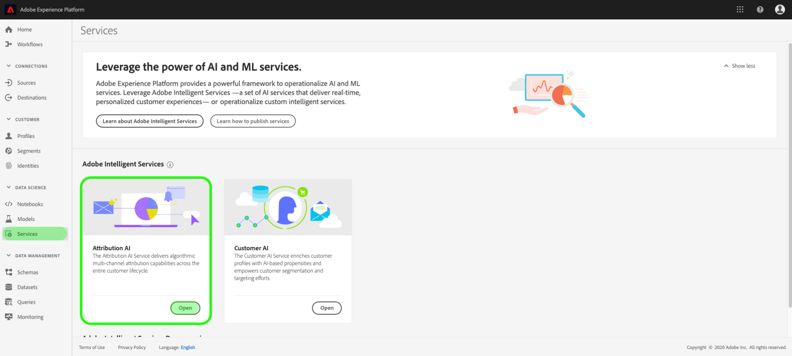
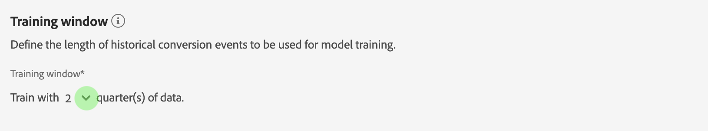

# Attribution AI UI指南

Attribution AI是Intelligent Services的一部分，它是一種多管道的演演算法歸因服務，可計算客戶互動對指定結果的影響和累加影響。 透過Attribution AI，行銷人員可經由瞭解每個客戶在客戶歷程各個階段的互動所產生的影響，來衡量行銷和廣告支出並予以最佳化。

本檔案可用作在Intelligent Services使用者介面中與Attribution AI互動的指南。

## 建立模型

在[!DNL Adobe Experience Platform] UI中，選取左側導覽中的&#x200B;**[!UICONTROL 服務]**。 **[!UICONTROL 服務]**&#x200B;瀏覽器出現，並顯示可用的Adobe智慧型服務。 在Attribution AI的容器中，選取&#x200B;**[!UICONTROL 開啟]**。

便會顯示Attribution AI服務頁面。 此頁面列出Attribution AI的服務模型並顯示其相關資訊，包括模型名稱、轉換事件、模型執行頻率以及上次更新狀態。

您可以在&#x200B;**[!UICONTROL 建立模型]**&#x200B;容器的右下角找到&#x200B;**[!UICONTROL 已評分的轉換事件總數]**&#x200B;個量度。 此量度會追蹤Attribution AI目前日曆年度所評分的轉換事件總數，包括所有沙箱環境及任何已刪除的服務模型。

您可以使用UI右側的控制項，編輯、複製和刪除服務模型。 若要顯示這些控制項，請從您現有的&#x200B;**[!UICONTROL 服務模型]**&#x200B;中選取模型。 控制項包含下列資訊：

- **[!UICONTROL 編輯]**：選取&#x200B;**[!UICONTROL 編輯]**&#x200B;可讓您修改現有的服務模型。 您可以編輯模型的名稱、說明、狀態、評分頻率以及其他評分資料集欄。
- **[!UICONTROL 複製]**：選取&#x200B;**[!UICONTROL 複製]**&#x200B;會複製選取的服務模型。 然後，您可以修改工作流程以進行微幅調整，並將其重新命名為新模型。
- **[!UICONTROL 刪除]**：您可以刪除包含任何歷史執行的服務模型。 對應的輸出資料集將會從Experience Platform中刪除。 不過，同步至即時客戶設定檔的分數不會刪除。
- **[!UICONTROL 資料來源]**：正在使用的資料集連結。 如果Attribution AI使用多個資料集，則會顯示「多個」，後面接著資料集數目。 選取超連結時，會顯示資料集預覽彈出視窗。
- **[!UICONTROL 上次執行詳細資料]**：這只有在執行失敗時才會顯示。 有關執行失敗原因的資訊，例如錯誤代碼會顯示在這裡。

- **[!UICONTROL 轉換事件]**：針對此模型設定的轉換事件快速概覽。
- **[!UICONTROL 回顧期間]**：您定義的時間範圍，表示包含轉換事件接觸點之前的天數。
- **[!UICONTROL 接觸點]**：建立此模型時定義的所有接觸點清單。

選取&#x200B;**[!UICONTROL 建立模型]**&#x200B;以開始。

接著，Attribution AI的設定頁面就會顯示，您可以在其中提供名稱和選用的服務模型說明。

## 選取資料 {#select-data}

<!-- https://www.adobe.com/go/aai-select-data -->

依設計，Attribution AI可以使用Adobe Analytics、體驗事件和消費者體驗事件資料來計算歸因分數。 選取資料集時，只會列出與Attribution AI相容的資料集。 若要選取資料集，請選取資料集名稱旁的(**+**)符號，或選取核取方塊以一次新增多個資料集。 您也可以使用搜尋選項來快速尋找您感興趣的資料集。

選取您要使用的資料集後，選取「**[!UICONTROL 新增]**」按鈕，將資料集新增至資料集預覽窗格。

選取資料集旁的資訊圖示會開啟資料集預覽彈出視窗。

資料集預覽包含上次更新時間、來源結構描述以及前十欄的預覽等資料。

選取「儲存&#x200B;****」以儲存您在工作流程中移動時的草稿。 您也可以儲存草稿模型組態，並移至工作流程中的下一個步驟。 使用&#x200B;**[!UICONTROL 儲存並繼續]**&#x200B;在模型組態期間建立並儲存草稿。 功能可讓您建立和儲存模型組態的草稿，當您必須在組態工作流程中定義許多欄位時，此功能特別有用。

### 資料集完整性 {#dataset-completeness}

<!-- https://www.adobe.com/go/aai-dataset-completeness -->

在資料集預覽中，是資料集完整性百分比值。 此值可讓您快速瞭解資料集中有多少欄是空白/空的。 如果資料集包含許多遺失值，而這些值是在其他位置擷取的，強烈建議您納入包含遺失值的資料集。

>[!NOTE]
>
>資料集完整性是使用Attribution AI的最大訓練時段（一年）來計算。 這表示在顯示您的資料集完整性值時，不會考慮超過一年的資料。

### 選取身分 {#identity}

您現在可以根據身分對應（欄位）將多個資料集聯結到彼此中。 您必須選取身分型別（也稱為「身分名稱空間」）及該名稱空間中的身分值。 如果您在相同名稱空間下將多個欄位指派為結構描述中的身分，則所有指派的身分值都會出現在身分下拉式清單中（前面加上`EMAIL (personalEmail.address)`或`EMAIL (workEmail.address)`等名稱空間）。

>[!IMPORTANT]
>
>您選取的每個資料集都必須使用相同的身分型別（名稱空間）。 在身分資料行中的身分型別旁會出現綠色核取記號，表示資料集相容。 例如，使用電話名稱空間和`mobilePhone.number`做為識別碼時，其餘資料集的所有識別碼都必須包含並使用電話名稱空間。

若要選取識別，請選取位於識別資料行中的底線值。 會出現「選取身分」彈出視窗。

如果名稱空間中有多個身分可用，請務必為您的使用案例選取正確的身分欄位。 例如，電子郵件名稱空間中有兩個電子郵件身分可用，一個是工作電子郵件，一個是個人電子郵件。 視使用案例而定，個人電子郵件更有可能被填寫，且在個人預測中更有用。 這表示您可以選取`EMAIL (personalEmail.address)`作為您的身分。

未選取

>[!NOTE]
>
> 如果資料集沒有有效的身分型別（名稱空間），您必須使用[結構描述編輯器](../../xdm/schema/composition.md#identity)設定主要身分，並將其指派給身分名稱空間。 若要深入瞭解名稱空間和身分，請瀏覽[Identity Service名稱空間](../../identity-service/features/namespaces.md)檔案。

## 對應媒體頻道和行銷活動欄位 {#aai-mapping}

<!-- https://www.adobe.com/go/aai-mapping -->

完成選取和新增資料集後，**對應**&#x200B;設定步驟就會顯示。 Attribution AI需要您對應您在上一步中選取的每個資料集的媒體頻道欄位。 這是因為如果沒有資料集之間的媒體管道對應，從Attribution AI衍生的深入分析可能無法正常顯示，導致深入分析頁面難以解譯。 雖然只需要媒體頻道，強烈建議您對應部分選用欄位，例如媒體動作、行銷活動名稱、行銷活動群組和行銷活動標籤。 這麼做可讓Attribution AI提供更清楚的深入分析和最佳結果。

## 定義事件 {#define-events}

<!-- https://www.adobe.com/go/aai-define-events -->

有三種不同型別的輸入資料用於定義事件：

- **轉換事件：**&#x200B;識別行銷活動影響的業務目標，例如，電子商務訂單、店內購買和網站造訪。
- **回顧期間：**&#x200B;提供時間範圍，指出應包含轉換事件接觸點之前的天數。
- **接觸點：**&#x200B;收件者、個人和/或Cookie層級的行銷事件，用於評估轉換的數值或收入型影響。

### 定義轉換事件 {#define-conversion-events}

若要定義轉換事件，您必須為事件命名，並從&#x200B;**選取資料集和欄位**&#x200B;下拉式選單中選取資料集和欄位，以選取事件型別。

選取事件後，其右側會出現新的下拉式清單。 第二個下拉式清單是用來透過使用作業，為您的事件提供進一步內容。 對於此轉換事件，使用預設作業&#x200B;*存在*。

>[!NOTE]
>
>定義事件時，*轉換名稱*&#x200B;下的字串會更新。

接下來，您可以選取合併資料集，此資料集是上一步驟中合併所有輸入資料集後產生的。 或者，您也可以從&#x200B;**選取資料集和欄位**&#x200B;下拉式功能表，根據個別資料集選取欄。

**[!UICONTROL 新增事件]**&#x200B;和&#x200B;**[!UICONTROL 新增群組]**&#x200B;按鈕可用來進一步定義您的轉換。 根據您定義的轉換，您可能需要使用&#x200B;**[!UICONTROL 新增事件]**&#x200B;和&#x200B;**[!UICONTROL 新增群組]**&#x200B;按鈕來提供進一步的內容。

選取「**[!UICONTROL 新增事件]**」會建立其他欄位，這些欄位可使用上述相同方法來填入。 這樣做會將AND陳述式新增到轉換名稱下方的字串定義中。 選取&#x200B;**x**&#x200B;以移除已新增的事件。

選取「**[!UICONTROL 新增群組]**」可讓您選擇建立與原始欄位不同的其他欄位。 加入群組後，會出現藍色&#x200B;*和*&#x200B;按鈕。 選取&#x200B;**And**&#x200B;可讓您將引數變更為包含「Or」的選項。 「或」可用來定義多個成功的轉換路徑。 &quot;And&quot;會擴充轉換路徑以包含其他條件。

如果您需要多個轉換，請選取&#x200B;**新增轉換**&#x200B;以建立新的轉換卡。 您可以重複上述程式來定義多個轉換。

### 定義回顧期間 {#lookback-window}

定義完轉換後，您需要確認回顧期間。 使用方向鍵或選取預設值(56)，指定您想在轉換事件前的幾天加入來自的接觸點。 接觸點會在下一個步驟中定義。

### 定義接觸點

定義接觸點的工作流程與[定義轉換](#define-conversion-events)類似。 一開始您需要為接觸點命名，並從&#x200B;*輸入欄位名稱*&#x200B;下拉式選單中選取接觸點值。 選取後，運運算元下拉式清單會出現，預設值為「存在」。 選取下拉式清單以顯示運運算元清單。

針對此接觸點，選取&#x200B;**等於**。

選取接觸點的運運算元後，*輸入欄位值*&#x200B;即可使用。 *輸入欄位值*&#x200B;的下拉式清單值會根據您先前選取的運運算元與接觸點值填入。 如果下拉式清單中未填入值，您可以手動在中輸入該值。 選取下拉式清單，然後選取&#x200B;**按一下**。

>[!NOTE]
>
>運運算元「存在」和「不存在」沒有關聯的欄位值。

**新增事件**&#x200B;和&#x200B;**新增群組**&#x200B;按鈕可用來進一步定義您的接觸點。 由於接觸點周圍的性質複雜，單一接觸點常會有多個事件和群組。

選取時，**新增事件**&#x200B;允許新增其他欄位。 選取&#x200B;**x**&#x200B;以移除已新增的事件。

選取「**新增群組**」可讓您選擇建立與原始欄位不同的其他欄位。 加入群組後，會出現藍色&#x200B;*和*&#x200B;按鈕。 選取&#x200B;**And**&#x200B;以變更引數，新引數&quot;Or&quot;可用來定義多個成功路徑。 此特定接觸點只有一個成功路徑，因此不需要「或」。

>[!NOTE]
>
>使用&#x200B;*接觸點名稱*&#x200B;下的字串來快速瞭解您的接觸點。 請注意，字串符合接觸點的名稱。

您可以選取&#x200B;**新增接觸點**&#x200B;並重複上述程式，以新增其他接觸點。

定義完所有必要的接觸點後，請向上捲動並在右上角選取「**下一步**」，以繼續進行最後步驟。

## 進階訓練和評分設定

Attribution AI中的最後一頁是用於設定訓練和評分的&#x200B;**[!UICONTROL 進階]**&#x200B;頁面。

### 排程訓練

使用&#x200B;*排程*，您可以選取一週中要評分的日期和時間。

選取&#x200B;*評分頻率*&#x200B;下的下拉式清單，以在每日、每週和每月評分之間選取。 接著，選取您希望評分在一週中的哪幾天發生。 可以選取多天。 再次選取同一天會取消選取。

若要變更評分發生的時間，請選取時鐘圖示。 在出現的新覆蓋圖中，輸入您要評分發生的時間。 在覆蓋之外選取以將其關閉。

>[!NOTE]
>
>完成每個評分程式最多可能需要24小時的時間。

### 其他分數資料集欄（選擇性）

根據預設，系統會針對標準結構描述中的每個服務模型建立分數資料集。 您可以選擇根據您的轉換事件和接觸點設定，將其他欄新增到評分資料集輸出。 首先，從您的輸入資料集中選取欄，然後您就可以將滑鼠左鍵按在漢堡圖示上，以拖放欄來變更順序。

### 以區域為根據的模型化（選擇性） {#region-based-modeling-optional}

您的客戶行為可能會因國家/地區和地理區域而有很大的差異。 對於全球企業，使用以國家或區域為根據的模型可以提高歸因準確性。 每個新增的區域都會建立含有該區域資料的新模型。

若要定義新的地區，請選取&#x200B;**[!UICONTROL 新增地區]**。 在出現的容器中，提供區域的名稱。 **[!UICONTROL 輸入欄位名稱]**&#x200B;下拉式清單中只會填入一個值(「placeContext.geo.countryCode」)。 選取此值。

區域

接著，選取運運算元。

最後，在&#x200B;**[!UICONTROL 輸入欄位值]**&#x200B;下拉式清單中輸入國家/地區代碼。

>[!NOTE]
>
>國家/地區代碼長度為兩個字元。 您可以在[ISO 3166-1 alpha-2](https://datahub.io/core/country-list)找到完整清單。

### 訓練時段 {#training-window}

為確保您獲得儘可能準確的模型，請務必使用代表您業務的歷史資料來訓練您的模型。 依預設，此模型會使用2季（6個月）的轉換事件資料進行訓練。 選取下拉式清單以變更預設值。 您可以選擇使用一至四個季度的資料（3-12個月）進行訓練。

>[!NOTE]
>
>較短的訓練時段對最近趨勢比較敏感，而較長的訓練時段則可建立較穩固的模型，而且對最近趨勢比較不敏感。

選取訓練時段後，在右上角選取&#x200B;**[!UICONTROL 完成]**。 留出一些時間處理資料。 完成後，會顯示彈出視窗對話方塊，確認執行個體設定完成。 選取「確定」****&#x200B;以重新導向至&#x200B;**[!UICONTROL 服務執行個體]**&#x200B;頁面，您可在其中看到您的服務執行個體。

## 後續步驟

依照本教學課程，您已成功在Attribution AI中建立服務執行個體。 執行個體完成評分後（最多允許24小時），您就可以[探索Attribution AI深入分析](./discover-insights.md)。 此外，如果您想要下載您的評分結果，請瀏覽[下載分數](./download-scores.md)檔案。

## 其他資源

以下影片概述在Attribution AI中建立新執行個體的端對端工作流程。

>[!VIDEO](https://video.tv.adobe.com/v/32668?learn=on&quality=12)
