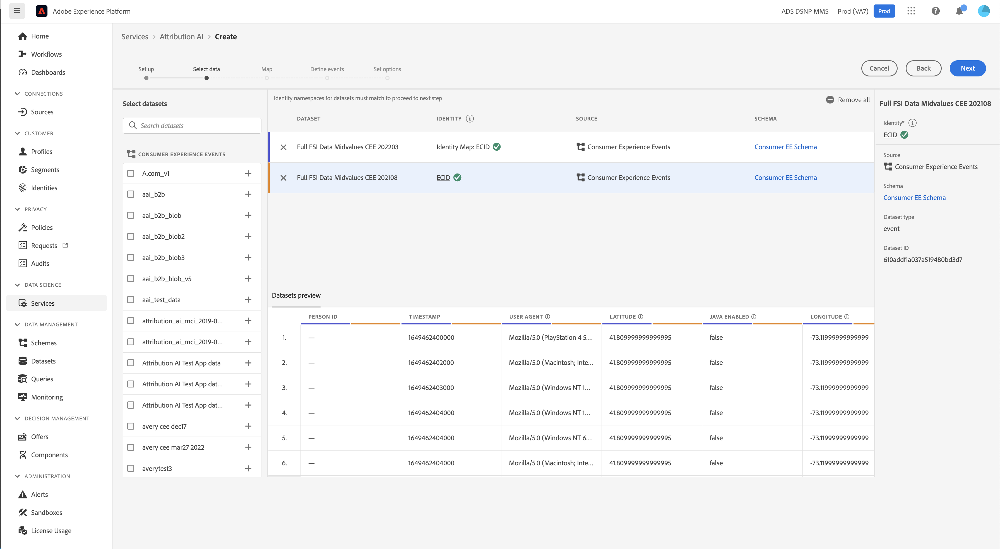
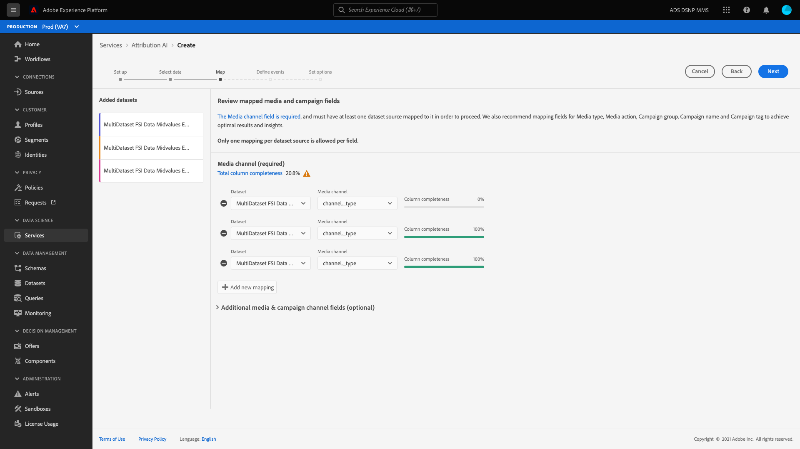
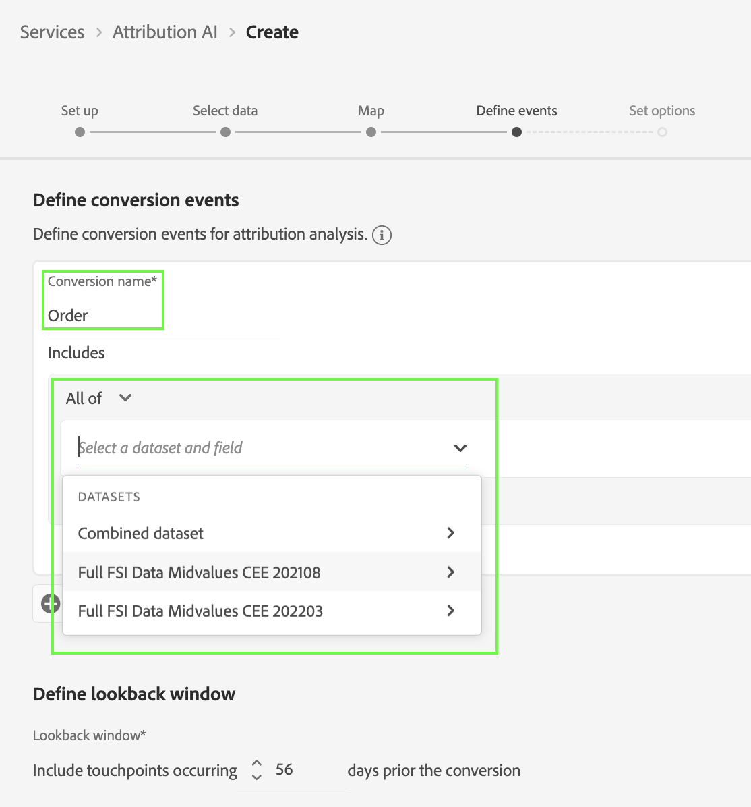

# Attribution AIUI指南

Attribution AI，作為智慧服務的一部分，是一種多渠道的算法歸屬服務，它計算客戶交互對特定結果的影響和增量影響。 透過 Attribution AI，行銷人員可經由了解每個客戶在客戶歷程各個階段的互動所產生的影響，來衡量行銷和廣告支出並予以最佳化。

本文檔用作與Intelligent Services用戶介面中的Attribution AI交互的指南。

## 建立實例

在 [!DNL Adobe Experience Platform] UI，選擇 **[!UICONTROL 服務]** 的子菜單。 的 **[!UICONTROL 服務]** 瀏覽器出現並顯示可用的Adobe智慧服務。 在Attribution AI容器中，選擇 **[!UICONTROL 開啟]**。

將顯示Attribution AI服務頁面。 此頁列出Attribution AI的服務實例並顯示有關這些實例的資訊，包括實例名稱、轉換事件、實例的運行頻率以及上次更新的狀態。

您可以找到 **[!UICONTROL 得到的轉換事件總數]** 位於 **[!UICONTROL 建立實例]** 容器。 此度量跟蹤當前日曆年（包括所有沙盒環境和所有已刪除的服務實例）由Attribution AI評分的轉換事件總數。

可以使用UI右側的控制項編輯、克隆和刪除服務實例。 要顯示這些控制項，請從現有控制項中選擇一個實例 **[!UICONTROL 服務實例]**。 控制項包含以下資訊：

- **[!UICONTROL 編輯]**:選擇 **[!UICONTROL 編輯]** 允許您修改現有服務實例。 您可以編輯實例的名稱、說明、狀態和記分頻率。
- **[!UICONTROL 克隆]**:選擇 **[!UICONTROL 克隆]** 複製所選服務實例。 然後，您可以修改工作流以進行小微調整，並將其更名為新實例。
- **[!UICONTROL 刪除]**:您可以刪除包含任何歷史運行的服務實例。
- **[!UICONTROL 資料源]**:到正在使用的資料集的連結。 如果Attribution AI正在使用多個資料集，則顯示「Multiple」，後面是資料集數。 選擇超連結後，將顯示資料集預覽跨距。
- **[!UICONTROL 上次運行詳細資訊]**:僅當運行失敗時才顯示此資訊。 此處顯示運行失敗原因的資訊，如錯誤代碼。

- **[!UICONTROL 轉換事件]**:快速概述為此實例配置的轉換事件。
- **[!UICONTROL 回望窗口]**:您定義的時間範圍，指示包含轉換事件觸點前的天數。
- **[!UICONTROL 觸點]**:建立此實例時定義的所有觸點的清單。

選擇 **[!UICONTROL 建立實例]** 開始。

接下來，將出現Attribution AI設定頁，您可以在其中為服務實例提供名稱和可選說明。

## 選擇資料 {#select-data}

<!-- https://www.adobe.com/go/aai-select-data -->

通過設計，Attribution AI可以使用Adobe Analytics、體驗事件和消費者體驗事件資料來計算歸因分數。 選擇資料集時，只列出與Attribution AI相容的資料集。 要選擇資料集，請選擇&#x200B;**+**)資料集名稱旁邊的符號，或選中複選框以一次添加多個資料集。 您還可以使用搜索選項快速查找您感興趣的資料集。

選擇要使用的資料集後，選擇 **[!UICONTROL 添加]** 按鈕，將資料集添加到資料集預覽窗格。

選擇資訊表徵圖  資料集旁邊開啟資料集預覽跨距。

資料集預覽包含資料，如上次更新時間、源架構和前十列的預覽。

### 資料集完整性 {#dataset-completeness}

<!-- https://www.adobe.com/go/aai-dataset-completeness -->

在資料集預覽中是資料集完整性百分比值。 此值提供了資料集中有多少列為空/空的快速快照。 如果資料集包含大量缺失值，並且這些值在其他位置被捕獲，強烈建議您包括包含缺失值的資料集。

>[!NOTE]
>
>使用Attribution AI（一年）的最大培訓窗口計算資料集完整性。 這意味著在顯示資料集完整性值時，不會考慮超過一年的資料。

### 選擇標識 {#identity}

現在，您可以基於標識映射（欄位）將多個資料集聯接到彼此。 必須選擇標識類型（也稱為「標識命名空間」）和該命名空間中的標識值。 如果在同一命名空間下將多個欄位指定為架構中的標識，則所有分配的標識值都會出現在由命名空間優先的標識下拉清單中，如 `EMAIL (personalEmail.address)` 或 `EMAIL (workEmail.address)`。

>[!IMPORTANT]
>
>必須對您選擇的每個資料集使用相同的標識類型（命名空間）。 標識列中標識類型旁邊出現綠色複選標籤，表示資料集相容。 例如，當使用Phone命名空間和 `mobilePhone.number` 作為標識符，其餘資料集的所有標識符必須包含並使用Phone命名空間。

要選擇標識，請選擇標識列中帶下划線的值。 將出現選擇標識跨距。

如果命名空間中有多個標識可用，請確保為使用案例選擇正確的標識欄位。 例如，電子郵件命名空間中有兩個電子郵件標識，一個是工作電子郵件，另一個是個人電子郵件。 根據使用案例，個人電子郵件更可能被填入，在個人預測中也更有用。 這意味著您將選擇 `EMAIL (personalEmail.address)` 你的身份。

>[!NOTE]
>
> 如果資料集不存在有效的標識類型（命名空間），則必須設定主標識並使用 [架構編輯器](../../xdm/schema/composition.md#identity)。 要瞭解有關命名空間和標識的詳細資訊，請訪問 [標識服務命名空間](../../identity-service/namespaces.md) 文檔。

## 映射媒體渠道和活動欄位 {#aai-mapping}

<!-- https://www.adobe.com/go/aai-mapping -->

在完成選擇和添加資料集後， **地圖** 出現配置步驟。 Attribution AI要求您為上一步中選擇的每個資料集映射「媒體通道」欄位。 這是因為，如果沒有資料集之間的媒體通道映射，從Attribution AI中派生的洞察力可能不會正確顯示，從而難以解釋洞察力頁面。 儘管只需要媒體頻道，但強烈建議您映射一些可選欄位，如媒體操作、市場活動名稱、市場活動組和市場活動標籤。 這樣，Attribution AI就能提供更清晰的見解和最佳結果。

## 定義事件 {#define-events}

<!-- https://www.adobe.com/go/aai-define-events -->

定義事件時使用三種不同類型的輸入資料：

- **轉換事件：** 確定營銷活動影響的業務目標，如電子商務訂單、店內採購和網站訪問。
- **回望窗口：** 提供一個時間框，指明在轉換事件觸點之前應包括多少天。
- **觸點：** 收件人、個人或cookie級市場營銷事件，用於評估轉換對數字或基於收入的影響。

### 定義轉換事件 {#define-conversion-events}

要定義轉換事件，您需要為該事件指定一個名稱，並通過從 **選擇資料集和欄位** 下拉菜單。

選中某個事件後，其右側將出現一個新的下拉清單。 第二個下拉清單用於通過使用操作為事件提供更多上下文。 對於此轉換事件，預設操作 *存在* 的子菜單。

>[!NOTE]
>
>下面的字串 *轉換名稱* 在定義事件時更新。

接下來，可以選擇通過組合上一步中的所有輸入資料集而生成的組合資料集。 或者，您也可以根據 **選擇資料集和欄位** 下拉菜單。

的 **[!UICONTROL 添加事件]** 和 **[!UICONTROL 添加組]** 按鈕用於進一步定義轉換。 根據您要定義的轉換，您可能需要使用 **[!UICONTROL 添加事件]** 和 **[!UICONTROL 添加組]** 按鈕以提供更多上下文。

選擇 **[!UICONTROL 添加事件]** 建立可使用上述相同方法填充的附加欄位。 這樣做會在轉換名稱下的字串定義中添加AND語句。 選擇 **x** 刪除已添加的事件。

選擇 **[!UICONTROL 添加組]** 提供了建立與原始欄位分開的附加欄位的選項。 加入組後，藍色 *和* 按鈕 選擇 **和** 提供了將參數更改為包含「Or」的選項。 「或」用於定義多個成功的轉換路徑。 「And」擴展了轉換路徑以包含附加條件。

如果需要多個轉換，請選擇 **添加轉換** 的子菜單。 您可以重複上述過程來定義多個轉換。

### 定義回望窗口 {#lookback-window}

定義完轉換後，需要確認回望窗口。 使用箭頭鍵或通過選擇預設值(56)，指定在轉換事件之前要包含的觸點數。 觸點在下一步中定義。

### 定義觸點

在定義觸點後，類似的工作流 [定義轉換](#define-conversion-events)。 最初，您需要命名觸點，並從 *輸入欄位名稱* 下拉菜單。 選中後，將出現運算子下拉清單，並顯示預設值「exists」。 選擇下拉清單以顯示運算子清單。

為此觸點，請選擇 **等於**。

一旦選擇了觸點的運算子， *輸入欄位值* 的子菜單。 的下拉值 *輸入欄位值* 根據先前選擇的運算子和觸點值填充。 如果某個值未在下拉清單中填充，則可以手動在中鍵入該值。 選擇下拉清單並選擇 **按一下**。

>[!NOTE]
>
>運算子&quot;exists&quot;和&quot;not exists&quot;沒有與它們關聯的欄位值。

的 **添加事件** 和 **添加組** 按鈕用於進一步定義觸點。 由於觸地點周圍的複雜性質，單個觸地點有多個事件和組並不罕見。

選中後， **添加事件** 允許添加其他欄位。 選擇 **x** 刪除已添加的事件。

選擇 **添加組** 允許您選擇建立與原始欄位分開的附加欄位。 加入組後，藍色 *和* 按鈕 選擇 **和** 要更改參數，新參數「Or」用於定義多個成功路徑。 此特定的觸點只有一條成功路徑，因此不需要「Or」。

>[!NOTE]
>
>使用下面的字串 *觸點名稱* 以快速瞭解您的觸點。 請注意，字串與觸點名稱匹配。

通過選擇 **添加觸點** 重複上述過程。

定義完所有必要的觸點後，向上滾動並選擇 **下一個** 的上界。

## 高級培訓和評分設定

Attribution AI中的最後一頁 **[!UICONTROL 高級]** 用於設定培訓和評分的頁面。

### 安排培訓

使用 *計畫*，您可以選擇要進行評分的星期中的日期和時間。

選擇下拉清單 *評分頻率* 以在每日、每週和每月評分之間進行選擇。 接下來，選擇要進行評分的星期。 可以選擇多天。 再次選擇同一天將取消選擇該日期。

要更改要進行計分的一天中的時間，請選擇時鐘錶徵圖。 在顯示的新覆蓋中，輸入要進行計分的日期。 選擇覆蓋外部以關閉它。

>[!NOTE]
>
>完成每個評分過程可能需要24小時。

### 其他分數資料集列（可選）

預設情況下，為標準架構中的每個服務實例建立分數資料集。 您可以選擇根據「轉換事件」和「觸碰點」配置將附加列添加到評分資料集輸出。 首先從輸入資料集中選擇列，然後通過按住滑鼠左鍵在漢堡表徵圖上來拖放列以更改順序。

### 基於區域的建模（可選） {#region-based-modeling-optional}

客戶的行為可能因國家和地理區域而異。 對於全球性企業，使用基於國家或基於區域的模型可以提高歸因的準確性。 添加的每個區域都使用該區域的資料建立新模型。

要定義新區域，請從選擇 **[!UICONTROL 添加區域]**。 在出現的容器中，提供區域的名稱。 僅從中填充一個值(&quot;placeContext.geo.countryCode&quot;) **[!UICONTROL 輸入欄位名稱]** 下拉清單。 選擇此值。

接下來，選擇一個運算子。

最後，在 **[!UICONTROL 輸入欄位值]** 下拉清單。

>[!NOTE]
>
>國家/地區代碼為兩個字元長。 此處可找到完整清單 [ISO 3166-1α-2](https://datahub.io/core/country-list)。

### 培訓窗口 {#training-window}

為確保您獲得盡可能最準確的模型，必須使用代表您業務的歷史資料來培訓您的模型。 預設情況下，模型使用2個季度（6個月）的轉換事件資料進行訓練。 選擇下拉清單以更改預設值。 您可以選擇使用四分之一到四的資料（3-12個月）進行培訓。

>[!NOTE]
>
>較短的訓練窗口對近期趨勢更敏感，而較長的訓練窗口則建立更穩健的模型，對近期趨勢更不敏感。

選擇培訓窗口後，選擇 **[!UICONTROL 完成]** 在右上角。 允許一些時間處理資料。 完成後，將出現一個跨距對話框，確認實例設定已完成。 選擇 **[!UICONTROL 確定]** 要重定向到 **[!UICONTROL 服務實例]** 頁面，您可以在其中查看服務實例。

### 以屬性為基礎的存取控制

>[!IMPORTANT]
>
>基於屬性的訪問控制目前僅在有限版本中可用。

[基於屬性的訪問控制](../../../help/access-control/abac/overview.md) 是Adobe Experience Platform的一種功能，使管理員能夠根據屬性控制對特定對象和/或權能的訪問。 屬性可以是添加到對象的元資料，如添加到架構欄位或段的標籤。 管理員定義包括屬性的訪問策略以管理用戶訪問權限。

此功能允許您用定義組織或資料使用範圍的標籤來標籤體驗資料模型(XDM)架構欄位。 同時，管理員可以使用用戶和角色管理介面來定義圍繞XDM架構欄位的訪問策略，並更好地管理授予用戶或用戶組（內部、外部或第三方用戶）的訪問。 此外，基於屬性的訪問控制允許管理員管理對特定段的訪問。

通過基於屬性的訪問控制，管理員可以控制用戶對所有平台工作流和資源中敏感個人資料(SPD)和個人身份資訊(PII)的訪問。 管理員可以定義只能訪問特定欄位和與這些欄位對應的資料的用戶角色。

由於基於屬性的訪問控制，某些欄位和功能可能受到訪問限制，並且對某些Attribution AI服務實例不可用。 示例包括「Identity」、「Score Definition」和「Clone」。

在Attribution AI工作區頂部 **insights頁**，邊欄中顯示的詳細資訊具有限制訪問權限。

如果您選擇的資料集上具有受限架構 **[!UICONTROL 建立實例工作流]** 頁，資料集名稱旁邊將顯示一個警告符號，消息為： [!UICONTROL 已排除受限資訊]。

在上預覽具有受限架構的資料集時 **[!UICONTROL 建立實例工作流]** 頁，警告會告訴您 [!UICONTROL 由於訪問限制，某些資訊不會顯示在資料集預覽中。]

在建立具有受限資訊的實例後，繼續執行 **[!UICONTROL 定義目標]** 步驟，頂部將顯示警告： [!UICONTROL 由於訪問限制，配置中不顯示某些資訊。]

## 後續步驟

按照本教程，您已成功在Attribution AI中建立了服務實例。 一旦實例完成計分（最多允許24小時），您就可以 [發現Attribution AI](./discover-insights.md)。 此外，如果您希望下載評分結果，請訪問 [下載分數](./download-scores.md) 文檔。

## 其他資源

以下視頻概述了用於在Attribution AI中建立新實例的端到端工作流。

>[!VIDEO](https://video.tv.adobe.com/v/32668?learn=on&quality=12)
