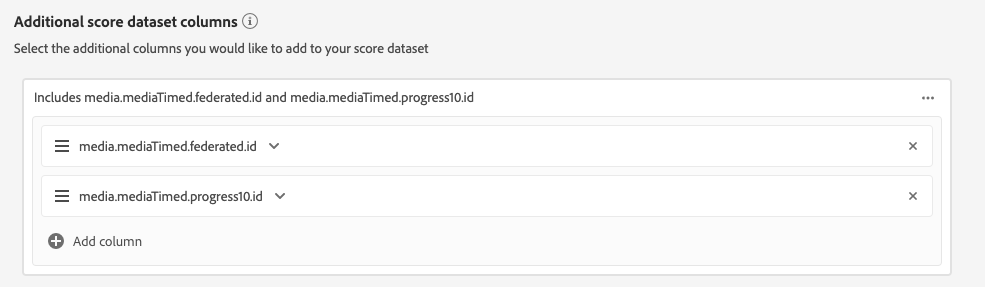

# Attribution AIUI指南

Attribution AI是智慧型服務的一部分，是多通道的演算法歸因服務，可計算客戶互動對特定結果的影響和增量影響。 透過 Attribution AI，行銷人員可經由了解每個客戶在客戶歷程各個階段的互動所產生的影響，來衡量行銷和廣告支出並予以最佳化。

本檔案可做為與智慧型服務使用者介面中Attribution AI互動的指南。

## 建立例項

在[!DNL Adobe Experience Platform] UI中，按一下左側導覽中的&#x200B;**[!UICONTROL Services]**。 出現&#x200B;**[!UICONTROL Services]**&#x200B;瀏覽器並顯示可用的Adobe智慧服務。 在Attribution AI容器中，按一下&#x200B;**[!UICONTROL Open]**。

此時將顯示Attribution AI服務頁。 本頁列出了Attribution AI的服務實例，並顯示了相關資訊，包括實例的名稱、轉換事件、實例的運行頻率以及上次更新的狀態。

您可以在&#x200B;**[!UICONTROL Create instance]**&#x200B;容器的右下側找到&#x200B;**[!UICONTROL Total conversion events scored]**&#x200B;量度。 此度量會追蹤目前日曆年度（包括所有沙盒環境和任何已刪除的服務例項）的Attribution AI計分轉換事件總數。

使用UI右側的控制項，即可編輯、複製和刪除服務例項。 若要顯示這些控制項，請從您現有的&#x200B;**[!UICONTROL Service instances]**&#x200B;中選取例項。 控制項包含下列資訊：

- **[!UICONTROL Edit]**:選擇 **[!UICONTROL Edit]** 允許修改現有服務實例。您可以編輯實例的名稱、說明、狀態和計分頻率。
- **[!UICONTROL Clone]**:選擇 **[!UICONTROL Clone]** 複製選定的服務實例。然後，您可以修改工作流程，進行微調，並將其重新命名為新例項。
- **[!UICONTROL Delete]**:您可以刪除包含任何歷史執行的服務例項。
- **[!UICONTROL Data source]**:此實例所使用之資料集的連結。
- **[!UICONTROL Last run details]**:只有當執行失敗時，才會顯示此項。此處會顯示執行失敗的原因，例如錯誤代碼。

- **[!UICONTROL Conversion events]**:此例項所設定之轉換事件的快速概述。
- **[!UICONTROL Lookback window]**:您定義的時間範圍，指出包含轉換事件接觸點前的天數。
- **[!UICONTROL Touchpoints]**:建立此例項時所定義之所有接觸點的清單。

選擇&#x200B;**[!UICONTROL Create instance]**&#x200B;開始。

接著，會出現Attribution AI的設定頁面，您可在此處提供基本資訊並指定例項的資料集。

### 命名例項

在&#x200B;**[!UICONTROL Basic information]**&#x200B;下，提供服務實例的名稱和可選說明。

### 選取資料集

填寫基本資訊後，按一下標示為&#x200B;**選擇資料集**&#x200B;的下拉式清單，以選取您的資料集。 該資料集用於訓練模型並對其生成的後續資料進行評分。 從下拉式選取器選取資料集時，只會列出與Attribution AI相容且符合體驗資料模型(XDM)架構的資料集。 在選擇資料集後，按一下右上角的&#x200B;**Next**&#x200B;以繼續定義事件頁面。

>[!TIP]
>
>Adobe Analytics資料集可透過Analytics Source Connector獲得支援。

## 定義事件

用於定義事件的輸入資料有三種類型：

- **轉換事件：** 識別行銷活動（例如電子商務訂單、店內採購和網站造訪）影響的業務目標。
- **回顧視窗：** 提供一個時間範圍，指出應包含轉換事件接觸點之前的天數。
- **觸點：收** 件者、個人或Cookie層級行銷事件，用來評估轉換的數值或收入型影響。

### 定義轉換事件{#define-conversion-events}

為了定義轉換事件，您需要為事件指定名稱，並按一下「輸入欄位名稱&#x200B;**」下拉式功能表以選擇事件類型。**

選取事件後，新的下拉式清單會顯示在其右側。 第二個下拉式清單會用來透過使用操作，為您的事件提供進一步的內容。 對於此轉換事件，使用預設操作&#x200B;*exists*。

>[!NOTE]
>
>當您定義事件時，會更新&#x200B;*轉換名稱*&#x200B;下方的字串。

**[!UICONTROL Add event]**&#x200B;和&#x200B;**[!UICONTROL Add Group]**&#x200B;按鈕可用來進一步定義轉換。 視您所定義的轉換而定，您可能需要使用&#x200B;**[!UICONTROL Add event]**&#x200B;和&#x200B;**[!UICONTROL Add group]**&#x200B;按鈕來提供更多內容。

按一下&#x200B;**[!UICONTROL Add event]**&#x200B;可建立其他欄位，這些欄位可使用與上述相同的方法填入。 這樣做會將AND陳述式新增至轉換名稱下方的字串定義。 按一下&#x200B;**x**&#x200B;以移除已新增的事件。

按一下&#x200B;**[!UICONTROL Add Group]**&#x200B;可提供建立與原始欄位不同之其他欄位的選項。 添加組後，出現藍色&#x200B;*And*&#x200B;按鈕。 按一下&#x200B;**And**&#x200B;提供選項，將參數變更為包含&quot;Or&quot;。 「Or」用於定義多個成功的轉換路徑。 「And」延伸轉換路徑，加入其他條件。

如果您需要多個轉換，請按一下「新增轉換&#x200B;**」以建立新的轉換卡。**&#x200B;您可以重複上述程式來定義多個轉換。

### 定義回顧視窗{#lookback-window}

定義完轉換後，您需要確認回顧視窗。 使用方向鍵或按一下預設值(56)，指定您要包含觸點的轉換事件前幾天。 接觸點在下一步驟中定義。

### 定義接觸點

定義觸點的工作流程與定義轉換[類似。 ](#define-conversion-events)一開始，您需要為觸點命名，並從&#x200B;*「輸入欄位名稱」下拉式選單中選取一個觸點值。*&#x200B;選取後，運算子下拉式清單會出現預設值「存在」。 按一下下拉式清單以顯示運算子清單。

為此觸點，請選擇&#x200B;**equals**。

在選取接觸點的運算子後，*「輸入欄位值」(Enter Field Value)*&#x200B;便可供使用。 根據您先前選取的運算元和觸點值填入&#x200B;*輸入欄位值*&#x200B;的下拉式值。 如果值未填入下拉式清單中，您可以手動輸入該值。 按一下下拉式清單並選擇&#x200B;**CLICK**。

>[!NOTE]
>
>運算子&quot;exists&quot;和&quot;not exists&quot;沒有與它們關聯的欄位值。

*新增事件*&#x200B;和&#x200B;*新增群組*&#x200B;按鈕可用來進一步定義您的觸點。 由於觸點周圍的複雜性質，單一觸點有多個事件和群組的情況並不少見。

按一下後，**Add event**&#x200B;允許新增其他欄位。 按一下&#x200B;**x**&#x200B;以移除已新增的事件。

按一下&#x200B;**添加組**&#x200B;可以選擇建立與原始欄位不同的其他欄位。 添加組後，出現藍色&#x200B;*And*&#x200B;按鈕。 按一下&#x200B;**And**&#x200B;以變更參數，新參數&quot;Or&quot;會用來定義多個成功路徑。 此特定觸點只有一條成功路徑，因此不需要「Or」。

>[!NOTE]
>
>使用&#x200B;*Touchpoint name*&#x200B;下方的字串，快速概觀您的觸點。 請注意，字串與接觸點的名稱相符。

您可以按一下「新增接觸點&#x200B;**」，然後重複上述程式，以新增其他接觸點。**

定義完所有必要的接觸點後，向上滾動並按一下右上角的&#x200B;**Next**&#x200B;以繼續最後的步驟。

## 進階訓練與計分設定

Attribution AI中的最後一頁是用於設定訓練和評分的&#x200B;**[!UICONTROL Advanced]**&#x200B;頁面。

### 排程培訓

使用&#x200B;*Schedule*，您可以選擇要進行計分的一週中的日期和時間。

按一下「計分頻率」下方的下拉式清單，以選擇每日、每週和每月計分。 **&#x200B;接著，選取您要進行計分的一週中的天數。 可選取多天。 按一下一天，再次取消選取。

要更改要進行計分的日期，請按一下時鐘錶徵圖。 在出現的新覆蓋中，輸入您要進行計分的日期。 按一下覆蓋外部以關閉覆蓋。

>[!NOTE]
>
>每個計分程式最多需要24小時才能完成。

### 其他分數資料集欄（選用）

依預設，會為標準架構中的每個服務例項建立分數資料集。 您可以選擇根據轉換事件和觸點組態新增其他欄至分數資料集輸出。 首先，從輸入資料集選取欄，然後拖放欄以變更順序，方法是將滑鼠左鍵按在漢堡圖示上。

### 區域型模型（可選）{#region-based-modeling-optional}

您客戶的行為可能會因國家／地區和地理區域而大不相同。 對於全球企業而言，使用以國家或地區為基礎的模型可以提高歸因準確度。 每個新增的區域都會建立包含該區域資料的新模型。

要定義新區域，請從按一下&#x200B;**[!UICONTROL Add region]**&#x200B;開始。 在出現的容器中，提供地區名稱。 從&#x200B;**[!UICONTROL Enter Field Name]**&#x200B;下拉式清單中只填入一個值(&quot;placeContext.geo.countryCode&quot;)。 選取此值。

接著，選取運算子。

最後，在&#x200B;**[!UICONTROL Enter Field Value]**&#x200B;下拉式清單中輸入國家／地區代碼。

>[!NOTE]
>
>國家／地區代碼有兩個字元長。 您可在這裡找到完整的清單。

### 培訓窗口{#training-window}

為確保您獲得盡可能精確的模型，請務必使用代表您業務的歷史資料來訓練模型。 依預設，模型會使用2個季度（6個月）的轉換事件資料進行訓練。 選擇下拉式清單以變更預設值。 您可以選擇培訓四分之一至四的資料（3-12個月）。

>[!NOTE]
>
>較短的訓練窗口對最近的趨勢更敏感，而較長的訓練窗口則建立更強穩的模型，對最近的趨勢更不敏感。

選擇培訓窗口後，按一下右上角的&#x200B;**[!UICONTROL Finish]**。 為資料處理留出一些時間。 完成後，將出現一個快顯對話框，確認實例設定已完成。 按一下&#x200B;**[!UICONTROL Ok]**&#x200B;可重定向到&#x200B;**[!UICONTROL Service instances]**&#x200B;頁，您可以在該頁看到服務實例。

## 後續步驟

按照本教程，您已成功建立了Attribution AI中的服務實例。 當例項完成計分（最多允許24小時）後，您就可以[發現Attribution AI見解](./discover-insights.md)。 此外，如果您想要下載計分結果，請造訪[下載計分](./download-scores.md)檔案。

## 其他資源

以下視訊概述端對端工作流程，以在Attribution AI中建立新例項。

>[!VIDEO](https://video.tv.adobe.com/v/32668?learn=on&quality=12)
