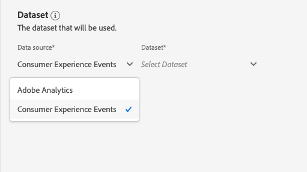

# Attribution AIUI指南

Attribution AI是Intelligent Services的一部分，是多管道的演算法歸因服務，可計算客戶互動對指定結果的影響和增量影響。 透過 Attribution AI，行銷人員可經由了解每個客戶在客戶歷程各個階段的互動所產生的影響，來衡量行銷和廣告支出並予以最佳化。

本檔案可做為與Intelligent Services使用者介面中的Attribution AI互動的指南。

## 建立例項

在[!DNL Adobe Experience Platform] UI中，按一下左側導覽中的&#x200B;**[!UICONTROL 服務]**。 出現&#x200B;**[!UICONTROL 服務]**&#x200B;瀏覽器，並顯示可用的Adobe智慧服務。 在Attribution AI容器中，按一下&#x200B;**[!UICONTROL 開啟]**。

Attribution AI服務頁面隨即顯示。 此頁面會列出Attribution AI的服務例項，並顯示其相關資訊，包括例項名稱、轉換事件、執行例項的頻率，以及上次更新的狀態。

您可以在&#x200B;**[!UICONTROL 建立例項]**&#x200B;容器右下方找到計分&#x200B;]**的轉換事件總數量度。**[!UICONTROL &#x200B;此量度會追蹤目前日曆年度中，依Attribution AI評分的轉換事件總數，包括所有沙箱環境和任何已刪除的服務例項。

使用UI右側的控制項，即可編輯、複製及刪除服務例項。 若要顯示這些控制項，請從現有的&#x200B;**[!UICONTROL 服務實例]**&#x200B;中選擇一個實例。 控制項包含下列資訊：

- **[!UICONTROL 編輯]**:選擇 **** 「編輯」(Edit)可以修改現有服務實例。您可以編輯例項的名稱、說明、狀態和計分頻率。
- **[!UICONTROL 原地複製]**:選擇 **** 克隆選定的服務實例。接著，您可以修改工作流程進行微幅調整，並重新命名為新例項。
- **[!UICONTROL 刪除]**:您可以刪除服務例項，包括任何歷史執行。
- **[!UICONTROL 資料來源]**:此執行個體所使用資料集的連結。
- **[!UICONTROL 上次執行詳細資料]**:唯有執行失敗時，才會顯示此選項。此處顯示執行失敗原因（例如錯誤代碼）的資訊。

- **[!UICONTROL 轉換事件]**:快速概述針對此執行個體設定的轉換事件。
- **[!UICONTROL 回顧期間]**:您定義的時間範圍，指出包含轉換事件接觸點前的天數。
- **[!UICONTROL 接觸點]**:建立此例項時定義的所有接觸點的清單。

選擇&#x200B;**[!UICONTROL 建立實例]**&#x200B;以開始。

接下來，會顯示Attribution AI的設定頁面，您可在其中提供基本資訊並指定執行個體的資料集。

### 為例項命名

在&#x200B;**[!UICONTROL 基本資訊]**&#x200B;下，提供服務實例的名稱和可選說明。

### 選取資料集

填寫基本資訊後，按一下標示為&#x200B;**選取資料集**&#x200B;的下拉式清單，選取您的資料集。 資料集可用來訓練模型，並對其產生的後續資料評分。 從下拉式選取器中選取資料集時，只會列出與Attribution AI相容且符合Experience Data Model(XDM)結構的資料集。 選取資料集後，按一下右上角的&#x200B;**Next**&#x200B;以繼續前往定義事件頁面。

>[!TIP]
>
>Adobe Analytics資料集可透過Analytics Source Connector獲得支援。

## 定義事件

定義事件時使用三種不同類型的輸入資料：

- **轉換事件：** 可識別行銷活動影響的業務目標，例如電子商務訂單、店內購買和網站造訪。
- **回顧期間：** 提供一個時間範圍，指出應包含轉換事件接觸點前的幾天。
- **接觸點：** 收件者、個人或Cookie層級行銷事件，用於評估轉換的數值或收入型影響。

### 定義轉換事件 {#define-conversion-events}

若要定義轉換事件，您需要為事件指定名稱，並按一下&#x200B;**Enter Field Name**&#x200B;下拉式選單來選取事件類型。

選取事件後，新的下拉式清單會顯示在其右側。 第二個下拉式清單可透過使用操作，為您的事件提供更多內容。 對於此轉換事件，會使用預設操作&#x200B;*exists*。

>[!NOTE]
>
>在您定義事件時，會更新&#x200B;*轉換名稱*&#x200B;底下的字串。

**[!UICONTROL 新增事件]**&#x200B;和&#x200B;**[!UICONTROL 新增群組]**&#x200B;按鈕可用來進一步定義您的轉換。 根據您正在定義的轉換，您可能需要使用&#x200B;**[!UICONTROL Add event]**&#x200B;和&#x200B;**[!UICONTROL Add group]**&#x200B;按鈕來提供更多上下文。

按一下「**[!UICONTROL 新增事件]**」會建立其他欄位，這些欄位可使用如上所述的相同方法填入。 這樣會在轉換名稱下方的字串定義中新增AND陳述式。 按一下&#x200B;**x**&#x200B;以移除已新增的事件。

按一下「**[!UICONTROL 新增群組]**」，即可選擇建立與原始欄位不同的其他欄位。 加入群組後，會出現藍色的&#x200B;*And*&#x200B;按鈕。 按一下&#x200B;**And**&#x200B;提供將參數變更為包含「Or」的選項。 「Or」可用來定義多個成功的轉換路徑。 「和」延伸轉換路徑以包含其他條件。

如果需要多個轉換，請按一下「**新增轉換**」以建立新的轉換卡。 您可以重複上述程式來定義多個轉換。

### 定義回顧期間 {#lookback-window}

定義完轉換後，您需要確認回顧期間。 使用方向鍵或按一下預設值(56)，指定您要加入接觸點的轉換事件前幾天。 接觸點會在下一個步驟中定義。

### 定義接觸點

定義接觸點會遵循類似於[定義轉換](#define-conversion-events)的工作流程。 起初，您需要為接觸點命名，並從&#x200B;*輸入欄位名稱*&#x200B;下拉式選單中選取接觸點值。 選取後，運算子下拉式清單就會顯示預設值「exists」。 按一下下拉式清單以顯示運算子清單。

為此接觸點的目的，請選取&#x200B;**等於**。

選取接觸點的運算子後，即可使用&#x200B;*輸入欄位值*。 *輸入欄位值*&#x200B;的下拉式清單值會根據您先前選取的運算子和接觸點值填入。 如果值未填入下拉式清單中，您可以手動在中輸入該值。 按一下下拉式清單，然後選取&#x200B;**按一下**。

>[!NOTE]
>
>運算子「exists」和「not exists」沒有與它們相關聯的欄位值。

*新增事件*&#x200B;和&#x200B;*新增群組*&#x200B;按鈕可用來進一步定義您的接觸點。 由於接觸點的周圍性質複雜，單一接觸點有多個事件和群組的現象並不少見。

按一下後，**新增事件**&#x200B;允許新增其他欄位。 按一下&#x200B;**x**&#x200B;以移除已新增的事件。

按一下&#x200B;**新增群組**&#x200B;可讓您選擇建立與原始欄位不同的其他欄位。 加入群組後，會出現藍色的&#x200B;*And*&#x200B;按鈕。 按一下&#x200B;**And**&#x200B;以變更參數，新參數&quot;Or&quot;可用來定義多個成功路徑。 此特定接觸點只有一個成功路徑，因此不需要「Or」。

>[!NOTE]
>
>使用&#x200B;*接觸點名稱*&#x200B;下的字串，快速概述接觸點。 請注意，字串與接觸點的名稱相符。

您可以按一下「**新增接觸點**」並重複上述程式，以新增其他接觸點。

定義完所有必要的接觸點後，向上捲動並按一下右上角的&#x200B;**Next**&#x200B;以繼續執行最後一步。

## 高級培訓和評分設定

Attribution AI中的最後一頁是用於設定訓練和分數的&#x200B;**[!UICONTROL Advanced]**&#x200B;頁面。

### 計畫培訓

使用&#x200B;*Schedule*，您可以選取要進行分數的一週中的日期和時間。

按一下&#x200B;*計分頻率*&#x200B;下的下拉式清單，在每日、每週和每月計分之間進行選擇。 接下來，選擇要進行分數的星期幾。 可選取多天。 第二次按一下某天來取消選取。

要更改要進行計分的時間，請按一下時鐘錶徵圖。 在顯示的新覆蓋圖中，輸入要進行計分的時間。 按一下覆蓋圖外部以關閉它。

>[!NOTE]
>
>完成每個計分程式最多需要24小時。

### 其他分數資料集欄（選用）

依預設，會為標準結構中的每個服務例項建立分數資料集。 您可以根據「轉換事件」和「接觸點」設定，選擇新增其他欄至分數資料集輸出。 首先，您可以從輸入資料集中選取欄，接著將滑鼠左鍵按住漢堡圖示上方，即可拖放欄以變更順序。

### 以區域為基礎的模型（可選） {#region-based-modeling-optional}

客戶的行為可能因國家/地區和地理區域而大不相同。 對於全球企業而言，使用國家/地區或地區模型可提高歸因準確度。 新增的每個區域都會使用該區域的資料建立新模型。

要定義新區域，請首先按一下&#x200B;**[!UICONTROL Add region]**。 在顯示的容器中，提供地區名稱。 從&#x200B;**[!UICONTROL 輸入欄位名稱]**&#x200B;下拉式清單只填入一個值(&quot;placeContext.geo.countryCode&quot;)。 選取此值。

接下來，選擇一個運算子。

最後，在&#x200B;**[!UICONTROL 輸入欄位值]**&#x200B;下拉式清單中輸入國家/地區代碼。

>[!NOTE]
>
>國家/地區代碼為兩個字元長。 您可以在此處[ISO 3166-1 alpha-2](https://datahub.io/core/country-list)找到完整清單。

### 培訓窗口 {#training-window}

為了確保您盡可能獲得最精確的模型，請務必使用代表您業務的歷史資料來訓練您的模型。 依預設，模型會使用2個季度（6個月）的轉換事件資料進行訓練。 選取下拉式清單以變更預設值。 您可以選擇使用1到4個季度的資料（3-12個月）進行培訓。

>[!NOTE]
>
>較短的培訓窗口對最近的趨勢更敏感，而較長的培訓窗口則建立更強健的模型，對最近的趨勢更不敏感。

選擇培訓窗口後，按一下右上角的&#x200B;**[!UICONTROL 完成]**。 讓資料有時間處理。 完成後，彈出視窗對話方塊隨即顯示，確認執行個體設定完成。 按一下&#x200B;**[!UICONTROL Ok]**&#x200B;以重新導向至&#x200B;**[!UICONTROL 服務例項]**&#x200B;頁面，您可在其中看到您的服務例項。

## 後續步驟

依照本教學課程，您已成功在Attribution AI中建立服務例項。 執行個體完成計分（最多允許24小時）後，您就可以[探索Attribution AI見解](./discover-insights.md)了。 此外，如果您想下載計分結果，請訪問[下載計分](./download-scores.md)文檔。

## 其他資源

以下影片概述在Attribution AI中建立新例項的端對端工作流程。

>[!VIDEO](https://video.tv.adobe.com/v/32668?learn=on&quality=12)
