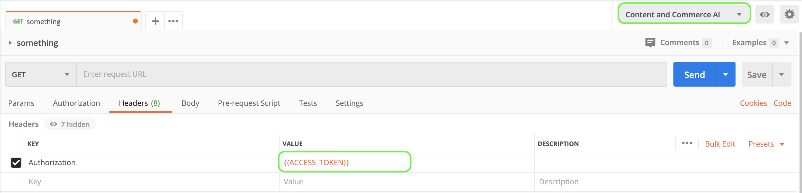

# 內容和商務AI入門

>[!NOTE]
>
>內容和商務AI處於測試版。 文檔可能會更改。

[!DNL Content and Commerce AI] 利用Adobe I/OAPI。 要調用Adobe I/OAPI和I/O控制台整合，必須首先完成 [驗證教程](https://www.adobe.com/go/platform-api-authentication-en)。

但是，當你到達 **添加API** 步驟， API位於Experience Cloud下，而不是Adobe Experience Platform下，如以下螢幕快照所示：

完成Adobe I/O教程將提供所有驗證API調用中每個必需標頭的值，如下所示：

- `Authorization: Bearer {ACCESS_TOKEN}`
- `x-api-key: {API_KEY}`
- `x-gw-ims-org-id: {IMS_ORG}`

## 建立Postman環境（可選）

在Adobe開發人員控制台中設定項目和API後，您就可以選擇下載Postman的環境檔案。 下 **[!UICONTROL API]** 項目的左滑軌，選擇 **[!UICONTROL 內容和商務AI]**。 將開啟一個新頁籤，其中包含標有「」的卡[!DNL Try it out]。 選擇 **郵遞員下載** 下載用於配置郵遞員環境的JSON檔案。

下載檔案後，開啟Postman並選擇 **齒輪表徵圖** 右上角開啟 **管理環境** 對話框。

下一步，選擇 **導入** 從 **管理環境** 對話框。

系統會重定向您並要求您從電腦中選擇環境檔案。 選擇您以前下載的JSON檔案，然後選擇 **開啟** 載入環境。

您被重定向回 *管理環境* 的子菜單。 選擇要查看和編輯Postman中可用變數的環境名稱。 您仍然需要手動填充 `JWT_TOKEN` 和 `ACCESS_TOKEN`。 應在完成 [驗證教程](https://www.adobe.com/go/platform-api-authentication-en)。

完成後，您的變數應類似於下面的螢幕截圖。 選擇 **更新** 完成環境設定。

現在，您可以從右上角的下拉菜單中選擇您的環境，並自動填充保存的任何值。 只需隨時重新編輯這些值以更新所有API調用。

有關使用PostmanAdobe I/OAPI的詳細資訊，請參閱上的「中等」帖子 [使用Postman在Adobe I/O上進行JWT驗證](https://medium.com/adobetech/using-postman-for-jwt-authentication-on-adobe-i-o-7573428ffe7f)。

## 讀取示例API調用

本指南提供了示例API調用，以演示如何格式化請求。 這些包括路徑、必需的標頭和正確格式化的請求負載。 還提供了API響應中返回的示例JSON。 有關示例API調用文檔中使用的約定的資訊，請參見上的 [如何讀取示例API調用](../../landing/troubleshooting.md) Experience Platform疑難解答指南。

## 後續步驟 {#next-steps}

一旦您擁有了所有憑據，您就可以為 [!DNL Content and Commerce AI]。 以下文檔有助於瞭解擴展性框架和環境設定。

要瞭解有關擴展性框架的更多資訊，請從 [擴展性簡介](https://experienceleague.adobe.com/docs/asset-compute/using/extend/understand-extensibility.html) 的子菜單。 本文檔概述了先決條件和設定要求。

瞭解有關為 [!DNL Content and Commerce AI]，從 [設定開發人員環境](https://experienceleague.adobe.com/docs/asset-compute/using/extend/setup-environment.html)。 本文檔提供了設定說明，允許您為Asset compute服務進行開發。
