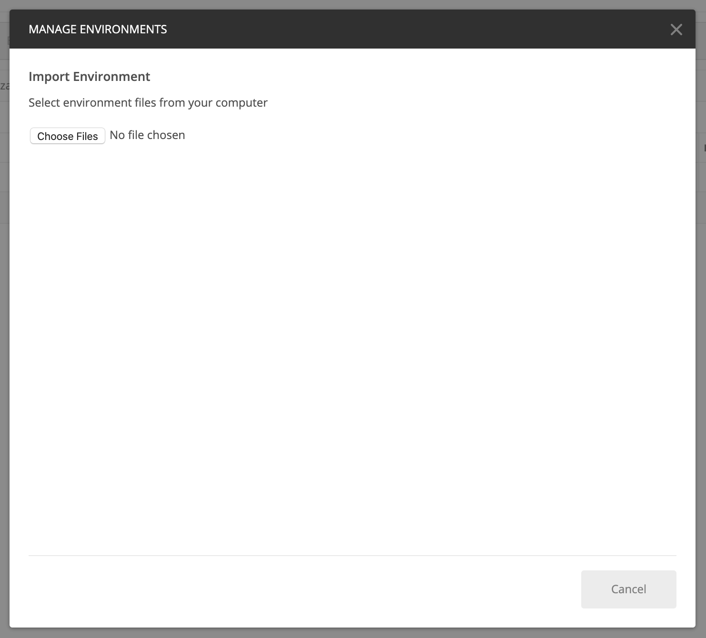

# 內容與商務AI快速入門

>[!NOTE]
>
>內容與商務AI為測試版。 說明檔案可能會有所變更。

[!DNL Content and Commerce AI] 運用Adobe I/OAPI。為了調用Adobe I/OAPI和I/O控制台整合，您必須先完成[驗證教程](https://www.adobe.com/go/platform-api-authentication-en)。

但是，當您進入「新增API」步驟時，API會位於「Experience Cloud」下，而非「Adobe Experience Platform」下，如下列螢幕擷取所示：****

完成驗證教學課程後，將提供所有Adobe I/OAPI呼叫中每個必要標題的值，如下所示：

- `Authorization: Bearer {ACCESS_TOKEN}`
- `x-api-key: {API_KEY}`
- `x-gw-ims-org-id: {IMS_ORG}`

## 建立郵遞員環境（可選）

在Adobe開發人員主控台中設定專案和API後，您就可以選擇下載Postman的環境檔案。 在項目的左側邊欄&#x200B;**[!UICONTROL APIs]**&#x200B;下，選擇&#x200B;**[!UICONTROL Content and Commerce AI]**。 隨即開啟新標籤，其中包含標示為&quot;[!DNL Try it out]&quot;的卡片。 選擇&#x200B;**Download for Postman**&#x200B;以下載用於配置郵遞員環境的JSON檔案。

下載檔案後，請開啟Postman並選取右上方的&#x200B;**gear圖示**，以開啟&#x200B;**管理環境**&#x200B;對話方塊。

接著，從&#x200B;**管理環境**&#x200B;對話方塊中選擇&#x200B;**導入**。

系統會重定向您，並要求您從電腦中選擇環境檔案。 選取您先前下載的JSON檔案，然後選取&#x200B;**Open**&#x200B;以載入環境。

系統會將您重新導向至&#x200B;*管理環境*&#x200B;標籤，並填入新的環境名稱。 選擇環境名稱，以檢視並編輯Postman中可用的變數。 您仍需手動填入`JWT_TOKEN`和`ACCESS_TOKEN`。 完成[驗證教程](https://www.adobe.com/go/platform-api-authentication-en)時，應已獲得這些值。

完成後，您的變數看起來應類似下方的螢幕擷取。 選擇&#x200B;**更新**&#x200B;以完成環境設定。

您現在可以從右上角的下拉式選單中選取您的環境，並自動填入任何儲存的值。 只要隨時重新編輯值，即可更新所有API呼叫。

有關使用Postman使用Adobe I/OAPI的詳細資訊，請參閱[上的「使用Postman進行Adobe I/O](https://medium.com/adobetech/using-postman-for-jwt-authentication-on-adobe-i-o-7573428ffe7f)的JWT驗證的中」貼文。

## 讀取範例API呼叫

本指南提供範例API呼叫，以示範如何格式化您的請求。 這些包括路徑、必要標題和正確格式化的請求負載。 也提供API回應中傳回的範例JSON。 如需範例API呼叫檔案中所用慣例的詳細資訊，請參閱Experience Platform疑難排解指南中[如何讀取範例API呼叫](../../landing/troubleshooting.md)一節。

## 下一步 {#next-steps}

擁有所有憑據後，您就可以為[!DNL Content and Commerce AI]設定自定義工作器。 以下檔案有助於瞭解擴充性架構與環境設定。

若要進一步瞭解擴充性架構，請先閱讀extensibility](https://docs.adobe.com/content/help/en/asset-compute/using/extend/understand-extensibility.html)檔案的[簡介。 本檔案概述必要條件和布建需求。

若要進一步瞭解如何為[!DNL Content and Commerce AI]設定環境，請先閱讀[設定開發人員環境](https://docs.adobe.com/content/help/en/asset-compute/using/extend/setup-environment.html)的指南。 本檔案提供設定指示，讓您針對Asset compute服務進行開發。
