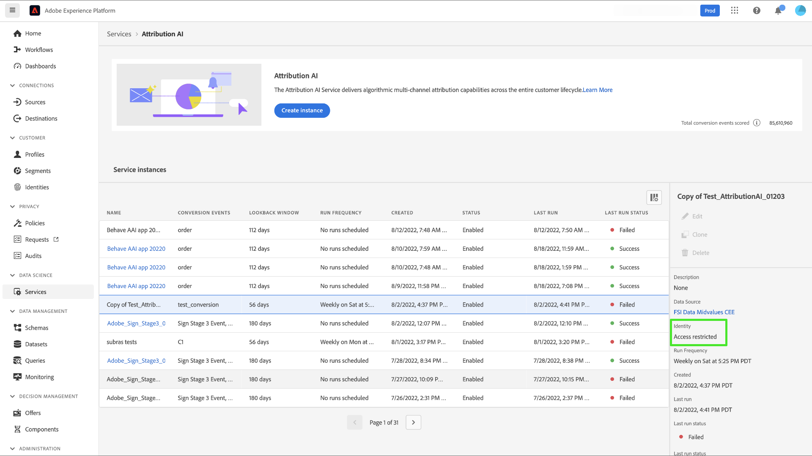

# Customer AI中以屬性為基礎的存取控制

>[!IMPORTANT]
>
>以屬性為基礎的存取控制目前僅在有限版本中可用。

[以屬性為基礎的存取控制](../../../access-control/abac/overview.md)是Adobe Experience Platform的一項功能，可讓管理員根據屬性控制特定物件和/或功能的存取。 屬性可以是新增至物件的中繼資料，例如新增至結構欄位或區段的標籤。 管理員定義存取原則，其中包含管理使用者存取許可權的屬性。

此功能可讓您使用定義組織或資料使用範圍的標籤，來標籤Experience Data Model (XDM)結構描述欄位。 同時，管理員可以使用使用者和角色管理介面來定義有關XDM結構描述欄位的存取原則，並更好地管理使用者或使用者群組（內部、外部或第三方使用者）的存取許可權。 此外，屬性型存取控制可讓管理員管理特定區段的存取權。

透過以屬性為基礎的存取控制，您組織的管理員可以控制使用者對所有Platform工作流程和資源的敏感個人資料(SPD)和個人識別資訊(PII)的存取權。 管理員可以定義只能存取特定欄位以及這些欄位對應資料的使用者角色。

由於基於屬性的存取控制，某些欄位和功能將存取受限，並且無法用於某些Customer AI服務模型。 範例包括「身分」、「評分定義」和「原地複製」。

在Customer AI工作區&#x200B;**深入分析頁面**&#x200B;頂端，請注意，側邊欄、分數定義、身分和設定檔屬性中的詳細資料都顯示「存取受限」。

當您在&#x200B;**[!UICONTROL 建立模型工作流程]**&#x200B;頁面上預覽包含受限制結構描述的資料集時，會出現警告以通知您[!UICONTROL 由於存取限制，某些資訊不會顯示在資料集預覽中。]

當您使用受限制的資訊建立模型並繼續&#x200B;**[!UICONTROL 定義目標]**&#x200B;步驟後，會在頂端顯示警告： [!UICONTROL 由於存取限制，某些資訊不會顯示在設定中。]

使用存取控制時，**檢視Customer AI**&#x200B;和&#x200B;**管理Customer AI**&#x200B;許可權會將存取權授予Customer AI的不同功能。 **管理Customer AI**&#x200B;許可權可讓您&#x200B;**建立**、**更新**、**刪除**、**啟用**&#x200B;或&#x200B;**停用**&#x200B;模型，而&#x200B;**檢視Customer AI**&#x200B;則可讓您讀取或檢視模型。 稽核記錄檔會記錄&#x200B;**建立**、**更新**&#x200B;和&#x200B;**刪除**&#x200B;動作。

請參閱檔案以瞭解[指派存取控制許可權](../../../access-control/home.md)或如何[使用稽核記錄來監視存取和活動](../../../landing/governance-privacy-security/audit-logs/overview.md)。

## 後續步驟

閱讀本指南後，您已經瞭解[!DNL Experience Platform]中存取控制的主要原則。 您現在可以繼續參閱[存取控制使用手冊](../overview.md)，以取得有關如何使用[!DNL Admin Console]建立產品設定檔及為[!DNL Platform]指派許可權的詳細步驟。
