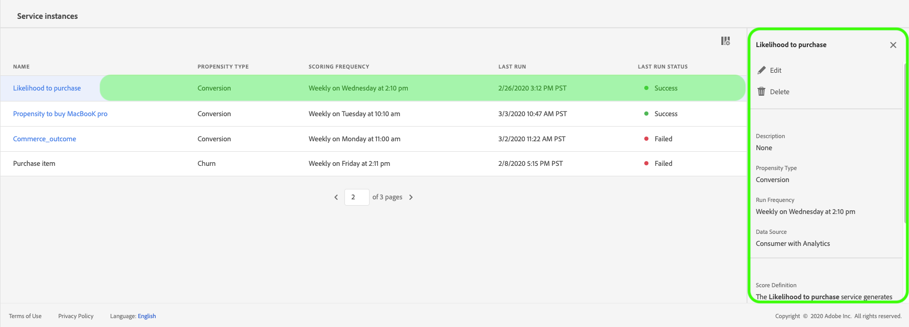

# 透過客戶人工智慧發掘見解

客戶人工智慧(Customer AI)是智慧型服務的一部分，可讓行銷人員運用Adobe Sensei來預測客戶的下一步行動。 客戶人工智慧可用來產生自訂傾向分數，例如大規模個別個人檔案的流失和轉換。 完成此項作業時，不需將業務需求轉換為機器學習問題、選擇演算法、訓練或部署。

本檔案可做為在智慧型服務客戶AI使用者介面中與服務例項見解互動的指南。

## 快速入門

為了利用客戶AI的見解，您需要有一個運行狀態成功的服務實例。 若要建立新的服務例項，請造訪 [Customer AI使用指南](./user-guide.md)。 如果您最近建立了一個服務例項，但它仍在訓練和計分中，請允許24小時以完成執行。

## 服務實例概述

在Adobe Experience Platform UI中，按一下左側導 **覽中** 「服務」。 出現 *「服務* 」瀏覽器並顯示可用的「智慧型服務」。 在「客戶AI」的容器中，按一下「開 **啟」**。

此時將顯示「客戶AI服務」頁。 本頁列出客戶AI的服務例項，並顯示其相關資訊，包括例項名稱、傾向類型、執行例項的頻率，以及上次更新的狀態。

>[!NOTE] 只有已完成成功計分執行的服務例項才有見解。

按一下服務實例名稱開始。

接著，該服務例項的前瞻分析頁面隨即出現，您會在此處獲得資料的視覺化。 本指南將詳細說明視覺化以及您可以如何處理資料。

### 服務實例詳細資訊

查看服務實例詳細資訊有兩種方法：第一種是從儀表板查看，另一種是從服務實例查看。

若要從控制面板內檢視詳細資訊，請按一下服務例項容器，以避免附加至名稱的超連結。 這會開啟右側邊欄，提供其他詳細資訊，例如說明、計分頻率、預測目標和合格人口。 此外，您也可以選擇按一下「編輯」或「刪除」來編 **輯** 和刪 **除實例**。

>[!NOTE] 當計分執行失敗時，會提供錯誤訊息。 錯誤訊息會列在右側邊欄的「 *上次執行詳細資訊* 」下方，此欄位僅會顯示失敗的執行。

檢視服務例項其他詳細資訊的第二個方法位於前瞻分析頁面。 您可以按一 **下右上方** 的「顯示更多」以填入下拉式清單。 詳細資訊會列出，例如分數定義、建立時間和傾向類型。 如需所列任何屬性的詳細資訊，請造訪客 [戶AI使用指南](./user-guide.md)。

### 編輯例項

若要編輯例項，請按一 **下右上方導覽** 中的「編輯」。

此時將出現編輯對話框，允許您編輯實例 *的「說明* 」 *和「計分頻率* 」。 若要確認變更並關閉對話方塊，請按一 **下右下** 角的「編輯」。

### 更多動作

「更 **多動作** 」按鈕位於「編輯」旁的右上導 **覽中**。 按一 **下「更多動作** 」會開啟下拉式清單，供您選取下列其中一個作業：

- **刪除**:刪除實例。
- **存取分數**:按一 *下「存取分數* 」會開啟對話方塊，提供客戶AI  教學課程下載分數的連結，此對話方塊也提供進行API呼叫所需的資料集ID。
- **檢視執行記錄**:此時將顯示一個對話框，其中包含與服務實例關聯的所有計分運行的清單。

## 計分摘要

計分摘要會顯示計分的描述檔總數，並將其分類至包含高、中和低傾向的時段。 傾向區間是根據得分範圍而決定，低於24，中度為25至74，高於74。 每個桶都有對應於圖例的顏色。

>[!NOTE] 如果是轉換傾向分數，高分以綠色顯示，低分以紅色顯示。 如果您預測客戶流失傾向，這會反轉，高分會以紅色顯示，低分會是綠色。 無論您選擇何種傾向類型，中時段都會保持黃色。

## 分數分佈

「 *分數分佈* 」卡會根據分數提供人口的視覺化摘要。 您在「分數分佈」卡 *中看到的顏色* ，代表產生的傾向分數類型。

## 影響因素

對於每個分數貯體，會產生一張卡片，顯示該貯體的前10個影響因素。 這些影響因素提供您更多有關客戶為何屬於不同分數區間的詳細資訊。

### 建立區段

按一 **下「低** 」、「中」和「高傾向」任何區段中的「建立區段」按鈕，會將您重新導向至區段產生器。

區段產生器可用來定義區段，但客戶人工智慧已為您完成工作。 若要完成區段的建立，只需填入區 *段產生器使用者介面右側導軌中的「名稱* 」和「說明 ** 」容器即可。 在您為區段指定名稱和說明後，按一 **下右上** 角的「儲存」。

>!![NOTE] 由於傾向分數會寫入個別描述檔，因此在「區段產生器」中可使用這些分數，就像任何其他描述檔屬性一樣。 當您導覽至區段產生器以建立新區段時，可在您的命名空間「客戶人工智慧」下查看所有不同的傾向分數。

若要在平台UI中檢視新區段，請按一下左 **側導覽** 中的區段。 「瀏 *覽* 」頁面隨即出現，並顯示所有可用區段。

## 後續步驟

本檔案概述了客戶AI服務實例提供的見解。 您現在可以繼續教學課程，在 [Customer AI](./download-scores.md) （客戶人工智慧）中下載分數 [，或瀏覽其他](../home.md) Adobe智慧型服務指南。