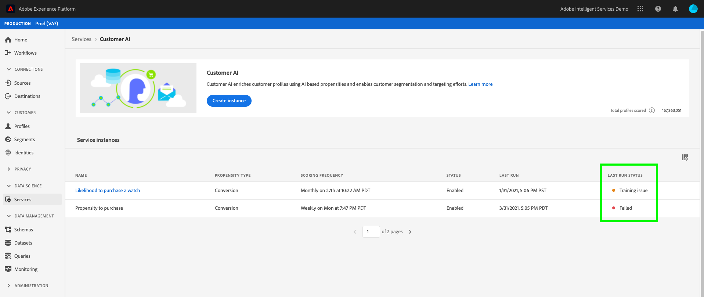

# Customer AI錯誤疑難排解

模型訓練、計分和設定失敗時，Customer AI會顯示錯誤。 在 **[!UICONTROL 服務實例]** 小節， **[!UICONTROL 上次運行狀態]** 顯示下列其中一條訊息： **[!UICONTROL 成功]**, **[!UICONTROL 培訓問題]**，和 **[!UICONTROL 失敗]**.

如果 **[!UICONTROL 失敗]** 或 **[!UICONTROL 培訓問題]** 顯示時，您可以選取執行狀態以開啟側面板。 側面板包含 **[!UICONTROL 上次運行狀態]** 和 **[!UICONTROL 上次運行詳細資訊]**. **[!UICONTROL 上次運行詳細資訊]** 包含執行失敗原因的資訊。 如果Customer AI無法提供您錯誤的詳細資訊，請聯絡支援人員，並提供錯誤代碼。

 

## 無法在Chrome無痕中存取Customer AI

由於Google Chrome的無痕模式安全設定有更新，因此會出現Google Chrome無痕模式中的載入錯誤。 目前正與Chrome共同處理此問題，將experience.adobe.com設為值得信賴的網域。

 

### 建議的修正

若要解決此問題，您需要將experience.adobe.com新增為一律可使用Cookie的網站。 首先，導覽至 **chrome://settings/cookies**. 下一步，向下捲動至 **自訂行為** 區段，接著選取 **新增** 按鈕（位於「一律可使用cookie的網站」旁）。 在顯示的彈出視窗中，複製並貼上 `[*.]experience.adobe.com` 然後選取 **包括第三方Cookie** 此網站上的複選框。 完成後，選取 **新增** 並以無痕方式重新載入客戶AI。

## 模型質量差

如果您收到錯誤「[!UICONTROL 模型質量差。 建議您使用修改後的設定建立新應用程式]」。 請依照下列建議步驟協助疑難排解。

 

### 建議的修正

「模型質量差」表示模型精度不在可接受的範圍內。 培訓後，Customer AI無法建立可靠的模型，且AUC（ROC曲線下的區域）&lt; 0.65。 若要修正錯誤，建議您變更其中一個設定參數並重新執行訓練。

首先，檢查資料的準確性。 您的資料必須包含預測結果所需的必要欄位。

- 檢查您的資料集是否有最新日期。 Customer AI一律假設資料是觸發模型時的最新狀態。
- 檢查您定義的預測和資格窗口中是否缺少資料。 您的資料必須完整無缺。 同時確認資料集符合 [Customer AI歷史資料需求](./input-output.md#data-requirements).
- 在您的架構欄位屬性中，檢查商務、應用程式、Web和搜尋中是否遺失資料。

如果您的資料似乎不是問題所在，請嘗試變更資格母體條件，將模型限制在特定設定檔(例如 `_experience.analytics.customDimensions.eVars.eVar142` 存在於最近56天)。 這會限制訓練視窗中所使用資料的母體和大小。

如果限制適用性母體無法運作或無法運作，請變更預測視窗。

- 嘗試將預測窗口更改為7天，查看錯誤是否繼續發生。 如果錯誤不再發生，表示您可能沒有足夠的資料用於定義的預測視窗。
