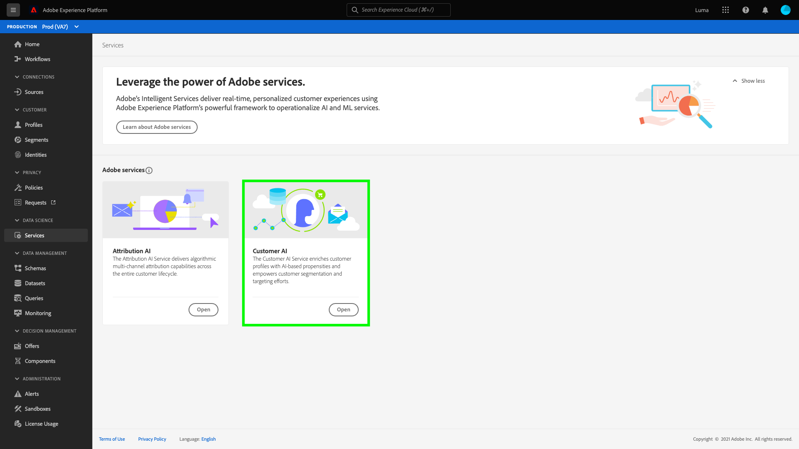

# 設定Customer AI執行個體

Customer AI是AI/ML服務的一部分，可讓您產生自訂傾向分數，而不需擔心機器學習。

AI/ML服務提供Customer AI作為簡單易用的Adobe Sensei服務，可針對不同使用案例進行設定。 以下小節提供設定Customer AI執行個體的步驟。

## 建立執行個體 {#set-up-your-instance}

在Platform UI中選取 **[!UICONTROL 服務]** ，位於左側導覽器中。 此 **[!UICONTROL 服務]** 瀏覽器隨即出現，並顯示您可使用的所有服務。 在Customer AI的容器中，選取 **[!UICONTROL 開啟]**.

此 **Customer AI** UI會出現，並顯示您的所有服務執行個體。

- 您可找到 **[!UICONTROL 已評分的個人檔案總數]** 位於右下角的量度 **[!UICONTROL 建立例項]** 容器。 此量度會追蹤Customer AI在目前日曆年度所評分的設定檔總數，包括所有沙箱環境及任何已刪除的服務執行個體。

您可以使用UI右側的控制項，編輯、複製和刪除服務執行個體。 若要顯示這些控制項，請從現有例項中選取一個例項 **[!UICONTROL 服務例項]**. 控制項包含下列專案：

- **[!UICONTROL 編輯]**：選取 **[!UICONTROL 編輯]** 可讓您修改現有的服務執行個體。 您可以編輯執行個體的名稱、說明和評分頻率。
- **[!UICONTROL 原地複製]**：選取 **[!UICONTROL 原地複製]** 複製目前選取的服務執行個體設定。 然後，您可以修改工作流程以進行微幅調整，並將其重新命名為新例證。
- **[!UICONTROL 刪除]**：您可以刪除包括任何歷史執行在內的服務執行個體。 對應的輸出資料集將會從Platform中刪除。 不過，同步至即時客戶設定檔的分數不會刪除。
- **[!UICONTROL 資料來源]**：此執行個體所使用資料集的連結。 如果使用多個資料集，選取超連結文字會開啟資料集預覽彈出視窗。
- **[!UICONTROL 上次執行詳細資料]**：這僅在執行失敗時顯示。 有關執行失敗原因的資訊，例如錯誤代碼會顯示在這裡。
- **[!UICONTROL 分數定義]**：您為此執行個體設定的目標快速概覽。

若要建立新例項，請選取 **[!UICONTROL 建立例項]**.

## 設定

此時會出現執行個體建立工作流程，從 **[!UICONTROL 設定]** 步驟。

以下是您必須為執行個體提供之值的重要資訊：

- **[!UICONTROL 名稱]：** 執行個體的名稱可用於顯示Customer AI分數的所有位置。 因此，名稱應該說明預測分數代表什麼。 例如，「取消雜誌訂閱的可能性」。

- **[!UICONTROL 說明]：** 說明您試圖預測的內容。

- **[!UICONTROL 傾向性型別]：** 傾向性型別會決定分數和量度極性的意圖。 您可以選擇 **[!UICONTROL 流失]** 或 **[!UICONTROL 轉換]**. 請參閱下的備註 [評分摘要](./discover-insights.md#scoring-summary) 在探索深入分析檔案中，取得傾向性型別如何影響您執行個體的詳細資訊。

提供所需的值，然後選取 **[!UICONTROL 下一個]** 以繼續。

## 選取資料 {#select-data}

Customer AI在設計上會使用Adobe Analytics、Adobe Audience Manager、一般體驗事件和消費者體驗事件資料來計算傾向分數。 選取資料集時，只會列出與Customer AI相容的資料集。 若要選取資料集，請選取(**+**)符號，或選取核取方塊一次新增多個資料集。 使用搜尋選項快速尋找您感興趣的資料集。

選取您要使用的資料集後，選取 **[!UICONTROL 新增]** 按鈕以將資料集新增到資料集預覽窗格。

選取資訊圖示  在資料集旁邊，會開啟資料集預覽彈出視窗。

資料集預覽包含上次更新時間、來源結構描述以及前十欄的預覽等資料。

選取 **[!UICONTROL 儲存]** 以在工作流程中移動時儲存草稿。 您也可以儲存草稿模型組態，並移至工作流程中的下一個步驟。 使用 **[!UICONTROL 儲存並繼續]** 在模型組態期間建立和儲存草稿。 功能可讓您建立和儲存模型組態的草稿，當您必須在組態工作流程中定義許多欄位時，此功能特別有用。

### 資料集完整性 {#dataset-completeness}

資料集預覽中有一個資料集完整性百分比值。 此值可讓您快速瞭解資料集中有多少欄是空白/空的。 如果資料集包含許多遺失值，而這些值是在其他位置擷取的，強烈建議您納入包含遺失值的資料集。 在此範例中，人員ID是空的，但人員ID會擷取在可以包含的個別資料集中。

>[!NOTE]
>
>資料集完整性是使用Customer AI的最大培訓時段（一年）計算的。 這表示在顯示您的資料集完整性值時，不會考慮超過一年的資料。

### 選取身分 {#identity}

您現在可以根據身分對應（欄位）將多個資料集聯結到彼此中。 您必須選取身分型別（也稱為「身分名稱空間」）及該名稱空間中的身分值。 如果您在相同名稱空間下的結構描述中將多個欄位指派為身分，則所有指派的身分值都會出現在身分下拉式清單中（前面有名稱空間），例如 `EMAIL (personalEmail.address)` 或 `EMAIL (workEmail.address)`.

[選取相同的名稱空間](../images/user-guide/cai-identity-map.png)

>[!IMPORTANT]
>
>您選取的每個資料集都必須使用相同的身分型別（名稱空間）。 在身分資料行中的身分型別旁會出現綠色核取記號，表示資料集相容。 例如，使用電話名稱空間和 `mobilePhone.number` 做為識別碼，其餘資料集的所有識別碼都必須包含並使用電話名稱空間。

若要選取識別，請選取位於識別資料行中的底線值。 會出現「選取身分」彈出視窗。

<!--  -->
[選取相同的名稱空間](../images/user-guide/cai-identity-namespace.png)

如果名稱空間中有多個身分可用，請務必為您的使用案例選取正確的身分欄位。 例如，電子郵件名稱空間中有兩個電子郵件身分可用，一個是工作電子郵件，一個是個人電子郵件。 視使用案例而定，個人電子郵件更有可能被填寫，且在個人預測中更有用。 這表示 `EMAIL (personalEmail.address)` 將被選為身分。

>[!NOTE]
>
> 如果資料集沒有有效的身分型別（名稱空間），您必須使用設定主要身分，並將其指派給身分名稱空間 [結構描述編輯器](../../../xdm/schema/composition.md#identity). 若要進一步瞭解名稱空間和身分，請造訪 [Identity Service名稱空間](../../../identity-service/features/namespaces.md) 檔案。

## 定義目標 {#define-a-goal}

<!-- https://www.adobe.com/go/cai-define-a-goal -->

此 **[!UICONTROL 定義目標]** 步驟隨即顯示，並提供互動式環境，供您以視覺化方式定義預測目標。 目標由一或多個事件組成，其中每個事件的發生皆根據其擁有的條件而定。 Customer AI執行個體的目標是判斷在指定時間範圍內達成其目標的可能性。

若要建立目標，請選取 **[!UICONTROL 輸入欄位名稱]** ，後面接著下拉式清單中的欄位。 選取第二個輸入，即事件條件的子句，然後選擇性提供完成事件的目標值。 透過選取「 」，可設定其他事件 **[!UICONTROL 新增事件]**. 最後，套用預測時段（以天數為單位）以完成目標，然後選取「 」 **[!UICONTROL 下一個]**.

<!--  -->

### 將會發生且將不會發生

定義目標時，您可以選擇選取 **[!UICONTROL 將會發生]** 或 **[!UICONTROL 將不會發生]**. 選取 **[!UICONTROL 將會發生]** 這表示您定義的事件條件必須符合，客戶的事件資料才會包含在深入分析UI中。

例如，如果您想要設定應用程式以預測客戶是否會購買，您可以選取 **[!UICONTROL 將會發生]** 後面接著 **[!UICONTROL 全部]** 然後輸入 **commerce.purchases.id** （或類似的欄位）和 **[!UICONTROL 已存在]** 作為運運算元。

<!--  -->

不過，在某些情況下，您可能會想要預測某個事件在特定時間範圍內是否不會發生。 若要使用此選項設定目標，請選取 **[!UICONTROL 將不會發生]** 從頂層下拉式清單。

例如，如果您有興趣預測哪些客戶的參與度降低，並且在下個月不要造訪您的帳戶登入頁面。 選取 **[!UICONTROL 將不會發生]** 後面接著 **[!UICONTROL 全部]** 然後輸入 **web.webInteraction.URL** （或類似的欄位）和 **[!UICONTROL 等於]** 作為運運算元，具有 **account-login** 做為值。

### 所有和任何

在某些情況下，您可能想要預測事件的組合是否會發生，而在其他情況下，您可能想要從預先定義的集合預測任何事件的發生。 為了預測客戶是否有事件組合，請選取 **[!UICONTROL 全部]** 選項，該選項可從上方的第二層下拉式清單中取得。 **[!UICONTROL 定義目標]** 頁面。

例如，您可能想要預測客戶是否購買特定產品。 此預測目標由兩個條件所定義：a `commerce.order.purchaseID` **已存在** 和 `productListItems.SKU` **等於** 某個特定值。

為了預測客戶是否會擁有來自給定集的任何事件，您可以使用 **[!UICONTROL 任何一個]** 選項。

例如，您可能想要預測客戶是否造訪特定URL或具有特定名稱的網頁。 此預測目標由兩個條件所定義： `web.webPageDetails.URL` **開頭為** 特定值和 `web.webPageDetails.name` **開頭為** 特定值。

### 符合資格的母體 *（選擇性）*

依預設，除非指定合格的母體，否則所有設定檔都會產生傾向分數。 您可以定義條件，以根據事件包含或排除設定檔，藉此指定合格的母體。

### 自訂事件(*可選*) {#custom-events}

如果您有其他資訊，除了 [標準事件欄位](../data-requirements.md#standard-events) customer AI使用產生傾向分數時，會提供自訂事件選項。 使用此選項可讓您新增您認為有影響力的其他事件，這些事件可能會改善模型的品質，並幫助提供更準確的結果。 如果您選取的資料集包含結構描述中定義的自訂事件，您可以將它們新增至執行個體。

>[!NOTE]
>
> 若要深入瞭解自訂事件對Customer AI評分結果的影響，請造訪 [自訂事件範例](#custom-event) 區段。

若要新增自訂事件，請選取 **[!UICONTROL 新增自訂事件]**. 接下來，輸入自訂事件名稱，然後將其對應至結構描述中的事件欄位。 檢視影響因素和其他深入分析時，自訂事件名稱會取代欄位值顯示。 這表示將會使用自訂事件名稱，而非事件的ID/值。 如需自訂事件顯示方式的詳細資訊，請參閱 [自訂事件範例區段](#custom-event). Customer AI使用這些其他自訂事件來改善模型的品質，並提供更準確的結果。

接下來，從可用的運運算元下拉式清單中選取您要使用的運運算元。 僅列出與事件相容的運運算元。

最後，如果選取的運運算元需要欄位值，請輸入該欄位值。 在此範例中，我們只需要檢視飯店或餐廳預訂是否存在。 不過，如果我們想要更精確，可以使用等於運運算元，並在值提示中輸入精確值。

完成後，選取 **[!UICONTROL 下一個]** 以繼續。

### 自訂設定檔屬性(*可選*)

除了以下專案外，您還可以在資料中定義重要的設定檔資料集欄位（含時間戳記） [標準事件欄位](../data-requirements.md#standard-events) customer AI用來產生傾向分數。 使用此選項可讓您新增您認為有影響力的其他設定檔屬性，這些屬性可能會改善模型的品質，並提供更準確的結果。 此外，新增自訂設定檔屬性可讓Customer AI更好地展示特定設定檔最終如何在傾向性貯體中。

>[!NOTE]
>
>新增自訂設定檔屬性會遵循與新增自訂事件相同的工作流程。 與自訂事件類似，自訂設定檔屬性也會以相同方式影響模型評分。 如需深入說明，請造訪 [自訂事件範例](#custom-event) 區段。

#### 從設定檔快照匯出選取設定檔屬性

您也可以選擇從每日「設定檔」快照匯出包含設定檔屬性。 這些屬性會同步至設定檔快照匯出，並顯示最近可用的值。 它們會自動顯示，不需要在設定步驟中選取資料集。

>[!WARNING]
>
> 請勿選取已因預測目標而更新或與預測目標高度相關的設定檔屬性。 這會導致資料洩漏和模型過度擬合。 例如， `total_purchases_in_the_last_3_months` 是預測購買轉換的屬性。

### 新增自訂事件範例 {#custom-event}

在下列範例中，自訂事件和設定檔屬性已新增到Customer AI執行個體。 Customer AI執行個體的目標是預測客戶在未來60天內購買其他Luma產品的可能性。 通常產品資料會連結至產品SKU。 在此案例中，SKU為 `prd1013`. 培訓/評分Customer AI模型後，此SKU即可連結至事件，並顯示為傾向性貯體的影響因素。

Customer AI會自動套用功能產生，例如「間隔天數」或「計數」針對自訂事件，例如 **觀看購買**. 如果將此事件視為影響客戶高、中或低傾向性的因素，Customer AI會將其顯示為 `Days since prd1013 purchase` 或 `Count of prd1013 purchase`. 將此專案建立為自訂事件，可為事件提供新名稱，讓結果更易於閱讀。 例如 `Days since Watch purchase`。此外，Customer AI在其訓練和評分中會使用此事件，即使該事件不是標準事件亦然。 這表示您可以新增多個您認為可能會有影響力的事件，並包含預訂、訪客記錄和其他事件等資料，以進一步自訂您的模型。 新增這些資料點會進一步提高Customer AI模型的精確度和精確度。

## 設定選項

設定選項步驟可讓您設定排程以自動化預測執行、定義預測排除以篩選特定事件並切換 **[!UICONTROL 個人資料]** 開啟/關閉。

### 設定排程 *（選擇性）* {#configure-a-schedule}

若要設定評分排程，請先設定 **[!UICONTROL 評分頻率]**. 自動化預測執行可排程為每週或每月執行。

### 預測排除 *（選擇性）*

如果您的資料集包含任何新增為測試資料的欄，您可以選取以將該欄或事件新增至排除清單 **[!UICONTROL 新增排除專案]** 然後輸入您要排除的欄位。 這可防止在產生分數時，評估符合特定條件的事件。 此功能可用來篩選掉不相關的資料輸入或促銷活動。

若要排除事件，請選取「 」 **[!UICONTROL 新增排除專案]** 和定義事件。 若要移除排除專案，請選取省略符號(**[!UICONTROL ...]**)，然後選取「 」 **[!UICONTROL 移除容器]**.

### 設定檔切換

設定檔切換可讓Customer AI將評分結果匯出至即時客戶設定檔。 停用此切換可防止將模型評分結果新增至設定檔。 此功能停用時，仍可取得Customer AI評分結果。

第一次使用Customer AI時，您可以關閉此功能，直到對模型輸出結果滿意為止。 這可讓您在微調模型時，無法將多個評分資料集上傳到您的客戶設定檔。 校準完模型後，您就可以使用 [複製選項](#set-up-your-instance) 從 **服務例項** 頁面。 這可讓您建立模型副本，並開啟設定檔。

設定好評分排程集、預測排除專案，並切換您要使用的設定檔後，選取「 」 **[!UICONTROL 完成]** 建立Customer AI執行個體。

如果成功建立執行個體，則會立即觸發預測執行，並根據您定義的排程執行後續執行。

>[!NOTE]
>
>根據輸入資料的大小，預測執行最多可能需要24小時才能完成。

依照本節指示，您已設定Customer AI執行個體並執行預測執行。 執行成功完成後，如果設定檔切換已啟用，已評分見解會自動將預測分數填入設定檔。 請等候最多24小時，再繼續本教學課程的下一節。

## 後續步驟 {#next-steps}

按照本教學課程，您已成功設定Customer AI例項並產生傾向分數。 您現在可以選擇使用區段產生器 [使用預測分數建立客戶區段](./create-segment.md) 或 [探索Customer AI的深入分析](./discover-insights.md).

## 其他資源

以下影片旨在協助您瞭解Customer AI的設定工作流程。 此外，還提供最佳實務和使用案例範例。

>[!IMPORTANT]
>
> 以下影片已過期。 如需最新資訊，請參閱檔案。

>[!VIDEO](https://video.tv.adobe.com/v/32665?learn=on&quality=12)

<!-- comment -->
