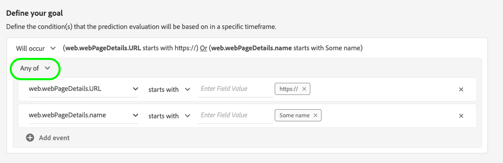

# 設定Customer AI例項

Customer AI是Intelligent Services的一部分，可讓您產生自訂傾向分數，而無須擔心機器學習。

Intelligent Services將Customer AI提供為簡單易用的Adobe Sensei服務，可針對不同使用案例進行設定。 以下各節提供設定Customer AI例項的步驟。

## 設定您的執行個體 {#set-up-your-instance}

在Platform UI中，選取左側導覽中的&#x200B;**[!UICONTROL 服務]**。 出現&#x200B;**[!UICONTROL 服務]**&#x200B;瀏覽器，顯示您可支配的所有可用服務。 在Customer AI的容器中，選取&#x200B;**[!UICONTROL 開啟]**。

**Customer AI** UI隨即顯示，並顯示您的所有服務例項。

- 您可以在&#x200B;**[!UICONTROL 建立例項]**&#x200B;容器右下方找到計分&#x200B;]**的設定檔總數量度。**[!UICONTROL &#x200B;此量度會追蹤Customer AI在目前日曆年度中得分的設定檔總數，包括所有沙箱環境和任何已刪除的服務例項。

使用UI右側的控制項，即可編輯、複製及刪除服務例項。 若要顯示這些控制項，請從現有的&#x200B;**[!UICONTROL 服務實例]**&#x200B;中選擇一個實例。 控制項包含下列項目：

- **[!UICONTROL 編輯]**:選擇 **** 「編輯」(Edit)可以修改現有服務實例。您可以編輯例項的名稱、說明和計分頻率。
- **[!UICONTROL 原地複製]**:選擇 **** 克隆當前選擇的服務實例設定。接著，您可以修改工作流程進行微幅調整，並重新命名為新例項。
- **[!UICONTROL 刪除]**:您可以刪除服務例項，包括任何歷史執行。
- **[!UICONTROL 資料來源]**:此例項所使用資料集的連結。
- **[!UICONTROL 上次執行詳細資料]**:唯有執行失敗時，才會顯示此選項。此處顯示了執行失敗的原因，例如錯誤代碼。
- **[!UICONTROL 分數定義]**:快速概述您為此執行個體設定的目標。

要建立新實例，請選擇&#x200B;**[!UICONTROL Create instance]**。

執行個體建立工作流程隨即顯示，從&#x200B;**[!UICONTROL Setup]**&#x200B;步驟開始。

以下是您必須為執行個體提供之值的重要資訊：

- 在顯示Customer AI分數的所有位置中，都會使用例項的名稱。 因此，名稱應該描述預測分數代表什麼，例如「取消雜誌訂閱的可能性」。

- 傾向類型決定分數和量度極性的目的。 您可以選擇&#x200B;**[!UICONTROL Churn]**&#x200B;或&#x200B;**[!UICONTROL Conversion]**。 請參閱探索見解檔案中[計分摘要](./discover-insights.md#scoring-summary)下方的附註，以取得關於傾向類型如何影響您執行個體的詳細資訊。

- 資料來源是資料的位置。 資料集是用來預測分數的輸入資料集。 Customer AI根據設計使用消費者體驗事件、Adobe Analytics和Adobe Audience Manager資料來計算傾向分數。 從下拉式選取器選取資料集時，系統只會列出與Customer AI相容的資料集。

- 依預設，除非指定合格母體，否則會為所有設定檔產生傾向分數。 您可以定義條件，根據事件包含或排除設定檔，以指定符合條件的母體。

提供所需值，然後選擇&#x200B;**[!UICONTROL Next]**。

### 定義目標 {#define-a-goal}

**[!UICONTROL 定義目標]**&#x200B;步驟隨即出現，它提供互動式環境，供您以視覺化方式定義預測目標。 目標由一或多個事件組成，其中每個事件的發生取決於其保留的條件。 Customer AI例項的目標是決定在指定時間範圍內達成其目標的可能性。

要建立目標，請選擇&#x200B;**[!UICONTROL 輸入欄位名稱]**&#x200B;並從下拉清單中選擇欄位。 選擇第二個輸入，並為事件的條件選擇一個子句，然後提供目標值以完成事件。 可選擇&#x200B;**[!UICONTROL Add event]**&#x200B;來配置其他事件。 最後，通過應用以天數為單位的預測時間幀來完成目標，然後選擇&#x200B;**[!UICONTROL Next]**。

#### 將發生且不會發生

在定義目標時，您可以選擇&#x200B;**[!UICONTROL Will occur]**&#x200B;或&#x200B;**[!UICONTROL Will not cocur]**。 選取&#x200B;**[!UICONTROL 將會發生]**&#x200B;表示您定義的事件條件必須符合，客戶的事件資料才會納入前瞻分析UI中。

例如，如果您想要設定應用程式以預測客戶是否會進行購買，您可以選取&#x200B;**[!UICONTROL Will occurr]**，後接&#x200B;**[!UICONTROL All of]**，然後輸入&#x200B;**commerce.purchases.id**&#x200B;和&#x200B;**exists**&#x200B;作為運算子。

不過，在某些情況下，您可能會想要預測某個事件是否會在特定時間範圍內發生。 若要使用此選項設定目標，請從頂層下拉式清單中選取「**[!UICONTROL 不會發生]**」。

例如，如果您想要預測哪些客戶的參與度會降低，則不要在下個月造訪您的帳戶登入頁面。 選擇「**[!UICONTROL 將不發生]**」後跟「**[!UICONTROL 所有]**」，然後輸入&#x200B;**web.webInteraction.URL**&#x200B;和&#x200B;**[!UICONTROL 等於]**&#x200B;作為運算子，並以&#x200B;**account-login**&#x200B;作為值。

#### 所有及任何

在某些情況下，您可能想要預測事件的組合是否會發生，而在其他情況下，您可能想要預測來自預先定義之集的任何事件的發生。 若要預測客戶是否會有事件組合，請從&#x200B;**[!UICONTROL 定義目標]**&#x200B;頁面的第二層下拉式清單中選取&#x200B;**[!UICONTROL 所有]**&#x200B;選項。

例如，您可能想要預測客戶是否購買特定產品。 此預測目標由兩個條件定義：a `commerce.order.purchaseID` **exists**，且`productListItems.SKU` **等於**&#x200B;某些特定值。

為了預測客戶是否將擁有來自指定集的任何事件，您可以使用&#x200B;**[!UICONTROL 任何]**&#x200B;選項。

例如，您可能想要預測客戶是否造訪特定URL或具有特定名稱的網頁。 此預測目標由兩個條件定義：`web.webPageDetails.URL` **以**&#x200B;開頭，`web.webPageDetails.name` **以**&#x200B;開頭。

### 自訂事件(*optional*){#custom-events}

如果您除了Customer AI用來產生傾向分數的[標準事件欄位](../input-output.md#standard-events)以外，還有其他資訊，則會提供自訂事件選項。 如果您選取的資料集包含結構中定義的自訂事件，您可以將其新增至執行個體。

若要新增自訂事件，請選取&#x200B;**[!UICONTROL 新增自訂事件]**。 接下來，輸入自訂事件名稱，然後將其對應至您結構中的事件欄位。 查看影響因素和其他深入分析時，會顯示自訂事件名稱，取代欄位值。 這表示使用者ID、保留ID、裝置資訊和其他自訂值會以自訂事件名稱列出，而非事件的ID/值。 Customer AI會使用這些額外的自訂事件來改善模型品質，並提供更精確的結果。

接下來，從「可用運算子」下拉式清單中選取您要使用的運算子。 僅列出與事件相容的運算子。

最後，如果選取的運算子需要一個，請輸入欄位值。 在此範例中，我們只需要查看酒店或餐廳是否存在預訂。 不過，如果想要更精確，可以使用等於運算子，並在值提示中輸入確切的值。

完成後，選擇右上角的&#x200B;**[!UICONTROL Next]**&#x200B;繼續。

### 配置計畫&#x200B;*（可選）* {#configure-a-schedule}

出現&#x200B;**[!UICONTROL Advanced]**&#x200B;步驟。 此可選步驟允許您配置計畫以自動執行預測、定義預測排除以篩選某些事件，或者如果不需要，則選擇&#x200B;**[!UICONTROL 完成]**。

通過配置&#x200B;**[!UICONTROL 計分頻率]**&#x200B;來設定計分計畫。 可排程每週或每月執行自動預測執行。

### 預測排除

如果您的資料集包含任何新增為測試資料的欄，您可以選取&#x200B;**新增排除**，然後輸入您要排除的欄位，將該欄或事件新增至排除清單。 這可防止在產生分數時評估符合特定條件的事件。 此功能可用來篩選掉無關的資料輸入或特定促銷活動。

若要排除事件，請選取&#x200B;**[!UICONTROL 新增排除]**&#x200B;並定義事件。 若要移除排除項目，請選取點(**[!UICONTROL ...]**)，然後選取「移除容器」]**。**[!UICONTROL 

視需要排除事件，然後選取&#x200B;**[!UICONTROL Finish]**&#x200B;以建立例項。

如果成功建立例項，則會立即觸發預測執行，並根據您定義的排程執行後續執行。

>[!NOTE]
>
>根據輸入資料的大小，預測執行最多可能需要24小時才能完成。

依照本節所述，您已設定Customer AI的例項，且已執行預測執行。 執行成功完成後，分數的深入分析會自動填入預測的分數。 請等候最多24小時，再繼續進行本教學課程的下一節。

## 後續步驟 {#next-steps}

依照本教學課程，您已成功設定Customer AI例項並產生傾向分數。 您現在可以選擇使用區段產生器，以[建立具有預測分數](./create-segment.md)或[使用Customer AI](./discover-insights.md)探索見解的客戶區段。

## 其他資源

以下影片旨在協助您了解Customer AI的設定工作流程。 此外，也提供最佳實務和使用案例範例。

>[!VIDEO](https://video.tv.adobe.com/v/32665?learn=on&quality=12)
