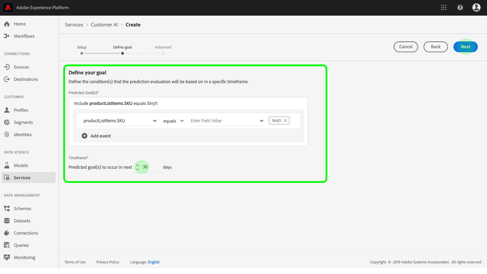

# 設定客戶AI例項

客戶人工智慧(Customer AI)是智慧型服務的一部分，可讓您產生自訂傾向分數，而不必擔心機器學習。

智慧型服務提供客戶人工智慧，提供簡單易用的Adobe Sensei服務，可針對不同使用案例進行設定。 以下各節提供設定客戶AI例項的步驟。

## 設定您的例項 {#set-up-your-instance}

在「平台UI」中，選取 **[!UICONTROL 左側導覽]** 中的「服務」。 「服 **[!UICONTROL 務]** 」瀏覽器隨即出現，並顯示您可使用的所有可用服務。 在「客戶AI」的容器中，選取「開 **[!UICONTROL 啟」]**。

此時 **會顯示「客戶AI** 」UI，並顯示您的所有服務例項。

- 您可以在「建 **[!UICONTROL 立例項]** 」容器右下方找到「總設定檔計分」 **[!UICONTROL 度量]** 。 此量度會追蹤客戶AI在目前日曆年度（包括所有沙盒環境和任何已刪除的服務例項）計分的設定檔總數。

使用UI右側的控制項，即可編輯、複製和刪除服務例項。 若要顯示這些控制項，請從現有的服務例項中選 **[!UICONTROL 取例項]**。 控制項包含下列項目：

- **[!UICONTROL 編輯]**:選擇「 **[!UICONTROL 編輯]** 」(Edit)允許您修改現有服務實例。 您可以編輯實例的名稱、說明和計分頻率。
- **[!UICONTROL 克隆]**:選擇 **[!UICONTROL 克隆]** ，將複製當前選定的服務實例設定。 然後，您可以修改工作流程，進行微調，並將其重新命名為新例項。
- **[!UICONTROL 刪除]**:您可以刪除包含任何歷史執行的服務例項。
- **[!UICONTROL 資料來源]**:此例項所使用之資料集的連結。
- **[!UICONTROL 上次執行詳細資訊]**:只有當執行失敗時，才會顯示此項。 此處會顯示執行失敗原因的資訊，例如錯誤代碼。
- **[!UICONTROL 分數定義]**:快速概述您為此例項設定的目標。

要建立新實例，請選擇「創 **[!UICONTROL 建實例」]**。

此時將顯示實例建立工作流，從「設定」( **[!UICONTROL Setup]** )步驟開始。

以下是您必須為實例提供的值的重要資訊：

- 在顯示客戶AI分數的所有位置都會使用實例的名稱。 因此，名稱應該描述預測分數代表什麼，例如「取消雜誌訂閱的可能性」。

- 傾向類型會決定分數和量度極性的意圖。 您可以選擇「流 **[!UICONTROL 失」]** 或「 **[!UICONTROL 轉換」]**。 如需傾向類型如何影 [響您的例項的詳細資訊](./discover-insights.md#scoring-summary) ，請參閱發現見解檔案中得分摘要下方的附註。

- 資料來源是資料所在位置。 資料集是用來預測分數的輸入資料集。 根據設計，客戶人工智慧會使用消費者體驗事件資料來計算傾向分數。 從下拉式選取器選取資料集時，只會列出與客戶AI相容的資料集。

- 依預設，會為所有描述檔產生傾向分數，除非指定合格人口。 您可以定義條件，根據事件加入或排除描述檔，以指定合格人口。

提供所需值，然後選擇「下 **[!UICONTROL 一步]**」。

### 定義目標 {#define-a-goal}

「定 **[!UICONTROL 義目標]** 」(Define goal)步驟隨即出現，它提供互動環境供您以視覺化方式定義預測目標。 目標由一個或多個事件組成，每個事件的發生基於事件所保持的條件。 客戶AI實例的目標是確定在給定時間範圍內實現其目標的可能性。

若要建立目標，請選取「 **[!UICONTROL 輸入欄位名稱]** 」，然後從下拉式清單中選取欄位。 選擇第二個輸入並為事件條件選擇一個子句，然後提供目標值以完成事件。 您可以選取「新增事件」來設定其 **[!UICONTROL 他事件]**。 最後，套用預測時間範圍（天數）以完成目標，然後選取「下 **[!UICONTROL 一步」]**。

#### 將發生且不會發生

定義目標時，您可以選擇「將 **[!UICONTROL 發生]** 」 **[!UICONTROL 或「不發生」]**。 選擇 **[!UICONTROL 將會發生]** ，表示您定義的事件條件必須符合，才能將客戶的事件資料納入前瞻分析UI。

例如，如果您想要設定應用程式來預測客戶是否要進行購買，您可以選取 **[!UICONTROL Will occur]** ，接著選取 **[!UICONTROL All of]** ，然後輸入 **commerce.purchases.id** ，並 **** 且existsExists作為運算子。

不過，您可能有興趣預測某個事件是否會在特定時間範圍內發生。 若要使用此選項設定目標，請從 **[!UICONTROL 頂層下拉式清單中選取]** 「不會發生」。

例如，如果您想預測哪些客戶的參與度降低，且不要在下個月造訪您的帳戶登入頁面。 選 **[!UICONTROL 擇「不發生]** 」後接「全部 **[!UICONTROL 」，然後輸入]** web.webInteraction.URL, **並且將All-Login值********** 等於Account-loginGlogin值的運算子。

#### 所有及任何

在某些情況下，您可能想要預測事件組合是否會發生，而在其他情況下，您可能想預測來自預先定義集合的任何事件的發生。 為了預測客戶是否具有事件組合，請從「定義目標」頁面的第二層下拉式清單中選取「 **[!UICONTROL All of]** 」（全部） **** 選項。

例如，您可能想要預測客戶是否購買特定產品。 此預測目標由兩個條件定義：a `commerce.order.purchaseID` 存 **在** ，且 `productListItems.SKU` 等 **於** 某些特定值。

為了預測客戶是否將有來自特定集合的任何事件，您可以使用「任 **[!UICONTROL 何]** 」選項。

例如，您可能想要預測客戶是否瀏覽特定URL或具有特定名稱的網頁。 此預測目標由兩個條件定義： `web.webPageDetails.URL` **以特定值開** 頭 `web.webPageDetails.name` ，以特 **定值開頭** 。

### 設定排程 *（選用）* {#configure-a-schedule}

出現 **[!UICONTROL 「Advanced]** （高級）」步驟。 此可選步驟可讓您設定排程以自動執行預測、定義預測排除以篩選特定事件，或在不需要時選取 **[!UICONTROL Finish]** 。

設定計分頻率，以設定計 **[!UICONTROL 分排程]**。 自動預測執行可排程每週或每月執行。

在排程設定下方，您可以定義預測排除，以防止在產生分數時評估符合特定條件的事件。 此功能可用來篩選不相關的資料輸入。

若要排除某些事件，請選 **[!UICONTROL 取「新增排除]** 」，並以定義目標的方式定義事件。 若要移除排除，請選取事件容器右上方的省略號(**[!UICONTROL ...]**)，然後選取「移除容 **[!UICONTROL 器」]**。

視需要排除事件，然後選 **[!UICONTROL 取「完成]** 」以建立例項。

如果成功建立例項，則會立即觸發預測執行，並根據您定義的排程執行後續執行。

>[!NOTE]
>
>根據輸入資料的大小，預測執行最多需要24小時才能完成。

依照本節內容，您已設定客戶AI的例項，並執行預測執行。 在執行成功完成後，計分見解會自動填入預測分數的個人檔案。 請等候最多24小時，再繼續本教學課程的下一節。

## 下一步 {#next-steps}

透過本教學課程，您已成功設定客戶AI的例項並產生傾向分數。 您現在可以選擇使用「區段產生器」來建立具 [有預測分數的客戶區段](./create-segment.md) ，或 [透過客戶人工智慧發掘見解](./discover-insights.md)。

## 其他資源

以下視訊旨在協助您瞭解客戶AI的設定工作流程。 此外，還提供最佳實務和使用案例範例。

>[!VIDEO](https://video.tv.adobe.com/v/32665?learn=on&quality=12)

