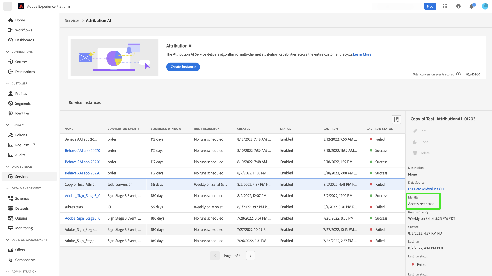

# 設定Customer AI例項

Customer AI（屬於AI/ML服務的一部分）可讓您產生自訂傾向分數，而無須擔心機器學習。

AI/ML服務提供Customer AI，作為簡單易用的Adobe Sensei服務，可針對不同使用案例進行設定。 以下各節提供設定Customer AI例項的步驟。

## 建立例項 {#set-up-your-instance}

在平台UI中，選取 **[!UICONTROL 服務]** 的下一頁。 此 **[!UICONTROL 服務]** 瀏覽器隨即顯示，並顯示您自己擁有的所有可用服務。 在Customer AI的容器中，選取 **[!UICONTROL 開啟]**.

此 **Customer AI** UI隨即顯示，並顯示您的所有服務執行個體。

- 您可以找到 **[!UICONTROL 計分的設定檔總數]** 位於 **[!UICONTROL 建立例項]** 容器。 此量度會追蹤Customer AI在目前日曆年度中得分的設定檔總數，包括所有沙箱環境和任何已刪除的服務例項。

使用UI右側的控制項，即可編輯、複製及刪除服務例項。 若要顯示這些控制項，請從現有的 **[!UICONTROL 服務實例]**. 控制項包含下列項目：

- **[!UICONTROL 編輯]**:選取 **[!UICONTROL 編輯]** 可讓您修改現有的服務執行個體。 您可以編輯例項的名稱、說明和計分頻率。
- **[!UICONTROL 原地複製]**:選取 **[!UICONTROL 原地複製]** 複製當前選擇的服務實例設定。 接著，您可以修改工作流程進行微幅調整，並重新命名為新例項。
- **[!UICONTROL 刪除]**:您可以刪除服務例項，包括任何歷史執行。 將從Platform中刪除對應的輸出資料集。 不過，同步至「即時客戶設定檔」的分數不會刪除。
- **[!UICONTROL 資料來源]**:此例項所使用資料集的連結。 如果使用多個資料集，選取超連結文字會開啟資料集預覽彈出視窗。
- **[!UICONTROL 上次運行詳細資訊]**:唯有執行失敗時，才會顯示此選項。 此處顯示了執行失敗的原因，例如錯誤代碼。
- **[!UICONTROL 分數定義]**:快速概述您為此執行個體設定的目標。

若要建立新例項，請選取 **[!UICONTROL 建立例項]**.

## 設定

執行個體建立工作流程隨即顯示，從 **[!UICONTROL 設定]** 步驟。

以下是您必須為執行個體提供之值的重要資訊：

- **[!UICONTROL 名稱]:** 在顯示Customer AI分數的所有位置中，都會使用例項的名稱。 因此，名稱應該描述預測分數的代表。 例如「取消雜誌訂閱的可能性」。

- **[!UICONTROL 說明]:** 說明您要預測的內容。

- **[!UICONTROL 傾向類型]:** 傾向類型決定分數和量度極性的目的。 您可以選擇 **[!UICONTROL 流失率]** 或 **[!UICONTROL 轉換]**. 請參閱 [計分摘要](./discover-insights.md#scoring-summary) 深入了解傾向類型對您執行個體有何影響的詳細資訊。

提供所需值，然後選取 **[!UICONTROL 下一個]** 繼續。

## 選擇資料 {#select-data}

根據設計，Customer AI一般會使用Adobe Analytics、Adobe Audience Manager、體驗事件和消費者體驗事件資料來計算傾向分數。 選取資料集時，僅會列出與Customer AI相容的資料集。 若要選取資料集，請選取&#x200B;**+**)資料集名稱旁的符號，或選取核取方塊以一次新增多個資料集。 使用搜尋選項快速找到您感興趣的資料集。

選取您要使用的資料集後，請選取 **[!UICONTROL 新增]** 按鈕，將資料集新增至資料集預覽窗格。

選取資訊圖示  資料集旁邊會開啟資料集預覽視窗。

資料集預覽包含上次更新時間、來源結構，以及前10欄的預覽等資料。

選擇 **[!UICONTROL 儲存]** 在工作流程中移動時儲存草稿。 您也可以儲存草稿模型設定，並移至工作流程的下一個步驟。 使用 **[!UICONTROL 保存並繼續]** 在模型配置期間建立和保存草稿。 此功能可讓您建立和儲存模型配置的草稿，當您必須在配置工作流程中定義許多欄位時，此功能特別有用。

### 資料集完整性 {#dataset-completeness}

資料集預覽中有資料集完整性百分比值。 此值提供資料集中有多少欄為空/空的快速快照。 如果資料集包含許多遺失值，而這些值被擷取到其他位置，強烈建議您加入包含遺失值的資料集。 在此範例中，人員ID為空，但人員ID會擷取至可包含的個別資料集中。

>[!NOTE]
>
>使用Customer AI（一年）的最大培訓期間，即可計算資料集完整性。 這表示顯示資料集完整性值時，不會考慮超過一年的資料。

### 選取身分 {#identity}

您現在可以根據身分對應（欄位），將多個資料集連結在一起。 您必須選取身分類型（也稱為「身分命名空間」），以及該命名空間中的身分值。 如果您已在相同命名空間下將多個欄位指派為架構中的身分，所有指派的身分值都會出現在以命名空間為前置的身分下拉式清單中，例如 `EMAIL (personalEmail.address)` 或 `EMAIL (workEmail.address)`.

[選擇相同的命名空間](../images/user-guide/cai-identity-map.png)

>[!IMPORTANT]
>
>您選取的每個資料集都必須使用相同的身分類型（命名空間）。 身分欄中的身分類型旁會出現綠色勾號，指出資料集相容。 例如，使用Phone命名空間時，以及 `mobilePhone.number` 做為識別碼，其餘資料集的所有識別碼都必須包含並使用Phone命名空間。

要選擇標識，請選擇位於標識列中的帶下划線的值。 此時會顯示「選取身分彈出視窗」。

<!--  -->
[選擇相同的命名空間](../images/user-guide/cai-identity-namespace.png)

如果命名空間中有多個身分可用，請務必為您的使用案例選取正確的身分欄位。 例如，電子郵件命名空間中提供兩個電子郵件身分識別：一個工作電子郵件，另一個是個人電子郵件。 根據使用案例，個人電子郵件更可能填入，且在個別預測中更有用。 這表示 `EMAIL (personalEmail.address)` 會被選為身分。

>[!NOTE]
>
> 如果資料集沒有有效的身分類型（命名空間），您必須設定主要身分識別，並使用 [結構編輯器](../../../xdm/schema/composition.md#identity). 若要進一步了解命名空間和身分識別，請造訪 [身分識別服務命名空間](../../../identity-service/namespaces.md) 檔案。

## 定義目標 {#define-a-goal}

<!-- https://www.adobe.com/go/cai-define-a-goal -->

此 **[!UICONTROL 定義目標]** 步驟隨即顯示，提供互動式環境，供您以視覺化方式定義預測目標。 目標由一或多個事件組成，其中每個事件的發生取決於其保留的條件。 Customer AI例項的目標是決定在指定時間範圍內達成其目標的可能性。

若要建立目標，請選取 **[!UICONTROL 輸入欄位名稱]** 後接下拉式清單中的欄位。 選取第二個輸入、事件條件的子句，然後選擇性地提供目標值以完成事件。 您可以選取 **[!UICONTROL 新增事件]**. 最後，應用預測時間範圍以天數完成目標，然後選擇 **[!UICONTROL 下一個]**.

<!--  -->

### 將發生且不會發生

定義目標時，您有選取的選項 **[!UICONTROL 將會發生]** 或 **[!UICONTROL 不會發生]**. 選取 **[!UICONTROL 將會發生]** 表示您定義的事件條件必須符合，才能將客戶的事件資料納入前瞻分析UI中。

例如，如果您想要設定應用程式以預測客戶是否要進行購買，您可以選取 **[!UICONTROL 將會發生]** 後跟 **[!UICONTROL 全部]** 然後輸入 **commerce.purchases.id** （或類似欄位）和 **[!UICONTROL 存在]** 作為運算子。

<!--  -->

不過，在某些情況下，您可能會想要預測某個事件是否會在特定時間範圍內發生。 若要使用此選項設定目標，請選取 **[!UICONTROL 不會發生]** 從頂層下拉式清單中。

例如，如果您想要預測哪些客戶的參與度會降低，則不要在下個月造訪您的帳戶登入頁面。 選擇 **[!UICONTROL 不會發生]** 後跟 **[!UICONTROL 全部]** 然後輸入 **web.webInteraction.URL** （或類似欄位）和 **[!UICONTROL 等於]** 作為運算元，搭配 **account-login** 作為值。

### 所有及任何

在某些情況下，您可能想要預測事件的組合是否會發生，而在其他情況下，您可能想要預測來自預先定義之集的任何事件的發生。 若要預測客戶是否會有事件組合，請選取 **[!UICONTROL 全部]** 選項(位於 **[!UICONTROL 定義目標]** 頁面。

例如，您可能想要預測客戶是否購買特定產品。 此預測目標由兩個條件定義：a `commerce.order.purchaseID` **存在** 和 `productListItems.SKU` **等於** 某些特定值。

為了預測客戶是否會有來自指定集的任何事件，您可以使用 **[!UICONTROL 任何]** 選項。

例如，您可能想要預測客戶是否造訪特定URL或具有特定名稱的網頁。 此預測目標由兩個條件定義： `web.webPageDetails.URL` **開頭為** 特定值與 `web.webPageDetails.name` **開頭為** 特定值。

### 合格人口 *（可選）*

依預設，除非指定合格母體，否則會為所有設定檔產生傾向分數。 您可以定義條件，根據事件包含或排除設定檔，以指定符合條件的母體。

### 自訂事件(*可選*) {#custom-events}

如果您除了 [標準事件欄位](../input-output.md#standard-events) 由Customer AI用來產生傾向分數，會提供自訂事件選項。 使用此選項可讓您新增您認為有影響力的其他事件，這可能會改善模型品質，並有助於提供更精確的結果。 如果您選取的資料集包含結構中定義的自訂事件，您可以將其新增至執行個體。

>[!NOTE]
>
> 如需自訂事件對Customer AI評分結果有何影響的深入說明，請造訪 [自訂事件範例](#custom-event) 區段。

若要新增自訂事件，請選取 **[!UICONTROL 新增自訂事件]**. 接下來，輸入自訂事件名稱，然後將其對應至您結構中的事件欄位。 查看影響因素和其他深入分析時，會顯示自訂事件名稱，取代欄位值。 這表示將會使用自訂事件名稱，而非事件的ID/值。 如需自訂事件顯示方式的詳細資訊，請參閱 [自訂事件範例區段](#custom-event). Customer AI會使用這些額外的自訂事件來改善模型品質，並提供更精確的結果。

接下來，從「可用運算子」下拉式清單中選取您要使用的運算子。 僅列出與事件相容的運算子。

最後，如果選取的運算子需要一個，請輸入欄位值。 在此範例中，我們只需要查看酒店或餐廳是否存在預訂。 不過，如果想要更精確，可以使用等於運算子，並在值提示中輸入確切的值。

完成後，選取 **[!UICONTROL 下一個]** 在右上角繼續。

### 自訂設定檔屬性(*可選*)

除了 [標準事件欄位](../input-output.md#standard-events) 供客戶AI用來產生傾向分數。 使用此選項可讓您新增您認為有影響的其他設定檔屬性，這可能會改善模型品質，並提供更精確的結果。 此外，新增自訂設定檔屬性可讓客戶AI更妥善地展示特定設定檔在傾向貯體中的結果。

>[!NOTE]
>
>新增自訂設定檔屬性的工作流程與新增自訂事件相同。 與自訂事件類似，自訂設定檔屬性也會以相同方式影響模型計分。 如需深入說明，請造訪 [自訂事件範例](#custom-event) 區段。

#### 從配置檔案快照導出中選擇配置檔案屬性

您也可以選擇從每日配置檔案快照導出中包含配置檔案屬性。 這些屬性會同步至設定檔快照匯出，並顯示最近可用的值。

>[!WARNING]
>
> 請留意勿選取因預測目標而更新或與預測目標高度相關的設定檔屬性。 這會導致資料洩漏和模型過擬合。 此類屬性的範例為 `total_purchases_in_the_last_3_months` 可預測購買轉換。

>[!NOTE]
>
>UI中可根據請求提供使用UPS快照導出的配置檔案屬性的支援。

### 新增自訂事件範例 {#custom-event}

在下列範例中，自訂事件和設定檔屬性會新增至Customer AI例項。 Customer AI例項的目標是預測客戶在未來60天內購買其他Luma產品的可能性。 通常，產品資料會連結至產品SKU。 在此情況下，SKU為 `prd1013`. 在Customer AI模型接受訓練/評分後，此SKU可以連結至事件，並顯示為傾向貯體的影響因素。

Customer AI會自動對自訂事件(例如 **手錶購買**. 若將此事件視為客戶高、中或低傾向的重要因素，則Customer AI會將其顯示為 `Days since prd1013 purchase` 或 `Count of prd1013 purchase`. 將其建立為「自訂」事件，可為事件指定新名稱，讓結果更容易閱讀。 例如 `Days since Watch purchase`。此外，即使該事件不是標準事件，Customer AI也會在其訓練和分數中使用此事件。 這表示您可以新增多個您認為可能具影響力的事件，並透過包含保留、訪客記錄和其他事件等資料來進一步自訂模型。 新增這些資料點，可進一步提高Customer AI模型的準確度和精準度。

## 設定選項

「設定選項」步驟可讓您設定排程以自動執行預測、定義預測排除以篩選特定事件，以及切換 **[!UICONTROL 設定檔]** 開/關。

### 設定排程 *（可選）* {#configure-a-schedule}

若要設定計分排程，請從設定 **[!UICONTROL 計分頻率]**. 可排程每週或每月執行自動預測執行。

### 預測排除 *（可選）*

如果您的資料集包含任何新增為測試資料的欄，您可以選取 **[!UICONTROL 新增排除項目]** 接著輸入您要排除的欄位。 這可防止在產生分數時評估符合特定條件的事件。 此功能可用來篩選掉無關的資料輸入或促銷活動。

若要排除事件，請選取 **[!UICONTROL 新增排除項目]** 和定義事件。 若要移除排除項目，請選取點(**[!UICONTROL ...]**)，然後選取「 」 **[!UICONTROL 移除容器]**.

### 設定檔切換

「設定檔」切換可讓Customer AI將計分結果匯出至「即時客戶設定檔」。 禁用此切換可防止將模型評分結果添加到「配置檔案」中。 停用此功能後，仍可使用Customer AI評分結果。

第一次使用Customer AI時，您可以關閉此功能，直到您對模型輸出結果滿意為止。 這可防止您上傳多個計分資料集至客戶設定檔，同時微調您的模型。 標定完模型後，可使用 [原地選項](#set-up-your-instance) 從 **服務實例** 頁面。 這可讓您建立模型副本並開啟設定檔。

設定計分排程、納入預測排除後，以及切換您想要其所在位置的設定檔，請選取 **[!UICONTROL 完成]** ，以建立您的Customer AI例項。

如果成功建立例項，則會立即觸發預測執行，並根據您定義的排程執行後續執行。

>[!NOTE]
>
>根據輸入資料的大小，預測執行最多可能需要24小時才能完成。

依照本節所述，您已設定Customer AI的例項並執行預測執行。 當執行成功完成時，如果設定檔切換已啟用，則分數的深入分析會自動填入預測的分數。 請等候最多24小時，再繼續進行本教學課程的下一節。

## 治理政策

完成工作流程以建立例項並提交模型的設定後， [政策執行](/help/data-governance/enforcement/auto-enforcement.md) 檢查是否有違規。 如果發生策略違規，將顯示一個彈出窗口，指示已違反一個或多個策略。 這是為了確保您的資料操作和Platform中的行銷動作符合資料使用原則。

彈出式視窗會提供違規的特定資訊。 您可以通過策略設定和與配置工作流不直接相關的其他措施來解決這些違規。 例如，您可以變更標籤，讓某些欄位可用於資料科學用途。 或者，您也可以修改模型配置本身，使其不使用帶有標籤的任何內容。 請參閱本檔案，以進一步了解如何設定 [原則](/help/data-governance/policies/overview.md).

## 以屬性為基礎的存取控制

>[!IMPORTANT]
>
>基於屬性的訪問控制當前僅在有限版本中可用。

[基於屬性的訪問控制](../../../access-control/abac/overview.md) 是Adobe Experience Platform的功能，可讓管理員根據屬性控制對特定物件和/或功能的存取。 屬性可以是新增至物件的中繼資料，例如新增至架構欄位或區段的標籤。 管理員定義了包括屬性的訪問策略以管理用戶訪問權限。

此功能可讓您以標籤來標示Experience Data Model(XDM)結構欄位，並定義組織或資料使用範圍。 同時，管理員可使用使用者和角色管理介面來定義XDM架構欄位的存取原則，並更妥善地管理指派給使用者或使用者群組（內部、外部或第三方使用者）的存取權。 此外，基於屬性的訪問控制允許管理員管理對特定段的訪問。

透過基於屬性的存取控制，貴組織的管理員可以控制使用者對所有平台工作流程和資源的敏感個人資料(SPD)和個人識別資訊(PII)的存取權。 管理員可以定義只有特定欄位和與這些欄位對應的資料存取權的使用者角色。

由於基於屬性的存取控制，某些欄位和功能將會受限，且無法用於某些客戶AI服務例項。 例如「身分」、「分數定義」和「原地複製」。

在Customer AI工作區頂端 **前瞻分析頁面**，請注意側邊欄、分數定義、身分和設定檔屬性中的詳細資料都顯示為「存取受限」。

<!-- If you select datasets with restricted schemas on the **[!UICONTROL Create instance workflow]** page, a warning sign appears next to the dataset name with the message: [!UICONTROL Restricted information is excluded].

 -->

在 **[!UICONTROL 建立執行個體工作流程]** 頁面，警告會通知您 [!UICONTROL 由於存取限制，資料集預覽中不會顯示某些資訊。]

在您建立具有限制資訊的例項後，請繼續前往 **[!UICONTROL 定義目標]** 步驟中，頂端會顯示警告： [!UICONTROL 由於存取限制，設定中未顯示特定資訊。]

## 後續步驟 {#next-steps}

依照本教學課程，您已成功設定Customer AI例項並產生傾向分數。 您現在可以選擇使用區段產生器，以 [建立預測分數的客戶區段](./create-segment.md) 或 [透過Customer AI探索見解](./discover-insights.md).

## 其他資源

以下影片旨在協助您了解Customer AI的設定工作流程。 此外，也提供最佳實務和使用案例範例。

>[!IMPORTANT]
>
> 以下視訊已過期。 如需最新資訊，請參閱本檔案。

>[!VIDEO](https://video.tv.adobe.com/v/32665?learn=on&quality=12)
