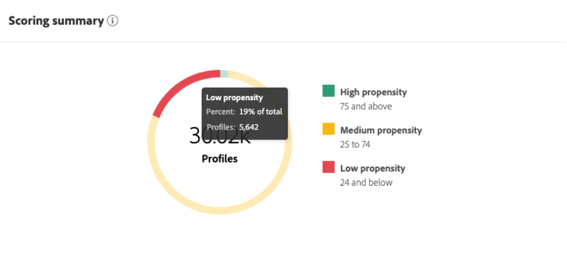
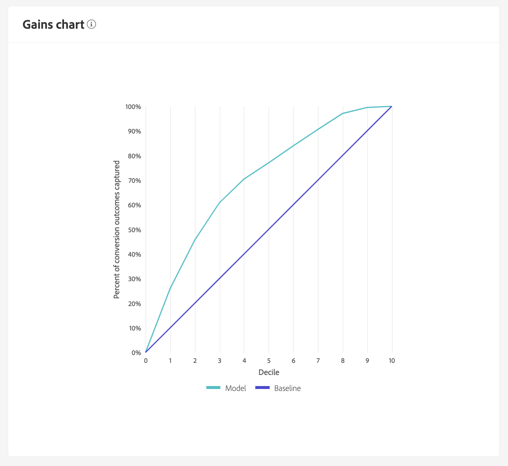

# 利用Customer AI探索深入分析

Customer AI是Intelligent Services的一部分，它讓行銷人員能夠運用Adobe Sensei來預測客戶的下一個動作。 Customer AI 可產生自訂傾向評分，例如大規模個別設定檔的流失和轉換情形。 不必將業務需求轉換為機器學習問題、挑選演演算法、訓練或部署，就能達成上述目的。

本檔案可用作在Intelligent Services Customer AI使用者介面中與服務執行個體深入分析互動的指南。

## 快速入門

為了利用Customer AI的深入分析，您需要有可成功執行狀態的服務執行個體。 若要建立新的服務執行個體，請造訪[設定Customer AI執行個體](./configure.md)。 如果您最近已建立服務執行個體，但仍在訓練和評分中，請等待24小時讓執行完成。

## 服務執行個體總覽

在[!DNL Adobe Experience Platform] UI中，選取左側導覽中的&#x200B;**[!UICONTROL 服務]**。 *服務*&#x200B;瀏覽器出現，並顯示可用的智慧型服務。 在Customer AI的容器中，選取&#x200B;**[!UICONTROL 開啟]**。

便會顯示Customer AI服務頁面。 此頁面列出Customer AI的服務執行個體並顯示其相關資訊，包括執行個體名稱、傾向型別、執行個體執行頻率以及上次更新狀態。

>[!NOTE]
>
>只有已完成成功評分回合的服務執行個體才會有深入分析。

選取服務執行處理名稱以開始。

接著，會顯示該服務執行個體的深入分析頁面，其中包含選取&#x200B;**[!UICONTROL 最新分數]**&#x200B;或&#x200B;**[!UICONTROL 效能摘要]**&#x200B;的選項。 預設標籤&#x200B;**[!UICONTROL 最新分數]**&#x200B;提供資料的視覺效果。 本指南會詳細說明視覺效果和您可以對資料執行的操作。

**[!UICONTROL 效能摘要]**&#x200B;索引標籤會顯示每個傾向性貯體的實際流失率或轉換率。 若要深入瞭解，請參閱[效能摘要量度](#performance-metrics)的相關章節。

## 服務執行個體詳細資訊

檢視服務執行個體詳細資訊的方式有兩種：從儀表板或服務執行個體內。

### 服務執行個體儀表板

若要在儀表板中檢視服務執行處理詳細資訊的概觀，請選取服務執行處理容器，以避免附加至名稱的超連結。 這會開啟一個提供其他詳細資訊的右側邊欄。 控制項包含下列專案：

- **[!UICONTROL 編輯]**：選取&#x200B;**[!UICONTROL 編輯]**&#x200B;可讓您修改現有的服務執行個體。 您可以編輯執行個體的名稱、說明和評分頻率。
- **[!UICONTROL 複製]**：選取&#x200B;**[!UICONTROL 複製]**&#x200B;會複製目前選取的服務執行個體設定。 然後，您可以修改工作流程以進行微幅調整，並將其重新命名為新例證。
- **[!UICONTROL 刪除]**：您可以刪除服務執行個體，包括任何歷史執行。
- **[!UICONTROL 資料來源]**：此執行個體使用的資料集連結。
- **[!UICONTROL 執行頻率]**：評分回合發生的頻率與時間。
- **[!UICONTROL 分數定義]**：您為此執行個體設定的目標快速概覽。

>[!NOTE]
>
>如果評分回合失敗，則會提供錯誤訊息。 錯誤訊息會列在右側邊欄的&#x200B;**上次執行詳細資料**&#x200B;下，只有失敗的執行才看得見。

### 顯示更多深入分析下拉式清單

檢視服務執行個體其他詳細資訊的第二種方式位於深入分析頁面中。 選取右上方的&#x200B;**[!UICONTROL 顯示更多]**&#x200B;以填入下拉式清單。 會列出詳細資訊，例如分數定義、建立時間、傾向型別和使用的資料集。 如需所列之任何屬性的詳細資訊，請造訪[設定Customer AI執行個體](./configure.md)。

### Customer AI資料集預覽彈出視窗

如果Customer AI使用一個以上的資料集，則會提供標示為&#x200B;**[!UICONTROL Multiple]**&#x200B;的超連結，後面接著括弧`()`中的資料集數目。

選取多個資料集連結會開啟Customer AI資料集預覽彈出視窗。 預覽中的每個顏色代表資料集，如資料集欄左側的顏色鍵所示。 在此範例中，您可以看到只有&#x200B;**資料集1**&#x200B;包含`PROP1`欄。

### 編輯例項

若要編輯執行個體，請選取右上方導覽列中的&#x200B;**[!UICONTROL 編輯]**。

「編輯」對話方塊會出現，讓您編輯執行個體的名稱、說明、狀態和評分頻率。 若要確認變更並關閉對話方塊，請選取右下角的&#x200B;**[!UICONTROL 儲存]**。

### 更多動作

**[!UICONTROL 更多動作]**&#x200B;按鈕位於&#x200B;**[!UICONTROL 編輯]**&#x200B;旁的右上角導覽器中。 選取&#x200B;**[!UICONTROL 其他動作]**&#x200B;會開啟一個下拉式清單，讓您選取下列其中一個動作：

- **[!UICONTROL 複製]**：選取&#x200B;**[!UICONTROL 複製]**&#x200B;會複製所設定的服務執行個體。 然後，您可以修改工作流程以進行微幅調整，並將其重新命名為新例證。
- **[!UICONTROL 刪除]**：刪除執行個體。
- **[!UICONTROL 存取分數]**：選取&#x200B;**[!UICONTROL 存取分數]**&#x200B;會開啟對話方塊，其中提供[下載Customer AI分數](./download-scores.md)教學課程的連結，該對話方塊也會提供進行API呼叫所需的資料集ID。
- **[!UICONTROL 檢視執行歷程記錄]**：會出現一個對話方塊，其中包含與服務執行個體相關聯的所有評分執行清單。

## 分數摘要 {#scoring-summary}

評分摘要會顯示已評分的個人檔案總數，並將其分類為包含高、中和低傾向性的貯體。 傾向值區是以分數範圍來決定，低值小於24，中值為25至74，而高值大於74。 每個值區都有對應圖例的顏色。

>[!NOTE]
>
>如果是轉換傾向分數，則高分數會以綠色顯示，低分數會以紅色顯示。 如果您預測的是流失傾向，則系統會加以逆轉，高分會以紅色顯示，低分則會以綠色顯示。 無論您選擇哪種傾向型別，中段貯體都會保持黃色。

您可以將滑鼠停留在鈴鐺上的任何顏色上以檢視其他資訊，例如屬於貯體的設定檔百分比和總數。

## 分數的分佈

**[!UICONTROL 分數分佈]**&#x200B;卡片會根據分數為您提供母體的視覺摘要。 您在[!UICONTROL 分數分佈]卡片中看到的顏色代表產生的傾向分數型別。 暫留在任何評分分配上，可提供屬於該分配的精確計數。

## 影響因素

對於每個分數貯體，會產生一張卡片，顯示該貯體的前10個影響因素。 影響因素會提供您更多詳細資訊，讓您瞭解客戶為何屬於各種分數貯體。

### 影響因子明細

將游標暫留在任何主要影響因素上，可以進一步劃分資料。 已針對為何某些設定檔屬於傾向性貯體提供概覽。 根據係數，您可以獲得數字、分類或布林值。 下列範例會依地區顯示分類值。

此外，透過深入分析，您可以比較分佈因數（如果分佈因數出現在兩個或多個傾向性貯體中），並使用這些值建立更具體的區段。 下列範例說明第一個使用案例：

您可以看到轉換傾向較低的設定檔最近造訪adobe.com網頁的可能性較低。 「上次網頁造訪間隔天數」因子的涵蓋範圍只有8%，而中傾向個人檔案為26%。 使用這些數字，您可以比較因子每個時段內的分配。 此資訊可用於推斷網路造訪中的造訪間隔在低傾向性貯體中的影響力較小，因為在中傾向性貯體中。

### 建立區段

在低、中、高傾向的任何貯體中選取&#x200B;**[!UICONTROL 建立區段]**&#x200B;按鈕，會將您重新導向至區段產生器。

>[!NOTE]
>
>**[!UICONTROL 建立區段]**&#x200B;按鈕僅在資料集啟用即時客戶設定檔時才能使用。 如需如何啟用即時客戶個人檔案的詳細資訊，請造訪[即時客戶個人檔案總覽](../../../rtcdp/overview.md)。

區段產生器可用來定義區段。 從「深入分析」頁面選取「**[!UICONTROL 建立區段]**」時，Customer AI會自動將選取的貯體資訊新增至區段。 若要完成建立區段，只需填寫位於區段產生器使用者介面的右側邊欄中的&#x200B;**名稱**&#x200B;和&#x200B;**描述**&#x200B;容器即可。 指定區段的名稱和說明後，選取右上方的&#x200B;**[!UICONTROL 儲存]**。

>[!NOTE]
>
>由於傾向分數會寫入個別設定檔中，因此可在區段產生器中使用，就像任何其他設定檔屬性一樣。 當您導覽至區段產生器以建立新區段時，您可以在名稱空間Customer AI下看到所有各種傾向分數。

若要在Platform UI中檢視您的新區段，請在左側導覽中選取&#x200B;**[!UICONTROL 區段]**。 **[!UICONTROL 瀏覽]**&#x200B;頁面出現，並顯示所有可用的區段。

## 歷史績效 {#historical-performance}

**[!UICONTROL 效能摘要]**&#x200B;索引標籤會顯示實際流失率或轉換率，這些流失率或轉換率會分隔為Customer AI評分的每個傾向值區。

一開始只會顯示預期的比率（虛線）。 當評分回合尚未發生且資料尚不可使用時，會顯示預期的比率。 不過，一旦結果視窗已過，預期比率會以實際比率（實線）取代。

將游標暫留在明細行上會顯示該時段中該日的日期與實際/預期費率。

您可以篩選顯示之預期和實際速率的時間範圍。 選取&#x200B;**行事曆圖示** 然後選取新的日期範圍。 每個值區中的結果都會更新，以顯示於新的日期範圍內。

### 個別評分回合率

**[!UICONTROL 效能摘要]**&#x200B;索引標籤的下半部會顯示每個個別評分回合的結果。 選取右上方的下拉式清單日期，以顯示不同評分回合的結果。

根據您是預測流失或轉換，[!UICONTROL 分數分佈]圖表會顯示每個增量中流失/轉換和未流失/轉換的個人檔案分佈。

## 模型評估 {#model-evaluation}

除了在「歷史績效」標籤上追蹤一段時間內的預測和實際結果外，行銷人員還使用「模型評估」標籤提高模型品質的透明度。 您可以使用提升度和收益圖表來判斷使用預測模型與隨機鎖定目標之間的差異。 此外，您可以決定在每個分數截止日期會擷取多少個正面結果。 這對於細分以及調整投資報酬率與行銷動作非常有用。

### 提升圖

提升圖會衡量使用預測性模型而非隨機鎖定目標的改善情形。

高品質的模型指標包括：

- 前幾位小數中的高提升度值。 這表示模型很適合識別具有最高興趣行動傾向的使用者。
- 遞減提升值。 這表示分數較高的客戶比分數較低的人更有可能採取感興趣的行動。

### 收益圖

累積收益圖會衡量將分數鎖定在高於特定臨界值而擷取的正向結果的百分比。 在依照高到低的傾向分數為客戶排序後，母體會分成十等分 — 10個大小相等的群組。 完美的模型會擷取最高分十等分中的所有正面結果。 基線隨機鎖定目標方法會依群組規模的比例擷取積極結果，鎖定30%的使用者將擷取30%的結果。

高品質的模型指標包括：

- 累積收益會快速接近100%。
- 此模型的累計收益曲線比較靠近圖表的左上角。
- 累計收益表可用來決定細分和目標定位的分數截斷點。 例如，如果模型在前兩個分數十分位數中擷取70%的正向結果，則以百分位數分數> 80為目標的使用者預計將擷取大約70%的正向結果。

### AUC （曲線下的區域）

AUC反映了分數排名與預測目標發生之間的關係強度。 0.5的&#x200B;**AUC**&#x200B;表示模型並不比隨機猜測好。 **AUC** / 1表示模型可以完美地預測誰將採取相關動作。

## 後續步驟

本檔案概述Customer AI服務執行個體所提供的深入分析。 您現在可以繼續有關[在Customer AI下載分數](./download-scores.md)的教學課程，或瀏覽提供的其他[Adobe智慧服務](../../home.md)指南。

## 其他資源

以下影片概述如何使用Customer AI來檢視模型和影響因素的輸出。

>[!VIDEO](https://video.tv.adobe.com/v/32666?learn=on&quality=12)
