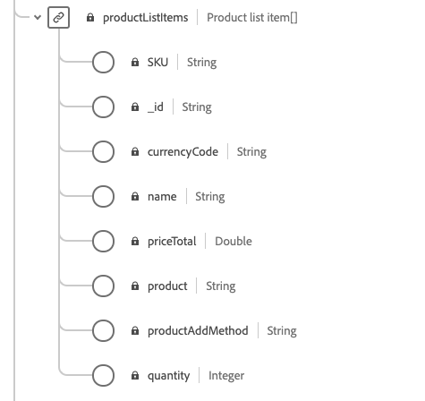

# 準備資料以用於[!DNL Intelligent Services]

為了讓[!DNL Intelligent Services]從行銷事件資料中探索見解，必須以標準結構在語義上擴充和維護資料。 [!DNL Intelligent Services]運用[!DNL Experience Data Model] (XDM)結構描述來達成此目標。 具體來說，[!DNL Intelligent Services]中使用的所有資料集都必須符合消費者ExperienceEvent (CEE) XDM結構描述或使用Adobe Analytics聯結器。 此外，Customer AI支援Adobe Audience Manager聯結器。

本檔案提供從多個管道對應行銷事件資料至CEE結構描述的一般指引，概述結構描述內重要欄位的資訊，協助您決定如何有效地將資料對應至其結構。 如果您打算使用Adobe Analytics資料，請檢視[Adobe Analytics資料準備](#analytics-data)的區段。 如果您打算使用Adobe Audience Manager資料（僅限Customer AI），請檢視[Adobe Audience Manger資料準備](#AAM-data)的區段。

## 資料需求

根據您建立的目標，[!DNL Intelligent Services]需要不同的歷史資料量。 無論如何，您為&#x200B;**所有** [!DNL Intelligent Services]準備的資料都必須包含正面和負面客戶歷程/事件。 同時具有負值和正值事件可改善模型精確度和精確度。

例如，如果您使用Customer AI來預測購買產品的傾向，Customer AI模型需要成功購買路徑的範例和不成功路徑的範例。 這是因為在模型訓練期間，Customer AI會尋找導致購買的事件和歷程。 這也包括未購買的客戶所執行的動作，例如個人停止其將專案新增至購物車的歷程。 這些客戶可能會表現出類似的行為，但Customer AI可提供深入分析並深入研究導致高傾向分數的主要差異和因素。 同樣地，Attribution AI需要事件和歷程這兩種型別，才能顯示量度，例如接觸點有效性、排名最前的轉換路徑以及依接觸點位置的劃分。

如需歷史資料需求的更多範例和資訊，請造訪輸入/輸出檔案中的[Customer AI](./customer-ai/data-requirements.md#data-requirements)或[Attribution AI](./attribution-ai/input-output.md#data-requirements)歷史資料需求區段。

### 彙整資料的准則

建議您儘可能將使用者的事件拼接在通用ID中。 例如，您可能有跨10個事件具有「id1」的使用者資料。 稍後，同一位使用者刪除了Cookie ID，並在接下來的20個事件中記錄為「id2」。 如果您知道id1和id2對應至相同的使用者，最佳做法是將所有30個事件與通用id拼接在一起。

如果無法這麼做，在建立模型輸入資料時，您應該將每組事件視為不同的使用者。 這可確保在模型訓練和評分期間獲得最佳結果。

## 工作流程摘要

準備程式會因您的資料是儲存在Adobe Experience Platform中還是儲存在外部而有所不同。 本節總結了您在任一情況下所需執行的必要步驟。

### 外部資料準備

如果您的資料儲存在Experience Platform外部，則需要將資料對應到[消費者ExperienceEvent結構描述](#cee-schema)中的必要和相關欄位。 此結構描述可使用自訂欄位群組來增強，以便更妥善地擷取您的客戶資料。 對應後，您可以使用消費者ExperienceEvent結構描述建立資料集，並[將您的資料內嵌至Experience Platform](../ingestion/home.md)。 接著在設定[!DNL Intelligent Service]時可以選取CEE資料集。

視您要使用的[!DNL Intelligent Service]而定，可能需要不同的欄位。 請注意，如果您有可用的資料，最佳實務是將資料新增到欄位。 若要深入瞭解必要欄位，請造訪[Attribution AI](./attribution-ai/input-output.md)或[Customer AI](./customer-ai/data-requirements.md)資料需求指南。

### Adobe Analytics資料準備 {#analytics-data}

Customer AI和Attribution AI原生支援Adobe Analytics資料。 若要使用Adobe Analytics資料，請依照檔案中概述的步驟，設定[Analytics來源聯結器](../sources/tutorials/ui/create/adobe-applications/analytics.md)。

來源聯結器將您的資料串流到Experience Platform後，您就可以在執行個體設定期間選取Adobe Analytics作為資料來源，然後選取資料集。 在連線設定期間會自動建立所有必要的結構描述欄位群組和個別欄位。 您不需要將資料集ETL （擷取、轉換、載入）為CEE格式。

如果您將透過Adobe Analytics來源聯結器傳入Adobe Experience Platform的資料與Adobe Analytics資料進行比較，您可能會注意到一些差異。 Analytics Source聯結器可能會在轉換成Experience Data Model (XDM)結構描述期間捨棄多列。 整列不適用於轉換的原因可能有多種，包括遺漏時間戳記、遺漏人員ID、無效或大筆人員ID、無效分析值等等。

如需詳細資訊和範例，請瀏覽[比較Adobe Analytics和Customer Journey Analytics資料](https://www.adobe.com/go/compare-aa-data-to-cja-data)的檔案。 本文章旨在協助您診斷並解決這些差異，以便於您和您的團隊可以將Adobe Experience Platform資料用於智慧型服務，不會受到資料完整性疑慮所阻礙。

在Adobe Experience Platform查詢服務中，依channel.typeAtSource查詢執行下列介於開始和結束時間戳記之間的記錄總數，以依行銷管道尋找計數。

```SELECT channel.typeAtSource as typeAtSource,
       Count(_id) AS Records 
FROM  df_hotel
WHERE timestamp>=from_utc_timestamp('2021-05-15','UTC')
        AND timestamp<from_utc_timestamp('2022-01-10','UTC')
        AND timestamp IS NOT NULL
        AND enduserids._experience.aaid.id IS NOT NULL
GROUP BY channel.typeAtSource
```

>[!IMPORTANT]
>
>Adobe Analytics聯結器最多需要四週的時間才能回填資料。 如果您最近設定了連線，您應該確認資料集具有Customer或Attribution AI所需的最小資料長度。 請檢閱[Customer AI](./customer-ai/data-requirements.md#data-requirements)或[Attribution AI](./attribution-ai/input-output.md#data-requirements)中的歷史資料區段，並確認您的資料足以達成預測目標。

### Adobe Audience Manager資料準備（僅限Customer AI） {#AAM-data}

Customer AI原生支援Adobe Audience Manager資料。 若要使用Audience Manager資料，請依照檔案中概述的步驟，設定[Audience Manager來源聯結器](../sources/tutorials/ui/create/adobe-applications/audience-manager.md)。

來源聯結器將您的資料串流到Experience Platform後，您就可以在Customer AI設定期間選取Adobe Audience Manager作為資料來源，然後選取資料集。 在連線設定期間會自動建立所有結構描述欄位群組和個別欄位。 您不需要將資料集ETL （擷取、轉換、載入）為CEE格式。

>[!IMPORTANT]
>
>如果您最近設定了聯結器，您應驗證資料集是否具備所需的最小資料長度。 請檢閱Customer AI的[輸入/輸出檔案](./customer-ai/data-requirements.md)中的歷史資料區段，並確認您的資料足以達成預測目標。

### [!DNL Experience Platform]資料準備

如果您的資料已儲存在[!DNL Experience Platform]中，且未透過Adobe Analytics或Adobe Audience Manager （僅限Customer AI）來源聯結器串流，請遵循下列步驟。 您仍建議您瞭解CEE結構。

1. 檢閱[消費者ExperienceEvent結構描述](#cee-schema)的結構，並決定您的資料是否可以對應至其欄位。
2. 請連絡Adobe Consulting服務，協助將您的資料對應到結構描述並將資料擷取到[!DNL Intelligent Services]，或者，如果您想自行對應資料，請[依照本指南中的步驟進行](#mapping)。

## 瞭解CEE結構 {#cee-schema}

消費者ExperienceEvent結構描述個人與數位行銷事件（網頁或行動裝置）以及線上或離線商務活動相關的行為。 [!DNL Intelligent Services]需要使用此結構描述，因為其語意定義良好的欄位（欄），避免任何未知名稱，否則會讓資料變得不那麼清晰。

CEE結構描述，像所有XDM ExperienceEvent結構描述一樣，會在事件（或事件集）發生時擷取系統以時間序列為基礎的狀態，包括時間點和所涉及主體的身分。 體驗事件是所發生情況的事實記錄，因此是不可變的，並代表在沒有彙總或詮釋的情況下所發生的情況。

[!DNL Intelligent Services]會利用此結構描述中的數個關鍵欄位，從行銷事件資料產生深入分析，所有這些可在根層級找到，並展開以顯示其必要的子欄位。


和所有XDM結構描述一樣，CEE結構描述欄位群組是可擴充的。 換言之，其他欄位可新增至CEE欄位群組，而不同的變數可視需要包含在多個結構描述中。

在[公用XDM存放庫](https://github.com/adobe/xdm/blob/797cf4930d5a80799a095256302675b1362c9a15/docs/reference/context/experienceevent-consumer.schema.md)中可以找到欄位群組的完整範例。 此外，您可以檢視及複製下列[JSON檔案](https://github.com/AdobeDocs/experience-platform.en/blob/master/help/intelligent-services/assets/CEE_XDM_sample_rows.json)，以取得如何建構資料以符合CEE結構描述的範例。 如需瞭解下節中概述的關鍵欄位，請參閱這兩個範例，以決定如何將您的資料對應到結構描述。

## 關鍵欄位

CEE欄位群組內有數個關鍵欄位，應該使用以便[!DNL Intelligent Services]產生有用的深入分析。 本節說明這些欄位的使用案例和預期資料，並提供參考檔案的連結以取得更多範例。

### 必填欄位

雖然強烈建議使用所有索引鍵欄位，但有兩個欄位是&#x200B;**必要的**，才能讓[!DNL Intelligent Services]運作：

* [主要身分欄位](#identity)
* [xdm：timestamp](#timestamp)
* [xdm：channel](#channel) （只有Attribution AI才有必要）

#### 主要身分識別 {#identity}

結構描述中的其中一個欄位必須設定為主要身分欄位，如此可讓[!DNL Intelligent Services]將時間序列資料的每個執行個體連結至個別人員。

您必須根據資料的來源和性質，決定要當作主要身分使用的最佳欄位。 身分欄位必須包含&#x200B;**身分名稱空間**，以指出欄位預期做為值的身分資料型別。 一些有效的名稱空間值包括：

>[!NOTE]
>
>Experience Cloud ID (ECID)也稱為MCID，並將繼續用於名稱空間。

* &quot;email&quot;
* &quot;phone&quot;
* &quot;mcid&quot; (適用於Adobe Audience Manager ID)
* &quot;aaid&quot; (適用於Adobe Analytics ID)

如果您不確定應使用哪個欄位作為主要身分，請聯絡Adobe Consulting服務以決定最佳解決方案。 如果未設定主要身分，Intelligent Service應用程式會使用以下預設行為：

| 預設 | Attribution AI | Customer AI |
| --- | --- | --- |
| 身分資料行 | `endUserIDs._experience.aaid.id` | `endUserIDs._experience.mcid.id` |
| 命名空間 | AAID | ECID |

若要設定主要身分，請從&#x200B;**[!UICONTROL 結構描述]**&#x200B;標籤瀏覽到您的結構描述，然後選取結構描述名稱超連結以開啟&#x200B;**[!DNL Schema Editor]**。


接下來，導覽至您要作為主要身分的欄位，然後選取該欄位。 會開啟該欄位的&#x200B;**[!UICONTROL 欄位屬性]**&#x200B;功能表。


在&#x200B;**[!UICONTROL 欄位屬性]**&#x200B;功能表中，向下捲動直到您找到&#x200B;**[!UICONTROL 身分]**&#x200B;核取方塊為止。 核取此方塊後，會顯示將選取的身分設定為&#x200B;**[!UICONTROL 主要身分]**&#x200B;的選項。 也請選取此方塊。


接下來，您必須從下拉式清單中的預先定義名稱空間清單中提供&#x200B;**[!UICONTROL 身分識別名稱空間]**。 在此範例中，由於正在使用Adobe Audience Manager ID `mcid.id`，因此已選取ECID名稱空間。 選取[套用]&#x200B;**&#x200B;**&#x200B;以確認更新，然後在右上角選取[儲存]&#x200B;**&#x200B;**&#x200B;以儲存對結構描述的變更。


#### xdm：timestamp {#timestamp}

此欄位代表事件發生時的日期時間。 根據ISO 8601標準，此值必須以字串形式提供。

#### xdm：channel {#channel}

>[!NOTE]
>
>只有在使用Attribution AI時，此欄位才為必填欄位。

此欄位代表與ExperienceEvent相關的行銷管道。 欄位包含有關頻道型別、媒體型別和位置型別的資訊。


**範例結構描述**

```json
{
  "@id": "https://ns.adobe.com/xdm/channels/facebook-feed",
  "@type": "https://ns.adobe.com/xdm/channel-types/social",
  "xdm:mediaType": "earned",
  "xdm:mediaAction": "clicks"
}
```

如需`xdm:channel`每個必要子欄位的完整資訊，請參閱[體驗管道結構描述](https://github.com/adobe/xdm/blob/797cf4930d5a80799a095256302675b1362c9a15/docs/reference/channels/channel.schema.md)規格。 如需某些範例對應，請參閱下方[&#128279;](#example-channels)的表格。

#### 管道對應範例 {#example-channels}

下表提供對應至`xdm:channel`結構描述的行銷管道範例：

| Channel | `@type` | `mediaType` | `mediaAction` |
| --- | --- | --- | --- |
| 付費搜尋 | https:/<span>/ns.adobe.com/xdm/channel-types/search | 付費 | 點按次數 |
| 社交 — 行銷 | https:/<span>/ns.adobe.com/xdm/channel-types/social | 盈餘 | 點按次數 |
| 顯示 | https:/<span>/ns.adobe.com/xdm/channel-types/display | 付費 | 點按次數 |
| 電子郵件 | https:/<span>/ns.adobe.com/xdm/channel-types/email | 付費 | 點按次數 |
| 內部反向連結 | https:/<span>/ns.adobe.com/xdm/channel-types/direct | 已擁有 | 點按次數 |
| 顯示檢視 | https:/<span>/ns.adobe.com/xdm/channel-types/display | 付費 | 閱聽 |
| QR碼重新導向 | https:/<span>/ns.adobe.com/xdm/channel-types/direct | 已擁有 | 點按次數 |
| 行動 | https:/<span>/ns.adobe.com/xdm/channel-types/mobile | 已擁有 | 點按次數 |

### 建議欄位

本節將概述其餘主要欄位。 雖然[!DNL Intelligent Services]不一定需要這些欄位才能運作，但強烈建議您儘可能多地使用這些欄位，以獲得更豐富的見解。

#### xdm：productListItems

此欄位是一系列專案，代表客戶選取的產品，包括產品SKU、名稱、價格和數量。



**範例結構描述**

```json
[
  {
    "xdm:SKU": "1002352692",
    "xdm:name": "24-Watt 8-Light Chrome Integrated LED Bath Light",
    "xdm:currencyCode": "USD",
    "xdm:quantity": 1,
    "xdm:priceTotal": 159.45
  },
  {
    "xdm:SKU": "3398033623",
    "xdm:name": "16ft RGB LED Strips",
    "xdm:currencyCode": "USD",
    "xdm:quantity": 1,
    "xdm:priceTotal": 79.99
  }
]
```

如需`xdm:productListItems`每個必要子欄位的完整資訊，請參閱[商務詳細資料結構描述](https://github.com/adobe/xdm/blob/797cf4930d5a80799a095256302675b1362c9a15/docs/reference/context/experienceevent-commerce.schema.md)規格。

#### xdm：commerce

此欄位包含有關ExperienceEvent的商務特定資訊，包括採購單編號和付款資訊。


**範例結構描述**

```json
{
    "xdm:order": {
      "xdm:purchaseID": "a8g784hjq1mnp3",
      "xdm:purchaseOrderNumber": "123456",
      "xdm:payments": [
        {
          "xdm:transactionID": "transactid-a111",
          "xdm:paymentAmount": 59,
          "xdm:paymentType": "credit_card",
          "xdm:currencyCode": "USD"
        },
        {
          "xdm:transactionId": "transactid-a222",
          "xdm:paymentAmount": 100,
          "xdm:paymentType": "gift_card",
          "xdm:currencyCode": "USD"
        }
      ],
      "xdm:currencyCode": "USD",
      "xdm:priceTotal": 159
    },
    "xdm:purchases": {
      "xdm:value": 1
    }
  }
```

如需`xdm:commerce`每個必要子欄位的完整資訊，請參閱[商務詳細資料結構描述](https://github.com/adobe/xdm/blob/797cf4930d5a80799a095256302675b1362c9a15/docs/reference/context/experienceevent-commerce.schema.md)規格。

#### xdm：web

此欄位代表與ExperienceEvent相關的網頁詳細資訊，例如互動、頁面詳細資訊和反向連結。


**範例結構描述**

```json
{
  "xdm:webPageDetails": {
    "xdm:siteSection": "Shopping Cart",
    "xdm:server": "example.com",
    "xdm:name": "Purchase Confirmation",
    "xdm:URL": "https://www.example.com/orderConf",
    "xdm:errorPage": false,
    "xdm:homePage": false,
    "xdm:pageViews": {
      "xdm:value": 1
    }
  },
  "xdm:webReferrer": {
    "xdm:URL": "https://www.example.com/checkout",
    "xdm:referrerType": "internal"
  }
}
```

如需`xdm:productListItems`每個必要子欄位的完整資訊，請參閱[ExperienceEvent網頁詳細資料結構描述](https://github.com/adobe/xdm/blob/797cf4930d5a80799a095256302675b1362c9a15/docs/reference/context/experienceevent-web.schema.md)規格。

#### xdm：marketing

此欄位包含與使用接觸點啟用的行銷活動相關的資訊。


**範例結構描述**

```json
{
  "xdm:trackingCode": "marketingcampaign111",
  "xdm:campaignGroup": "50%_DISCOUNT",
  "xdm:campaignName": "50%_DISCOUNT_USA"
}
```

如需`xdm:productListItems`每個必要子欄位的完整資訊，請參閱[行銷密碼](https://github.com/adobe/xdm/blob/797cf4930d5a80799a095256302675b1362c9a15/docs/reference/context/marketing.schema.md)規格。

## 對應及擷取資料 {#mapping}

一旦您決定行銷事件資料是否可對應至CEE結構描述，下一步就是決定要將哪些資料帶入[!DNL Intelligent Services]。 [!DNL Intelligent Services]中使用的所有歷史資料必須在資料的最短四個月時間範圍內，加上預期做為回顧期間的天數。

決定您要傳送的資料範圍後，請聯絡Adobe Consulting服務，協助將您的資料對應到結構描述並將其擷取到服務。

如果您有[!DNL Adobe Experience Platform]訂閱，而且想要自己對應及擷取資料，請遵循下節中概述的步驟。

### 使用Adobe Experience Platform

>[!NOTE]
>
>下列步驟需要訂閱Experience Platform。 如果您沒有Experience Platform的存取權，請跳至[後續步驟](#next-steps)區段。

本節概述對應及擷取資料至Experience Platform以用於[!DNL Intelligent Services]的工作流程，包括詳細步驟的教學課程連結。

#### 建立CEE結構和資料集

當您準備好要開始準備要擷取的資料時，第一步是建立採用CEE欄位群組的新XDM結構描述。 以下教學課程會逐步說明在UI或API中建立新結構的程式：

* [在UI中建立結構描述](../xdm/tutorials/create-schema-ui.md)
* [在API中建立結構描述](../xdm/tutorials/create-schema-api.md)

>[!IMPORTANT]
>
>上述教學課程遵循建立結構描述的一般工作流程。 為結構描述選擇類別時，您必須使用&#x200B;**XDM ExperienceEvent類別**。 選擇此類別後，您就可以將CEE欄位群組新增到結構描述中。

將CEE欄位群組新增到結構描述後，您可以視需要在資料內新增其他欄位群組。

建立並儲存結構描述後，您就可以根據該結構描述建立新的資料集。 以下教學課程會逐步說明在UI或API中建立新資料集的程式：

* [在UI中建立資料集](../catalog/datasets/user-guide.md#create) （遵循使用現有結構描述的工作流程）
* [在API中建立資料集](../catalog/datasets/create.md)

建立資料集後，您可以在&#x200B;**[!UICONTROL 資料集]**&#x200B;工作區的Experience Platform UI中找到它。


#### 將身分欄位新增至資料集

如果您從[!DNL Adobe Audience Manager]、[!DNL Adobe Analytics]或其他外部來源引進資料，則您可選擇將結構描述欄位設為身分欄位。 若要將結構描述欄位設定為身分欄位，請檢視[UI教學課程](../xdm/tutorials/create-schema-ui.md#identity-field)或[API教學課程](../xdm/tutorials/create-schema-api.md#define-an-identity-descriptor)中關於設定身分欄位的章節，以建立結構描述。

如果您要從本機CSV檔案擷取資料，您可以跳到有關[對應與擷取資料](#ingest)的下一節。

#### 對應及擷取資料 {#ingest}

建立CEE結構描述和資料集後，您可以開始將資料表格對應至結構描述，並將該資料擷取至Experience Platform。 請參閱有關[將CSV檔案對應到XDM結構描述](../ingestion/tutorials/map-csv/overview.md)的教學課程，以瞭解如何在UI中執行此動作的步驟。 您可以使用下列[範例JSON檔案](https://github.com/AdobeDocs/experience-platform.en/blob/master/help/intelligent-services/assets/CEE_XDM_sample_rows.json)來測試擷取程式，然後再使用您自己的資料。

填入資料集後，相同的資料集可用於內嵌其他資料檔案。

如果您的資料儲存在支援的協力廠商應用程式中，您也可以選擇建立[來源聯結器](../sources/home.md)，即時將您的行銷事件資料擷取到[!DNL Experience Platform]。

## 後續步驟 {#next-steps}

本檔案提供準備資料以用於[!DNL Intelligent Services]的一般指引。 如果您需要根據使用案例獲得其他諮詢，請聯絡Adobe Consulting支援。

當您成功將客戶體驗資料填入資料集後，您就可以使用[!DNL Intelligent Services]來產生深入分析。 請參閱下列檔案以開始使用：

* [Attribution AI 概述](./attribution-ai/overview.md)
* [Customer AI 概述](./customer-ai/overview.md)
