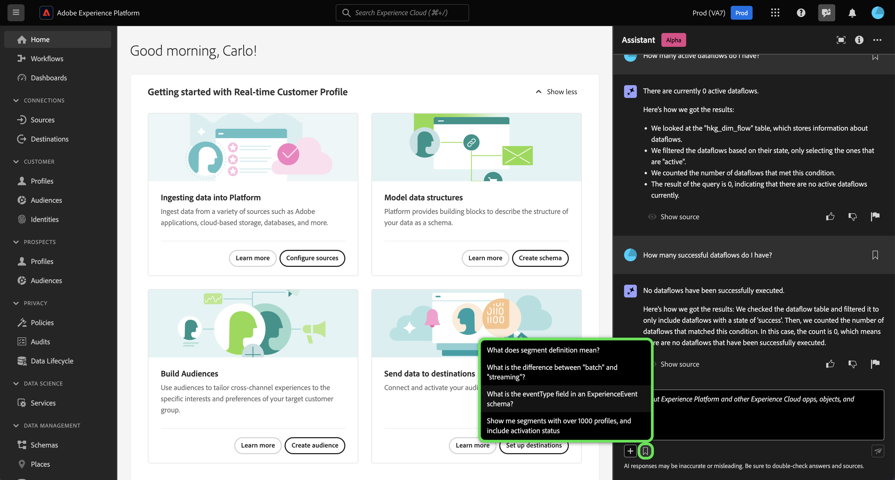
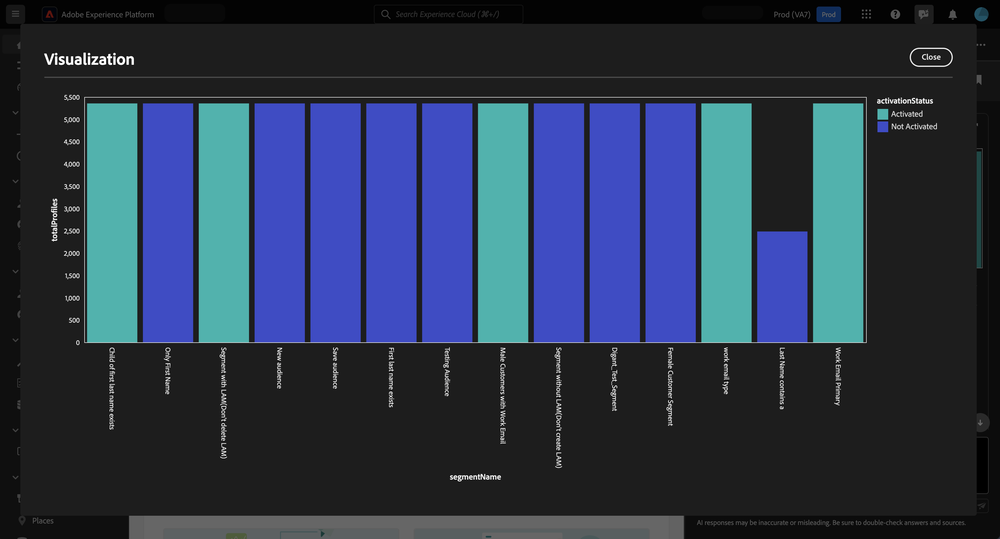

# Adobe Experience Platform的AI助理

>[!NOTE]
>
>Adobe Experience Platform的AI助理目前仍在測試階段。 功能和檔案可能會有所變更。

AI助理是UI功能，可用來導覽並瞭解Adobe Experience Platform和Real-time Customer Data Platform概念以及有關您物件的使用資訊。

您可以查詢AI助理以取得下列資訊：

* 有關如何執行與資料和受眾相關之工作的指南。
* 貴組織中現有資料物件的狀態和量度。
* 使用案例範例和細微差別，更能瞭解您的資料物件，包括屬性、受眾、資料流程、資料集、目的地、結構描述和來源。

請閱讀以下指南，瞭解如何使用AI助理來協助導覽並瞭解您的Experience Platform和Real-Time CDP工作流程。

>[!BEGINSHADEBOX]

**AI助理如何運作？**

AI Assistant會查詢資料庫，然後將資料庫中的資料轉譯成人類看得懂的答案，以回應您提交的問題。

這種基礎資料的內部表示法也稱為知識圖表，是一張包含特定答案的概念、資料和中繼資料的完整網路。

「知識圖形」由每次提交查詢時所參考的子圖形組成：

* 客戶使用資料。
* 各種中繼存放區的客戶使用資料。
* Experience League檔案。

在查詢AI Assistant之前，需要考慮兩種型別的問題：

* **概念問題**：概念問題與資料或受眾相關的Adobe概念有關。 概念問題的一些範例包括：
   * 批次和串流區段之間有何差異？
   * 是否有產業資料模型，以及我該如何使用？
   * Real-Time CDP的最佳用途為何？
* **使用問題**：使用問題與組織內的資料物件有關。 使用問題的一些範例包括：
   * 我有多少資料集？
   * 有多少結構描述屬性從未使用過？
   * 已啟用哪些對象？

>[!ENDSHADEBOX]

## 您可以使用AI助理完成的目標

您可以使用AI助理來達成下列目標：

| 目標 | 說明 | 範例 |
| --- | --- | --- |
| 學習概念和持續工作流程 | <ul><li>身為新手使用者，您可以使用AI Assistant來瞭解Real-Time CDP和Adobe Journey Optimizer概念，並且將自己帶入你不熟悉的產品和功能。</li><li>身為經驗豐富的使用者，您可以使用AI Assistant來解決可能阻礙您工作流程的邊緣案例。 | <ul><li>如何在Journey Analytics中設定儀表板？</li><li>告訴我一些Real-Time CDP的使用案例。</li></ul> |
| 疑難排解 | 使用AI助理瞭解如何偵錯工作流程中可能遇到的基本錯誤。 | <ul><li>發生此錯誤的原因 {ERROR_MESSAGE} 平均值？</li><li>我為何無法刪除名為「Luma：電子郵件對象」的對象？</li></ul> |
| 沙箱衛生 | 使用AI助理來識別任何重複專案或未使用的物件，以便您能夠有效地維護您的沙箱。 | <ul><li>您可以顯示類似的對象嗎？</li><li>是否有任何沒有關聯資料集的結構描述？</li></ul> |
| 值分析 | 使用AI助理可以識別您最常用的資料物件，並評估任何績效指標或尋找最有價值的資料物件。 | <ul><li>我們的「Luma：電子郵件對象」區段定義中有多少設定檔？</li><li>對象何時啟用以Experience Cloud對象目的地？</li></ul> |
| 搜尋 | 使用AI助理來尋找支援的Experience Platform物件，例如對象、資料集、目的地、結構描述和來源。 | <ul><li>列出在上季建立的名稱中包含「Luma」的對象。</li><li>「Luma：自訂動作」XDM結構描述中有哪些屬性？</li></ul> |
| 影響分析 | 使用AI助理來識別某些工作流程中使用的資料物件，以便您評估任何變更的影響。 | <ul><li>使用哪些對象 `homeAddress.city` 在「Luma：PersonProfiles」結構描述中？</li><li>哪些資料集是 `consents.marketing.push.val` 設定檔屬性儲存在中？</li></ul> |

## 在Experience PlatformUI中存取AI助理

若要啟動AI助理，請選取 **[!UICONTROL AI助理圖示]** 從Experience PlatformUI的頂端標題。

AI Assistant介面隨即顯示，立即為您提供開始使用的資訊。 您可以使用下提供的選項 [!UICONTROL 開始使用的概念] 回答下列問題和命令：

* [!UICONTROL 已啟用我的哪些對象？]
* [!UICONTROL 什麼是結構描述？]
* [!UICONTROL 告訴我一些Real-Time CDP的常見使用案例]

若要與AI Assistant互動，請使用輸入方塊輸入您的查詢或命令。 您也可以使用(**`+`**)符號，以利用自動完成功能及書籤圖示來存取您的書籤化查詢與命令。

## 使用案例範例：使用AI助理加快您的綱要建立流程

>[!NOTE]
>
>以下工作流程是使用Experience Event結構描述建立程式的範例，說明如何使用Experience PlatformUI中的AI Assistant。

考慮您正在建立的使用案例 **裝置交易事件結構描述**. 在體驗事件結構描述建立程式期間，您會 `eventType` 欄位。 「此時，您可以選擇退出工作流程並參閱 [結構描述組合的基本面](../xdm/schema/composition.md) 檔案或您可以使用AI助理來擷取問題的答案，並透過AI助理建議的檔案連結尋找其他資源。」

若要開始，請在提供的文字方塊中輸入您的問題。 在以下範例中，AI Assistant會提供以下問題： &quot;**什麼是ExperienceEvent結構描述中的eventType欄位？**&quot;

AI Assistant接著會查詢其知識庫並計算答案。 幾分鐘後，AI Assistant會傳回答案和相關建議，您可將其用作後續提示。

收到來自AI助理的回應後，您可以從多個選項中進行選取，以決定要如何繼續。

### 儲存查詢 {#save-your-query}

+++選取以檢視如何儲存查詢的範例

若要儲存查詢，請選取問題旁的書籤圖示。

若要存取已儲存的查詢，請選取輸入方塊下方的書籤圖示，然後選取您要執行的查詢。

+++

### 在您的沙箱中檢視資料 {#view-data-in-your-sandbox}

+++選取以檢視範例

根據您的查詢，AI Assistant會提供與沙箱中資料相關的其他資訊。 若要檢視查詢回應如何套用至您的沙箱，請選取 **[!UICONTROL 在您的沙箱中].**

在此步驟中，AI助理可以提供特定問題物件UI頁面的直接連結。 在以下範例中，AI Assistant提供直接連結至 [!UICONTROL 方案] 和 [!UICONTROL 區段] UI頁面。

+++

### 驗證回應 {#verify-the-response}

+++選取此選項可檢視如何顯示來源的範例

若要檢視引文及驗證AI助理的回應，請選取 **[!UICONTROL 顯示來源]**. AI Assistant提供可證實其回應的檔案連結。 您也可以使用AI Assistant提供的查詢 [!UICONTROL 相關建議] 以進一步探索與原始查詢相關的主題。

+++

### 資料使用情況和視覺效果 {#data-usage-and-visualization}

+++選取此選項可檢視資料使用問題和資料視覺效果的範例

若要讓AI Assistant回應有關您組織內資料使用情況的查詢，您必須處於有效沙箱中。

在以下範例中，AI助理會隨附以下查詢： **「使用超過1000個設定檔顯示區段定義並包含啟用狀態。」** AI Assistant接著會以圖表回應，將您的區段和設定檔資料視覺化。

您可以將滑鼠停留在個別長條圖上，以檢視特定資料。 您也可以選取展開圖示，以檢檢視表的大圖。

視覺效果的展開檢視隨即顯示。 您可以使用展開的強制回應視窗來進一步檢查資料，且在視覺化傳回大量欄時特別實用。

出現資料使用問題提示時，AI Assistant會提供如何計算答案的說明。 在以下範例中，AI Assistant概述其顯示的區段定義所使用的步驟，其中包含超過1000個設定檔及其各自的啟用狀態。

您還可以提供篩選器和修改查詢，並可以指示AI助理根據您包含的篩選器呈現其結果。 例如，您可以要求AI助理按其建立日期的順序，顯示計數區段定義的趨勢；移除總設定檔為零的區段定義；以及在顯示資料時，使用月份名稱而非整數。

+++

### 使用自動完成 {#use-auto-complete}

+++選取以檢視自動完成的範例

您可以使用自動完成函式來接收沙箱中存在之資料物件的清單。 自動完成建議適用於下列網域：受眾、結構描述、資料集、來源和目的地。

加入加號(**`+`**)。 您也可以選取加號(**`+`**)，位於文字輸入方塊底部。 隨即顯示一個視窗，其中包含沙箱中建議的資料物件清單。

接著，選取您要查詢的資料物件以完成問題，然後提交問題。

+++

### 使用多圈 {#use-multi-turn}

+++選取以檢視多圈範例

您可以使用AI Assistant的多圈功能，在體驗期間進行更自然的交談。 AI Assistant能夠回答後續的問題。 該上下文可從先前的互動中推斷。

在以下範例中，會要求AI助理取得目前組織中資料流程的總數。

接著，AI助理會收到另一個後續追蹤要求。 這次，AI Assistant會列出組織中目前存在的資料流來進行回應。

+++

## 文件 {#documentation}

目前，檔案索引涵蓋Adobe Experience Platform (Real-Time CDP和受眾)。 索引會定期更新。

說明檔案擷取模型已針對Experience Platform(Real-Time CDP和受眾)接受訓練。 Adobe Experience Platform範圍以外的問題，例如，關於其他Adobe產品(如Adobe Target)和Creative Cloud套裝的問題，無法回答。

## 資料使用情況 {#data-usage}

您也可以向AI Assistant詢問有關下列網域中資料使用情況的問題：

* 屬性
* 對象
* 資料流
* 資料集
* 目的地 _（關於帳戶的問題和資料流的一些問題目前無法回答。）_
* 方案 _（目前無法回答有關欄位群組的問題。）_
* 來源 _（目前無法回答有關帳戶的問題。）_

對於使用資料查詢，答案可能不會反映UI的目前狀態。 支援這些問題的資料每24小時更新一次。 例如，使用者白天在Real-Time CDP中所做的變更會在夜間與資料存放區同步，然後早上就可供使用者提問。 您可能需要將問題的格式設定為：「標題的對象是什麼時候 {TITLE} 建立時間？」 而非「何時會 {TITLE} 對象已建立？」

您需要登入沙箱，查詢與物件（例如對象、結構描述、資料集、屬性和目的地）相關的特定資料。

### 範例資料使用問題 {#example-data-usage-questions}

+++選取以檢視範例資料使用問題清單

| 問題型別 | 說明 | 範例 |
| --- | --- | --- | 
| 資料譜系 | 追蹤其他Experience Platform物件中一或多個物件的使用情況 | <ul><li>使用哪些資料集 {SCHEMA_NAME} 綱要？</li><li>使用相同結構描述擷取了多少資料集？</li><li>啟用的受眾中使用了哪些資料集？</li><li>列出具有用於已啟動受眾之屬性的結構描述。</li><li>顯示啟用的對象 {DESTINATION_ACCOUNT_NAME} 和超過1000個設定檔。</li><li>顯示啟用對象中所使用的屬性，這些對象在2023年1月之後已修改。</li><li>什麼是資料集透過擷取 {SOURCE_NAME}？</li><li>哪些資料流相關聯 {DATAFLOW_NAME}</li><li>列出與啟用的對象相關且建立於過去1年的結構描述。</li></ul> |
| 分佈與彙總 | 關於Experience Platform物件使用情況的摘要式問題 | <ul><li>啟用的對象百分比為何？</li><li>區段中使用了多少欄位？</li><li>哪些對象啟用的目的地數量最多？</li><li>列出重複的對象。</li><li>顯示啟用的對象 {DESTINATION_ACCOUNT_NAME} 並按設定檔大小排名。</li><li>尚未啟用但擁有超過100個設定檔的對象百分比為何？ 顯示他們的姓名。</li><li>列出將資料擷取到我的資料集中的3個來源聯結器。</li><li>根據啟用對象的發生次數，列出前5個用於啟用對象的屬性。</li></ul> |
| 物件查詢 | 擷取或存取Experience Platform物件或其屬性。 | <ul><li>哪些資料集沒有任何相關聯的結構描述</li><li>列出用於以下專案的屬性： {AUDIENCE_NAME}？</li><li>給我已啟用設定檔但自建立以來未修改的結構描述清單。</li><li>上週修改了哪些對象？</li><li>列出具有相同區段定義的對象及其建立日期。</li><li>哪些資料集已啟用設定檔，並且包括已從每個資料集建立多少對象。</li><li>哪些來源帳戶與資料集XYZ相關聯？</li><li>顯示區段定義和修改日期 {AUDIENCE_NAME}.</li></ul> |

+++

## 提供意見反應 {#feedback}

>[!BEGINSHADEBOX]

**您的意見回饋已要求**

在此Alpha階段，請您針對從AI助理收到的回應提供意見反應。 所有回應和提交的意見都會經過稽核，以繼續改善AI助理體驗。

若要提供意見回饋，請在收到AI助理的回應後選取向上或向下拇指，然後在提供的文字方塊中輸入您的意見回饋。 接下來，選取 **[!UICONTROL 提交意見]** 以提交。

>[!ENDSHADEBOX]

+++提供意見回饋

>[!BEGINTABS]

>[!TAB 豎起大拇指]

選取向上拇指圖示，提供您對於AI助理的良好體驗的反饋。

>[!TAB 向下拇指]

選取向下縮圖圖示，即可根據您使用AI助理的經驗，提供哪些可改善的意見回饋。 在此步驟中，您也可以提供關於體驗的特定註解。 評論中提供的意見回饋會每天稽核。

>[!TAB 標幟]

選取標幟圖示以提供關於您使用AI助理體驗的進一步報告。

>[!ENDTABS]

+++

## 其他資訊 {#additional-information}

請參閱本節以取得有關AI Assistant forExperience Platform的更多資訊。

### 警告和限制 {#caveats-and-limitations}

以下章節概述使用AI助理時應考量的目前注意事項和限制。

#### 有限的閒聊

您可以與AI助理進行交談，但此容量目前有限。

#### 功能問題

AI Assistant可能會提供其功能的錯誤印象。 它可能會錯誤地回答以下型別的問題：

| 範例問題 | 注意 |
| --- | --- |
| 「您可以回答有關以下方面的問題 {ENTITY}？」 | 只要「AI助理」能夠在索引中找到參照指定實體的單一頁面，就會回答「是」。 |
| 「您知道嗎 **x** 語言？」 | AI助理目前僅支援英文，但因為基礎模型可以支援，所以可能會回答「是」。 |
| 「您可以……？」 | AI助理可能會回答「是」，即使它無法回答。 |

### 提示 {#tips}

以下章節概述使用AI助理時應考慮的一些提示和解決方法。

#### 問題可能會以錯誤的資訊來源來回答

在某些情況下，您關於使用情況資料的問題可能會根據檔案得出答案。 這是因為AI助理可能會將您的問題錯誤地路由到錯誤的資訊來源。 您可以透過以下方式防止此情況：

* 改寫您的問題以使用類似SQL的語言
* 明確呼叫要使用的資訊來源。

請閱讀下表的範例：

| 錯誤的問題 | 好問題 | 附註 |
| --- | --- | --- |
| 我的最大受眾為何？ | 我的最大受眾為何？ 使用資料。 | 明確告知AI助理，您希望答案以資料為基礎。 |
| 我的最大受眾為何？ | 列出我最大的對象。 | 在某些情況下，「什麼……」問題可能會被誤認為檔案型問題。 使用類似「list」的命令是較強化的指標，表示您對上下文中的資料存有疑問。 |
| 我有多少資料集？ | 計算我的資料集。 | 原始問題適用於對象，但可能無法用於資料集。 |
