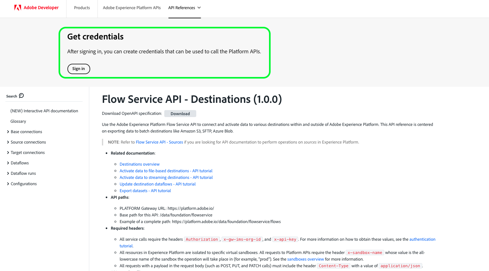

# 驗證及存取 Experience Platform API

本檔案逐步說明如何存取Adobe Experience Platform開發人員帳戶，進而呼叫Experience Platform API。 在本教學課程結束時，您將已產生或收集下列Experience Platform API呼叫中作為標頭所需的認證：

* `{ACCESS_TOKEN}`
* `{API_KEY}`
* `{ORG_ID}`

>[!TIP]
>
>除了上述三個認證外，許多Experience Platform API也需要提供有效的`{SANDBOX_NAME}`作為標頭。 請參閱[沙箱總覽](../sandboxes/home.md)以取得有關沙箱的詳細資訊，並參閱[沙箱管理端點](/help/sandboxes/api/sandboxes.md#list)檔案，以取得有關列出貴組織可用的沙箱的資訊。

為了維護應用程式和使用者的安全性，對Experience Platform API的所有請求都必須使用OAuth等標準進行驗證和授權。

本教學課程涵蓋如何收集所需的認證以驗證Experience Platform API呼叫，如下方流程圖所述。 您可以在初始的一次性設定中收集大部分必要的認證。 然而，存取權杖必須每24小時重新整理一次。


## 先決條件 {#prerequisites}

為了成功呼叫Experience Platform API，您必須具備下列條件：

* 有權存取Adobe Experience Platform的組織。
* Admin Console管理員，能將您新增為產品設定檔的開發人員和使用者。
* Experience Platform系統管理員，可授予您必要的屬性型存取控制項，以透過API在Experience Platform的不同部分執行讀取或寫入作業。

您也必須有Adobe ID才能完成本教學課程。 如果您沒有Adobe ID，可以使用下列步驟建立一個：

1. 移至[Adobe Developer Console](https://console.adobe.io)。
2. 選取&#x200B;**[!UICONTROL 建立新帳戶]**。
3. 完成註冊程式。

## 取得Experience Platform的開發人員和使用者存取權 {#gain-developer-user-access}

在Adobe Developer Console上建立整合之前，您的帳戶必須擁有Adobe Admin Console中Experience Platform產品設定檔的開發人員和使用者許可權。

### 取得開發人員存取權 {#gain-developer-access}

請聯絡貴組織的Admin Console管理員，將您作為開發人員新增至Experience Platform產品設定檔。 請參閱Admin Console檔案以取得如何[管理產品設定檔的開發人員存取權](https://helpx.adobe.com/tw/enterprise/admin-guide.html/enterprise/using/manage-developers.ug.html)的特定指示。

一旦指派您為開發人員，您就可以開始在[Adobe Developer Console](https://www.adobe.com/go/devs_console_ui)中建立整合。 這些整合是從外部應用程式和服務到Adobe API的管道。

### 取得使用者存取權 {#gain-user-access}

您的Admin Console管理員必須將您作為使用者新增至相同的產品設定檔。 透過使用者存取權，您可以在UI中檢視您執行的API作業的結果。

如需詳細資訊，請參閱[在Admin Console中管理使用者群組](https://helpx.adobe.com/tw/enterprise/admin-guide.html/enterprise/using/user-groups.ug.html)的指南。

## 產生API金鑰（使用者端ID）和組織ID {#generate-credentials}

>[!NOTE]
>
>如果您是從[Privacy Service API指南](../privacy-service/api/getting-started.md)追蹤此檔案，您現在可以返回該指南以產生[!DNL Privacy Service]唯一的存取認證。

在透過Admin Console授予您Experience Platform的開發人員和使用者存取權後，下一步就是在Adobe Developer Console中產生您的`{ORG_ID}`和`{API_KEY}`認證。 這些憑證只需產生一次，並可在未來的Experience Platform API呼叫中重複使用。

>[!TIP]
>
>您可以直接從API參考檔案頁面取得使用Experience Platform API所需的所有驗證認證，而不用前往Developer Console。 [閱讀更多](#get-credentials-functionality)有關此功能的資訊。

### 將Experience Platform新增至專案 {#add-platform-to-project}

移至[Adobe Developer Console](https://www.adobe.com/go/devs_console_ui)並使用您的Adobe ID登入。 接下來，請依照教學課程中概述的步驟，在Adobe Developer Console檔案中建立[空白專案](https://developer.adobe.com/developer-console/docs/guides/projects/projects-empty/)。

建立新專案後，請在&#x200B;**[!UICONTROL 專案概述]**&#x200B;畫面上選取&#x200B;**[!UICONTROL 新增API]**。

>[!TIP]
>
>如果您已布建多個組織，請使用介面右上角的組織選擇器，以確保您位於所需的組織中。


**[!UICONTROL 新增API]**&#x200B;畫面會出現。 選取&#x200B;**[!UICONTROL Adobe Experience Platform]**&#x200B;的產品圖示，然後選擇&#x200B;**[!UICONTROL Experience Platform API]**，再選取&#x200B;**[!UICONTROL 下一步]**。


>[!TIP]
>
>選取&#x200B;**[!UICONTROL 檢視檔案]**&#x200B;選項，在個別瀏覽器視窗中導覽至完整的[Experience Platform API參考檔案](https://developer.adobe.com/experience-platform-apis/)。

### 選取[!UICONTROL OAuth伺服器對伺服器]驗證型別 {#select-oauth-server-to-server}

接著，選取&#x200B;**[!UICONTROL OAuth伺服器對伺服器]**&#x200B;驗證型別，以產生存取權杖並存取Experience Platform API。 在選取&#x200B;**[!UICONTROL 下一步]**&#x200B;之前，請在&#x200B;**[!UICONTROL 認證名稱]**&#x200B;文字欄位中為您的認證提供有意義的名稱。

>[!IMPORTANT]
>
>**[!UICONTROL OAuth Server-to-Server]**&#x200B;方法是日後唯一支援的權杖產生方法。 先前支援的&#x200B;**[!UICONTROL 服務帳戶(JWT)]**&#x200B;方法已過時，無法選取以進行新整合。 雖然使用JWT驗證方法的現有整合可繼續運作至2025年6月30日，Adobe強烈建議您在該日期之前將現有整合移轉至新的[!UICONTROL OAuth伺服器對伺服器]方法。 在[!BADGE 已棄用]一節中取得詳細資訊{type=negative}[產生JSON Web權杖(JWT)](#jwt)。


### 選取要整合的產品設定檔 {#select-product-profiles}

在&#x200B;**[!UICONTROL 設定API]**&#x200B;畫面中，選取&#x200B;**[!UICONTROL AEP-Default-All-Users]**&#x200B;以及您想要存取的任何其他產品設定檔。

>[!IMPORTANT]
>
>若要存取Experience Platform中的特定功能，您還需要系統管理員授予您必要的屬性型存取控制許可權。 請參閱[取得必要的屬性型存取控制許可權](#get-abac-permissions)一節中的詳細資訊。


當您準備好時，選取&#x200B;**[!UICONTROL 儲存已設定的API]**。

以下的影片教學課程也提供上述步驟的逐步解說，以設定與Experience Platform API的整合：

>[!VIDEO](https://video.tv.adobe.com/v/28832/?learn=on)

### 收集認證 {#gather-credentials}

將API新增至專案後，專案的&#x200B;**[!UICONTROL OAuth伺服器對伺服器]**&#x200B;頁面會顯示所有呼叫Experience Platform API時所需的下列認證：

在Developer Consle中新增API之後的

* `{API_KEY}` （[!UICONTROL 使用者端識別碼]）
* `{ORG_ID}` （[!UICONTROL 組織識別碼]）

<!--


<!--

In addition to the above credentials, you also need the generated **[!UICONTROL Client Secret]** for a future step. Select **[!UICONTROL Retrieve client secret]** to reveal the value, and then copy it for later use.


-->

## 產生存取權杖 {#generate-access-token}

下一步是產生`{ACCESS_TOKEN}`認證以用於Experience Platform API呼叫。 不像`{API_KEY}`和`{ORG_ID}`的值，必須每24小時產生一次新Token，才能繼續使用Experience Platform API。 選取&#x200B;**[!UICONTROL 產生存取權杖]**，這會產生您的存取權杖，如下所示。


>[!TIP]
>
>您也可以使用Postman環境和集合來產生存取權杖。 如需詳細資訊，請閱讀有關[使用Postman驗證和測試API呼叫](#use-postman)的章節。

## 直接在API參考檔案中建立和擷取驗證認證 {#get-credentials-functionality}

從2024年11月發行的Experience Platform開始，您可以直接從API參考頁面取得使用Experience Platform API的認證，不需要前往[!UICONTROL Developer Console]。 從[流量服務API — 目的地頁面](https://developer.adobe.com/experience-platform-apis/references/destinations/)檢視以下範例。



若要取得呼叫Experience Platform API的認證，請瀏覽至任何Experience Platform API參考頁面，並在頁面頂端選取「**[!UICONTROL 登入]**」。 使用您的&#x200B;**[!UICONTROL 個人帳戶]**&#x200B;或&#x200B;**[!UICONTROL 公司或學校帳戶]**&#x200B;登入。

登入後，請選取&#x200B;**[!UICONTROL 建立新認證]**&#x200B;以建立一組新的認證以存取Experience Platform API。


接下來，使用下拉式選擇器開啟憑證視窗、產生存取權杖，並取得您的API金鑰和組織ID。 將認證複製到API參考頁面上的[**[!UICONTROL Try it]**](/help/release-notes/2024/may-2024.md#interactive-api-documentation)區塊中，以開始使用Experience Platform API。


>[!TIP]
>
>當您在Experience Platform API參考檔案中的不同端點頁面之間導覽時，頁面頂端憑證區塊仍會顯示。

## [!BADGE 已棄用]{type=negative}產生JSON Web權杖(JWT) {#jwt}

>[!WARNING]
>
>不建議使用產生存取權杖的JWT方法。 所有新的整合都必須使用[OAuth伺服器對伺服器驗證方法](#select-oauth-server-to-server)來建立。 Adobe也要求您在2025年6月30日前將現有的整合移轉至OAuth方法，以便您的整合能繼續運作。 請參閱下列重要檔案：
> 
>* [您的應用程式從JWT移轉至OAuth的移轉指南](https://developer.adobe.com/developer-console/docs/guides/authentication/ServerToServerAuthentication/migration/)
>* [使用OAuth的新舊應用程式實作指南](https://developer.adobe.com/developer-console/docs/guides/authentication/ServerToServerAuthentication/implementation/)
>* [使用OAuth伺服器對伺服器認證方法的優點](https://developer.adobe.com/developer-console/docs/guides/authentication/ServerToServerAuthentication/migration/#why-oauth-server-to-server-credentials)

+++ 檢視已棄用的資訊

下一步是根據您的帳戶憑證產生JSON Web權杖(JWT)。 此值用於產生您的`{ACCESS_TOKEN}`認證，以用於Experience Platform API呼叫，必須每24小時重新產生一次。

>[!IMPORTANT]
>
>在本教學課程中，以下步驟會概述如何在Developer Console中產生JWT。 不過，此產生方法只應用於測試和評估目的。
>
>如要正常使用，必須自動產生JWT。 如需如何以程式設計方式產生JWT的詳細資訊，請參閱Adobe Developer上的[服務帳戶驗證指南](https://www.adobe.io/developer-console/docs/guides/authentication/JWT/)。

在左側導覽中選取&#x200B;**[!UICONTROL 服務帳戶(JWT)]**，然後選取&#x200B;**[!UICONTROL 產生JWT]**。


在&#x200B;**[!UICONTROL 產生自訂JWT]**&#x200B;下提供的文字方塊中，貼上您先前將Experience Platform API新增至服務帳戶時所產生之私密金鑰的內容。 然後，選取&#x200B;**[!UICONTROL 產生Token]**。


頁面會更新以顯示產生的JWT，以及可讓您產生存取權杖的範例cURL命令。 在本教學課程中，請選取&#x200B;**[!UICONTROL 產生的JWT]**&#x200B;旁的&#x200B;**[!UICONTROL 複製]**，將權杖複製到剪貼簿。


**產生存取權杖**

產生JWT後，您可以在API呼叫中使用它來產生您的`{ACCESS_TOKEN}`。 不像`{API_KEY}`和`{ORG_ID}`的值，必須每24小時產生一次新Token，才能繼續使用Experience Platform API。

**要求**

以下請求會根據承載中提供的認證產生新的`{ACCESS_TOKEN}`。 此端點僅接受表單資料作為其裝載，因此必須向其指定`multipart/form-data`的`Content-Type`標頭。

```shell
curl -X POST https://ims-na1.adobelogin.com/ims/exchange/jwt \
  -H 'Content-Type: multipart/form-data' \
  -F 'client_id={API_KEY}' \
  -F 'client_secret={SECRET}' \
  -F 'jwt_token={JWT}'
```

| 屬性 | 說明 |
| --- | --- |
| `{API_KEY}` | 您在[先前的步驟](#api-ims-secret)中擷取的`{API_KEY}` （[!UICONTROL 使用者端識別碼]）。 |
| `{SECRET}` | 您在[先前步驟](#api-ims-secret)中擷取的使用者端密碼。 |
| `{JWT}` | 您在[先前步驟](#jwt)產生的JWT。 |

>[!NOTE]
>
>您可以使用相同的API金鑰、使用者端密碼和JWT，為每個工作階段產生新的存取權杖。 這可讓您在應用程式中自動產生存取權杖。

**回應**

```json
{
  "token_type": "bearer",
  "access_token": "{ACCESS_TOKEN}",
  "expires_in": 86399992
}
```

| 屬性 | 說明 |
| --- | --- |
| `token_type` | 型別 of 正在傳回權杖。 對於存取權杖，此值一律為`bearer`。 |
| `access_token` | 產生的`{ACCESS_TOKEN}`。 所有Experience Platform API呼叫都需要以這個值做為`Authentication`標題，且前置詞為`Bearer`。 |
| `expires_in` | 存取Token過期前的剩餘毫秒數。 此值達到0後，必須產生新的存取權杖才能繼續使用Experience Platform API。 |

+++

## 測試存取認證 {#test-credentials}

收集完所有三個必要的認證（存取權杖、API金鑰和組織ID）後，您可以嘗試進行下列API呼叫。 此呼叫列出貴組織可用的所有標準[!DNL Experience Data Model] (XDM)類別。 在[Postman](#use-postman)中匯入並執行呼叫。

>[!BEGINSHADEBOX]

**要求**

```SHELL
curl -X GET https://platform.adobe.io/data/foundation/schemaregistry/global/classes \
  -H 'Accept: application/vnd.adobe.xed-id+json' \
  -H 'Authorization: Bearer {{ACCESS_TOKEN}}' \
  -H 'x-api-key: {{API_KEY}}' \
  -H 'x-gw-ims-org-id: {{ORG_ID}}'
```

**回應**

如果您的回應與下方所示的回應類似，表示您的認證有效且運作正常。 （此回應已因空間而遭截斷。）

```JSON
{
  "results": [
    {
        "title": "XDM ExperienceEvent",
        "$id": "https://ns.adobe.com/xdm/context/experienceevent",
        "meta:altId": "_xdm.context.experienceevent",
        "version": "1"
    },
    {
        "title": "XDM Individual Profile",
        "$id": "https://ns.adobe.com/xdm/context/profile",
        "meta:altId": "_xdm.context.profile",
        "version": "1"
    }
  ]
}
```

>[!ENDSHADEBOX]

>[!IMPORTANT]
>
>雖然上述呼叫足以測試您的存取認證，但請注意，您若沒有正確的屬性型存取控制許可權，將無法存取或修改數個資源。 閱讀以下&#x200B;**取得必要的屬性型存取控制許可權**&#x200B;章節中的詳細資訊。

## 取得必要的屬性型存取控制許可權 {#get-abac-permissions}

若要在Experience Platform中存取或修改數個資源，您必須擁有適當的存取控制許可權。 系統管理員可以授與您所需的[許可權](/help/access-control/ui/permissions.md)。 在章節中取得有關[管理角色](/help/access-control/abac/ui/permissions.md#manage-api-credentials-for-role)的API認證的詳細資訊。

有關系統管理員如何授與所需許可權以透過API存取Experience Platform資源的詳細資訊，也可在以下教學影片中取得：

>[!VIDEO](https://video.tv.adobe.com/v/28832/?learn=on&t=159)

## 使用Postman驗證及測試API呼叫 {#use-postman}

[Postman](https://www.postman.com/)是熱門工具，可讓開發人員探索及測試RESTful API。 您可以使用Experience Platform Postman集合和環境，加速使用Experience Platform API。 深入瞭解[在Experience Platform](/help/landing/postman.md)中使用Postman以及開始使用集合和環境。

有關將Postman與Experience Platform集合和環境一起使用的詳細資訊，也可在以下影片教學課程中取得：

**下載並匯入Postman環境以搭配Experience Platform API使用**

>[!VIDEO](https://video.tv.adobe.com/v/28832/?learn=on&t=106)

**使用Postman集合來產生存取權杖**

下載[Identity Management Service Postman集合](https://github.com/adobe/experience-platform-postman-samples/tree/master/apis/ims)並觀看以下影片，瞭解如何產生存取權杖。

>[!VIDEO](https://video.tv.adobe.com/v/29698/?learn=on)

**下載Experience Platform API Postman集合併與API互動**

>[!VIDEO](https://video.tv.adobe.com/v/29704/?learn=on)

<!--
This [Medium post](https://medium.com/adobetech/using-postman-for-jwt-authentication-on-adobe-i-o-7573428ffe7f) describes how you can set up Postman to automatically perform JWT authentication and use it to consume Experience Platform APIs.
-->

## 系統管理員：透過Experience Platform許可權授予開發人員和API存取控制 {#grant-developer-and-api-access-control}

您必須先擁有適用於Adobe Developer Console產品設定檔的開發人員和使用者許可權，才能在Experience Platform上建立整合。

>[!NOTE]
>
>只有系統管理員才能在「許可權」中檢視和管理API認證。

### 將開發人員新增至產品設定檔 {#add-developers-to-product-profile}

導覽至[Admin Console](https://adminconsole.adobe.com/)並使用您的Adobe ID登入。

從導覽列中選取&#x200B;**[!UICONTROL 產品]**，然後從產品清單中選取&#x200B;**[!UICONTROL Adobe Experience Platform]**。


從&#x200B;**[!UICONTROL 產品設定檔]**&#x200B;索引標籤中，選取&#x200B;**[!UICONTROL AEP-Default-All-Users]**。 或者，使用搜尋列透過輸入名稱來搜尋產品描述檔。


選取&#x200B;**[!UICONTROL 開發人員]**&#x200B;標籤，然後選取&#x200B;**[!UICONTROL 新增開發人員]**。

![顯示[開發人員]索引標籤，並反白顯示[新增開發人員]選項，](././images/api-authentication/add-developer1.png)

**[!UICONTROL 新增開發人員]**&#x200B;對話方塊出現。 輸入開發人員的&#x200B;**[!UICONTROL 電子郵件或使用者名稱]**。 有效的[!UICONTROL 電子郵件或使用者名稱]會顯示開發人員詳細資料。 選取「**[!UICONTROL 儲存]**」。

![新增開發人員對話方塊中填入開發人員資訊，並反白顯示[儲存]選項。](././images/api-authentication/add-developer-email.png)

開發人員已成功新增，並出現在&#x200B;**[!UICONTROL 開發人員]**&#x200B;標籤上。


### 指派API認證給角色

>[!NOTE]
>
>只有系統管理員可以將API指派給Experience Platform UI中的角色。

若要在Experience Platform API上使用及執行作業，系統管理員除了需要角色的指定許可權集之外，還需要新增API認證。 在章節中取得有關[管理角色](../access-control/abac/ui/permissions.md#manage-api-credentials-for-a-role)的API認證的詳細資訊。

以下影片教學課程也提供上述步驟的逐步解說，說明如何將開發人員新增至產品設定檔，以及將API指派至角色：

>[!VIDEO](https://video.tv.adobe.com/v/3426407/?learn=on)

## 其他資源 {#additional-resources}

請參閱以下連結的其他資源，以取得開始使用Experience Platform API的更多說明

* [驗證及存取Experience Platform API](https://experienceleague.adobe.com/docs/platform-learn/tutorials/platform-api-authentication.html?lang=zh-Hant)影片教學課程頁面
* 用於產生存取權杖的[Identity Management服務Postman集合](https://github.com/adobe/experience-platform-postman-samples/tree/master/apis/ims)
* [Experience Platform API Postman集合](https://github.com/adobe/experience-platform-postman-samples/tree/master/apis/experience-platform)

## 後續步驟 {#next-steps}

閱讀本檔案後，您已收集並成功測試Experience Platform API的存取認證。 您現在可以跟隨在[檔案](../landing/documentation/overview.md)中提供的範例API呼叫。

除了您在本教學課程中收集的驗證值之外，許多Experience Platform API也需要提供有效的`{SANDBOX_NAME}`作為標頭。 如需詳細資訊，請參閱[沙箱概觀](../sandboxes/home.md)。
