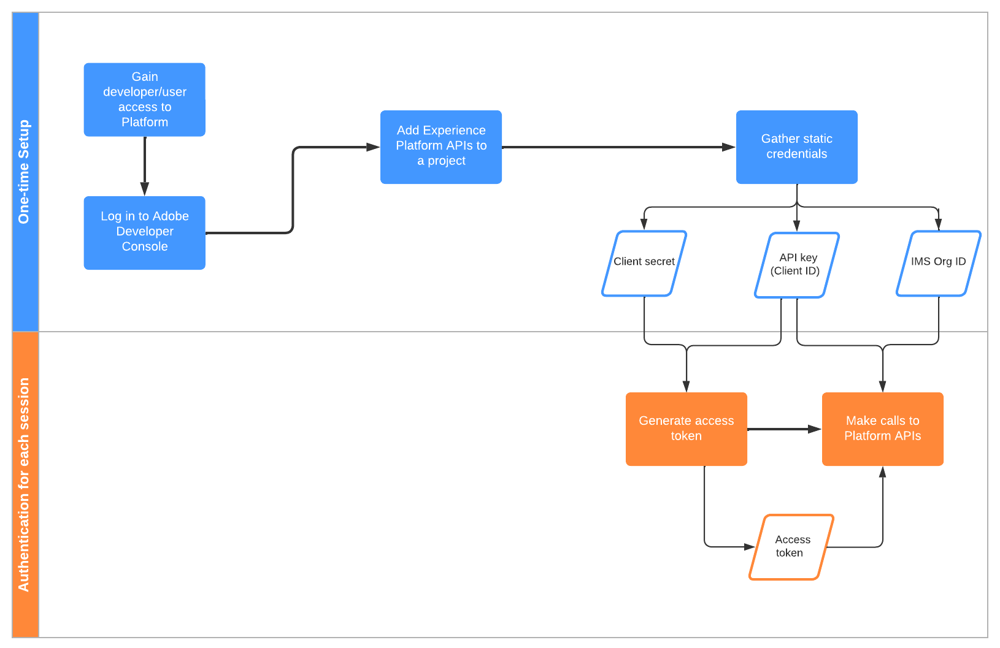

# 驗證及存取 Experience Platform API

本文件逐步說明如何存取 Adobe Experience Platform 開發人員帳戶，進而呼叫 Experience Platform API。在本教學課程結束時，您將產生所有Platform API呼叫所需的下列認證：

* `{ACCESS_TOKEN}`
* `{API_KEY}`
* `{ORG_ID}`

為了維護應用程式和使用者的安全，所有Adobe I/OAPI的要求都必須使用OAuth和JSON Web Token(JWT)等標準來驗證和授權。 JWT會與用戶端特定資訊搭配使用，以產生您的個人存取權杖。

本教學課程說明如何收集驗證Platform API呼叫所需的憑證，如下列流程圖所述：



## 先決條件

若要成功呼叫Experience PlatformAPI，您必須具備下列條件：

* 可存取Adobe Experience Platform的組織。
* Admin Console管理員，可將您新增為產品設定檔的開發人員和使用者。

您也必須有Adobe ID才能完成本教學課程。 如果您沒有Adobe ID，則可使用下列步驟來建立：

1. 前往 [Adobe Developer Console](https://console.adobe.io).
2. 選擇 **[!UICONTROL 建立新帳戶]**.
3. 完成註冊程式。

## 獲得開發人員和使用者的Experience Platform存取權

在Adobe Developer Console中建立整合之前，您的帳戶必須擁有Adobe Admin Console中Experience Platform產品設定檔的開發人員和使用者權限。

### 獲得開發人員訪問權

聯絡 [!DNL Admin Console] 組織中的管理員，使用將您新增為開發人員，並加入Experience Platform產品設定檔 [[!DNL Admin Console]](https://adminconsole.adobe.com/). 請參閱 [!DNL Admin Console] 說明檔案，以了解如何 [管理產品設定檔的開發人員存取](https://helpx.adobe.com/enterprise/admin-guide.html/enterprise/using/manage-developers.ug.html).

一旦您獲指派為開發人員，即可開始在 [Adobe Developer Console](https://www.adobe.com/go/devs_console_ui). 這些整合是從外部應用程式和服務到AdobeAPI的管道。

### 取得使用者存取權

您的 [!DNL Admin Console] 管理員也必須將您新增為相同產品設定檔的使用者。 請參閱 [管理使用者群組 [!DNL Admin Console]](https://helpx.adobe.com/enterprise/admin-guide.html/enterprise/using/user-groups.ug.html) 以取得更多資訊。

## 產生API金鑰、組織ID和用戶端密碼 {#api-ims-secret}

>[!NOTE]
>
>如果您要從 [Privacy ServiceAPI指南](../privacy-service/api/getting-started.md)，您現在可以返回該指南，產生 [!DNL Privacy Service].

在您透過 [!DNL Admin Console]，下一步是產生 `{ORG_ID}` 和 `{API_KEY}` Adobe Developer Console中的認證。 這些憑證只需產生一次，即可在未來的Platform API呼叫中重複使用。

### 新增Experience Platform至專案

前往 [Adobe Developer Console](https://www.adobe.com/go/devs_console_ui) 並登入您的Adobe ID。 接下來，請依照 [建立空白專案](https://developer.adobe.com/developer-console/docs/guides/projects/projects-empty/) 在Adobe Developer Console檔案中。

建立新專案後，請選取 **[!UICONTROL 新增API]** 在 **[!UICONTROL 專案概述]** 螢幕。


此 **[!UICONTROL 新增API]** 畫面。 選取Adobe Experience Platform的產品圖示，然後選擇 **[!UICONTROL Experience PlatformAPI]** 選擇 **[!UICONTROL 下一個]**.


從這裡，請遵循本教學課程中概述的步驟： [使用服務帳戶(JWT)將API新增至專案](https://www.adobe.io/apis/experienceplatform/console/docs.html#!AdobeDocs/adobeio-console/master/services-add-api-jwt.md) （從「設定API」步驟開始），以完成程式。

>[!IMPORTANT]
>
>在上述連結程式期間的特定步驟中，您的瀏覽器會自動下載私密金鑰和相關的公開憑證。 請注意，此私密金鑰儲存在您的電腦上的位置，因為在本教學課程的後續步驟中，是必要的。

### 收集憑據

將API新增至專案後， **[!UICONTROL Experience PlatformAPI]** 專案的頁面會顯示所有呼叫Experience PlatformAPI時所需的下列憑證：

* `{API_KEY}` ([!UICONTROL 用戶端ID])
* `{ORG_ID}` ([!UICONTROL 組織 ID])


除了上述憑證外，您還需要產生 **[!UICONTROL 用戶端密碼]** 以備將來之需。 選擇 **[!UICONTROL 擷取用戶端密碼]** 以顯示值，然後複製它以供稍後使用。


## 產生JSON網頁代號(JWT) {#jwt}

下一步是根據您的帳戶憑證產生JSON網頁代號(JWT)。 此值用於產生 `{ACCESS_TOKEN}` 用於Platform API呼叫的憑證，必須每24小時重新產生一次。

>[!IMPORTANT]
>
>在本教學課程中，下列步驟將說明如何在開發人員控制台中產生JWT。 但是，這種生成方法只應用於測試和評估。
>
>JWT必須自動產生，以供日常使用。 如需如何以程式設計方式產生JWT的詳細資訊，請參閱 [服務帳戶驗證指南](https://www.adobe.io/developer-console/docs/guides/authentication/JWT/) 在Adobe Developer。

選擇 **[!UICONTROL 服務帳戶(JWT)]** 在左側導覽器中，然後選取 **[!UICONTROL 產生JWT]**.


在下方提供的文字方塊中 **[!UICONTROL 產生自訂JWT]**，貼上您先前將Platform API新增至服務帳戶時產生的私密金鑰內容。 然後，選取 **[!UICONTROL 產生代號]**.


頁面會更新，顯示產生的JWT，以及可讓您產生存取權杖的範例cURL命令。 在本教學課程中，請選取 **[!UICONTROL 複製]** 下一頁 **[!UICONTROL 產生的JWT]** 將代號複製到剪貼簿。


## 產生存取權杖

產生JWT後，您就可以在API呼叫中使用它來產生您的 `{ACCESS_TOKEN}`. 不同於 `{API_KEY}` 和 `{ORG_ID}`，則必須每24小時產生一個新代號，才能繼續使用Platform API。

**要求**

下列請求會產生新 `{ACCESS_TOKEN}` 根據裝載中提供的憑證。 此端點僅接受表單資料作為其裝載，因此必須為它指定 `Content-Type` 標題 `multipart/form-data`.

```shell
curl -X POST https://ims-na1.adobelogin.com/ims/exchange/jwt \
  -H 'Content-Type: multipart/form-data' \
  -F 'client_id={API_KEY}' \
  -F 'client_secret={SECRET}' \
  -F 'jwt_token={JWT}'
```

| 屬性 | 說明 |
| --- | --- |
| `{API_KEY}` | 此 `{API_KEY}` ([!UICONTROL 用戶端ID]) [上一步](#api-ims-secret). |
| `{SECRET}` | 您在 [上一步](#api-ims-secret). |
| `{JWT}` | 您在 [上一步](#jwt). |

>[!NOTE]
>
>您可以使用相同的API金鑰、用戶端密碼和JWT，為每個工作階段產生新的存取權杖。 這可讓您自動在應用程式中產生存取權杖。

**回應**

```json
{
  "token_type": "bearer",
  "access_token": "{ACCESS_TOKEN}",
  "expires_in": 86399992
}
```

| 屬性 | 說明 |
| --- | --- |
| `token_type` | 要傳回的代號類型。 若為存取Token，此值一律為 `bearer`. |
| `access_token` | 產生的 `{ACCESS_TOKEN}`. 此值，前置詞為 `Bearer`，是必要項目，作為 `Authentication` 標題。 |
| `expires_in` | 存取權杖過期前的剩餘毫秒數。 一旦此值達到0，就必須產生新的存取權杖，才能繼續使用Platform API。 |

## 測試訪問憑據

收集完所有三個必要憑證後，您可以嘗試進行下列API呼叫。 此呼叫會列出所有標準 [!DNL Experience Data Model] (XDM)類別可供您的組織使用。

**要求**

```SHELL
curl -X GET https://platform.adobe.io/data/foundation/schemaregistry/global/classes \
  -H 'Accept: application/vnd.adobe.xed-id+json' \
  -H 'Authorization: Bearer {ACCESS_TOKEN}' \
  -H 'x-api-key: {API_KEY}' \
  -H 'x-gw-ims-org-id: {ORG_ID}'
```

**回應**

如果您的回應類似於下列所示的回應，則您的憑證有效且有效。 （此回應已因空格而截斷。）

```JSON
{
  "results": [
    {
        "title": "XDM ExperienceEvent",
        "$id": "https://ns.adobe.com/xdm/context/experienceevent",
        "meta:altId": "_xdm.context.experienceevent",
        "version": "1"
    },
    {
        "title": "XDM Individual Profile",
        "$id": "https://ns.adobe.com/xdm/context/profile",
        "meta:altId": "_xdm.context.profile",
        "version": "1"
    }
  ]
}
```

## 使用Postman來驗證和測試API呼叫

[Postman](https://www.postman.com/) 是一種熱門工具，可讓開發人員探索及測試RESTful API。 此 [中等貼文](https://medium.com/adobetech/using-postman-for-jwt-authentication-on-adobe-i-o-7573428ffe7f) 說明如何設定Postman以自動執行JWT驗證，以及使用它來使用Platform API。

## 具有Experience Platform權限的開發人員和API存取控制

>[!NOTE]
>
>只有系統管理員能夠在「權限」中檢視及管理API憑證。

在Adobe Developer Console中建立整合之前，您的帳戶必須擁有Adobe Admin Console中Experience Platform產品設定檔的開發人員和使用者權限。

### 將開發人員新增至產品設定檔

移至 [[!DNL Admin Console]](https://adminconsole.adobe.com/) 並使用您的 Adobe ID 登入。

選擇 **[!UICONTROL 產品]**，然後選取 **[!UICONTROL Adobe Experience Platform]** 從產品清單中。


從 **[!UICONTROL 產品設定檔]** 索引標籤，選取 **[!UICONTROL AEP-Default-All-Users]**. 或者，使用搜尋列，輸入名稱以搜尋產品設定檔。


選取 **[!UICONTROL 開發人員]** ，然後選取 **[!UICONTROL 新增開發人員]**.


輸入開發人員的 **[!UICONTROL 電子郵件或使用者名稱]**. 有效 [!UICONTROL 電子郵件或使用者名稱] 會顯示開發人員詳細資訊。 選取「**[!UICONTROL 儲存]**」。


已成功添加開發人員，並顯示在 [!UICONTROL 開發人員] 標籤。


### 設定API

開發人員可在Adobe Developer Console的專案中新增和設定API。

選取您的專案，然後選取 **[!UICONTROL 新增API]**.


在 **[!UICONTROL 新增API]** 對話框選擇 **[!UICONTROL Adobe Experience Platform]**，然後選取 **[!UICONTROL Experience PlatformAPI]**.


在 **[!UICONTROL 設定API]** 螢幕，選擇 **[!UICONTROL AEP-Default-All-Users]**.

### 將API指派給角色

系統管理員可以在Experience PlatformUI中將API指派給角色。

選擇 **[!UICONTROL 權限]** 和您要新增API的角色。 選取 **[!UICONTROL API憑證]** ，然後選取 **[!UICONTROL 新增API憑證]**.


選取您要新增至角色的API，然後選取 **[!UICONTROL 儲存]**.


您會回到 [!UICONTROL API憑證] 標籤中，列出新新增的API。


## 後續步驟

閱讀本檔案後，您已收集並成功測試了Platform API的存取憑證。 您現在可以依照 [檔案](../landing/documentation/overview.md).

除了在本教學課程中收集的驗證值之外，許多Platform API也需要有效的 `{SANDBOX_NAME}` 作為標題提供。 如需詳細資訊，請參閱[沙箱概觀](../sandboxes/home.md)。