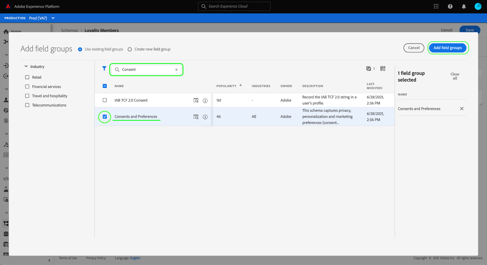
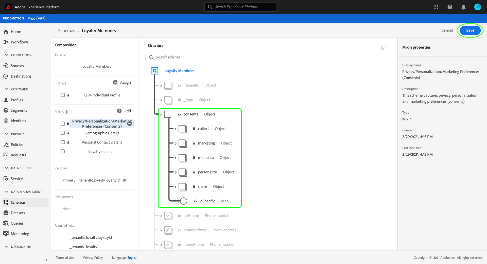
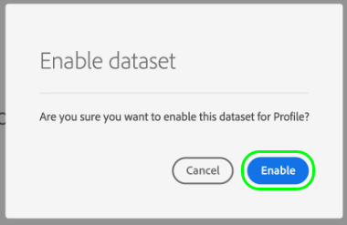
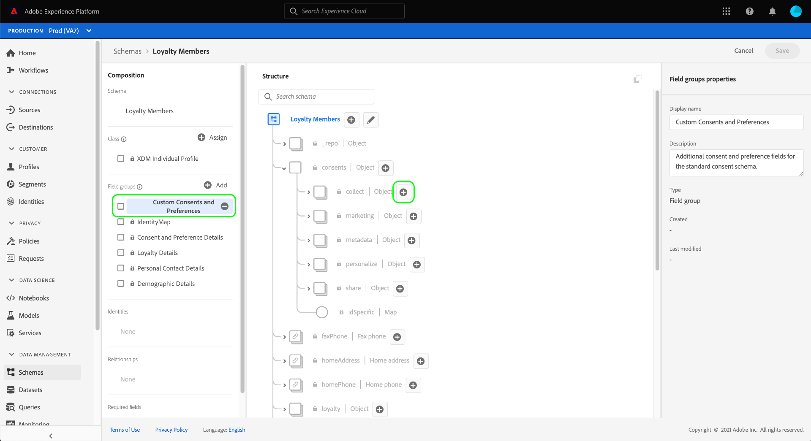

# 設定資料集以擷取同意和偏好設定資料

為了讓Adobe Experience Platform處理您的客戶同意/偏好設定資料，該資料必須傳送至資料集，其結構包含與同意和其他權限相關的欄位。 具體而言，此資料集必須以 [!DNL XDM Individual Profile] 類別，並啟用以用於 [!DNL Real-Time Customer Profile].

本檔案提供設定資料集以處理Experience Platform中同意資料的步驟。 如需在Platform中處理同意/偏好設定資料的完整工作流程的概觀，請參閱 [同意處理概述](./overview.md).

>[!IMPORTANT]
>
>本指南中的範例使用標準化的欄位集，來表示客戶同意值，如 [[!UICONTROL 同意和偏好設定詳細資訊] 方案欄位組](../../../../xdm/field-groups/profile/consents.md). 這些欄位的結構旨在提供有效的資料模型，以涵蓋許多常見的同意收集使用案例。
>
>不過，您也可以定義自己的欄位群組，以根據自己的資料模型來表示同意。 請洽詢您的法律團隊，根據下列選項，取得符合您業務需求的同意資料模型的核准：
>
>* 標準化同意欄位群組
>* 貴組織建立的自訂同意欄位群組
>* 標準化同意欄位群組和自訂同意欄位群組提供之其他欄位的組合


## 先決條件

本教學課程需要妥善了解下列Adobe Experience Platform元件：

* [Experience Data Model(XDM)](../../../../xdm/home.md):標準化框架 [!DNL Experience Platform] 組織客戶體驗資料。
   * [結構構成基本概念](../../../../xdm/schema/composition.md):了解XDM結構的基本建置組塊。
* [即時客戶個人檔案](../../../../profile/home.md):將不同來源的客戶資料整合為完整、統一的檢視，同時提供每個客戶互動的可操作、時間戳記帳戶。

>[!IMPORTANT]
>
>本教學課程假設您知道 [!DNL Profile] 平台中，您想要用來擷取客戶屬性資訊的結構描述。 無論您使用何種方法收集同意資料，此結構必須 [啟用即時客戶個人檔案](../../../../xdm/ui/resources/schemas.md#profile). 此外，結構的主要身分不能是禁止在以興趣為基礎的廣告（例如電子郵件地址）中使用的可直接識別欄位。 如果您不確定哪些欄位受限，請洽詢您的法律顧問。

## [!UICONTROL 同意和偏好設定詳細資訊] 欄位群結構 {#structure}

此 [!UICONTROL 同意和偏好設定詳細資訊] 欄位群組為結構提供標準化的同意欄位。 目前，此欄位群組僅與以 [!DNL XDM Individual Profile] 類別。

欄位組提供單個對象類型欄位， `consents`，其子屬性會擷取一組標準化同意欄位。 下列JSON是資料類型的範例 `consents` 資料擷取時預期：

```json
{
  "consents": {
    "collect": {
      "val": "y",
    },
    "share": {
      "val": "y",
    },
    "personalize": {
      "content": {
        "val": "y"
      }
    },
    "marketing": {
      "preferred": "email",
      "any": {
        "val": "y"
      },
      "push": {
        "val": "n",
        "reason": "Too Frequent",
        "time": "2019-01-01T15:52:25+00:00"
      }
    },
    "idSpecific": {
      "email": {
        "jdoe@example.com": {
          "marketing": {
            "email": {
              "val": "n"
            }
          }
        }
      }
    }
  },
  "metadata": {
    "time": "2019-01-01T15:52:25+00:00"
  }
}
```

>[!NOTE]
>
>如需子屬性的結構與意義的詳細資訊，請參閱 `consents`，請參閱 [[!UICONTROL 同意和偏好設定詳細資訊] 欄位群組](../../../../xdm/field-groups/profile/consents.md).

## 將必要欄位群組新增至 [!DNL Profile] 綱要 {#add-field-group}

若要使用Adobe標準收集同意資料，您必須有已啟用設定檔的結構，其中包含下列兩個欄位群組：

* [!UICONTROL 同意和偏好設定詳細資訊]
* [!UICONTROL IdentityMap] （使用Platform Web或Mobile SDK傳送同意訊號時為必要）

在平台UI中，選取 **[!UICONTROL 結構]** 在左側導覽器中，選取 **[!UICONTROL 瀏覽]** 標籤來顯示現有結構的清單。 從此處，選取 [!DNL Profile] — 啟用的架構，您要向其添加同意欄位。 此區段的螢幕擷取畫面使用 [方案建立教學課程](../../../../xdm/tutorials/create-schema-ui.md) 作為範例。


>[!TIP]
>
>您可以使用工作區的搜尋和篩選功能，協助您更輕鬆找到您的結構。 請參閱 [探索XDM資源](../../../../xdm/ui/explore.md) 以取得更多資訊。

此 [!DNL Schema Editor] ，顯示畫布中架構的結構。 在畫布的左側，選取 **[!UICONTROL 新增]** 在 **[!UICONTROL 欄位群組]** 區段。


此 **[!UICONTROL 新增欄位群組]** 對話框。 從此處，選擇 **[!UICONTROL 同意和偏好設定詳細資訊]** 從清單中。 您可以選擇使用搜尋列來縮小結果，以便更輕鬆地找出欄位群組。



接下來，找到 **[!UICONTROL IdentityMap]** 欄位群組，並加以選取。 將兩個欄位群組列於右側邊欄後，請選取 **[!UICONTROL 新增欄位群組]**.


畫布會重新顯示，表示 `consents` 和 `identityMap` 欄位已新增至架構結構。 如果您需要其他未由標準欄位群組擷取的同意和偏好設定欄位，請參閱附錄中的 [將自訂同意和偏好設定欄位新增至結構](#custom-consent). 否則，請選取 **[!UICONTROL 儲存]** 完成架構的變更。



>[!IMPORTANT]
>
>如果要建立新架構或編輯尚未為配置檔案啟用的現有架構，則必須 [啟用配置檔案的架構](../../../../xdm/ui/resources/schemas.md#profile) 儲存之前。

如果您編輯的架構由 [!UICONTROL 設定檔資料集] 在您的Platform Web SDK資料流中指定，該資料集現在會包含新的同意欄位。 您現在可以返回 [同意處理指南](./overview.md#merge-policies) 繼續設定Experience Platform以處理同意資料的程式。 如果您尚未為此結構建立資料集，請依照下一節中的步驟操作。

## 根據您的同意結構建立資料集 {#dataset}

建立含同意欄位的結構後，您必須建立資料集，最終內嵌客戶的同意資料。 必須為 [!DNL Real-Time Customer Profile].

若要開始，請選取 **[!UICONTROL 資料集]** 在左側導覽器中，然後選取 **[!UICONTROL 建立資料集]** 在右上角。


在下一頁，選取 **[!UICONTROL 從結構建立資料集]**.


此 **[!UICONTROL 從結構建立資料集]** 工作流程隨即顯示，從 **[!UICONTROL 選擇架構]** 步驟。 在提供的清單中，找出您先前建立的其中一個同意結構。 您可以選擇使用搜尋列來縮小結果範圍，並更輕鬆地找出您的結構。 選取所需結構旁的選項按鈕，然後選取 **[!UICONTROL 下一個]** 繼續。


此 **[!UICONTROL 設定資料集]** 步驟。 在選取資料集前，提供可輕鬆識別的唯一名稱和說明 **[!UICONTROL 完成]**.


隨即顯示新建立資料集的詳細資訊頁面。 如果資料集以您的時間序列結構為基礎，則程式會完成。 如果資料集以您的記錄結構為基礎，此程式的最後一步是啟用資料集以供 [!DNL Real-Time Customer Profile].

在右側邊欄中，選取 **[!UICONTROL 設定檔]** 切換。


最後，選取 **[!UICONTROL 啟用]** 在確認彈出視窗中，為 [!DNL Profile].



資料集現在已儲存並啟用，以供使用 [!DNL Profile]. 如果您打算使用Platform Web SDK將同意資料傳送至設定檔，則必須選取此資料集作為 [!UICONTROL 設定檔資料集] 設定 [資料流](../../../../edge/datastreams/overview.md).

## 後續步驟

依照本教學課程，您已將同意欄位新增至 [!DNL Profile] — 已啟用的結構，其資料集將用來使用Platform Web SDK或直接XDM擷取內嵌同意資料。

您現在可以返回 [同意處理概述](./overview.md#merge-policies) 繼續設定Experience Platform以處理同意資料。

## 附錄

以下章節包含建立資料集以擷取客戶同意和偏好設定資料的其他資訊。

### 將自訂同意和偏好設定欄位新增至結構 {#custom-consent}

如果您需要擷取標準所代表以外的其他同意訊號 [!UICONTROL 同意和偏好設定詳細資訊] 欄位群組中，您可以使用自訂XDM元件來增強您的同意結構，以符合您的特定業務需求。 本節概述如何自訂同意結構以將這些訊號內嵌至設定檔的基本原則。

>[!IMPORTANT]
>
>Platform Web和行動SDK不支援其同意變更命令中的自訂欄位。 目前，將自訂同意欄位擷取至「設定檔」的唯一方式是透過 [批次內嵌](../../../../ingestion/batch-ingestion/overview.md) 或 [源連接](../../../../sources/home.md).

強烈建議您使用 [!UICONTROL 同意和偏好設定詳細資訊] 欄位群組，作為同意資料結構的基線，並視需要新增其他欄位，而非嘗試從頭建立整個結構。

若要將自訂欄位新增至標準欄位群組的結構，您必須先建立自訂欄位群組。 新增 [!UICONTROL 同意和偏好設定詳細資訊] 欄位組，選擇 **加號(+)** 圖示 **[!UICONTROL 欄位群組]** ，然後選取 **[!UICONTROL 建立新欄位組]**. 提供欄位群組的名稱和可選說明，然後選取 **[!UICONTROL 新增欄位群組]**.


此 [!DNL Schema Editor] 在左側邊欄中選取新的自訂欄位群組時，重新顯示。 在畫布中，會顯示可讓您新增自訂欄位至架構結構的控制項。 若要新增同意或偏好設定欄位，請選取 **加號(+)** 表徵圖 `consents` 物件。



新欄位會顯示在 `consents` 物件。 由於您要將自訂欄位新增至標準XDM物件，因此新欄位會建立在與租用戶ID命名的物件下。


在右側邊欄下方 **[!UICONTROL 欄位屬性]**，提供欄位的名稱和說明。 選取欄位的 **[!UICONTROL 類型]**，您必須為自訂同意或偏好設定欄位使用適當的標準資料類型：

* [[!UICONTROL 一般同意欄位]](../../../../xdm/data-types/consent-field.md)
* [[!UICONTROL 一般行銷偏好設定欄位]](../../../../xdm/data-types/marketing-field.md)
* [[!UICONTROL 具有訂閱的一般行銷偏好設定欄位]](../../../../xdm/data-types/marketing-field-subscriptions.md)
* [[!UICONTROL 一般個人化偏好設定欄位]](../../../../xdm/data-types/personalization-field.md)

完成後，請選取 **[!UICONTROL 套用]**.


同意或偏好設定欄位會新增至架構結構。 請注意， [!UICONTROL 路徑] 顯示在右側邊欄中包含 `_tenantId` 命名空間。 每當您在資料操作中參考此欄位的路徑時，都必須包含此命名空間。


請依照上述步驟，繼續新增您需要的同意和偏好設定欄位。 完成後，請選取 **[!UICONTROL 儲存]** 確認變更。

如果您尚未為此結構建立資料集，請繼續前往 [建立資料集](#dataset).
