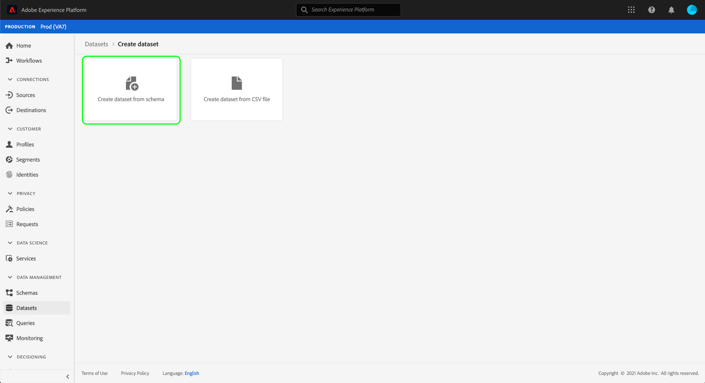

# 設定資料集以擷取同意和偏好設定資料

為了讓Adobe Experience Platform處理您的客戶同意／偏好資料，必須將該資料傳送至資料集，其架構包含與同意和其他權限相關的欄位。 具體而言，此資料集必須以[!DNL XDM Individual Profile]類別為基礎，並啟用在[!DNL Real-time Customer Profile]中。

本檔案提供設定資料集以處理Experience Platform中同意資料的步驟。 有關在平台中處理同意／偏好資料的完整工作流程的概述，請參閱[同意處理概述](./overview.md)。

>[!IMPORTANT]
>
>本指南中的範例使用一組標準化欄位來表示客戶同意值，如[同意與偏好XDM資料類型](../../../../xdm/data-types/consents.md)所定義。 這些欄位的結構旨在提供有效的資料模型，以涵蓋許多常見的同意收集使用案例。
>
>不過，您也可以根據您自己的資料模型定義自己的混合，以表示同意。 請洽詢您的法律團隊，以取得符合您業務需求的同意資料模型的核准，請依下列選項進行：
>
>* 標準化的許可混合
>* 由貴組織建立的自訂同意混合
>* 標準化許可組合和由定制許可組合提供的附加欄位的組合


## 先決條件

本教學課程需要對Adobe Experience Platform的下列部分有正確的理解：

* [體驗資料模型(XDM)](../../../../xdm/home.md):組織客戶體驗資 [!DNL Experience Platform] 料的標準化架構。
   * [架構構成基礎](../../../../xdm/schema/composition.md):瞭解XDM架構的基本建置區塊。
* [即時客戶個人檔案](../../../../profile/home.md):將不同來源的客戶資料整合為完整、統一的檢視，同時為每次客戶互動提供可操作的時間戳記帳戶。

>[!IMPORTANT]
>
>本教程假定您知道要用於捕獲客戶屬性資訊的平台中的[!DNL Profile]架構。 無論您使用何種方法收集同意資料，此結構必須啟用「即時客戶個人檔案」](../../../../xdm/ui/resources/schemas.md#profile)。 [此外，架構的主要身分識別不能是直接可識別的欄位，無法用於喜好式廣告，例如電子郵件地址。 如果您不確定哪些欄位受限制，請洽詢您的法律顧問。

## 同意與偏好混合結構{#structure}

[!UICONTROL Privacy/Personalization/Marketing Preferences (Consents)]混合（以下稱為「同意與偏好混合」）為架構提供標準化的同意欄位。 目前，此混音僅與基於[!DNL XDM Individual Profile]類的架構相容。

混合素提供單個對象類型欄位`consents`，其子屬性捕獲一組標準化許可欄位。 以下JSON是資料擷取時`consents`所需資料類型的範例：

```json
{
  "consents": {
    "collect": {
      "val": "y",
    },
    "share": {
      "val": "y",
    },
    "personalize": {
      "content": {
        "val": "y"
      }
    },
    "marketing": {
      "preferred": "email",
      "any": {
        "val": "y"
      },
      "push": {
        "val": "n",
        "reason": "Too Frequent",
        "time": "2019-01-01T15:52:25+00:00"
      }
    },
    "idSpecific": {
      "email": {
        "jdoe@example.com": {
          "marketing": {
            "email": {
              "val": "n"
            }
          }
        }
      }
    }
  },
  "metadata": {
    "time": "2019-01-01T15:52:25+00:00"
  }
}
```

>[!NOTE]
>
>有關`consents`中子屬性的結構和含義的詳細資訊，請參閱[同意與首選項資料類型](../../../../xdm/data-types/consents.md)的概述。

## 將「同意與首選項」混合添加到[!DNL Profile]方案{#add-mixin}

在平台UI中，在左側導覽中選擇&#x200B;**[!UICONTROL Schemas]**，然後選擇&#x200B;**[!UICONTROL Browse]**&#x200B;標籤以顯示現有結構的清單。 在此處，選擇要向其添加許可欄位的[!DNL Profile]啟用模式的名稱。 本節中的截屏使用[架構建立教程](../../../../xdm/tutorials/create-schema-ui.md)中構建的「Loyalty Members」架構作為示例。


>[!TIP]
>
>您可以使用工作區的搜尋和篩選功能，協助您更輕鬆地尋找結構。 如需詳細資訊，請參閱[探索XDM資源](../../../../xdm/ui/explore.md)指南。

出現[!DNL Schema Editor]，顯示畫布中的架構結構。 在畫布的左側，選取&#x200B;**[!UICONTROL Mixins]**&#x200B;區段下的&#x200B;**[!UICONTROL Add]**。


出現&#x200B;**[!UICONTROL Add mixin]**&#x200B;對話框。 從這裡，從清單中選擇&#x200B;**[!UICONTROL Privacy/Personalization/Marketing Preferences (Consents)]**。 您可選擇使用搜尋列縮小結果，以更輕鬆地找到混音。 選擇混音後，選擇&#x200B;**[!UICONTROL Add mixin]**。


畫布會重新出現，顯示`consents`物件已新增至架構結構。 如果您需要其他未由標準混合擷取的同意和偏好設定欄位，請參閱[中的附錄章節，將自訂同意和偏好設定欄位新增至架構](#custom-consent)。 否則，選擇&#x200B;**[!UICONTROL Save]**&#x200B;以完成對架構的更改。


如果您編輯的架構由您的平台網頁SDK邊緣設定中指定的[!UICONTROL Profile Dataset]使用，該資料集現在會包含新的同意欄位。 您現在可以返回[同意處理指南](./overview.md#merge-policies)，繼續設定Experience Platform以處理同意資料的程式。

如果您尚未為此模式建立資料集，請遵循下一節中的步驟。

## 根據您的同意方案{#dataset}建立資料集

在建立具有同意欄位的架構後，您必須建立資料集，以便最終收錄客戶的同意資料。 必須為[!DNL Real-time Customer Profile]啟用此資料集。

若要開始，請在左側導覽中選取&#x200B;**[!UICONTROL Datasets]**，然後在右上角選取&#x200B;**[!UICONTROL Create dataset]**。


在下一頁，選擇&#x200B;**[!UICONTROL Create dataset from schema]**。



將顯示&#x200B;**[!UICONTROL Create dataset from schema]**&#x200B;工作流，從&#x200B;**[!UICONTROL Select schema]**&#x200B;步驟開始。 在提供的清單中，找出您先前建立的其中一個同意方案。 您可以選擇使用搜尋列來縮小結果範圍，並更輕鬆地尋找結構。 選擇所需方案旁的單選按鈕，然後選擇&#x200B;**[!UICONTROL Next]**&#x200B;以繼續。


出現&#x200B;**[!UICONTROL Configure dataset]**&#x200B;步驟。 在選擇&#x200B;**[!UICONTROL Finish]**&#x200B;之前，請為資料集提供唯一、可輕鬆識別的名稱和說明。


此時會顯示新建立資料集的詳細資料頁面。 如果資料集是以您的時間序列模式為基礎，則程式已完成。 如果資料集是以您的記錄架構為基礎，則程式的最後步驟是啟用資料集以用於[!DNL Real-time Customer Profile]。

在右邊欄中，選取&#x200B;**[!UICONTROL Profile]**&#x200B;切換。


最後，在確認快顯視窗中選取&#x200B;**[!UICONTROL Enable]**，以啟用[!DNL Profile]的架構。


資料集現在已儲存並啟用，可用於[!DNL Profile]。 如果您打算使用平台網頁SDK將同意資料傳送至描述檔，則在設定[edge configuration](../../../../edge/fundamentals/edge-configuration.md)時，必須將此資料集選為[!UICONTROL Profile Dataset]。

## 後續步驟

在本教學課程中，您已將同意欄位新增至[!DNL Profile]啟用的架構，其資料集將用來使用平台網頁SDK或直接XDM擷取來擷取同意資料。

您現在可以返回[同意處理概述](./overview.md#merge-policies)，以繼續設定Experience Platform以處理同意資料。

## 附錄

下節包含建立資料集以收錄客戶同意和偏好資料的其他資訊。

### 將自訂同意和偏好設定欄位新增至架構{#custom-consent}

如果您需要擷取標準[!DNL Consents & Preferences] mixin以外的其他同意信號，您可以使用自訂XDM元件來增強您的同意方案，以符合您的特定業務需求。 本節概述如何以符合Adobe Experience Platform行動與網頁SDK所做同意變更指令的方式自訂同意架構的基本原則。

>[!IMPORTANT]
>
>您必須使用[!DNL Consents & Preferences] mixin做為同意資料結構的基準，並視需要新增其他欄位，而不是嘗試從頭開始建立整個結構。

若要將自訂欄位新增至標準混音的結構，您必須先建立自訂混音。 將[!DNL Consents & Preferences] mixin加入架構後，在&#x200B;**[!UICONTROL Mixins]**&#x200B;區段中選取&#x200B;**plus(+)**&#x200B;圖示，然後選取&#x200B;**[!UICONTROL Create new mixin]**。 提供混音的名稱和可選說明，然後選擇&#x200B;**[!UICONTROL Add mixin]**。


[!DNL Schema Editor]會重新顯示，並在左側導軌中選取新的自訂混音。 在畫布中，會出現可讓您新增自訂欄位至架構結構的控制項。 要添加新的許可或首選項欄位，請選擇`consents`對象旁邊的&#x200B;**加號(+)**&#x200B;表徵圖。


`consents`物件中會出現新欄位。 由於您要將自訂欄位新增至標準XDM物件，因此新欄位是在與您的租用戶ID同名的物件下建立。


在&#x200B;**[!UICONTROL Field properties]**&#x200B;下方的右邊欄中，提供欄位的名稱和說明。 在選擇欄位的&#x200B;**[!UICONTROL Type]**&#x200B;時，您必須為自定義許可或首選項欄位使用相應的標準資料類型：

* [[!UICONTROL Generic Consent Field]](../../../../xdm/data-types/consent-field.md)
* [[!UICONTROL Generic Marketing Preference Field]](../../../../xdm/data-types/marketing-field.md)
* [[!UICONTROL Generic Marketing Preference Field with Subscriptions]](../../../../xdm/data-types/marketing-field-subscriptions.md)
* [[!UICONTROL Generic Personalization Preference Field]](../../../../xdm/data-types/personalization-field.md)

完成後，選擇&#x200B;**[!UICONTROL Apply]**。


許可或偏好欄位被添加到模式結構中。 請注意，右側欄中顯示的[!UICONTROL Path]包含`_tenantId`命名空間。 每當您在資料作業中參考此欄位的路徑時，都必須包含此命名空間。


請依照上述步驟繼續新增您需要的同意和偏好設定欄位。 完成後，選擇&#x200B;**[!UICONTROL Save]**&#x200B;以確認更改。

如果您編輯的架構由您的平台網頁SDK邊緣設定中指定的[!UICONTROL Profile Dataset]使用，該資料集現在會包含新的同意欄位。 您現在可以返回[同意處理指南](./overview.md#merge-policies)，繼續設定Experience Platform以處理同意資料的程式。

如果尚未為此模式建立資料集，請繼續[上的建立資料集](#dataset)部分。
