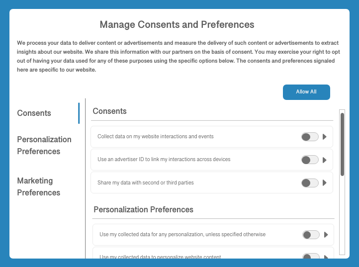

# Adobe Experience Platform中的同意處理

Adobe Experience Platform可讓您處理從客戶收集的同意資料，並將其整合至您儲存的客戶設定檔中。 然後下游流程可使用此資料來判斷資料收集是否針對特定客戶發生，或其設定檔是否用於特定目的。 例如，特定設定檔的同意資料可決定其是否可包含在匯出的對象區段中，或其是否可參與特定行銷管道，例如電子郵件、簡訊或推播通知。

本檔案概述如何設定您的Platform資料作業，以擷取同意管理平台(CMP)產生的客戶同意資料，並將這些資料整合至客戶設定檔中，以用於下游使用案例。

>[!NOTE]
>
>本檔案著重於使用Adobe標準處理同意資料。 如果您是依照IAB透明與同意架構(TCF) 2.0處理同意資料，請參閱以下指南： [Adobe Real-time Customer Data Platform中的TCF 2.0支援](../iab/overview.md).

## 先決條件

本指南需要您實際瞭解處理同意資料所涉及的各種Experience Platform服務：

* [體驗資料模型(XDM)](/help/xdm/home.md)：Experience Platform組織客戶體驗資料的標準化架構。
* [Adobe Experience Platform Identity服務](/help/identity-service/home.md)：透過跨裝置和系統橋接身分，解決客戶體驗資料分散所造成的根本挑戰。
* [即時客戶個人檔案](/help/profile/home.md)：使用 [!DNL Identity Service] 從資料集即時建立詳細客戶設定檔的功能。 即時客戶設定檔從資料湖提取資料，並將客戶設定檔儲存在其自己的獨立資料存放區中。
* [Adobe Experience Platform Web SDK](/help/web-sdk/home.md)：使用者端JavaScript程式庫，可讓您將各種Platform服務整合至您面向客戶的網站。
   * [SDK同意命令](/help/web-sdk/consent/supporting-consent.md)：本指南中顯示的同意相關SDK命令的使用案例概觀。
* [Adobe Experience Platform Segmentation Service](/help/segmentation/home.md)：可讓您將即時客戶個人檔案資料分割成共用類似特徵且對行銷策略有類似回應的一組個人。

## 同意處理流程摘要 {#summary}

以下說明在系統正確設定後如何處理同意資料：

1. 客戶透過您網站上的對話方塊提供其資料收集的同意偏好設定。
1. 在每次載入頁面時（或當您的CMP偵測到同意偏好設定變更時），您網站上的自訂指令碼會將目前的偏好設定對應到標準XDM物件。 然後此物件會傳遞至Platform Web SDK `setConsent` 命令。
1. 時間 `setConsent` 呼叫，Platform Web SDK會檢查同意值與上次收到的值是否不同。 如果值不同（或沒有先前的值），則會將結構化同意/偏好設定資料傳送至Adobe Experience Platform。
1. 同意/偏好設定資料會擷取至 [!DNL Profile] — 啟用的資料集，其結構描述包含同意/偏好設定欄位。

Experience Platform除了CMP同意變更掛接所觸發的SDK命令外，同意資料也可以透過任何客戶產生的XDM資料(直接上傳至 [!DNL Profile] — 啟用的資料集。

### 同意實作

在目前版本的Platform同意處理支援中，只有資料收集許可權(`collect.val`)由Platform Web SDK自動強制執行。 雖然可以收集更細微的同意和偏好設定並保留在客戶設定檔中，但必須在您自己的下游流程中手動強制這些額外訊號。

>[!NOTE]
>
>如需上述XDM同意欄位結構的詳細資訊，請參閱 [[!UICONTROL 同意和偏好設定] 資料型別](/help/xdm/data-types/consents.md).

設定系統後，Platform Web SDK會解譯目前使用者的資料收集同意值，以判斷資料應傳送至Adobe Experience Platform Edge Network、從使用者端捨棄或持續存在，直到資料收集許可權設為「是」或「否」為止。

## 決定如何在您的CMP中產生客戶同意資料 {#consent-data}

由於每個CMP系統都是獨一無二的，因此您必須決定讓客戶在與您的服務互動時提供同意的最佳方式。 常見方法是使用Cookie同意對話方塊來達成此目的，類似於以下範例：

此對話方塊應允許客戶針對其資料選擇加入或退出特定行銷和個人化使用案例。 這些同意和偏好設定應該符合您為定義的資料模型 [!DNL Profile] — 在下個步驟中啟用資料集。

## 將標準化的同意欄位新增至 [!DNL Profile] — 啟用的資料集 {#dataset}

客戶同意資料必須傳送至 [!DNL Profile] — 啟用的資料集，其結構描述包含同意欄位。 這些欄位必須包含在您用來擷取個別客戶屬性資訊的相同結構描述和資料集中。

請參閱上的教學課程 [設定資料集以擷取同意資料](./dataset.md) 有關如何將這些必填欄位新增到中的詳細步驟 [!DNL Profile] — 已啟用資料集，然後再繼續本指南。

## 更新 [!DNL Profile] 合併原則以包含同意資料 {#merge-policies}

一旦建立 [!DNL Profile] — 已啟用處理同意資料的資料集，您必須確保合併原則已設定為在每個客戶設定檔中一律包含同意欄位。 這涉及設定資料集優先順序，讓您的同意資料集能比其他潛在衝突的資料集優先處理。

>[!NOTE]
>
>如果您沒有任何衝突的資料集，您應該為合併原則設定時間戳記優先順序。 這有助於確保客戶指定的最新同意是使用的同意設定。

如需如何使用合併原則的詳細資訊，請從閱讀 [合併原則概觀](../../../../profile/merge-policies/overview.md). 在設定合併原則時，您必須確保您的設定檔包含提供的所有必要同意屬性， [!UICONTROL 同意和偏好設定] 綱要欄位群組，如 [資料集準備](./dataset.md).

## 將同意資料帶入Platform

當您有資料集和合併原則來代表客戶設定檔中的必要同意欄位後，下一步就是將同意資料本身帶入Platform。

首先，您應該在CMP偵測到同意變更事件時，使用Adobe Experience Platform Web SDK將同意資料傳送至Platform。 如果您在行動平台上收集同意資料，應使用Adobe Experience Platform Mobile SDK。 您也可以將收集的同意資料對應至同意資料集的XDM結構描述，並透過批次擷取將其傳送至Platform，以直接擷取資料。

以下各小節提供每種方法的詳細資訊。

### 設定Experience Platform Web SDK處理同意資料 {#web-sdk}

將CMP設定為監聽網站上的同意變更事件後，您就可以整合Experience PlatformWeb SDK以接收更新的同意設定，並在每次載入頁面時和發生同意變更事件時傳送給Platform。 請參閱以下指南： [設定Web SDK處理客戶同意資料](../sdk.md) 以取得詳細資訊。

### 設定Experience Platform Mobile SDK處理同意資料 {#mobile-sdk}

如果您的行動應用程式需要客戶同意偏好設定，您可以整合Experience PlatformMobile SDK以擷取及更新同意設定，並在呼叫同意API時將其傳送至Platform。

請參閱行動SDK檔案以瞭解 [設定同意行動擴充功能](https://developer.adobe.com/client-sdks/documentation/consent-for-edge-network/) 和 [使用同意API](https://developer.adobe.com/client-sdks/documentation/consent-for-edge-network/api-reference/). 如需如何使用Mobile SDK處理隱私權問題的詳細資訊，請參閱區段 [隱私權與GDPR](https://developer.adobe.com/client-sdks/resources/privacy-and-gdpr/).

### 直接擷取XDM相容的同意資料 {#batch}

您可以使用批次擷取，從CSV檔案擷取XDM相容的同意資料。 如果您有先前收集的同意資料待處理，且尚未整合至客戶設定檔中，此功能會很有用。

請依照以下說明進行教學課程： [將CSV檔案對應至XDM](../../../../ingestion/tutorials/map-csv/overview.md) 以瞭解如何將資料欄位轉換為XDM並將它們擷取到Platform。 選取 [!UICONTROL 目的地] 對於對應，請務必選取 **[!UICONTROL 使用現有的資料集]** 選項，然後選擇 [!DNL Profile] — 已啟用您先前建立的同意資料集。

## 測試您的實作 {#test-implementation}

將客戶同意資料內嵌至 [!DNL Profile] — 啟用的資料集，您可以檢查更新的設定檔，檢視其是否包含同意屬性。

>[!IMPORTANT]
>
>為了在UI中檢視現有設定檔的屬性，您必須知道與該設定檔相關聯的至少一個身分值（及其對應的名稱空間）。
>
>如果您無法存取此資訊，您可以選取擷取自己的測試同意資料，並將其與自己已知的身分值/名稱空間建立關聯。

請參閱以下小節： [依身分瀏覽設定檔](../../../../profile/ui/user-guide.md#browse) 在 [!DNL Profile] UI指南，瞭解有關如何查閱設定檔詳細資訊的特定步驟。

預設情況下，新的同意屬性不會顯示在設定檔的控制面板上。 因此，您必須導覽至 **[!UICONTROL 屬性]** 定位字元，以確認已如預期般擷取設定檔。 請參閱 [設定檔儀表板](../../../../profile/ui/profile-dashboard.md) 以瞭解如何根據您的需求自訂儀表板。

<!-- (To be included once CJM is GA)
## Handling consent in Customer Journey Management

If you are using Customer Journey Management, after confirming that your profiles and segments contain consent data, you can start honoring customer [marketing preferences](../../../../xdm/data-types/consents.md#marketing) when pulling segments from Platform. Specifically, profiles who have opted out of the email marketing preference should not be included in segments that are targeted for email campaigns.

Customer Journey Management can also send consent-change signals back to Platform. When a customer selects an "unsubscribe" link in an email message, the updated consent preference is sent to Platform and the appropriate profile attributes are updated accordingly.
-->

## 後續步驟

本指南說明如何設定您的Platform作業，以使用Adobe標準處理客戶同意資料，並在客戶設定檔中呈現這些屬性。 您現在可以將客戶同意偏好設定整合為區段資格及其他下游使用案例中的決定性因素。

如需Experience Platform隱私權相關功能的詳細資訊，請參閱以下內容的概觀： [Platform中的治理、隱私和安全性](../../overview.md).
