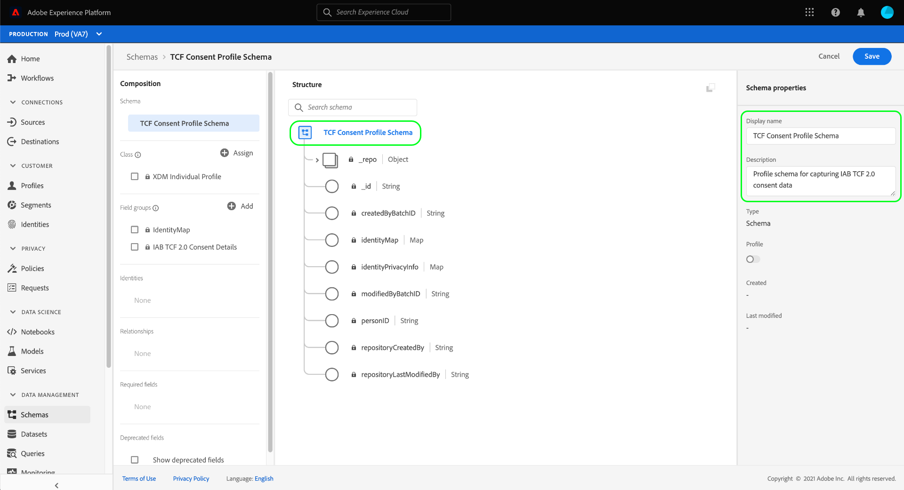

# 建立資料集以捕獲IAB TCF 2.0同意資料

為了Adobe Experience Platform根據IAB處理客戶同意資料 [!DNL Transparency & Consent Framework] (TCF)2.0，該資料必須發送到架構包含TCF 2.0同意欄位的資料集。

具體來說，捕獲TCF 2.0同意資料需要兩個資料集：

* 基於 [!DNL XDM Individual Profile] 類，啟用為 [!DNL Real-Time Customer Profile]。
* 基於 [!DNL XDM ExperienceEvent] 類。

>[!IMPORTANT]
>
>平台僅強制在單個配置檔案資料集中收集的TCF字串。 雖然仍然需要ExperienceEvent資料集來建立作為此工作流一部分的資料流，但您只需將資料插入配置檔案資料集。 如果您希望跟蹤一段時間內的同意更改事件，仍可以使用ExperienceEvent資料集，但在強制執行段激活時，不會使用這些值。

本文檔提供了設定這兩個資料集的步驟。 有關配置TCF 2.0平台資料操作的完整工作流的概述，請參閱 [IAB TCF 2.0合規性概述](./overview.md)。

## 先決條件

本教程需要對Adobe Experience Platform的以下部分進行有效的理解：

* [體驗資料模型(XDM)](../../../../xdm/home.md):標準化框架 [!DNL Experience Platform] 組織客戶體驗資料。
   * [架構組合的基礎](../../../../xdm/schema/composition.md):瞭解XDM架構的基本構建塊。
* [Adobe Experience Platform身份服務](../../../../identity-service/home.md):允許您跨設備和系統將客戶身份從不同資料源連接起來。
   * [標識命名空間](../../../../identity-service/namespaces.md):客戶標識資料必須在Identity Service識別的特定標識命名空間下提供。
* [即時客戶配置檔案](../../../../profile/home.md):利用 [!DNL Identity Service] 以便您即時從資料集中建立詳細的客戶配置檔案。 [!DNL Real-Time Customer Profile] 從Data Lake中提取資料，並將客戶配置檔案保留在其自己的單獨資料儲存中。

## TCF 2.0外地組 {#field-groups}

的 [!UICONTROL IAB TCF 2.0同意詳情] schema欄位組提供TCF 2.0支援所需的客戶同意欄位。 此欄位組有兩個版本：與 [!DNL XDM Individual Profile] 課，而另一課 [!DNL XDM ExperienceEvent] 類。

以下各節說明了每個欄位組的結構，包括它們在攝取期間預期的資料。

### 配置檔案欄位組 {#profile-field-group}

對於基於的架構 [!DNL XDM Individual Profile]，也請參見Wiki頁。 [!UICONTROL IAB TCF 2.0同意詳情] 欄位組提供單個映射類型欄位， `identityPrivacyInfo`將客戶身份與其TCF同意偏好相對應。 必須將此欄位組包含在為即時客戶配置檔案啟用的基於記錄的架構中，才能自動實施。

查看 [參考指南](../../../../xdm/field-groups/profile/iab.md) 以便此欄位組瞭解有關其結構和使用案例的詳細資訊。

### 事件欄位組 {#event-field-group}

如果要跟蹤隨時間推移的同意更改事件，可以添加 [!UICONTROL IAB TCF 2.0同意詳情] 欄位組 [!UICONTROL XDM體驗事件] 架構。

如果您不計畫跟蹤隨時間推移的同意更改事件，則不需要在事件架構中包含此欄位組。 當自動強制實施TCF同意值時，Experience Platform僅使用接收到的最新同意資訊 [配置檔案欄位組](#profile-field-group)。 由事件捕獲的同意值不參與自動強制工作流。

查看 [參考指南](../../../../xdm/field-groups/event/iab.md) 的子菜單。

## 建立客戶同意方案 {#create-schemas}

為了建立捕獲同意資料的資料集，必須首先建立XDM架構以基於這些資料集。

如上節所述，使用 [!UICONTROL XDM個人配置檔案] 在下游平台工作流中，需要類以強制執行同意。 您也可以根據 [!UICONTROL XDM體驗事件] 如果您希望跟蹤隨時間變化的同意更改。 兩個架構必須包含 `identityMap` 欄位和相應的TCF 2.0欄位組。

在平台UI中，選擇 **[!UICONTROL 架構]** 的下界 [!UICONTROL 架構] 工作區。 在此處，按照以下各節中的步驟建立每個所需的架構。

>[!NOTE]
>
>如果您現有的XDM架構希望用來捕獲同意資料，則可以編輯這些架構，而不是建立新的架構。 但是，如果已啟用現有架構以在即時客戶配置檔案中使用，則其主要標識不能是禁止在基於興趣的廣告中使用的直接可識別欄位，如電子郵件地址。 如果您不確定哪些欄位受到限制，請咨詢您的法律顧問。
>
>此外，編輯現有架構時，只能進行添加（非中斷）更改。 請參閱 [圖式演化原理](../../../../xdm/schema/composition.md#evolution) 的子菜單。

### 建立配置檔案同意架構 {#profile-schema}

選擇 **[!UICONTROL 建立架構]**，然後選擇 **[!UICONTROL XDM個人配置檔案]** 的下界。

的 **[!UICONTROL 添加欄位組]** 對話框，允許您立即開始向架構添加欄位組。 從此處，選擇 **[!UICONTROL IAB TCF 2.0同意詳情]** 清單中。 您可以選擇使用搜索欄縮小結果範圍，以便更輕鬆地查找欄位組。

接下來，查找 **[!UICONTROL 標識映射]** 欄位組，並選擇它。 在右滑軌中列出兩個欄位組後，選擇 **[!UICONTROL 添加欄位組]**。

畫布重新出現，顯示 `identityPrivacyInfo` 和 `identityMap` 欄位已添加到架構結構中。

在向架構添加更多欄位之前，請選擇根欄位以顯示 **[!UICONTROL 架構屬性]** 右欄中，您可以在其中為架構提供名稱和說明。

提供名稱和說明後，可以選擇通過選擇 **[!UICONTROL 添加]** 下 **[!UICONTROL 欄位組]** 的下界。

如果正在編輯已啟用以供使用的現有架構 [!DNL Real-Time Customer Profile]選中 **[!UICONTROL 保存]** 在跳到上的部分之前確認更改 [根據您的同意模式建立資料集](#dataset)。 如果要建立新架構，請繼續執行下文子節中概述的步驟。

#### 啟用方案以用於 [!DNL Real-Time Customer Profile]

為了使平台將其接收的同意資料與特定客戶配置檔案相關聯，必須啟用同意架構以用於 [!DNL Real-Time Customer Profile]。

>[!NOTE]
>
>本節中顯示的示例架構使用 `identityMap` 欄位作為其主標識。 如果希望將另一個欄位設定為主要標識，請確保您使用的是Cookie ID等間接標識符，而不是禁止在基於興趣的廣告中使用的直接標識欄位。 如果您不確定哪些欄位受到限制，請咨詢您的法律顧問。
>
>有關如何為架構設定主標識欄位的步驟，請參見 [[!UICONTROL 架構] UI指南](../../../../xdm/ui/fields/identity.md)。

啟用架構 [!DNL Profile]，在左欄中選擇架構的名稱以開啟 **[!UICONTROL 架構屬性]** 的子菜單。 從此處，選擇 **[!UICONTROL 配置檔案]** 切換按鈕。

出現跨距，表示缺少主標識。 選中用於使用備用主標識的複選框，因為主標識將包含在 `identityMap` 的子菜單。

最後，選擇 **[!UICONTROL 保存]** 確認更改。

### 建立事件同意架構 {#event-schema}

>[!NOTE]
>
>事件同意架構僅用於跟蹤隨時間推移的同意更改事件，且不參與下游實施工作流。 如果您不希望跟蹤隨時間推移的同意更改，可跳到上面的下一節 [建立同意資料集](#datasets)。

在 **[!UICONTROL 架構]** 工作區，選擇 **[!UICONTROL 建立架構]**，然後選擇 **[!UICONTROL XDM體驗事件]** 的下界。

的 **[!UICONTROL 添加欄位組]** 對話框。 從此處，選擇 **[!UICONTROL IAB TCF 2.0同意詳情]** 清單中。 您可以選擇使用搜索欄縮小結果範圍，以便更輕鬆地查找欄位組。

接下來，查找 **[!UICONTROL 標識映射]** 欄位組，並選擇它。 在右滑軌中列出兩個欄位組後，選擇 **[!UICONTROL 添加欄位組]**。

畫布重新出現，顯示 `consentStrings` 和 `identityMap` 欄位已添加到架構結構中。

在向架構添加更多欄位之前，請選擇根欄位以顯示 **[!UICONTROL 架構屬性]** 右欄中，您可以在其中為架構提供名稱和說明。

提供名稱和說明後，可以選擇通過選擇 **[!UICONTROL 添加]** 下 **[!UICONTROL 欄位組]** 的下界。

添加您需要的欄位組後，通過選擇 **[!UICONTROL 保存]**。

## 根據您的同意架構建立資料集 {#datasets}

對於上述每種必需方案，您必須建立一個資料集，該資料集最終將接收客戶的同意資料。 必須為啟用基於記錄架構的資料集 [!DNL Real-Time Customer Profile]，而基於時間序列模式的資料集 **不應** 是 [!DNL Profile] — 已啟用。

要開始，請選擇 **[!UICONTROL 資料集]** 在左側導航中，然後選擇 **[!UICONTROL 建立資料集]** 在右上角。

在下一頁，選擇 **[!UICONTROL 從架構建立資料集]**。

的 **[!UICONTROL 從架構建立資料集]** 工作流，從 **[!UICONTROL 選擇架構]** 的子菜單。 在提供的清單中，找到您以前建立的同意架構之一。 您可以選擇使用搜索欄縮小結果範圍，並更輕鬆地定位方案。 選擇所需方案旁邊的單選按鈕，然後選擇 **[!UICONTROL 下一個]** 繼續。

的 **[!UICONTROL 配置資料集]** 的上界。 在選擇之前，為資料集提供唯一且易於識別的名稱和說明 **[!UICONTROL 完成]**。

此時將顯示新建立的資料集的詳細資訊頁面。 如果資料集基於您的時間序列模式，則該過程將完成。 如果資料集基於您的記錄模式，則此過程中的最後一步是啟用資料集，以便在 [!DNL Real-Time Customer Profile]。

在右滑軌中，選擇 **[!UICONTROL 配置檔案]** 切換，然後選擇 **[!UICONTROL 啟用]** 在確認跨距中，為 [!DNL Profile]。

如果為基於事件的資料集建立了模式，請再次執行上述步驟。

## 後續步驟

按照本教程，您至少建立了一個資料集，現在可以用來收集客戶同意資料：

* 支援在即時客戶配置檔案中使用的基於記錄的資料集。 **(必填)**
* 未啟用的基於時間序列的資料集 [!DNL Profile]。 (選填)

您現在可以返回 [IAB TCF 2.0概述](./overview.md#merge-policies) 繼續配置平台以符合TCF 2.0。
