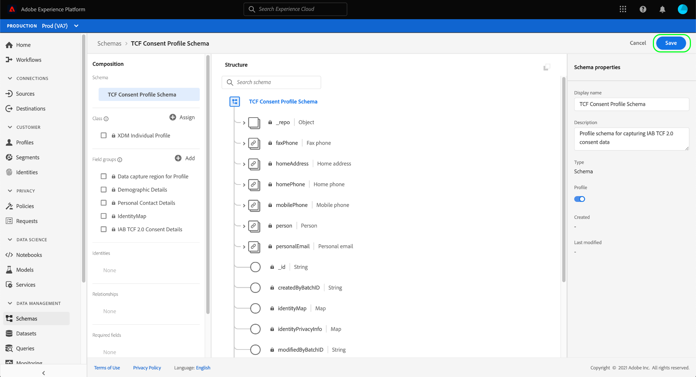
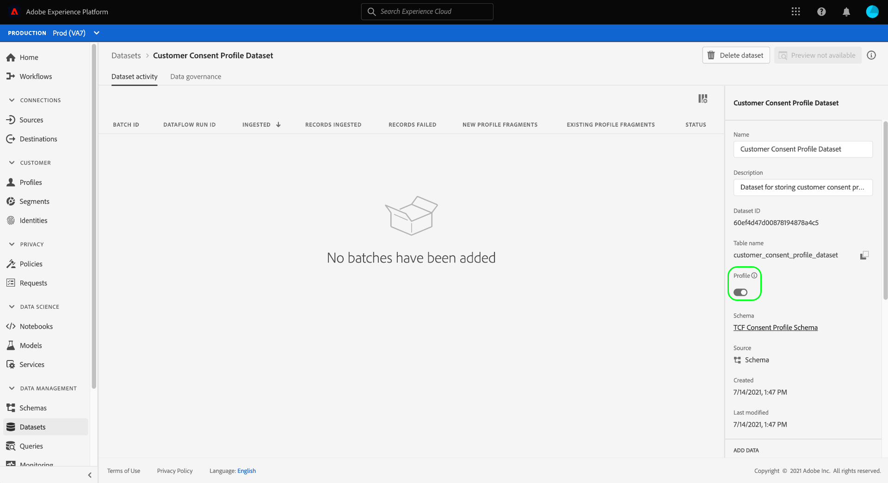

# 建立資料集以擷取IAB TCF 2.0同意資料

為了Adobe Experience Platform能根據IAB處理客戶同意資料 [!DNL Transparency & Consent Framework] (TCF) 2.0中，該資料必須傳送至其結構描述包含TCF 2.0同意欄位的資料集。

具體而言，擷取TCF 2.0同意資料需要兩個資料集：

* 資料集，根據 [!DNL XDM Individual Profile] 類別，啟用以便用於 [!DNL Real-Time Customer Profile].
* 資料集，根據 [!DNL XDM ExperienceEvent] 類別。

>[!IMPORTANT]
>
>Platform只會強制執行「個別設定檔」資料集中收集的TCF字串。 雖然在此工作流程中建立資料流仍需要ExperienceEvent資料集，但您只需要將資料內嵌到設定檔資料集中。 如果您想要追蹤一段時間的同意變更事件，仍可使用ExperienceEvent資料集，但針對區段啟用強制執行時，不會使用這些值。

本檔案提供設定這兩個資料集的步驟。 如需為TCF 2.0設定Platform資料作業的完整工作流程概觀，請參閱 [IAB TCF 2.0法規遵循概述](./overview.md).

## 先決條件

本教學課程需要您實際瞭解下列Adobe Experience Platform元件：

* [體驗資料模型(XDM)](../../../../xdm/home.md)：作為依據的標準化架構 [!DNL Experience Platform] 組織客戶體驗資料。
   * [結構描述組合基本概念](../../../../xdm/schema/composition.md)：瞭解XDM結構描述的基本建置組塊。
* [Adobe Experience Platform Identity Service](../../../../identity-service/home.md)：可讓您跨裝置和系統，從不同的資料來源橋接客戶身分。
   * [身分名稱空間](../../../../identity-service/namespaces.md)：客戶身分資料必須在由Identity Service識別的特定身分名稱空間下提供。
* [即時客戶個人檔案](../../../../profile/home.md)：利用 [!DNL Identity Service] 可讓您即時從資料集建立詳細的客戶設定檔。 [!DNL Real-Time Customer Profile] 從Data Lake提取資料，並將客戶設定檔儲存在其自己的獨立資料存放區中。

## tcf 2.0欄位群組 {#field-groups}

此 [!UICONTROL IAB TCF 2.0同意詳細資料] 結構描述欄位群組提供TCF 2.0支援所需的客戶同意欄位。 此欄位群組有兩個版本：一個與 [!DNL XDM Individual Profile] 類別，而另一個具有 [!DNL XDM ExperienceEvent] 類別。

以下各節說明每個欄位群組的結構，包括擷取期間他們期望的資料。

### 設定檔欄位群組 {#profile-field-group}

針對根據的結構描述 [!DNL XDM Individual Profile]，則 [!UICONTROL IAB TCF 2.0同意詳細資料] 欄位群組提供單一對應型別欄位， `identityPrivacyInfo`，將客戶身分對應至其TCF同意偏好設定。 為了進行自動強制執行，此欄位群組必須包含在為即時客戶設定檔啟用的記錄型結構描述中。

請參閱 [參考指南](../../../../xdm/field-groups/profile/iab.md) 以進一步瞭解此欄位群組的結構和使用案例。

### 事件欄位群組 {#event-field-group}

如果您想要追蹤一段時間內的同意變更事件，可以新增 [!UICONTROL IAB TCF 2.0同意詳細資料] 您的欄位群組 [!UICONTROL XDM ExperienceEvent] 結構描述。

如果您不打算追蹤一段時間的同意變更事件，您就不需要在事件結構描述中包含此欄位群組。 自動強制執行TCF同意值時，Experience Platform只會使用擷取到 [設定檔欄位群組](#profile-field-group). 事件所擷取的同意值不會參與自動執行工作流程。

請參閱 [參考指南](../../../../xdm/field-groups/event/iab.md) 以取得有關其結構和使用案例的詳細資訊。

## 建立客戶同意結構描述 {#create-schemas}

為了建立擷取同意資料的資料集，您必須先建立XDM結構描述，以作為這些資料集的基礎。

如上一節所述，使用 [!UICONTROL XDM個別設定檔] 類別是在下游Platform工作流程中強制執行同意所必需。 您也可以選擇根據以下專案建立個別的結構描述： [!UICONTROL XDM ExperienceEvent] 如果您想要追蹤一段期間內的同意變更。 兩個結構描述都必須包含 `identityMap` 欄位和適當的TCF 2.0欄位群組。

在Platform UI中選取 **[!UICONTROL 結構描述]** 在左側導覽以開啟 [!UICONTROL 結構描述] 工作區。 從這裡，依照以下各節中的步驟來建立每個必要的結構描述。

>[!NOTE]
>
>如果您有想要用來擷取同意資料的現有XDM結構描述，您可以編輯這些結構描述，而不是建立新結構描述。 不過，如果已啟用現有結構描述以用於即時客戶個人檔案，其主要身分不能是禁止用於利息型廣告（例如電子郵件地址）中的直接可識別欄位。 如果您不確定哪些欄位受到限制，請洽詢法律顧問。
>
>此外，在編輯現有方案時，只能進行加總（非中斷）變更。 請參閱以下小節： [結構描述演化原則](../../../../xdm/schema/composition.md#evolution) 以取得詳細資訊。

### 建立設定檔同意綱要 {#profile-schema}

選取 **[!UICONTROL 建立結構描述]**，然後選擇 **[!UICONTROL XDM個別設定檔]** 下拉式選單中的。

此 **[!UICONTROL 新增欄位群組]** 對話方塊隨即顯示，可讓您立即開始將欄位群組新增到結構描述。 從此處選取 **[!UICONTROL IAB TCF 2.0同意詳細資料]** 從清單中。 您可以選擇使用搜尋列來縮小結果範圍，以便更輕鬆地找到欄位群組。

接下來，尋找 **[!UICONTROL 身分對應]** 欄位群組，並加以選取。 將兩個欄位群組都列在右側邊欄中後，選取 **[!UICONTROL 新增欄位群組]**.

畫布會重新出現，並顯示 `identityPrivacyInfo` 和 `identityMap` 欄位已新增至結構描述結構。

將更多欄位新增到結構描述之前，請選取要顯示的根欄位 **[!UICONTROL 結構描述屬性]** 在右側邊欄中，您可以在此提供結構的名稱和說明。

提供名稱和說明後，您可以選擇新增更多欄位到結構描述，方法是選取 **[!UICONTROL 新增]** 在 **[!UICONTROL 欄位群組]** 區段。

如果您編輯的現有結構描述已啟用以便用於 [!DNL Real-Time Customer Profile]，選取 **[!UICONTROL 儲存]** 以確認變更，再跳至以下章節： [根據您的同意結構描述建立資料集](#dataset). 如果您要建立新架構，請繼續遵循以下子章節中概述的步驟。

#### 啟用結構描述以用於 [!DNL Real-Time Customer Profile]

為了讓Platform將其收到的同意資料與特定客戶設定檔建立關聯，必須啟用同意結構描述以便用於 [!DNL Real-Time Customer Profile].

>[!NOTE]
>
>本節中顯示的範例結構描述會使用其 `identityMap` 欄位作為其主要身分。 如果您想要將另一個欄位設定為主要身分，請確定您使用的是間接識別碼（例如Cookie ID），而不是禁止在利息型廣告（例如電子郵件地址）中使用的直接可識別欄位。 如果您不確定哪些欄位受到限制，請洽詢法律顧問。
>
>有關如何為結構描述設定主要身分欄位的步驟，請參閱 [[!UICONTROL 結構描述] UI指南](../../../../xdm/ui/fields/identity.md).

啟用以下專案的結構描述： [!DNL Profile]，在左側邊欄中選取結構描述名稱以開啟 **[!UICONTROL 結構描述屬性]** 區段。 從這裡，選取 **[!UICONTROL 設定檔]** 切換按鈕。

此時會出現彈出視窗，指出缺少主要身分。 選取使用替代主要身分的核取方塊，因為主要身分將包含在 `identityMap` 欄位。

最後，選取 **[!UICONTROL 儲存]** 以確認您的變更。

### 建立事件同意綱要 {#event-schema}

>[!NOTE]
>
>事件同意結構描述僅用於追蹤一段時間的同意變更事件，不會參與下游執行工作流程。 如果您不想要追蹤一段時間內的同意變更，可以跳至下一節： [建立同意資料集](#datasets).

在 **[!UICONTROL 結構描述]** 工作區，選取 **[!UICONTROL 建立結構描述]**，然後選擇 **[!UICONTROL XDM ExperienceEvent]** 下拉式清單中的。

此 **[!UICONTROL 新增欄位群組]** 對話方塊隨即顯示。 從此處選取 **[!UICONTROL IAB TCF 2.0同意詳細資料]** 從清單中。 您可以選擇使用搜尋列來縮小結果範圍，以便更輕鬆地找到欄位群組。

接下來，尋找 **[!UICONTROL 身分對應]** 欄位群組，並加以選取。 將兩個欄位群組都列在右側邊欄中後，選取 **[!UICONTROL 新增欄位群組]**.

畫布會重新出現，並顯示 `consentStrings` 和 `identityMap` 欄位已新增至結構描述結構。

將更多欄位新增到結構描述之前，請選取要顯示的根欄位 **[!UICONTROL 結構描述屬性]** 在右側邊欄中，您可以在此提供結構的名稱和說明。

提供名稱和說明後，您可以選擇新增更多欄位到結構描述，方法是選取 **[!UICONTROL 新增]** 在 **[!UICONTROL 欄位群組]** 區段。

新增您需要的欄位群組後，請選取「 」 **[!UICONTROL 儲存]**.

## 根據您的同意結構描述建立資料集 {#datasets}

對於上述的每個必要結構，您必須建立最終將擷取客戶同意資料的資料集。 必須啟用記錄結構描述為基礎的資料集 [!DNL Real-Time Customer Profile]，而資料集是以時間序列結構描述為基礎 **不應該** 是 [!DNL Profile]-enabled.

若要開始，請選取 **[!UICONTROL 資料集]** 在左側導覽中，然後選取 **[!UICONTROL 建立資料集]** 右上角。

在下一頁，選取 **[!UICONTROL 從結構描述建立資料集]**.

此 **[!UICONTROL 從結構描述建立資料集]** 工作流程隨即出現，從 **[!UICONTROL 選取結構描述]** 步驟。 在提供的清單中，找到您先前建立的其中一個同意結構描述。 您可以選擇使用搜尋列來縮小結果範圍，並更容易找到您的結構描述。 選取所需綱要旁的單選按鈕，然後選取 **[!UICONTROL 下一個]** 以繼續。

此 **[!UICONTROL 設定資料集]** 步驟隨即顯示。 在選取之前，為資料集提供唯一、易於識別的名稱和說明 **[!UICONTROL 完成]**.

新建立資料集的詳細資訊頁面隨即顯示。 如果資料集是以您的時間序列結構描述為基礎，則程式已完成。 如果資料集是以您的記錄結構描述為基礎，則此程式的最後一步是啟用資料集以用於中 [!DNL Real-Time Customer Profile].

在右邊欄中，選取 **[!UICONTROL 設定檔]** 切換，然後選取 **[!UICONTROL 啟用]** 在確認彈出視窗中啟用結構描述 [!DNL Profile].

如果您已建立結構描述，請再次按照上述步驟建立事件型資料集。

## 後續步驟

依照本教學課程，您已建立至少一個資料集，現在可用來收集客戶同意資料：

* 啟用以用於即時客戶個人檔案的記錄型資料集。 **(必填)**
* 未啟用的時間序列資料集 [!DNL Profile]. (選填)

您現在可以返回 [IAB TCF 2.0概觀](./overview.md#merge-policies) 繼續設定Platform以符合TCF 2.0規範的程式。
