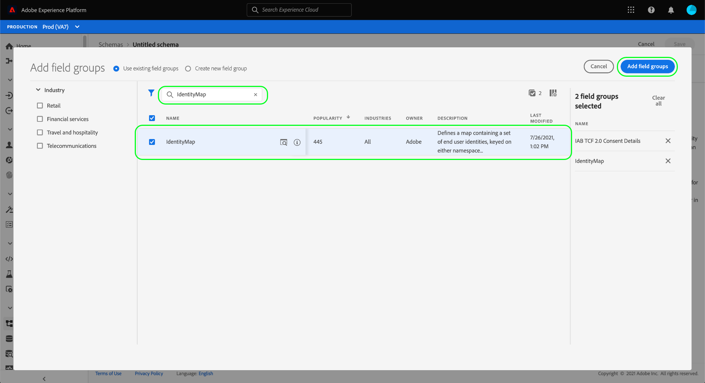

# 建立資料集以擷取IAB TCF 2.0同意資料

為了讓Adobe Experience Platform能夠根據IAB [!DNL Transparency & Consent Framework] (TCF) 2.0處理客戶同意資料，該資料必須傳送至結構描述包含TCF 2.0同意欄位的資料集。

具體而言，擷取TCF 2.0同意資料需要兩個資料集：

* 以[!DNL XDM Individual Profile]類別為基礎的資料集，已啟用以用於[!DNL Real-Time Customer Profile]。
* 以[!DNL XDM ExperienceEvent]類別為基礎的資料集。

>[!IMPORTANT]
>
>Platform只會強制執行「個別設定檔」資料集中收集的TCF字串。 雖然在此工作流程中，仍需使用ExperienceEvent資料集建立資料串流，但您只需要將資料擷取至設定檔資料集。 如果您想要追蹤一段時間內的同意變更事件，您仍可使用ExperienceEvent資料集，但針對區段啟用強制實施時，不會使用這些值。

本檔案提供設定這兩個資料集的步驟。 如需設定TCF 2.0之Platform資料作業的完整工作流程總覽，請參閱[IAB TCF 2.0法規遵循總覽](./overview.md)。

## 先決條件

本教學課程需要您實際瞭解下列Adobe Experience Platform元件：

* [體驗資料模型(XDM)](../../../../xdm/home.md)： [!DNL Experience Platform]用來組織客戶體驗資料的標準化架構。
   * [結構描述組合的基本概念](../../../../xdm/schema/composition.md)：瞭解XDM結構描述的基本建置區塊。
* [Adobe Experience Platform Identity服務](../../../../identity-service/home.md)：可讓您跨裝置和系統，從不同的資料來源橋接客戶身分。
   * [身分識別名稱空間](../../../../identity-service/features/namespaces.md)：客戶身分資料必須由身分服務辨識的特定身分識別名稱空間提供。
* [即時客戶個人檔案](../../../../profile/home.md)：運用[!DNL Identity Service]從資料集即時建立詳細的客戶個人檔案。 [!DNL Real-Time Customer Profile]從資料湖提取資料，並將客戶設定檔儲存在其自己的獨立資料存放區中。

## tcf 2.0欄位群組 {#field-groups}

[!UICONTROL IAB TCF 2.0同意詳細資料]結構描述欄位群組提供TCF 2.0支援所需的客戶同意欄位。 此欄位群組有兩個版本：一個相容於[!DNL XDM Individual Profile]類別，另一個相容於[!DNL XDM ExperienceEvent]類別。

以下各節將說明每個欄位群組的結構，包括擷取期間預期的資料。

### 設定檔欄位群組 {#profile-field-group}

針對以[!DNL XDM Individual Profile]為基礎的結構描述，[!UICONTROL IAB TCF 2.0同意詳細資料]欄位群組提供單一對應型別欄位`identityPrivacyInfo`，此欄位會將客戶身分對應到其TCF同意偏好設定。 此欄位群組必須包含在為即時客戶設定檔啟用的記錄型結構描述中，才能進行自動強制。

請參閱此欄位群組的[參考指南](../../../../xdm/field-groups/profile/iab.md)，以進一步瞭解其結構和使用案例。

### 事件欄位群組 {#event-field-group}

如果您想要追蹤一段期間內的同意變更事件，可以將[!UICONTROL IAB TCF 2.0 Consent Details]欄位群組新增至您的[!UICONTROL XDM ExperienceEvent]結構描述。

如果您不打算隨著時間追蹤同意變更事件，您就不需要在事件結構描述中包含此欄位群組。 當自動強制執行TCF同意值時，Experience Platform只會使用擷取到[設定檔欄位群組](#profile-field-group)的最新同意資訊。 事件擷取的同意值不會參與自動執行工作流程。

請參閱此欄位群組的[參考指南](../../../../xdm/field-groups/event/iab.md)，以取得有關其結構和使用案例的詳細資訊。

## 建立客戶同意綱要 {#create-schemas}

為了建立擷取同意資料的資料集，您必須先建立XDM結構描述以作為這些資料集的基礎。

如上一節所述，若要在下游平台工作流程中強制同意，需要使用[!UICONTROL XDM個別設定檔]類別的結構描述。 如果您想要追蹤一段時間的同意變更，也可以選擇根據[!UICONTROL XDM ExperienceEvent]建立個別結構描述。 兩個結構描述都必須包含`identityMap`欄位和適當的TCF 2.0欄位群組。

在Platform UI中，選取左側導覽中的&#x200B;**[!UICONTROL 結構描述]**&#x200B;以開啟[!UICONTROL 結構描述]工作區。 從這裡，依照以下各節中的步驟建立每個所需的結構描述。

>[!NOTE]
>
>如果您有想要用來擷取同意資料的現有XDM結構描述，您可以編輯這些結構描述，而非建立新結構描述。 不過，如果現有結構描述已啟用用於即時客戶個人檔案，則其主要身分不能是禁止用於利息型廣告（例如電子郵件地址）的直接可識別欄位。 如果您不確定哪些欄位受到限制，請諮詢法律顧問。
>
>此外，在編輯現有方案時，只能進行附加（非中斷）變更。 如需詳細資訊，請參閱結構描述演化[原則](../../../../xdm/schema/composition.md#evolution)的相關章節。

### 建立設定檔同意綱要 {#profile-schema}

選取「**[!UICONTROL 建立結構描述]**」，然後從下拉式選單中選擇「**[!UICONTROL XDM個別設定檔]**」。

**[!UICONTROL 新增欄位群組]**&#x200B;對話方塊會出現，可讓您立即開始將欄位群組新增到結構描述。 從這裡，從清單中選取&#x200B;**[!UICONTROL IAB TCF 2.0同意詳細資料]**。 您可以選擇使用搜尋列來縮小結果，以便更輕鬆地找到欄位群組。

接著，從清單中尋找&#x200B;**[!UICONTROL IdentityMap]**&#x200B;欄位群組並加以選取。 兩個欄位群組都列在右邊欄後，請選取&#x200B;**[!UICONTROL 新增欄位群組]**。

畫布會重新出現，顯示`identityPrivacyInfo`和`identityMap`欄位已新增至結構描述結構。

在將更多欄位新增到結構描述之前，請選取根欄位以顯示右側邊欄中的&#x200B;**[!UICONTROL 結構描述屬性]**，您可以在其中提供結構描述的名稱和說明。

提供名稱和說明後，您可以選擇性地在畫布左側的&#x200B;**[!UICONTROL 欄位群組]**&#x200B;區段下選取&#x200B;**[!UICONTROL 新增]**，以新增更多欄位到結構描述。

如果您正在編輯已啟用在[!DNL Real-Time Customer Profile]中使用的現有結構描述，請選取「**[!UICONTROL 儲存]**」以確認您的變更，然後跳到[上根據您的同意結構描述建立資料集](#dataset)的區段。 如果您要建立新結構描述，請繼續依照以下子章節中概述的步驟進行。

#### 啟用結構描述以用於[!DNL Real-Time Customer Profile]

為了讓Platform將其收到的同意資料與特定客戶設定檔建立關聯，必須啟用同意結構描述以在[!DNL Real-Time Customer Profile]中使用。

>[!NOTE]
>
>此區段中顯示的範例結構描述使用其`identityMap`欄位作為其主要身分。 如果您想要將另一個欄位設定為主要身分，請確定您使用的是間接識別碼（例如Cookie ID），而不是禁止在利息型廣告中使用的直接可識別欄位（例如電子郵件地址）。 如果您不確定哪些欄位受到限制，請諮詢法律顧問。
>
>在[[!UICONTROL 結構描述] UI指南](../../../../xdm/ui/fields/identity.md)中找到如何設定結構描述的主要身分欄位的步驟。

若要啟用[!DNL Profile]的結構描述，請在左側邊欄中選取結構描述名稱，以開啟&#x200B;**[!UICONTROL 結構描述屬性]**&#x200B;區段。 從這裡，選取&#x200B;**[!UICONTROL 設定檔]**&#x200B;切換按鈕。

此時會出現彈出視窗，表示缺少主要身分。 選取使用替代主要身分的核取方塊，因為主要身分將會包含在`identityMap`欄位中。

最後，選取&#x200B;**[!UICONTROL 儲存]**&#x200B;以確認您的變更。

### 建立事件同意綱要 {#event-schema}

>[!NOTE]
>
>事件同意結構描述僅用於追蹤一段時間內的同意變更事件，不會參與下游執行工作流程。 如果您不想要追蹤一段期間內的同意變更，可以跳至[建立同意資料集](#datasets)的下一節。

在&#x200B;**[!UICONTROL 結構描述]**&#x200B;工作區中，選取&#x200B;**[!UICONTROL 建立結構描述]**，然後從下拉式清單中選擇&#x200B;**[!UICONTROL XDM ExperienceEvent]**。

**[!UICONTROL 新增欄位群組]**&#x200B;對話方塊就會顯示。 從這裡，從清單中選取&#x200B;**[!UICONTROL IAB TCF 2.0同意詳細資料]**。 您可以選擇使用搜尋列來縮小結果，以便更輕鬆地找到欄位群組。

接著，從清單中尋找&#x200B;**[!UICONTROL IdentityMap]**&#x200B;欄位群組並加以選取。 兩個欄位群組都列在右邊欄後，請選取&#x200B;**[!UICONTROL 新增欄位群組]**。

畫布會重新出現，顯示`consentStrings`和`identityMap`欄位已新增至結構描述結構。

在將更多欄位新增到結構描述之前，請選取根欄位以顯示右側邊欄中的&#x200B;**[!UICONTROL 結構描述屬性]**，您可以在其中提供結構描述的名稱和說明。

提供名稱和說明後，您可以選擇性地在畫布左側的&#x200B;**[!UICONTROL 欄位群組]**&#x200B;區段下選取&#x200B;**[!UICONTROL 新增]**，以新增更多欄位到結構描述。

新增您需要的欄位群組後，選取&#x200B;**[!UICONTROL 儲存]**&#x200B;即可完成。

## 根據您的同意結構描述建立資料集 {#datasets}

對於上述的每個必要結構，您必須建立資料集，以便最終擷取客戶的同意資料。 必須為[!DNL Real-Time Customer Profile]啟用以記錄結構描述為基礎的資料集，而以時間序列結構描述&#x200B;**為基礎的資料集不應**&#x200B;啟用[!DNL Profile]。

若要開始，請在左側導覽中選取&#x200B;**[!UICONTROL 資料集]**，然後在右上角選取&#x200B;**[!UICONTROL 建立資料集]**。

在下一頁，選取&#x200B;**[!UICONTROL 從結構描述建立資料集]**。

**[!UICONTROL 從結構描述]**&#x200B;建立資料集工作流程隨即出現，從&#x200B;**[!UICONTROL 選取結構描述]**&#x200B;步驟開始。 在提供的清單中，找出您先前建立的其中一個同意結構描述。 您可以選擇使用搜尋列來縮小結果範圍，並更輕鬆地找到您的結構描述。 選取所需結構描述旁邊的圓鈕，然後選取[下一步] **[!UICONTROL 以繼續。]**

**[!UICONTROL 設定資料集]**&#x200B;步驟隨即顯示。 在選取&#x200B;**[!UICONTROL 完成]**&#x200B;之前，為資料集提供唯一、易於識別的名稱和描述。

新建立資料集的詳細資訊頁面隨即顯示。 如果資料集是以您的時間序列結構描述為基礎，則程式已完成。 如果資料集是以您的記錄結構描述為基礎，程式中的最後一個步驟是啟用資料集以在[!DNL Real-Time Customer Profile]中使用。

在右邊欄中，選取&#x200B;**[!UICONTROL 設定檔]**&#x200B;切換，然後在確認彈出視窗中選取&#x200B;**[!UICONTROL 啟用]**&#x200B;以啟用[!DNL Profile]的結構描述。

如果您已建立結構描述，請再次按照上述步驟建立事件型資料集。

## 後續步驟

依照本教學課程，您已建立至少一個資料集，現在可用來收集客戶同意資料：

* 已啟用用於即時客戶個人檔案的記錄型資料集。 **（必要）**
* 未針對[!DNL Profile]啟用的時間序列資料集。 (選填)

您現在可以返回[IAB TCF 2.0總覽](./overview.md#merge-policies)，繼續設定Platform以符合TCF 2.0規範。
