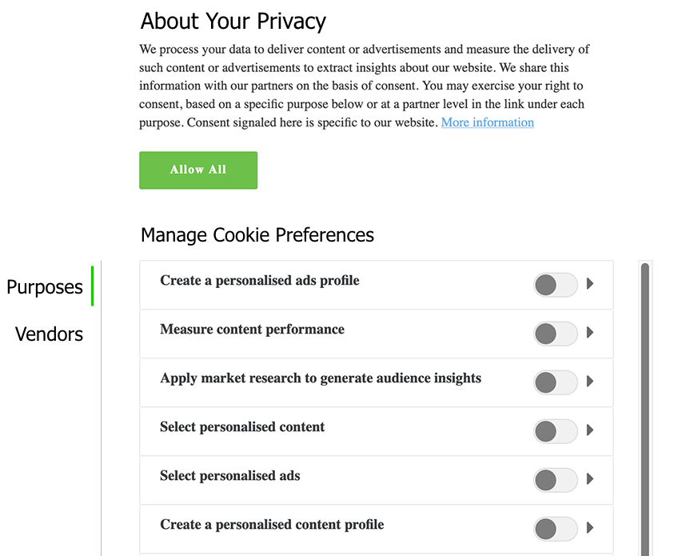

# IAB TCF 2.0支援Experience Platform

的 [!DNL Transparency & Consent Framework] (TCF)，如 [!DNL Interactive Advertising Bureau] (IAB)，是一個開放標準的技術框架，旨在使各組織能夠按照歐盟的規定獲得、記錄和更新消費者對處理其個人資料的同意 [!DNL General Data Protection Regulation] (GDPR)。 該框架的第二次迭代TCF 2.0為消費者如何提供或拒絕同意提供了更大的靈活性，包括供應商是否和如何使用資料處理的某些特徵，如精確地理位置。

>[!NOTE]
>
>有關TCF 2.0的更多資訊，請參見 [IAB歐洲網站](https://iabeurope.eu/tcf-2-0/)包括支援材料和技術規格。

Adobe Experience Platform是 [IAB TCF 2.0供應商清單](https://iabeurope.eu/vendor-list-tcf-v2-0/)，在ID下 **565**。 根據TCF 2.0要求，平台允許您收集客戶同意資料並將其整合到您儲存的客戶配置檔案中。 然後，可以根據配置檔案的使用情況，將此同意資料納入導出的受眾段中。

>[!IMPORTANT]
>
>平台只能遵守TCF（或更高版本）的2.0。 不支援以前版本的TCF。

本文檔概述了如何配置資料操作和配置檔案架構以接受由CMP生成的客戶同意資料，以及平台在導出段時如何傳達用戶同意選擇。

## 先決條件

為了與本指南一起跟進，您必須使用與IAB TCF整合併符合的「同意管理平台」(CMP)，無論是商業版還是您自己的版本。 查看 [符合CMP的清單](https://iabeurope.eu/cmp-list/) 的子菜單。

>[!IMPORTANT]
>
>如果CMP的ID無效，平台將繼續按原樣處理資料。 為了強制實施TCF 2.0，您必須先確認您的CMP具有已在IAB TCF 2.0中註冊的有效ID，然後才能將資料發送到平台。

本指南還要求對以下平台服務進行工作理解：

* [體驗資料模型(XDM)](../../../../xdm/home.md):Experience Platform組織客戶體驗資料的標準化框架。
* [Adobe Experience Platform身份服務](../../../../identity-service/home.md):通過跨設備和系統橋接身份，解決客戶體驗資料碎片化帶來的根本難題。
* [即時客戶配置檔案](../../../../profile/home.md):利用 [!DNL Identity Service] 從您的資料集中即時建立詳細的客戶配置檔案。 [!DNL Real-Time Customer Profile] 從Data Lake中提取資料，並將客戶配置檔案保留在其自己的單獨資料儲存中。
* [Adobe Experience PlatformWeb SDK](../../../../edge/home.md):客戶端JavaScript庫，允許您將各種平台服務整合到面向客戶的網站中。
   * [SDK同意命令](../../../../edge/consent/supporting-consent.md):本指南中所示的與同意相關的SDK命令的用例概述。
* [Adobe Experience Platform分段服務](../../../../segmentation/home.md):允許您 [!DNL Real-Time Customer Profile] 資料被分成具有相似特徵的群體，並會對營銷策略做出類似的反應。

除了上面列出的平台服務外，您還應熟悉 [目的地](../../../../data-governance/home.md) 以及它們在平台生態系統中的作用。

## 客戶同意流程摘要 {#summary}

以下各節介紹在系統正確配置後如何收集和強制執行同意資料。

### 同意資料收集

平台允許您通過以下過程收集客戶同意資料：

1. 客戶通過您網站上的對話框為資料收集提供其同意首選項。
1. 您的CMP檢測同意偏好更改，並相應地生成TCF同意資料。
1. 使用平台Web SDK，生成的同意資料（由CMP返回）被發送到Adobe Experience Platform。
1. 收集的同意資料被攝入到 [!DNL Profile]-enabled資料集，其架構包含TCF同意欄位。

除了由CMP同意更改掛接觸發的SDK命令外，同意資料還可以通過任何由客戶生成的XDM資料流入Experience Platform，這些資料直接上傳到 [!DNL Profile]-enabled dataset。

Adobe Audience Manager與平台共用的任何網段(通過 [!DNL Audience Manager] 源連接器或其他)也可能包含同意資料，但前提是通過以下方式對這些段應用了適當的欄位 [!DNL Experience Cloud Identity Service]。 有關在中收集同意資料的詳細資訊 [!DNL Audience Manager]，請參閱 [Adobe Audience ManagerIAB TCF插件](https://experienceleague.adobe.com/docs/audience-manager/user-guide/overview/data-privacy/consent-management/aam-iab-plugin.html?lang=zh-Hant)。

### 下游同意強制執行

成功接收TCF同意資料後，在下游平台服務中將進行以下過程：

1. [!DNL Real-Time Customer Profile] 更新該客戶配置檔案的儲存同意資料。
1. 僅當為群集中的每個ID提供了平台(565)的供應商權限時，平台才處理客戶ID。
1. 將段導出到屬於TCF 2.0供應商清單成員的目標時，平台僅包括兩個平台的供應商權限(565)時的配置檔案 *和* 為群集中的每個ID提供單個目標。

本文檔的其餘部分提供有關如何配置平台和資料操作以滿足上述收集和強制要求的指導。

## 確定如何在CMP中生成客戶同意資料 {#consent-data}

由於每個CMP系統都是唯一的，因此您必須確定允許客戶在與您的服務交互時提供同意的最佳方式。 實現此目的的常見方法是使用cookie同意對話框，類似於以下示例：



此對話框必須允許客戶選擇加入或退出以下內容：

| 同意選項 | 說明 |
| --- | --- |
| **目的** | 目的定義品牌可以使用客戶資料用於哪些廣告技術目的。 為了平台處理客戶ID，必須選擇以下目的： <ul><li>**用途1**:在設備上儲存和/或訪問資訊</li><li>**用途10**:開發和改進產品</li></ul> |
| **供應商權限** | 除了廣告技術目的外，該對話還必須允許客戶選擇使用或不使用其資料，包括Adobe Experience Platform(565)。 |

### 同意字串 {#consent-strings}

無論您使用何種方法收集資料，目標都是根據客戶選擇的同意選項（稱為同意字串）生成字串值。

在TCF規範中，同意字串用於根據由策略和供應商定義的特定營銷目的對有關客戶同意設定的相關細節進行編碼。 平台利用這些字串來儲存每個客戶的同意設定，因此每次這些設定更改時必須生成新的同意字串。

只能由註冊到IAB TCF的CMP建立同意字串。 有關如何使用特定CMP生成同意字串的詳細資訊，請參閱 [同意字串格式設定指南](https://github.com/InteractiveAdvertisingBureau/GDPR-Transparency-and-Consent-Framework/blob/master/TCFv2/IAB%20Tech%20Lab%20-%20Consent%20string%20and%20vendor%20list%20formats%20v2.md) IAB TCF GitHub回購協定。

## 建立具有TCF同意欄位的資料集 {#datasets}

必須將客戶同意資料發送到其架構包含TCF同意欄位的資料集。 請參閱上的教程 [建立資料集以捕獲TCF 2.0同意](./dataset.md) 有關如何在繼續使用本指南之前建立所需的配置檔案資料集（以及可選的「體驗事件」資料集）。

## 更新 [!DNL Profile] 合併策略包括同意資料 {#merge-policies}

建立 [!DNL Profile]-enabled資料集，用於收集同意資料，您必須確保將合併策略配置為始終在客戶配置檔案中包含TCF同意欄位。 這涉及設定資料集優先順序，以便您的同意資料集優先順序高於其他可能衝突的資料集。

有關如何使用合併策略的詳細資訊，請參閱 [合併策略概述](../../../../profile/merge-policies/overview.md)。 在設定合併策略時，必須確保段包含由 [XDM隱私架構欄位組](./dataset.md#privacy-field-group)，如資料集準備指南中所述。

## 整合Experience PlatformWeb SDK以收集客戶同意資料 {#sdk}

>[!NOTE]
>
>需要使用Experience PlatformWeb SDK，才能直接在Adobe Experience Platform處理同意資料。 [!DNL Experience Cloud Identity Service] 當前不支援。
>
>[!DNL Experience Cloud Identity Service] 但是，在Adobe Audience Manager，仍支援進行同意處理，而遵守TCF 2.0僅要求將庫更新為 [版本5.0](https://github.com/Adobe-Marketing-Cloud/id-service/releases)。

將CMP配置為生成同意字串後，必須整合Experience PlatformWeb SDK以收集這些字串並將它們發送到平台。 平台SDK提供了兩個命令，可用於將TCF同意資料發送到平台（如下子節所述），當客戶首次提供同意資訊時，以及此後同意更改的任何時候，應使用這些命令。

**SDK不與任何出廠設定的CMP進行介面**。 如何將SDK整合到您的網站、傾聽CMP中的同意更改並調用相應的命令，由您決定。

### 建立新資料流

為了SDK將資料發送到Experience Platform，必須首先為平台建立新資料流。 有關如何建立新資料流的具體步驟，請參見 [SDK文檔](../../../../edge/datastreams/overview.md)。

為資料流提供唯一名稱后，選擇旁邊的切換按鈕 **[!UICONTROL Adobe Experience Platform]**。 接下來，使用以下值完成表單的其餘部分：

| 資料流欄位 | 值 |
| --- | --- |
| [!UICONTROL 沙箱] | 平台的名稱 [沙坑](../../../../sandboxes/home.md) 包含設定資料流所需的流連接和資料集。 |
| [!UICONTROL 流式入口] | 用於Experience Platform的有效流連接。 請參閱上的教程 [建立流連接](../../../../ingestion/tutorials/create-streaming-connection-ui.md) 如果沒有現有的流入口。 |
| [!UICONTROL 事件資料集] | 選擇 [!DNL XDM ExperienceEvent] 在 [上一步](#datasets)。 如果包括 [[!UICONTROL IAB TCF 2.0同意] 欄位組](../../../../xdm/field-groups/event/iab.md) 在此資料集的架構中，您可以使用 [`sendEvent`](#sendEvent) 命令，將資料儲存到此資料集中。 請記住，此資料集中儲存的同意值是 **不** 用於自動實施工作流。 |
| [!UICONTROL 配置檔案資料集] | 選擇 [!DNL XDM Individual Profile] 在 [上一步](#datasets)。 在響應CMP同意更改掛接時，使用 [`setConsent`](#setConsent) 命令，收集的資料將儲存在此資料集中。 由於此資料集啟用了Profile，因此在自動實施工作流期間，將遵守儲存在此資料集中的同意值。 |


完成後，選擇 **[!UICONTROL 保存]** 在螢幕底部，繼續執行任何附加提示以完成配置。

### 生成同意更改命令

建立上一節中描述的資料流後，您可以開始使用SDK命令向平台發送同意資料。 以下各節提供了如何在不同情形中使用每個SDK命令的示例。

>[!NOTE]
>
>有關所有Platform SDK命令的常用語法的介紹，請參見上的文檔 [執行命令](../../../../edge/fundamentals/executing-commands.md)。

#### 使用CMP更改同意掛鈎 {#setConsent}

許多CMP提供「開箱即用」掛接，用於聽取同意變更事件。 當發生這些事件時，您可以使用 `setConsent` 命令更新客戶的同意資料。

的 `setConsent` 命令需要兩個參數：(1)指示命令類型的字串（在本例中為「setConnest」），以及(2)包含 `consent` array ，它必須包含至少一個提供所需同意欄位的對象，如下所示：

```js
alloy("setConsent", {
  consent: [{
    standard: "IAB TCF",
    version: "2.0",
    value: "CLcVDxRMWfGmWAVAHCENAXCkAKDAADnAABRgA5mdfCKZuYJez-NQm0TBMYA4oCAAGQYIAAAAAAEAIAEgAA.argAC0gAAAAAAAAAAAA",
    gdprApplies: "true"
  }]
});
```

| 負載屬性 | 說明 |
| --- | --- |
| `standard` | 正在使用的同意標準。 此值必須設定為 `IAB` TCF 2.0同意處理。 |
| `version` | 下面所示的同意標準的版本號 `standard`。 此值必須設定為 `2.0` TCF 2.0同意處理。 |
| `value` | 由CMP生成的基64編碼的同意字串。 |
| `gdprApplies` | 一個布爾值，它指示GDPR是否適用於當前登錄的客戶。 要為此客戶強制執行TCF 2.0，必須將值設定為 `true`。 預設為 `true` 的子菜單。 |

的 `setConsent` 命令應用作檢測同意設定更改的CMP掛接的一部分。 以下JavaScript提供了一個示例 `setConsent` 命令可用於OneTrust `OnConsentChanged` 掛接：

```js
OneTrust.OnConsentChanged(function () {
  // Retrieve the TCF 2.0 consent data generated by the CMP, and pass it to Alloy. 
  __tcfapi("getTCData", 2, function (data, success) {
    if (success) {
      var tcString = data.tcString;
      var gdpr = data.gdprApplies;

      alloy("setConsent", {
        consent: [{
          standard: "IAB TCF",
          version: "2.0",
          value: tcString,
          gdprApplies: gdpr
        }]
      });
    }
  });
});
```

#### 使用事件 {#sendEvent}

您還可以使用 `sendEvent` 的子菜單。

>[!NOTE]
>
>要使用此方法，必須已將「體驗事件隱私」欄位組添加到 [!DNL Profile]已啟用 [!DNL XDM ExperienceEvent] 架構。 請參閱 [更新ExperienceEvent架構](./dataset.md#event-schema) 有關如何配置此項的步驟，請參閱資料集準備指南。

的 `sendEvent` 在網站上的相應事件偵聽器中，命令應用作回調。 該命令需要兩個參數：(1)指示命令類型的字串(在本例中， `sendEvent`)和(2)包含 `xdm` 將必需的同意欄位作為JSON提供的對象：

```js
alloy("sendEvent", {
  xdm: {
    "consentStrings": [{
      "consentStandard": "IAB TCF",
      "consentStandardVersion": "2.0",
      "consentStringValue": "CLcVDxRMWfGmWAVAHCENAXCkAKDAADnAABRgA5mdfCKZuYJez-NQm0TBMYA4oCAAGQYIAAAAAAEAIAEgAA.argAC0gAAAAAAAAAAAA",
      "gdprApplies": true
    }]
  }
});
```

| 負載屬性 | 說明 |
| --- | --- |
| `xdm.consentStrings` | 必須包含至少一個提供所需同意欄位的對象的陣列。 |
| `consentStandard` | 正在使用的同意標準。 此值必須設定為 `IAB` TCF 2.0同意處理。 |
| `consentStandardVersion` | 下面所示的同意標準的版本號 `standard`。 此值必須設定為 `2.0` TCF 2.0同意處理。 |
| `consentStringValue` | 由CMP生成的基64編碼的同意字串。 |
| `gdprApplies` | 一個布爾值，它指示GDPR是否適用於當前登錄的客戶。 要為此客戶強制執行TCF 2.0，必須將值設定為 `true`。 預設為 `true` 的子菜單。 |

### 處理SDK響應

全部 [!DNL Platform SDK] 命令返回指示調用是成功還是失敗的承諾。 然後，您可以將這些響應用於其它邏輯，如向客戶顯示確認消息。 請參閱 [處理成功或失敗](../../../../edge/fundamentals/executing-commands.md#handling-success-or-failure) 的子例。

## 導出段 {#export}

>[!NOTE]
>
>在開始導出段之前，必須確保段包含所有必需的同意欄位。 請參閱 [配置合併策略](#merge-policies) 的子菜單。

一旦您收集了客戶同意資料並建立了包含所需同意屬性的受眾段，您就可以在將這些段導出到下游目標時強制實施TCF 2.0合規性。

前提是同意設定 `gdprApplies` 設定為 `true` 對於一組客戶配置檔案，根據每個配置檔案的TCF同意首選項過濾從這些配置檔案導出到下游目標的任何資料。 在導出過程中，將跳過任何不符合所需同意首選項的配置檔案。

客戶必須同意以下目的(如 [TCF 2.0政策](https://iabeurope.eu/iab-europe-transparency-consent-framework-policies/#Appendix_A_Purposes_and_Features_Definitions))以便將其配置檔案包含在導出到目標的段中：

* **用途1**:在設備上儲存和/或訪問資訊
* **用途10**:開發和改進產品

TCF 2.0還要求資料源必須先檢查目標的供應商權限，然後才能將資料發送到該目標。 因此，平台會檢查是否在包括綁定到該目標的資料之前，選擇將目標的供應商權限用於群集中的所有ID。

>[!NOTE]
>
>與Adobe Audience Manager共用的任何部分都將包含與平台對應方相同的TCF 2.0同意值。 自 [!DNL Audience Manager] 與平台(565)共用相同的供應商ID，需要相同的目的和供應商權限。 請參閱 [Adobe Audience ManagerIAB TCF插件](https://experienceleague.adobe.com/docs/audience-manager/user-guide/overview/data-privacy/consent-management/aam-iab-plugin.html?lang=zh-Hant) 的子菜單。

## Test您的實施 {#test-implementation}

一旦配置了TCF 2.0實施並將資料段導出到目標，則不會導出任何不符合同意要求的資料。 但是，為了查看在導出過程中是否篩選了正確的客戶配置檔案，您必須手動檢查目標上的資料儲存，以查看是否正確執行了同意。

請注意，如果多個ID組成一個群集，並且TCF 2.0應用，則即使單個ID不包含正確的目的和供應商權限，也會排除整個群集。

## 後續步驟

本文檔介紹了配置平台資料操作以滿足TCF 2.0中概述的業務義務的過程。請參閱 [治理、隱私和安全](../../overview.md) 瞭解更多資訊平台的隱私相關功能。
