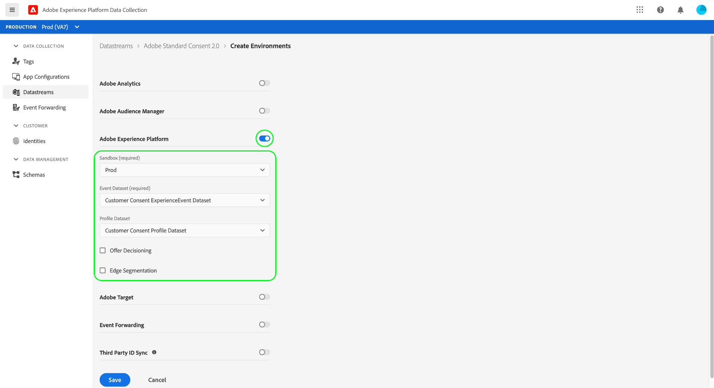

# 整合Platform Web SDK以處理客戶同意資料

Adobe Experience Platform Web SDK可讓您擷取同意管理平台(CMP)產生的客戶同意訊號，並在同意變更事件發生時傳送給Adobe Experience Platform。

**SDK未與任何現成的CMP介面**。 您可以自行決定如何將SDK整合至您的網站、接聽CMP中的同意變更，以及呼叫適當的命令。 本檔案提供如何將CMP與Platform Web SDK整合的一般指引。

## 先決條件 {#prerequisites}

本教學課程假設您已決定如何在CMP中產生同意資料，並建立資料集，其中包含符合Adobe標準或IAB透明與同意架構(TCF) 2.0標準的同意欄位。 如果您尚未建立此資料集，請先參閱下列教學課程，再返回閱讀本指南：

* [使用Adobe標準建立資料集](./adobe/dataset.md)
* [使用TCF 2.0標準建立資料集](./iab/dataset.md)

本指南會遵循在UI中使用標籤擴充功能設定SDK的工作流程。 如果您不想使用擴充功能，且想要直接在網站上內嵌獨立SDK版本，請參閱下列檔案，而非本指南：

* [設定資料流](/help/datastreams/overview.md)
* [安裝SDK](/help/web-sdk/install/overview.md)
* [設定SDK的同意命令](/help/web-sdk/commands/configure/defaultconsent.md)

本指南中的安裝步驟需要您實際瞭解標籤擴充功能及其在Web應用程式中的安裝方式。 如需詳細資訊，請參閱下列檔案：

* [標籤總覽](/help/tags/home.md)
* [快速入門手冊](/help/tags/quick-start/quick-start.md)
* [發佈概觀](/help/tags/ui/publishing/overview.md)

## 設定資料串流

為了讓SDK傳送資料給Experience Platform，您必須先設定資料流。 在資料收集UI或Experience Platform UI中，選取左側導覽中的&#x200B;**[!UICONTROL 資料串流]**。

建立新資料流或選取要編輯的現有資料流後，請選取&#x200B;**[!UICONTROL Adobe Experience Platform]**&#x200B;旁的切換按鈕。 接下來，使用下列值完成表單。



| 資料流欄位 | 值 |
| --- | --- |
| [!UICONTROL 沙箱] | 平台[沙箱](../../../sandboxes/home.md)的名稱，其中包含設定資料串流所需的串流連線和資料集。 |
| [!UICONTROL 事件資料集] | 您打算使用SDK將事件資料傳送至的[!DNL XDM ExperienceEvent]資料集。 雖然您需要提供事件資料集才能建立Platform資料流，但請注意，下游執行工作流程不會遵循透過事件傳送的同意資料。 |
| [!UICONTROL 輪廓資料集] | 已啟用[!DNL Profile]且含有您建立[earter](#prerequisites)之客戶同意欄位的資料集。 |

完成時，選取畫面底部的&#x200B;**[!UICONTROL 儲存]**，然後繼續依照其他提示完成設定。

## 安裝及設定平台Web SDK

依照上節所述建立資料流後，您必須設定Platform Web SDK擴充功能，才能最終在網站上部署。 如果您的標籤屬性上未安裝SDK擴充功能，請在左側導覽中選取&#x200B;**[!UICONTROL 擴充功能]**，然後選取&#x200B;**[!UICONTROL 目錄]**&#x200B;索引標籤。 然後，在可用擴充功能清單中，選取Platform SDK擴充功能底下的&#x200B;**[!UICONTROL 安裝]**。


設定SDK時，在「**[!UICONTROL Edge設定]**」下，選取您在上一步中建立的資料流。


選取&#x200B;**[!UICONTROL 儲存]**&#x200B;以安裝擴充功能。

### 建立資料元素以設定預設同意

安裝SDK擴充功能後，您就可以選擇建立資料元素，代表使用者的預設資料收集同意值(`collect.val`)。 如果您想要根據使用者有不同的預設值，例如`pending`適用於歐盟使用者，而`in`適用於北美使用者，則此功能相當實用。

在此使用案例中，您可以實作下列專案，以根據使用者地區設定預設同意：

1. 判斷使用者在網頁伺服器上的區域。
1. 在網頁上的`script`標籤（內嵌程式碼）之前，轉譯根據使用者地區設定`adobeDefaultConsent`變數的個別`script`標籤。
1. 設定使用`adobeDefaultConsent` JavaScript變數的資料元素，並使用此資料元素作為使用者的預設同意值。

如果使用者的區域由CMP決定，您可以改用以下步驟：

1. 處理頁面上的「CMP已載入」事件。
1. 在事件處理常式中，根據使用者的地區設定`adobeDefaultConsent`變數，然後使用JavaScript載入標籤程式庫指令碼。
1. 設定使用`adobeDefaultConsent` JavaScript變數的資料元素，並使用此資料元素作為使用者的預設同意值。

若要在UI中建立資料元素，請在左側導覽中選取&#x200B;**[!UICONTROL 資料元素]**，然後選取&#x200B;**[!UICONTROL 新增資料元素]**&#x200B;以導覽至資料元素建立對話方塊。

您必須從此處，根據`adobeDefaultConsent`建立[!UICONTROL JavaScript變數]資料元素。 完成時選取&#x200B;**[!UICONTROL 儲存]**。


建立資料元素後，導覽回Web SDK擴充功能設定頁面。 在[!UICONTROL 隱私權]區段下，選取&#x200B;**[!UICONTROL 資料元素提供的]**，並使用提供的對話方塊來選取您先前建立的預設同意資料元素。


### 在您的網站上部署擴充功能

完成擴充功能設定後，即可將其整合至您的網站。 請參閱標籤檔案中的[發佈指南](../../../tags/ui/publishing/overview.md)，以取得有關如何部署已更新程式庫組建的詳細資訊。

## 發出同意變更命令 {#commands}

將SDK擴充功能整合至您的網站後，您就可以開始使用Platform Web SDK `setConsent`命令將同意資料傳送至Platform。

`setConsent`命令會執行兩個動作：

1. 直接在設定檔存放區中更新使用者的設定檔屬性。 這不會將任何資料傳送至Data Lake。
1. 建立記錄同意變更事件之時間戳記帳戶的[體驗事件](../../../xdm/classes/experienceevent.md)。 此資料會直接傳送至Data Lake，並可用來追蹤同意偏好設定在一段時間內的變更。

### 何時呼叫`setConsent`

在兩種情況下，應該在您的網站上呼叫`setConsent`：

1. 同意載入頁面時（換言之，每次載入頁面時）
1. 做為CMP連結或事件監聽器的一部分，可偵測同意設定中的變更

### `setConsent`語法

[`setConsent`](/help/web-sdk/commands/setconsent.md)命令需要包含單一陣列型別屬性的裝載物件： `consent`。 `consent`陣列必須至少包含一個物件，提供Adobe標準所需的同意欄位。

下列範例`setConsent`呼叫中顯示Adobe標準的必要同意欄位：

```js
alloy("setConsent", {
  consent: [{
    standard: "Adobe",
    version: "2.0",
    value: {
      collect: {
        val: "y"
      },
      share: {
        val: "y"
      },
      personalize: {
        content: {
          val: "y"
        }
      },
      metadata: {
        time: "YYYY-10-12T15:52:25+00:00"
      }
    }
  }]
});
```

| 裝載屬性 | 說明 |
| --- | --- |
| `standard` | 使用的同意標準。 對於Adobe標準，此值必須設定為`Adobe`。 |
| `version` | 在`standard`下表示的同意標準的版本號碼。 此值必須設定為`2.0`，以進行Adobe標準的同意處理。 |
| `value` | 客戶更新的同意資訊，此資訊會提供為XDM物件，且符合已啟用設定檔資料集同意欄位的結構。 |

>[!NOTE]
>
>如果您使用其他同意標準搭配`Adobe` （例如`IAB TCF`），您可以為每個標準新增其他物件至`consent`陣列。 每個物件都必須針對它們所代表的同意標準，包含適當的`standard`、`version`和`value`值。

以下JavaScript提供處理網站上同意偏好設定變更的函式範例，可在事件監聽器或CMP勾點中作為回呼：

```js
var setConsent = function () {

  // Retrieve the current consent data.
  var categories = getConsentData();

  // If the script is running on a consent change, generate a new timestamp.
  // If the script is running on page load, set the timestamp to when the consent values last changed.
  var now = new Date();
  var collectedAt = consentChanged ? now.toISOString() : categories.collectedAt;

  //  Map the consent values and timestamp to XDM
  var consentXDM = {
    collect: {
      val: categories.collect !== -1 ? "y" : "n"
    },
    personalize: {
      content: {
        val: categories.personalizeContent !== -1 ? "y" : "n"
      }
    },
    share: {
      val: categories.share !== -1 ? "y" : "n"
    },
    metadata: {
      time: collectedAt
    }
  };

  // Pass the XDM object to the Platform Web SDK
  alloy("setConsent", {
    consent: [{
      standard: "Adobe",
      version: "2.0",
      value: consentXDM
    }]
  });
});
```

## 處理SDK回應

所有[!DNL Platform SDK]命令都會傳回表示呼叫成功或失敗的Promise。 然後，您可以將這些回應用於其他邏輯，例如向客戶顯示確認訊息。 如需詳細資訊，請參閱[命令回應](/help/web-sdk/commands/command-responses.md)。

當您成功使用SDK進行`setConsent`呼叫後，便可以在Platform UI中使用設定檔檢視器，驗證資料是否登入設定檔存放區。 如需詳細資訊，請參閱[依身分瀏覽設定檔](../../../profile/ui/user-guide.md#browse-identity)的相關章節。

## 後續步驟

依照本指南，您已設定Platform Web SDK擴充功能將同意資料傳送至Experience Platform。 如需測試實作的指引，請參閱您正在實作的同意標準檔案：

* [Adobe標準](./adobe/overview.md#test)
* [TCF 2.0標準](./iab/overview.md#test)
