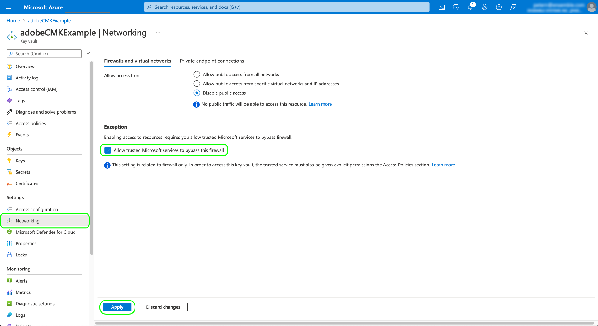
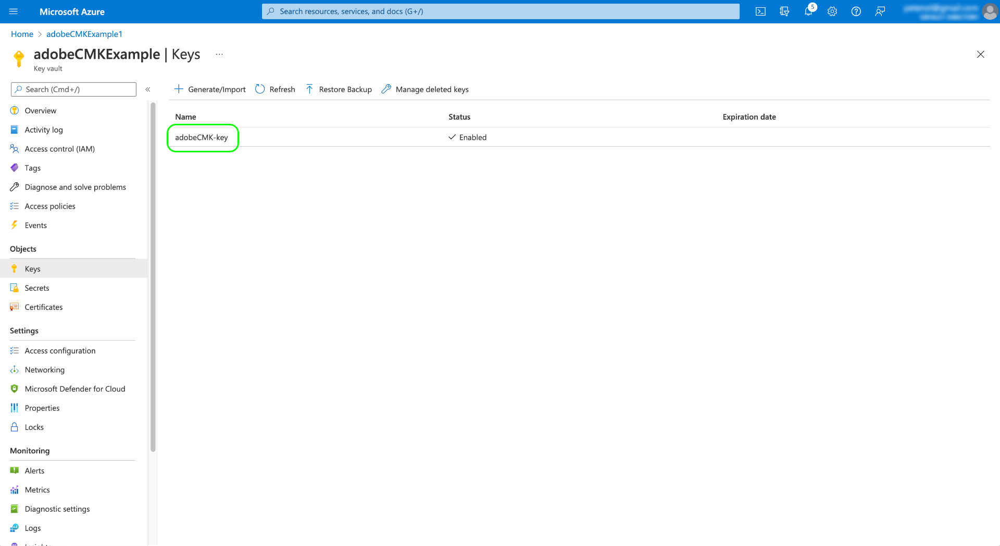

# Adobe Experience Platform中的客戶自控金鑰

儲存在Adobe Experience Platform上的資料會使用系統層級的金鑰進行靜態加密。 如果您使用以Platform為基礎建立的應用程式，可以選擇改用您自己的加密金鑰，讓您更能掌控資料安全性。

>[!NOTE]
>
>Adobe Experience Platform Data Lake和設定檔存放區中的資料是使用CMK加密。 這些會視為您的主要資料存放區。

本文介紹在Platform中啟用客戶自控金鑰(CMK)功能的程式。

## 先決條件

若要存取CMK API，您必須指派 [!UICONTROL 管理客戶自控金鑰] 與API認證相關的新角色或現有角色的許可權和生產沙箱的存取權。 如果您只想提供具有CMK存取權的API認證，建議您使用先前提及的必要許可權，建立新的CMK管理員角色。

有關在Experience Platform中指派角色和許可權的詳細資訊，請參閱 [設定許可權檔案](https://experienceleague.adobe.com/docs/platform-learn/getting-started-for-data-architects-and-data-engineers/configure-permissions.html).

為了啟用CMK，您的 [!DNL Azure] 金鑰儲存庫必須設定以下設定：

* [啟用清除保護](https://learn.microsoft.com/en-us/azure/key-vault/general/soft-delete-overview#purge-protection)
* [啟用軟刪除](https://learn.microsoft.com/en-us/azure/key-vault/general/soft-delete-overview)
* [設定存取權，使用 [!DNL Azure] 角色型存取控制](https://learn.microsoft.com/en-us/azure/role-based-access-control/)

## 程式摘要

CMK包含在Healthcare Shield以及Adobe的Privacy and Security Shield產品中。 您的組織購買其中一項方案的授權後，您就可以開始一次性流程來設定功能。

>[!WARNING]
>
>設定CMK後，您無法還原為系統管理的金鑰。 您有責任安全地管理您的金鑰，並提供您對中的金鑰儲存庫、金鑰和CMK應用程式的存取權。 [!DNL Azure] 以防止無法存取您的資料。

程式如下：

1. [設定 [!DNL Azure] 金鑰儲存庫](#create-key-vault) 根據您組織的原則，然後 [產生加密金鑰](#generate-a-key) 最終將與Adobe共用。
1. 使用API呼叫來 [設定CMK應用程式](#register-app) 與您的 [!DNL Azure] 租使用者。
1. 使用API呼叫來 [將您的加密金鑰ID傳送至Adobe](#send-to-adobe) 並啟動特徵的啟用程式。
1. [檢查設定的狀態](#check-status) 以確認CMK是否已啟用。

完成設定程式後，所有所有沙箱中上線到Platform的所有資料，都會使用您的系統加密。 [!DNL Azure] 金鑰設定。 若要使用CMK，請善用 [!DNL Microsoft Azure] 可能屬於其 [公開預覽計畫](https://azure.microsoft.com/en-ca/support/legal/preview-supplemental-terms/).

## 設定 [!DNL Azure] 金鑰儲存庫 {#create-key-vault}

CMK僅支援來自 [!DNL Microsoft Azure] 金鑰儲存庫。 若要開始使用，您必須使用 [!DNL Azure] 建立新的企業帳戶，或使用現有的企業帳戶，然後依照下列步驟建立金鑰儲存庫。

>[!IMPORTANT]
>
>僅限高階和標準服務層級 [!DNL Azure] 支援金鑰儲存庫。 [!DNL Azure Managed HSM]， [!DNL Azure Dedicated HSM] 和 [!DNL Azure Payments HSM] 不受支援。 請參閱 [[!DNL Azure] 檔案](https://learn.microsoft.com/en-us/azure/security/fundamentals/key-management#azure-key-management-services) 以取得所提供的金鑰管理服務的詳細資訊。

>[!NOTE]
>
>以下檔案僅涵蓋建立金鑰儲存庫的基本步驟。 在本指引之外，您應根據組織的原則設定金鑰儲存庫。

登入 [!DNL Azure] 入口網站，並使用搜尋列來尋找 **[!DNL Key vaults]** 在服務清單底下。


此 **[!DNL Key vaults]** 頁面會在選取服務後顯示。 從這裡，選擇 **[!DNL Create]**.


使用提供的表單，填寫金鑰儲存庫的基本詳細資訊，包括名稱和指定的資源群組。

>[!WARNING]
>
>雖然大多數選項都可保留為預設值， **請務必啟用「軟刪除」和「清除保護」選項**. 如果您未開啟這些功能，則在刪除金鑰儲存庫時，您可能會失去對資料的存取權。
>
>

從此處，繼續完成金鑰儲存庫建立工作流程，並根據您組織的原則設定不同選項。

一旦您到達 **[!DNL Review + create]** 步驟，您可以在金鑰儲存庫進行驗證時檢閱其詳細資訊。 驗證通過後，選取 **[!DNL Create]** 以完成程式。


### 設定網路選項

如果您的金鑰儲存庫設定為限制特定虛擬網路的公開存取或完全停用公開存取，您必須授予Microsoft防火牆例外。

選取 **[!DNL Networking]** ，位於左側導覽器中。 在 **[!DNL Firewalls and virtual networks]**，選取核取方塊 **[!DNL Allow trusted Microsoft services to bypass this firewall]**，然後選取 **[!DNL Apply]**.



### 產生金鑰 {#generate-a-key}

建立金鑰儲存庫後，即可產生新的金鑰。 導覽至 **[!DNL Keys]** 標籤並選取 **[!DNL Generate/Import]**.


使用提供的表單提供索引鍵的名稱，然後選取 **RSA** 鍵型別。 至少 **[!DNL RSA key size]** 至少必須是 **3072** 位元（視需求） [!DNL Cosmos DB]. [!DNL Azure Data Lake Storage] 也與RSA 3027相容。

>[!NOTE]
>
>請記住您為金鑰提供的名稱，因為此金鑰將在以下步驟中使用： [傳送索引鍵至Adobe](#send-to-adobe).

使用剩餘的控制項來設定您想要產生或匯入的金鑰。 完成後，選取 **[!DNL Create]**.


已設定的金鑰會出現在儲存庫的金鑰清單中。



## 設定CMK應用程式 {#register-app}

設定好金鑰儲存庫後，下一步就是註冊將連結至您的 [!DNL Azure] 租使用者。

### 快速入門

註冊CMK應用程式時，您必須呼叫平台API。 如需有關如何收集進行這些呼叫所需的驗證標題的詳細資訊，請參閱 [平台API驗證指南](../../landing/api-authentication.md).

而驗證指南會提供如何針對所需產生您自己的唯一值的指示 `x-api-key` 請求標頭，本指南中的所有API作業都使用靜態值 `acp_provisioning` 而非。 您仍然必須提供自己的值 `{ACCESS_TOKEN}` 和 `{ORG_ID}`，但是。

在本指南中顯示的所有API呼叫中， `platform.adobe.io` 作為根路徑，預設為VA7區域。 如果您的組織使用不同的地區， `platform` 後面必須跟有破折號和指派給您的組織的區域代碼： `nld2` 適用於NLD2或 `aus5` 適用於AUS5 (例如： `platform-aus5.adobe.io`)。 如果您不知道您組織的地區，請聯絡您的系統管理員。

### 擷取驗證URL

若要開始註冊程式，請向應用程式註冊端點發出GET請求，以擷取組織所需的驗證URL。

**要求**

```shell
curl -X GET \
  https://platform.adobe.io/data/infrastructure/manager/byok/app-registration \ 
  -H 'Authorization: Bearer {ACCESS_TOKEN}' \
  -H 'x-api-key: acp_provisioning' \
  -H 'x-gw-ims-org-id: {ORG_ID}'
```

**回應**

成功的回應會傳回 `applicationRedirectUrl` 屬性，包含驗證URL。

```json
{
    "id": "byok",
    "name": "acpebae9422Caepcmkmultitenantapp",
    "applicationUri": "https://adobe.com/acpebae9422Caepcmkmultitenantapp",
    "applicationId": "e463a445-c6ac-4ca2-b36a-b5146fcf6a52",
    "applicationRedirectUrl": "https://login.microsoftonline.com/common/oauth2/authorize?response_type=code&client_id=e463a445-c6ac-4ca2-b36a-b5146fcf6a52&redirect_uri=https://adobe.com/acpebae9422Caepcmkmultitenantapp&scope=user.read"
}
```

複製並貼上 `applicationRedirectUrl` 位址放入瀏覽器以開啟驗證對話方塊。 選取 **[!DNL Accept]** 若要將CMK應用程式服務主體新增至 [!DNL Azure] 租使用者。


### 將CMK應用程式指派給角色 {#assign-to-role}

完成驗證程式後，請導覽回 [!DNL Azure] 金鑰儲存庫及選擇 **[!DNL Access control]** ，位於左側導覽器中。 從這裡，選擇 **[!DNL Add]** 後面接著 **[!DNL Add role assignment]**.


下一個畫面會提示您選擇此指派的角色。 選取 **[!DNL Key Vault Crypto Service Encryption User]** 在選取之前 **[!DNL Next]** 以繼續。


在下一個畫面，選擇 **[!DNL Select members]** 以開啟右側邊欄中的對話方塊。 使用搜尋列來尋找CMK應用程式的服務主體，並從清單中選取它。 完成後，選取 **[!DNL Save]**.

>[!NOTE]
>
>如果您在清單中找不到您的應用程式，則表示您的服務主體尚未被租使用者接受。 請使用您的 [!DNL Azure] 管理員或代表以確保您擁有正確的許可權。

## 在Experience Platform上啟用加密金鑰設定 {#send-to-adobe}

在上安裝CMK應用程式後 [!DNL Azure]，即可將加密金鑰識別碼傳送至Adobe。 選取 **[!DNL Keys]** ，然後輸入要傳送的金鑰名稱。


選取金鑰的最新版本，其詳細資訊頁面就會顯示。 您可以在此處選擇設定金鑰的允許操作。 至少必須將該金鑰授予 **[!DNL Wrap Key]** 和 **[!DNL Unwrap Key]** 許可權。

此 **[!UICONTROL 金鑰識別碼]** 欄位會顯示金鑰的URI識別碼。 複製此URI值以用於下一個步驟。


取得金鑰儲存庫URI後，您可以使用POST請求將其傳送到CMK設定端點。

>[!NOTE]
>
>只有金鑰儲存庫和金鑰名稱與Adobe一起儲存，而不是金鑰版本。

**要求**

```shell
curl -X POST \
  https://platform.adobe.io/data/infrastructure/manager/customer/config \ 
  -H 'Authorization: Bearer {ACCESS_TOKEN}' \
  -H 'x-api-key: acp_provisioning' \
  -H 'x-gw-ims-org-id: {ORG_ID}' \
  -d '{
        "name": "Config1",
        "type": "BYOK_CONFIG",
        "imsOrgId": "{ORG_ID}",
        "configData": {
          "providerType": "AZURE_KEYVAULT",
          "keyVaultKeyIdentifier": "https://adobecmkexample.vault.azure.net/keys/adobeCMK-key/7c1d50lo28234cc895534c00d7eb4eb4"
        }
      }'
```

| 屬性 | 說明 |
| --- | --- |
| `name` | 設定的名稱。 請確定您記住此值，因為您需要在 [後續步驟](#check-status). 值區分大小寫。 |
| `type` | 設定型別。 必須設為 `BYOK_CONFIG`. |
| `imsOrgId` | 您的組織 ID。此值必須與 `x-gw-ims-org-id` 標頭。 |
| `configData` | 包含有關設定的下列詳細資訊：<ul><li>`providerType`：必須設為 `AZURE_KEYVAULT`.</li><li>`keyVaultKeyIdentifier`：您複製的金鑰儲存庫URI [較早](#send-to-adobe).</li></ul> |

**回應**

成功的回應會傳回設定工作的詳細資訊。

```json
{
  "id": "4df7886b-a122-4391-880b-47888d5c5b92",
  "config": {
    "configData": {
      "keyVaultUri": "https://adobecmkexample.vault.azure.net",
      "keyVaultKeyIdentifier": "https://adobecmkexample.vault.azure.net/keys/adobeCMK-key/7c1d50lo28234cc895534c00d7eb4eb4",
      "keyVersion": "7c1d50lo28234cc895534c00d7eb4eb4",
      "keyName": "Config1",
      "providerType": "AZURE_KEYVAULT"
    },
    "name": "acpcf978863Aaepcmkmultitenantapp",
    "type": "BYOK_CONFIG",
    "imsOrgId": "{IMS_ORG}",
    "status": "NEW"
  },
  "status": "CREATED"
}
```

工作應在幾分鐘內完成處理。

## 驗證設定的狀態 {#check-status}

若要檢查設定要求的狀態，您可以提出GET要求。

**要求**

您必須附加 `name` 要檢查的設定的路徑(`config1` （在以下範例中）並包含 `configType` 查詢引數設為 `BYOK_CONFIG`.

```shell
curl -X GET \
  https://platform.adobe.io/data/infrastructure/manager/customer/config/config1?configType=BYOK_CONFIG \ 
  -H 'Authorization: Bearer {ACCESS_TOKEN}' \
  -H 'x-api-key: acp_provisioning' \
  -H 'x-gw-ims-org-id: {ORG_ID}'
```

**回應**

成功的回應會傳回工作的狀態。

```json
{
  "name": "acpcf978863Aaepcmkmultitenantapp",
  "type": "BYOK_CONFIG",
  "status": "COMPLETED",
  "configData": {
    "keyVaultUri": "https://adobecmkexample.vault.azure.net",
    "keyVaultKeyIdentifier": "https://adobecmkexample.vault.azure.net/keys/adobeCMK-key/7c1d50lo28234cc895534c00d7eb4eb4",
    "keyVersion": "7c1d50lo28234cc895534c00d7eb4eb4",
    "keyName": "Config1",
    "providerType": "AZURE_KEYVAULT"
  },
  "imsOrgId": "{IMS_ORG}",
  "subscriptionId": "cf978863-7325-47b1-8fd9-554b9fdb6c36",
  "id": "4df7886b-a122-4391-880b-47888d5c5b92",
  "rowType": "BYOK_KEY"
}
```

此 `status` attribute可以有四個值之一，其含義如下：

1. `RUNNING`：驗證平台是否能夠存取金鑰和金鑰儲存庫。
1. `UPDATE_EXISTING_RESOURCES`：系統會將金鑰儲存庫和金鑰名稱新增至組織中所有沙箱內的資料存放區。
1. `COMPLETED`：金鑰儲存庫和金鑰名稱已新增至資料存放區。
1. `FAILED`：發生問題，主要與金鑰、金鑰儲存庫或多租使用者應用程式設定有關。

## 撤銷存取權 {#revoke-access}

如果您想要撤銷Platform對您資料的存取權，可以從的金鑰儲存庫中移除與應用程式相關聯的使用者角色 [!DNL Azure].

>[!WARNING]
>
>停用金鑰儲存庫、金鑰或CMK應用程式可能會導致重大變更。 一旦金鑰儲存庫、金鑰或CMK應用程式停用，且資料無法在Platform中存取，任何與該資料相關的下游作業都將無法再進行。 在對設定進行任何變更之前，請確定您瞭解撤銷平台對您金鑰的存取權的下游影響。

移除金鑰存取權或停用/刪除金鑰之後 [!DNL Azure] 金鑰儲存庫可能需要幾分鐘到24小時的時間，才能讓此設定傳播到主要資料存放區。 平台工作流程也包含效能和核心應用程式功能所需的快取和暫時性資料存放區。 透過此類快取和暫時性存放區傳播CMK撤銷最多可能需要七天，具體取決於其資料處理工作流程。 例如，這表示「設定檔」儀表板會保留並顯示其快取資料存放區的資料，並且需要七天的時間來讓快取資料存放區中的資料過期，做為重新整理週期的一部分。 重新啟用對應用程式的存取權時，資料再次可用的時間也會延遲。

>[!NOTE]
>
>非主要（快取/暫時）資料的7天資料集到期有兩個使用案例特定例外。 如需這些功能的詳細資訊，請參閱其各自的檔案。<ul><li>[Adobe Journey Optimizer URL Shortener](https://experienceleague.adobe.com/docs/journey-optimizer/using/sms/sms-configuration.html?lang=zh-Hant#message-preset-sms)</li><li>[邊緣投影](https://experienceleague.adobe.com/docs/experience-platform/profile/home.html#edge-projections)</li></ul>

## 後續步驟

完成上述步驟，您已成功為組織啟用CMK。 現在，您會使用中的金鑰，將內嵌至主要資料存放區的資料加密和解密。 [!DNL Azure] 金鑰儲存庫。

