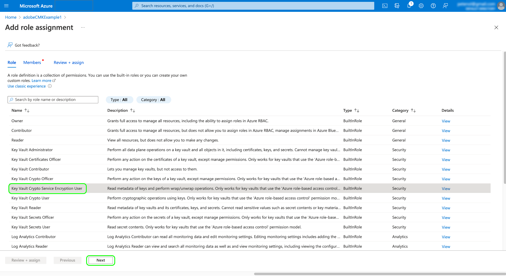

# Adobe Experience Platform中的客戶管理金鑰

儲存在Adobe Experience Platform上的資料會使用系統層級的金鑰進行靜態加密。 如果您使用的應用程式是以Platform為建置基礎，您可以選擇使用您自己的加密密鑰，從而更好地控制資料安全性。

本檔案說明在Platform中啟用客戶管理金鑰(CMK)功能的程式。

## 流程摘要

CMK包含在Healthcare Shield和Privacy and Security Shield產品中，不會Adobe。 您的組織購買其中一項產品的授權後，您就可以開始設定功能的一次性程式。

>[!WARNING]
>
>設定CMK後，無法恢復到由系統管理的密鑰。 您負責安全地管理密鑰，並在內提供對密鑰保管庫、密鑰和CMK應用程式的訪問 [!DNL Azure] 以防止遺失資料的存取權。

該過程如下：

1. [建立 [!DNL Microsoft Azure] 密鑰保管庫](#create-key-vault)，然後 [生成加密密鑰](#generate-a-key) （根據貴組織的原則），最終將與Adobe共用。
1. 將API呼叫用於 [註冊CMK應用](#register-app) 與 [!DNL Azure] 租用戶。
1. [為CMK應用程式分配服務主體](#assign-to-role) 為密鑰保管庫設定適當角色。
1. 將API呼叫用於 [將您的加密密鑰ID發送到Adobe](#send-to-adobe).

完成設定程式後，所有沙箱上架的所有資料都會使用 [!DNL Azure] 金鑰設定，專屬於您 [[!DNL Cosmos DB]](https://docs.microsoft.com/en-us/azure/cosmos-db/) 和 [[!DNL Data Lake Storage]](https://docs.microsoft.com/en-us/azure/storage/blobs/data-lake-storage-introduction) 資源。 要使用CMK，您將利用 [!DNL Microsoft Azure] 可能屬於其一部分的功能 [公共預覽程式](https://azure.microsoft.com/en-ca/support/legal/preview-supplemental-terms/).

## 建立 [!DNL Azure] 密鑰保管庫 {#create-key-vault}

CMK僅支援來自 [!DNL Microsoft Azure] 密鑰庫。 若要開始，您必須使用 [!DNL Azure] 要建立新企業帳戶，或使用現有企業帳戶，並按照以下步驟建立密鑰保管庫。

>[!IMPORTANT]
>
>僅適用於 [!DNL Azure] 支援密鑰保管庫。 [!DNL Azure Managed HSM], [!DNL Azure Dedicated HSM] 和 [!DNL Azure Payments HSM] 不支援。 請參閱 [[!DNL Azure] 檔案](https://learn.microsoft.com/en-us/azure/security/fundamentals/key-management#azure-key-management-services) 提供密鑰管理服務的更多資訊。

>[!NOTE]
>
>以下文檔僅涵蓋建立密鑰保管庫的基本步驟。 在本指南之外，您應根據貴組織的策略配置密鑰保管庫。

登入 [!DNL Azure] 入口網站和使用搜尋列來尋找 **[!DNL Key vaults]** 在服務清單下。


此 **[!DNL Key vaults]** 選取服務後，頁面就會顯示。 從此處，選擇 **[!DNL Create]**.


使用提供的表格填寫密鑰保管庫的基本詳細資訊，包括名稱和分配的資源組。

>[!WARNING]
>
>雖然大部分選項都可保留為預設值， **確保啟用軟刪除和清除保護選項**. 如果不開啟這些功能，則如果刪除密鑰保管庫，您可能會丟失對資料的訪問權。
>
>

從這裡，繼續執行關鍵保管庫建立工作流程，並根據貴組織的原則配置不同的選項。

一旦您到達 **[!DNL Review + create]** 步驟中，您可以在密鑰保管庫進行驗證時查看其詳細資訊。 驗證通過後，選擇 **[!DNL Create]** 來完成此程式。


## 配置網路選項

如果您的密鑰保管庫配置為限制對某些虛擬網路的公共訪問或完全禁用公共訪問，則必須授予Microsoft防火牆例外。

選擇 **[!DNL Networking]** 的下一頁。 在 **[!DNL Firewalls and virtual networks]**，選取核取方塊 **[!DNL Allow trusted Microsoft services to bypass this firewall]**，然後選取 **[!DNL Apply]**.


## 產生金鑰 {#generate-a-key}

建立密鑰保管庫後，即可生成新密鑰。 導覽至 **[!DNL Keys]** 索引標籤和選取 **[!DNL Generate/Import]**.


使用提供的表單來提供金鑰的名稱，然後選取 **RSA** （鍵類型）。 至少， **[!DNL RSA key size]** 必須至少 **3072** 所需位數 [!DNL Cosmos DB]. [!DNL Azure Data Lake Storage] 也與RSA 3027相容。

>[!NOTE]
>
>請記住您為金鑰提供的名稱，因為稍後步驟中會使用 [傳送金鑰至Adobe](#send-to-adobe).

使用其餘控制項，視需要設定您要產生或匯入的金鑰。 完成後，請選取 **[!DNL Create]**.


配置的密鑰將顯示在保管庫的密鑰清單中。


## 註冊CMK應用 {#register-app}

配置密鑰保管庫後，下一步是註冊將連結到您的 [!DNL Azure] 租用戶。

>[!NOTE]
>
>註冊CMK應用程式需要您呼叫平台API。 如需如何收集進行這些呼叫所需的驗證標題的詳細資訊，請參閱 [Platform API驗證指南](../../landing/api-authentication.md).
>
>而驗證指南則提供如何為所需項目產生您自己的唯一值的指示 `x-api-key` 要求標題，本指南中的所有API操作都使用靜態值 `acp_provisioning` 。 您仍必須為 `{ACCESS_TOKEN}` 和 `{ORG_ID}`，不過。

### 擷取驗證URL

若要開始註冊程式，請向應用程式註冊端點提出GET要求，以擷取貴組織所需的驗證URL。

**要求**

```shell
curl -X GET \
  https://platform.adobe.io/data/infrastructure/manager/byok/app-registration \ 
  -H 'Authorization: Bearer {ACCESS_TOKEN}' \
  -H 'x-api-key: acp_provisioning' \
  -H 'x-gw-ims-org-id: {ORG_ID}'
```

**回應**

成功的回應會傳回 `applicationRedirectUrl` 屬性，包含驗證URL。

```json
{
    "id": "byok",
    "name": "acpebae9422Caepcmkmultitenantapp",
    "applicationUri": "https://adobe.com/acpebae9422Caepcmkmultitenantapp",
    "applicationId": "e463a445-c6ac-4ca2-b36a-b5146fcf6a52",
    "applicationRedirectUrl": "https://login.microsoftonline.com/common/oauth2/authorize?response_type=code&client_id=e463a445-c6ac-4ca2-b36a-b5146fcf6a52&redirect_uri=https://adobe.com/acpebae9422Caepcmkmultitenantapp&scope=user.read"
}
```

複製並貼上 `applicationRedirectUrl` 地址到瀏覽器以開啟驗證對話方塊。 選擇 **[!DNL Accept]** 向 [!DNL Azure] 租用戶。


## 將CMK應用指派給角色 {#assign-to-role}

完成驗證程式後，請導覽回您的 [!DNL Azure] 密鑰保管庫並選擇 **[!DNL Access control]** 的下一頁。 從此處，選擇 **[!DNL Add]** 後跟 **[!DNL Add role assignment]**.


下一個螢幕會提示您為此分配選擇角色。 選擇 **[!DNL Key Vault Crypto Service Encryption User]** 選擇 **[!DNL Next]** 繼續。



在下一個畫面中，選擇 **[!DNL Select members]** 以在右側邊欄中開啟對話方塊。 使用搜索欄查找CMK應用程式的服務主體，並從清單中選擇它。 完成後，請選取 **[!DNL Save]**.

>[!NOTE]
>
>如果您在清單中找不到您的應用程式，則您的服務主體尚未被接受到您的租戶中。 請與您的 [!DNL Azure] 管理員或代表，確保您擁有正確的權限。

## 將密鑰URI發送到Adobe {#send-to-adobe}

在上安裝CMK應用程式後 [!DNL Azure]，您可以將您的加密密鑰標識符發送到Adobe。 選擇 **[!DNL Keys]** 在左側導覽中，隨後是您要傳送的索引鍵名稱。


選取金鑰的最新版本，並顯示其詳細資訊頁面。 在此，您可以選擇配置密鑰的允許操作。 至少，金鑰必須授予 **[!DNL Wrap Key]** 和 **[!DNL Unwrap Key]** 權限。

此 **[!UICONTROL 密鑰標識符]** 欄位顯示鍵的URI標識符。 複製此URI值以用於下一步。


獲得密鑰保管庫URI後，可以使用POST請求將其發送到CMK配置終結點。

>[!NOTE]
>
>只有密鑰保管庫和密鑰名稱與Adobe一起儲存，而不是密鑰版本。

**要求**

```shell
curl -X POST \
  https://platform.adobe.io/data/infrastructure/manager/customer/config \ 
  -H 'Authorization: Bearer {ACCESS_TOKEN}' \
  -H 'x-api-key: acp_provisioning' \
  -H 'x-gw-ims-org-id: {ORG_ID}' \
  -d '{
        "name": "Config1",
        "type": "BYOK_CONFIG",
        "imsOrgId": "{ORG_ID}",
        "configData": {
          "providerType": "AZURE_KEYVAULT",
          "keyVaultIdentifier": "https://adobecmkexample.vault.azure.net/keys/adobeCMK-key/7c1d50lo28234cc895534c00d7eb4eb4"
        }
      }'
```

| 屬性 | 說明 |
| --- | --- |
| `name` | 設定的名稱。 請務必記住此值，因為您需要檢查設定的狀態，位於 [稍後步驟](#check-status). 值區分大小寫。 |
| `type` | 配置類型。 必須設為 `BYOK_CONFIG`. |
| `imsOrgId` | 您的IMS組織ID。 此值必須與 `x-gw-ims-org-id` 頁首。 |
| `configData` | 包含有關設定的下列詳細資料：<ul><li>`providerType`:必須設為 `AZURE_KEYVAULT`.</li><li>`keyVaultIdentifier`:您複製的密鑰保管庫URI [較早](#send-to-adobe).</li></ul> |

**回應**

成功的回應會傳回設定作業的詳細資訊。

```json
{
  "id": "4df7886b-a122-4391-880b-47888d5c5b92",
  "config": {
    "configData": {
      "keyVaultUri": "https://adobecmkexample.vault.azure.net",
      "keyVaultKeyIdentifier": "https://adobecmkexample.vault.azure.net/keys/adobeCMK-key/7c1d50lo28234cc895534c00d7eb4eb4",
      "keyVersion": "7c1d50lo28234cc895534c00d7eb4eb4",
      "keyName": "Config1",
      "providerType": "AZURE_KEYVAULT"
    },
    "name": "acpcf978863Aaepcmkmultitenantapp",
    "type": "BYOK_CONFIG",
    "imsOrgId": "{IMS_ORG}",
    "status": "NEW"
  },
  "status": "CREATED"
}
```

工作應該會在幾分鐘內完成處理。

### 檢查配置的狀態 {#check-status}

若要檢查設定請求的狀態，您可以提出GET請求。

**要求**

您必須附加 `name` 要檢查到路徑(`config1` 在以下範例中)，並包含 `configType` 查詢參數設定為 `BYOK_CONFIG`.

```shell
curl -X GET \
  https://platform.adobe.io/data/infrastructure/manager/customer/config/config1?configType=BYOK_CONFIG \ 
  -H 'Authorization: Bearer {ACCESS_TOKEN}' \
  -H 'x-api-key: acp_provisioning' \
  -H 'x-gw-ims-org-id: {ORG_ID}'
```

**回應**

成功的回應會傳回作業的狀態。

```json
{
  "name": "acpcf978863Aaepcmkmultitenantapp",
  "type": "BYOK_CONFIG",
  "status": "COMPLETED",
  "configData": {
    "keyVaultUri": "https://adobecmkexample.vault.azure.net",
    "keyVaultKeyIdentifier": "https://adobecmkexample.vault.azure.net/keys/adobeCMK-key/7c1d50lo28234cc895534c00d7eb4eb4",
    "keyVersion": "7c1d50lo28234cc895534c00d7eb4eb4",
    "keyName": "Config1",
    "providerType": "AZURE_KEYVAULT"
  },
  "imsOrgId": "{IMS_ORG}",
  "subscriptionId": "cf978863-7325-47b1-8fd9-554b9fdb6c36",
  "id": "4df7886b-a122-4391-880b-47888d5c5b92",
  "rowType": "BYOK_KEY"
}
```

此 `status` 屬性可以有四個值之一，具有以下含義：

1. `RUNNING`:驗證Platform是否能存取金鑰和金鑰保管庫。
1. `UPDATE_EXISTING_RESOURCES`:系統會將金鑰保管庫和金鑰名稱新增至組織中所有沙箱的資料存放區。
1. `COMPLETED`:密鑰保管庫和密鑰名稱已添加到資料儲存中。
1. `FAILED`:出現問題，主要與密鑰、密鑰保管庫或多租戶應用程式設定有關。

## 後續步驟

完成上述步驟後，貴組織便成功啟用CMK。 擷取至Platform的資料現在會使用 [!DNL Azure] 密鑰庫。 如果要撤銷對您資料的Platform訪問權，可以從內的密鑰保管庫中刪除與應用程式關聯的用戶角色 [!DNL Azure].

停用應用程式的存取權後，可能需要幾分鐘到24小時的時間，資料才會在Platform中無法再存取。 重新啟用應用程式的存取權時，資料會再次可用的時間延遲。

>[!WARNING]
>
>一旦Key Vault、Key或CMK應用程式停用，且Platform中的資料不再可存取，則與該資料相關的任何下游操作將不再可行。 在對設定進行任何變更之前，請務必了解撤銷Platform對您資料的存取權對下游的影響。
