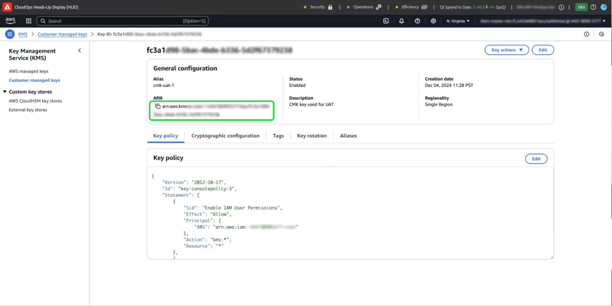
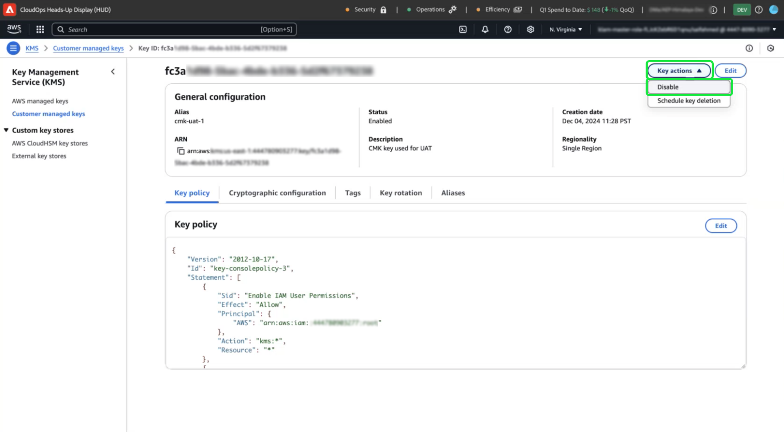

# 使用Experience Platform UI透過AWS設定及設定客戶自控金鑰

使用本指南，透過Experience Platform UI為AWS上託管的Experience Platform執行個體啟用客戶自控金鑰(CMK)。

>[!IMPORTANT]
>
>繼續進行本指南之前，請確定您已完成[&#39;為CMK設定AWS KMS&#39;](./configure-kms.md)檔案中詳述的設定。

## 更新AWS金鑰政策，以整合金鑰與Experience Platform

若要將您的AWS金鑰與Experience Platform整合，您必須在KMS工作區的「**[!DNL Key Policy]**」區段中編輯JSON。 預設金鑰原則看起來類似於以下JSON。

<!-- The AWS ID below is fake. Q) Can I refer to it simply as AWS_ACCOUNT_ID ? Is that suitable? -->

```JSON
{
  "Id": "key-consolepolicy-3",
  "Version": "2012-10-17",
  "Statement": [
    {
      "Sid": "Enable IAM User Permissions",
      "Effect": "Allow",
      "Principal": {
        "AWS": "arn:aws:iam::123464903283:root" // this is a mock AWS Principal ID, your ID will differ
      },
      "Action": "kms:*",
      "Resource": "*"
    }
  ]
}
```

在上述範例中，相同帳戶(`Principal.AWS`)內的所有資源(`"Resource": "*"`)都可以存取金鑰。 此原則允許帳戶中的服務執行加密和解密作業，但僅限於指定的帳戶。 若要授與您的Experience Platform單一租使用者帳戶對此金鑰的存取權，請將新陳述式新增至預設的AWS原則。 您可以從Experience Platform UI取得必要的JSON原則，並將其套用至您的AWS KMS金鑰，以與Adobe Experience Platform建立安全連線。

在Experience Platform UI中，前往左側導覽邊欄中的&#x200B;**[!UICONTROL 管理]**&#x200B;區段，然後選取&#x200B;**[!UICONTROL 加密]**。 在[!UICONTROL 加密組態]工作區中，選取[!UICONTROL 客戶自控金鑰]卡片中的&#x200B;**[!UICONTROL 組態]**。


[!UICONTROL Customer Managed Keys組態]出現。 從[!UICONTROL 客戶受管理金鑰] [!UICONTROL 加密組態]中顯示的CMK KMS原則複製`statement`物件。

<!-- Select the copy icon () to copy the CMK KMS policy to your clipboard. A green pop-up notification confirms that the policy was copied.  -->

<!-- I cannot add the 'and the copy icon highlighted.' to the alt text below as i do not have access to this UI. -->


<!-- This part of the workflow was in contention at the time of the demo.  -->

接著，返回AWS KMS工作區並更新下方顯示的金鑰原則。


從[!UICONTROL 平台加密組態]工作區新增四個陳述式，如下所示： `Enable IAM User Permissions`、`CJA Flow IAM User Permissions`、`CJA Integrity IAM User Permissions`、`CJA Oberon IAM User Permissions`。

```json
{
    "Version": "2012-10-17",
    "Id": "key-consolepolicy",
    "Statement": [
        {
            "Sid": "Enable IAM User Permissions",
            "Effect": "Allow",
            "Principal": {
                "AWS": "arn:aws:iam::975049898882:root" // this is a mock AWS Principal ID, your ID will differ
            },
            "Action": [
                "kms:Decrypt",
                "kms:Encrypt",
                "kms:ReEncrypt*",
                "kms:GenerateDataKey*",
                "kms:DescribeKey",
                "kms:CreateGrant"
            ],
            "Resource": "*",
            "Condition": {
                "StringEquals": {
                    "aws:PrincipalAccount": "975049898882" // this is a mock AWS Principal ID, your ID will differ
                }
            }
        },
        {
            "Sid": "CJA Flow IAM User Permissions",
            "Effect": "Allow",
            "Principal": {
                "AWS": "arn:aws:iam::767397686373:root"
            },
            "Action": [
                "kms:Decrypt",
                "kms:Encrypt",
                "kms:ReEncrypt*",
                "kms:GenerateDataKey*",
                "kms:DescribeKey",
                "kms:CreateGrant"
            ],
            "Resource": "*",
            "Condition": {
                "StringEquals": {
                    "aws:PrincipalAccount": "767397686373"
                }
            }
        },
        {
            "Sid": "CJA Integrity IAM User Permissions",
            "Effect": "Allow",
            "Principal": {
                "AWS": "arn:aws:iam::730335345392:root"
            },
            "Action": [
                "kms:Decrypt",
                "kms:Encrypt",
                "kms:ReEncrypt*",
                "kms:GenerateDataKey*",
                "kms:DescribeKey",
                "kms:CreateGrant"
            ],
            "Resource": "*",
            "Condition": {
                "StringEquals": {
                    "aws:PrincipalAccount": "730335345392"
                }
            }
        },
        {
            "Sid": "CJA Oberon IAM User Permissions",
            "Effect": "Allow",
            "Principal": {
                "AWS": "arn:aws:iam::891377157113:root"
            },
            "Action": [
                "kms:Decrypt",
                "kms:Encrypt",
                "kms:ReEncrypt*",
                "kms:GenerateDataKey*",
                "kms:DescribeKey",
                "kms:CreateGrant"
            ],
            "Resource": "*",
            "Condition": {
                "StringEquals": {
                    "aws:PrincipalAccount": "891377157113"
                }
            }
        }
    ]
}
```

選取&#x200B;**[!DNL Finish]**&#x200B;以確認更新的原則並建立金鑰。 設定現在包含五個陳述式，讓您的AWS帳戶可與Adobe Experience Platform通訊。 變更會立即生效。

AWS [!DNL Key Management Service]的已更新[!DNL Customer Managed Keys]工作區隨即顯示。

### 將AWS加密金鑰詳細資料新增至Experience Platform

接下來，若要啟用加密，請將金鑰的Amazon資源名稱(ARN)新增至您的Experience Platform [!UICONTROL 客戶自控金鑰組態]。 在AWS的[!DNL Customer Managed Keys]區段中，從[!DNL Key Management Service]的清單中選取新金鑰的別名。


您的金鑰的詳細資訊隨即顯示。 AWS中的所有專案都有Amazon資源名稱(ARN)，其中
是用於跨AWS服務指定資源的唯一識別碼。 它遵循標準化格式： `arn:partition:service:region:account-id:resource`。

選取復製圖示以複製您的ARN。 確認對話方塊隨即顯示。



現在，導覽回Experience Platform [!UICONTROL 客戶自控金鑰組態] UI。 在&#x200B;**[!UICONTROL 新增AWS加密金鑰詳細資料]**&#x200B;區段中，新增您從AWS UI複製的&#x200B;**[!UICONTROL 設定名稱]**&#x200B;和&#x200B;**[!UICONTROL KMS金鑰ARN]**。


接著，選取&#x200B;**[!UICONTROL 儲存]**&#x200B;以提交組態名稱、KMS金鑰ARN，並開始驗證金鑰。


您返回[!UICONTROL 加密設定]工作區。 加密組態的狀態會顯示在&#x200B;**[!UICONTROL 客戶受管理的金鑰]**&#x200B;卡片底部。


在驗證金鑰後，金鑰儲存庫識別碼將新增到所有沙箱的Data Lake和設定檔資料存放區。

>[!NOTE]
>
>流程的持續時間取決於您的資料大小。 一般而言，程式會在24小時內完成。 每個沙箱通常會在2到3分鐘內更新。

## 金鑰撤銷 {#key-revocation}

>[!IMPORTANT]
>
>在撤銷任何存取權之前，請先瞭解金鑰撤銷對下游應用程式的影響。

以下是金鑰撤銷的主要考量事項：

- 撤銷或停用金鑰將會使您的Experience Platform資料無法存取。 此動作不可逆，應謹慎執行。
- 在撤銷加密金鑰存取權時，請考慮傳輸時間表。 主要資料存放區在幾分鐘到24小時內變得無法存取。 快取或暫時性資料存放區在7天內無法存取。

若要撤銷金鑰，請導覽至AWS KMS工作區。 **[!DNL Customer managed keys]**&#x200B;區段會顯示您AWS帳戶的所有可用金鑰。 從清單中選取金鑰的別名。


您的金鑰的詳細資訊隨即顯示。 若要停用金鑰，請選取&#x200B;**[!DNL Key actions]**，然後從下拉式功能表中選取&#x200B;**[!DNL Disable]**。



確認對話方塊隨即顯示。 選取&#x200B;**[!DNL Disable key]**&#x200B;以確認您的選擇。 停用索引鍵的影響應在約五分鐘內反映在Experience Platform應用程式和UI中。

>[!NOTE]
>
>停用金鑰後，您可以視需要使用上述相同方法再次啟用金鑰。 此選項可從&#x200B;**[!DNL Key actions]**&#x200B;下拉式清單中取得。

![反白顯示[停用金鑰]的[停用金鑰]對話方塊。](../../../images/governance-privacy-security/key-management-service/disable-key-dialog.png)

或者，如果您的金鑰用於其他服務，您可以直接從金鑰原則中移除Experience Platform的存取權。 在&#x200B;**[!DNL Key Policy]**&#x200B;區段中選取&#x200B;**[!UICONTROL 編輯]**。

![在[金鑰原則]區段中反白顯示[編輯的AWS金鑰的詳細資訊區段。](../../../images/governance-privacy-security/key-management-service/edit-key-policy.png)

**[!DNL Edit key policy]**&#x200B;頁面隨即顯示。 反白標示並刪除從Experience Platform UI複製的原則宣告，以移除客戶自控金鑰應用程式的許可權。 然後，選取&#x200B;**[!DNL Save changes]**&#x200B;以完成程式。


## 金鑰輪換 {#key-rotation}

AWS提供自動和隨選金鑰輪換。 為了降低金鑰洩露的風險或符合安全性法規要求，您可以視需要或定期自動產生新的加密金鑰。 排程自動金鑰輪換以限制金鑰的使用壽命，並確保如果金鑰受損，輪換後將無法使用。 雖然現代加密演演算法高度安全，但金鑰輪換是一項重要的安全性合規措施，並表明遵循安全性最佳實務。

### 自動金鑰輪換 {#automatic-key-rotation}

自動金鑰輪換預設為停用。 若要從KMS工作區排程自動金鑰輪換，請選取&#x200B;**[!DNL Key rotation]**&#x200B;索引標籤，然後在&#x200B;**[!DNL Automatic key rotation section]**&#x200B;中選取&#x200B;**[!DNL Edit]**。


**[!DNL Edit automatic key rotation]**&#x200B;工作區會出現。 從這裡，選取選項按鈕以啟用或停用自動金鑰輪換。 然後使用文字輸入欄位或下拉式功能表，選擇按鍵旋轉的時間段。 選取&#x200B;**[!DNL Save]**&#x200B;以確認您的設定並返回金鑰詳細資料工作區。

>[!NOTE]
>
>金鑰輪換的最小週期為90天，最大週期為2560天。


### 隨選金鑰輪換 {#on-demand-key-rotation}

選取&#x200B;**[!DNL Rotate Now]**&#x200B;以在目前金鑰遭到破壞時執行立即金鑰輪換。 AWS限制此功能為10次旋轉。 如需定期維護，請改為排程自動金鑰輪替。


## 後續步驟

閱讀本檔案後，您已瞭解如何在適用於Adobe Experience Platform的AWS KMS中建立、設定和管理加密金鑰。 接下來，請檢閱貴組織的安全性和法規遵循政策，以實作最佳實務，例如排程金鑰輪換並確保安全金鑰儲存。
