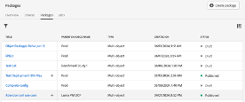
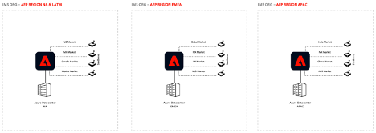

# 適用於多地區、多品牌企業的Adobe Experience Platform

## 簡介

Adobe Experience Platform走在變革解決方案的前列，使您能夠充分利用客戶資料和內容的潛力。 有了Experience Platform，您可以集中和標準化來自不同系統的資料，並運用資料科學和機器學習的力量。 如此一來，個人化體驗的建立與傳送功能得以強化，並且引起消費者的共鳴。

Experience Platform可讓您呈現結構並控管您的業務資料，以進行可擴充、彈性的實施。 實作Platform應用程式是一項重大的歷程，需要進行策略規劃並謹慎考量，尤其是當您跨越全球、區域和品牌特定網域或所有這些方面的組合進行操作時。

本白皮書可作為參考，提供產品觀點和一套指引。 其主要目的是讓您和您的實作團隊具備有效導覽Experience Platform錯綜複雜之處所需的工具和深入見解。 藉由提供結構化架構以評估您的特定需求、考量事項和真實使用案例，您可充分運用必要知識，以發揮Experience Platform和平台應用程式的全部潛能。 閱讀下列章節後，您會找到寶貴的見解和推薦，以簡化實作程式，提升貴組織向對象提供卓越體驗的能力，同時提供治理和控制以維護隱私權和合規性。


## 瞭解多品牌、多區域企業

如果您經營多品牌、多地區的企業，Experience Platform可能會有獨特的資料管理需求。 瞭解您的不同需求，是量身打造Experience Platform實作以最符合您特定需求的關鍵。

探索部署選項時，您需要瞭解並考慮將與Experience Platform和平台型應用程式互動的角色。 根據客戶的角色和興趣設計其體驗，可確保成功實作。 探索選項時，您應該考慮以下三個主要角色：

**Mary，行銷人員：**
- 焦點：大規模的客戶贏取與體驗個人化。
- 目標：建立完整的設定檔，提升媒體效率。

**Ted，技術人員**
- 焦點：組織資料管理。
- 目標：確保法規遵循、管理資料獨立單位，以及服務各行各業。

**Dan，資料架構師**
- 焦點：資料正確性與品質。
- 目標：確保資料隱私權和信任、設計方案和資料模型、管理資料來源。

### 1.資料隔離能力有限的企業作業系統

Experience Platform的一項重要架構原則是，根據治理政策和要求，將客戶資料限制在特定生產沙箱。

如果您的組織需要單一資料環境來大規模營運行銷體驗，您可能會偏好將所有資料整合至單一Experience Platform沙箱，且將資料隔離要求降至最低。 在此設定中，資料會擷取到沙箱中，而所有相關身分都會表示為單一統一設定檔，無論身分識別方式為假名還是已知身分。 這表示您的行銷人員可以存取企業內Experience Platform中的所有設定檔屬性和體驗事件資料。 他們可將此資料與平台式應用程式搭配使用，以建立對象和歷程，且幾乎不需要限制行銷人員使用所有資料，無論品牌或地區為何。 此方法有助於在Experience Platform應用程式支援的目的地無縫劃分和啟用對象。 如果您打算利用整個客戶群，無論地區或品牌有何差異，進行統一且有凝聚力的行銷工作，此策略即適用。


#### 運作方式

讓我們從規劃實施並設定您的頂層環境開始。 接下來，您將決定以最佳方式為企業操作Experience Platform和平台型應用程式所需的沙箱、角色和許可權數量。

##### 實作的一般設定

- 設定沙箱以建置統一的客戶設定檔。
- 設定角色和存取控制來管理沙箱，並存取每個角色的功能。
- 使用開發沙箱和沙箱工具管理開發生命週期。

**沙箱**

沙箱是單一Experience Platform執行個體中的虛擬分割區，可與數位體驗應用程式的開發流程無縫整合。 在沙箱內採取的所有內容和動作都限於該沙箱，不會影響任何其他沙箱，包括資料和存取資料。 Experience Platform支援兩種沙箱：

- **生產沙箱**：生產沙箱應該用於您生產環境中的設定檔。 Experience Platform可讓您建立多個生產沙箱，以提供適當的資料功能，同時維持作業隔離。

- **開發沙箱**：開發沙箱可專門用於具有非生產設定檔的開發和測試。

您可以建立任何型別的多個沙箱，對於這種型別的企業，我們將使用一個生產和一個開發沙箱來說明如何執行和操作這種型別的企業。


在生產沙箱中，我們預期您會擷取生產設定檔和體驗事件資料，為您的行銷活動建立統一的設定檔。 如需有關如何結合來自多個企業來源的已知和匿名資料以建立客戶設定檔，其可用於跨所有管道和裝置即時提供個人化客戶體驗的詳細資訊，請參閱[Adobe Real-Time Customer Data Platform檔案](https://experienceleague.adobe.com/zh-hant/docs/experience-platform/rtcdp/home)。

**存取控制**

您可以定義具有角色和許可權的存取控制，以根據角色及其所需功能來控制對應用程式資源的存取。 此外，您可以選擇限制對設定檔資料特定欄位的存取權。 您應該深入思考此步驟，以更有效地控管Experience Platform、平台式應用程式和客戶資料的使用方式。

假設資料工程師不需要存取所有Experience Platform和平台型應用程式功能。 他們通常負責建立資料定義（結構描述）、設定資料來源以擷取資料，以及建立資料集。 但是，他們可能與為個人化客戶體驗建立和啟用對象的角色不同。 針對此角色，建立角色、新增適當許可權，並僅授予所需功能的存取權。 相較之下，行銷人員角色不會建立方案和擷取資料，而是專注於建立和啟用對象以啟用個人化客戶體驗。

如有需要，請考慮新增精細的存取控制，以限制對整合客戶設定檔上特定欄位的存取，並具有以屬性為基礎的存取控制/欄位層級存取控制功能。 這些是Experience Platform中的治理機制，可讓您根據預先定義的標籤限制資料屬性的存取權。 透過欄位層級存取控制，可以控管個人識別資料，並限制所有Experience Platform和應用程式工作流程的存取。 如需存取控制功能的詳細資訊，請參閱[存取控制檔案](https://experienceleague.adobe.com/en/docs/experience-platform/access-control/home)。


**使用開發沙箱的開發生命週期**

開發沙箱在所有功能方面的行為與生產沙箱相同。 不同之處在於，它將有一些合約護欄，可讓您保持在授許可權制內。 它專門設計為使用非生產設定檔進行開發和測試，支援最多10%的授權設定檔承諾（在所有授權開發沙箱中累積測量）。 如需其他詳細資訊和護欄，請參閱[沙箱概觀檔案](https://experienceleague.adobe.com/zh-hant/docs/experience-platform/sandbox/home)和[產品說明頁面](https://helpx.adobe.com/legal/product-descriptions.html)以瞭解權益詳細資訊。

在開發和測試生命週期中，您可以有多個開發沙箱（在此企業範例中最多可有4個，因為我們正在使用一個生產沙箱）。

**使用沙箱工具匯出和匯入套件**

沙箱工具功能可讓具有適當許可權的使用者從開發沙箱封裝其工作，並將其匯出至存放庫。 其他使用者可以存取此存放庫，以便將這些套件匯入其指定的沙箱中。 此功能可確保沙箱之間的設定一致，促進順暢的匯出和匯入流程。

使用沙箱工具可大幅增強設定準確性並減少實施所需的時間。 它可讓您在不同的沙箱中有效率地移動成功的設定。

使用沙箱工具功能，您可以選取各種物件並將其匯出至套件中。 一個套件可以包含單一物件或多個物件，但所有物件都必須源自相同的沙箱。

**透過API的沙箱自動化**

您可以選擇使用Experience Platform API來自動化沙箱部署和設定工作。 API允許重複工作的程式化控制，例如匯出、匯入或修改沙箱設定，如果您偏好自動化工作流程，可提供彈性。

如需沙箱工具的其他詳細資訊，請參閱[沙箱工具檔案](https://experienceleague.adobe.com/en/docs/experience-platform/sandbox/ui/sandbox-tooling)。

|  |  |
| --- | --- |

### 2.地區或品牌特定資料隔離

如果您需要完全隔離（例如，區域或品牌型），您可能會根據嚴格的資料存取原則或法律要求操作，以限制您的品牌團隊存取其各自區域或品牌的特定資料。 您可以根據地區或品牌特定資料來定義存取模式，以確保符合內部、法規和資料治理通訊協定。 如果您在高度法規化的產業中營運（例如處理PII資料），或需要針對不同的地理區域或品牌身分維護不同和分段的資料，此方法至關重要。


#### 運作方式

首先，請規劃您的實作、設定頂層環境，以及決定以最佳方式為企業運作Experience Platform和平台型應用程式所需的沙箱、角色和許可權數量。

##### 多沙箱實施的一般設定

- 設定多個生產沙箱，以便在每個沙箱中建置統一的客戶設定檔。

- 設定角色和存取控制來管理沙箱，並存取每個角色的功能。

- 使用沙箱工具管理開發生命週期。

- 全域報表和啟用(彙總來自多個沙箱的資料，以透過Customer Journey Analytics進行跨組織深入分析)。

**沙箱**

相較於使用單一生產沙箱的設定，如果您需要完全隔離資料和工作流程，則可能需要更複雜的方法。 這是多個生產沙箱發揮作用的地方，每個沙箱代表根據您的特定需求量身打造的隔離單位。

如前所述，每個沙箱都是單一平台執行個體中的虛擬分割區。 這些沙箱可讓您在不干擾其他沙箱的受控環境中管理您的資料、工作流程和流程。 雖然開發沙箱旨在用於具有非生產設定檔的測試和開發活動，但生產沙箱是即時操作的骨幹，支援為真實世界的行銷活動擷取實際生產資料。

生產沙箱中乾淨隔離的主要優點：

1. **資料控管與法規遵循：**&#x200B;如果您在受監管的產業或具有嚴格資料隱私權法規的地區營運，您必須確保來自某個地區或品牌的資料保持孤立。 多個生產沙箱可讓您透過確保只能在適當的沙箱中存取資料，以遵守治理要求或產業特定標準。

2. **營運效率：**&#x200B;透過隔離資料和工作流程，您可以更高效地管理作業。 您負責不同地區或品牌的團隊可以在其專屬沙箱中獨立工作，無需擔心意外資料洩漏或未經授權的存取。

3. **自訂工作流程：**&#x200B;您可以根據您地區的特定需求或它所代表的品牌，量身打造每個生產沙箱。 這可讓您實作針對該區段最佳化的自訂工作流程、資料模型和行銷策略。

4. **擴充性：**&#x200B;隨著您的成長，您可以輕鬆建立額外的生產沙箱，以容納新的地區或品牌。 此擴充性可確保平台能因應您不斷變化的需求，而不會影響資料的完整性或效能。

5. **增強型控制：**&#x200B;使用多個生產沙箱，您的管理員可以更精細地控制存取許可權、資料擷取及工作流程執行。 這可讓您以更安全、更有條理的方式，管理全球企業的複雜作業。

**存取控制**

在多個生產沙箱中，存取控制仍然是管理Experience Platform中資料和工作流程的關鍵元件。 但是，複雜性會增加，因為管理員必須確保使用者只能存取與其角色相關的沙箱，同時仍然為需要它的使用者啟用跨沙箱操作，例如您的行銷團隊跨越多個區域，或負責全球資料擷取和資料建模的資料工程師。

**定義不同沙箱的角色和許可權：**

就像在單一生產沙箱情境中一樣，您可以根據不同角色的需求量身打造角色和許可權，以定義存取控制政策。 不過，您必須考慮在多沙箱環境中這些角色如何跨不同的沙箱擴展。

例如：

- **地區行銷人員：**&#x200B;如果您的行銷人員於多個地區作業，則其角色可能需要跨越多個沙箱。 您可以授予他們存取多個沙箱中資源的必要許可權，同時確保他們的存取權仍然限於每個沙箱中的適當資料和工作流程。

- **資料工程師：**&#x200B;負責建立資料模型、定義結構描述及管理資料擷取的資料工程師可能需要存取所有沙箱。 您可以將他們的角色設計成允許他們在整個平台上操作，同時限制他們僅能存取與其工作相關的功能和資料。 例如，歐洲和北美的資料模型開發人員可以存取這些地區的生產沙箱，並擁有修改方案和擷取資料的許可權。 但是，他們將無法存取行銷功能，例如建立和啟用對象。

**精細存取控制考量事項：**

在多沙箱環境中，精細的存取控制變得更為重要。 屬性型存取控制（欄位層級存取控制/物件層級存取控制）可讓您進一步限制對設定檔或特定對象內特定資料欄位的存取，確保所有沙箱中的敏感或個人識別資訊(PII)都受到保護。 例如：

- 您可以將存取沙箱中特定資料欄位的許可權限製為僅限該區域的使用者。 這可確保PII或敏感資料僅對需要者可見，並符合隱私權法規及內部治理政策。

- 對於具有跨沙箱存取許可權的使用者，以屬性為基礎的存取控制可確保即使他們可存取多個沙箱，但他們對敏感資料的可見度仍受限於其角色和知情需求基礎。

角色型與屬性型存取控制的優點：

1. 透過根據角色和屬性來控制存取，您可以顯著減少未經授權存取資料的風險，確保只有具有適當許可權的人才能檢視或操控敏感資訊。

2. 清楚且定義明確的角色和許可權可簡化作業，因為每個角色都可以存取所需的功能和資料，而不會造成不必要的混亂或風險。 如此清晰可支援有效率的工作流程，並減少摩擦。

3. 隨著您的企業成長和發展，存取控制可以調整以適應新的地區、品牌或角色。 在不中斷現有工作流程的情況下修改存取許可權的靈活性，對於縮放您的操作至關重要。

4. 管理員可以維持對所有沙箱的集中控制，以確保在您的企業內套用存取控制的一致性，同時允許針對不同區域或品牌進行自訂。

**使用開發沙箱的開發生命週期**

在Experience Platform中跨多個地區和品牌管理您的開發生命週期，需要可確保一致性、效率和擴充性的強大方法。 開發沙箱可在包含許多生產沙箱的複雜環境中支援開發生命週期。 沙箱工具功能可加強設定，實現不同環境間的無縫設定共用和部署。

開發沙箱在開發生命週期中起著至關重要的作用。 這些沙箱提供隔離的環境，讓開發人員和資料工程師可以在不影響生產資料的情況下建立、測試和迭代設定。 雖然開發沙箱在功能上類似於生產沙箱，但它們有所不同，因為它們用於測試非生產設定檔，並受合約限制約束，例如在所有授權的開發沙箱中支援最多10%的授權設定檔承諾。

您可以建立多個開發沙箱以支援不同的團隊或區域。 這可讓您的每個團隊實驗其區域或品牌的特定工作流程，確保生產環境在開發期間保持穩定與安全。 如果您有許多生產沙箱，我們建議您使用開發沙箱集區來支援多個區域/品牌。

**使用沙箱工具匯出和匯入套件**

如果您正在管理多個沙箱，沙箱工具功能是一個強大的工具。 它可讓開發人員、資料工程師和行銷人員將其工作封裝在開發沙箱中，包括結構描述、資料模型和其他設定，然後匯出到存放庫。 從該位置，其他使用者可以存取這些套件並將其匯入到他們的指定沙箱，促進整個企業之間無縫共用和部署成功的設定。

例如，在北美區域開發沙箱中工作的資料工程師可以建立結構描述，並將其與所有相依性封裝。 其他地區（例如歐洲）的資料工程師可以存取此套件，並將其匯入其地區的沙箱中。 此程式可確保整個企業資料模型與組態的一致性，降低錯誤風險，並提升營運效率。

多沙箱環境中的沙箱工具優點：

1. 沙箱工具可讓成功的設定在多個沙箱之間輕鬆共用，進而簡化開發生命週期。 這能減少重複工作，並確保所有地區或品牌都能一致地實作最佳實務。

2. 能夠跨不同沙箱匯出和匯入套件，增強了企業內的互通性。 不同地區的團隊可以更有效地合作，確保他們的設定符合整體企業目標，同時滿足地區或品牌特定需求。

3. 隨著企業成長，並新增更多沙箱來因應新區域或品牌，沙箱工具可提供有效管理這些環境所需的擴充能力。 新沙箱可以使用現有套件快速設定，加速上線流程並減少上線所需的時間。

4. 將設定和相依性封裝在開發沙箱中，然後部署到生產沙箱，企業可以確保其設定正確且全面一致。 這降低了發生錯誤的可能性，並增強了平台的整體可靠性。

5. 透過沙箱工具，從開發到生產的轉變是順暢且可控的。 一旦在開發沙箱中測試並驗證設定後，即可將其匯出並匯入生產沙箱，並確信其會如預期般執行。

**全域報告與啟用**

這涉及彙總來自多個沙箱的資料以進行跨組織深入分析，通常需要專用報告沙箱才能與Customer Journey Analytics整合。

雖然多重生產沙箱方法明顯為地區和品牌特定作業提供隔離優勢，但也帶來需要創意解決方案的挑戰。 主要挑戰是能夠針對全域報告和全域行銷活動目的而分析各沙箱的資料。 企業通常需要在全球層級瞭解客戶歷程，其中涉及整合來自多個沙箱的資料並啟用跨沙箱行銷工作。 我們將在下方概述解決這些挑戰的方法。

**跨沙箱的全域報告**

當企業使用多個生產沙箱（每個沙箱代表一個地區或品牌）運作時，跨所有沙箱分析客戶資料變得複雜。 例如，建立跨不同品牌客戶歷程的統一檢視，需要合併來自這些獨立環境的資料。

**專用的全域沙箱**


此沙箱可作為中央存放庫，用於整合來自個別區域或品牌特定沙箱的資料。 常見的解決方案是在每個沙箱中使用查詢服務來擷取相關的客戶資料。 其中可能包括需要跨不同區域或品牌分析的設定檔和體驗事件。 從每個沙箱準備資料後，資料會擷取到全域報告沙箱中，以進行分析並建立受眾。

使用Customer Journey Analytics對全球沙箱中的彙總資料執行跨市場和跨品牌分析，以全面瞭解所有品牌和區域的客戶互動。 這可讓他們獲得有價值的深入分析，例如識別與多個品牌互動的客戶，並建立跨品牌或跨區域的受眾。 這些見解可用於多種用途，包括啟動行銷策略、個人化客戶體驗及推動企業成長。

**對象共用**

全球沙箱也可讓全球行銷團隊在更廣的範圍內定義和管理對象。 使用沙箱工具，這些全域對象（僅限定義，而非資料）可以從全域沙箱匯出至個別品牌或區域沙箱，讓當地行銷團隊可在各自的市場中評估及啟用這些對象。

此外，您可以利用Experience Platform區段比對，這是Platform的一項功能，可讓不同組織單位或業務實體之間跨沙箱區段共用（合格受眾）。

此區段共用服務可讓兩名或多名使用者以安全、受規管且有利於隱私權的方式交換區段資料。

如需區段比對功能的詳細資訊，請參閱[區段比對檔案](https://experienceleague.adobe.com/en/docs/experience-platform/segmentation/ui/segment-match/overview)。

### 3. 適用於全球營運、地區及特定品牌的各種方法

許多多品牌企業都是在全球範圍經營，因此經常會尋求統一與獨立資料管理方法的結合。 在此案例中，他們嘗試為多個區域或國家分隔資料。 組織內的品牌可預期僅能在其特定品牌相關的資料上運作，且全都位於相同的地理或國家/地區資料邊界內。 此方法可集中管理地區或國家的資料，同時仍可促進特定品牌的行銷和資料作業。 此模式結合了統一資料管理的優點，以及品牌和區域特定隔離的必要性。

Experience Platform瞭解這些不同的需求，並設定為您提供極具適應性和彈性的資料管理解決方案，確保多品牌、多地區的企業能夠在平台中有效呈現您的業務。 無論目標是最大化整體客戶資料、維持嚴格的資料隔離，或達成兩者之間的平衡，Experience Platform都能滿足您企業的各種需求。


#### 運作方式

首先，請規劃您的實作、設定您的最上層環境，以及決定以最佳方式為這個企業運作Experience Platform和平台型應用程式所需的沙箱、角色和許可權數量。

##### 此企業的一般設定

- 設定多個生產沙箱以建置統一的客戶設定檔。

- 設定角色和存取控制來管理沙箱，並存取每個角色的功能。

- 設定以屬性為基礎的存取控制：欄位層級存取控制/物件層級存取控制，用於設定檔屬性和對象的精細控制。

- 使用開發沙箱和沙箱工具管理開發生命週期。

- 全域報告。

**沙箱**

為每個品牌/地區設定沙箱。 請參閱以上章節，瞭解如何建立多個生產沙箱。

**存取控制**

角色和使用者許可權：

- 建立角色「**行銷人員 — 全域**」，並授予建立、檢視和管理對象的許可權。 此外，此角色將取得檢視所有客戶資料的許可權。

- 建立角色，並僅授予正確角色對特定功能的存取權。 例如，使用者角色「**行銷人員 — Germany**」和「**行銷人員 — France**」將只會取得針對欄位層級存取控制、物件層級存取控制和預設對象啟用的國家資料建立、檢視和管理對象的許可權。

- 建立角色「**技術人員 — 全域**」，並授予建立和管理結構描述、資料集、原則、來源等的正確許可權。 此角色將負責所有必要的管理和設定。

###### 結構描述設計和以屬性為基礎的存取控制：欄位層級存取控制

**體驗資料模型(XDM)**

Experience Platform中的標準化資料結構可確保跨所有平台應用程式的一致資料結構和互通性。

**以屬性為基礎的存取控制：欄位層級存取控制和資料模型選項：**

- 建立資料模型以包含應針對每個國家/地區限制的租使用者特定XDM欄位(PII)。

- 建立國家/地區標籤並套用至XDM欄位。 標籤=德國、法國、愛爾蘭、荷蘭等

- 將標籤新增至適當的角色。 例如，將「Germany」標籤新增至「Marketer—Germany」角色。

XDM個別設定檔結構描述：

```
\- PII
\- Germany
	\- name --> Label: "Germany"
	\- email --> Label: "Germany"
	\- birthdate --> Label: "Germany"

\- France
	\- name --> Label: "France"
	\- email --> Label: "France"
	\- birthdate --> Label: "France"

\- Netherland
	\- name --> Label: "Netherland", "Germany"
	\- email --> Label: "Netherland", "Germany"
	\- birthdate --> Label: "Netherland", "Germany"

\- Loyalty
	\- member
	\- registrationDate
```

###### 對象：使用以屬性為基礎的存取控制：物件層級存取控制可控制對品牌/國家/地區特定對象的存取

**以屬性為基礎的存取控制：對象的物件層級存取控制：**

- 建立對象並控制誰可以檢視對象。

- 建立國家/地區標籤並套用至對象。 標籤=德國、法國、愛爾蘭、荷蘭等。

- 將標籤新增至適當的角色。 例如，將「Germany」標籤新增至「Marketer—Germany」角色。


###### 在建立品牌/國家/地區特定對象時包含預設對象

**預設對象：列層級存取控制的替代方式：**

- 目前，對象產生器可讓您在對象建立程式中納入現有對象作為建置區塊。

- 結果會衍生自對象，然後是屬性和事件。

- 在構成時沒有自動新增一或多個對象的機制。


###### 啟用和品牌/國家層級設定檔篩選

**自訂同意原則選項：**

這可讓您在啟用時控制或篩選設定檔：

- 建立行銷動作。

- 建立目的地並關聯行銷動作。

- 建立自訂同意原則。

>[!NOTE]
>
> 需要Privacy and Security Shield SKU才能建立同意政策。


多品牌啟用和同意原則複雜性：

跨多個品牌管理對象啟用需要詳細的同意原則控管，以確保符合每個品牌的獨特要求。 此外，Adobe Privacy and Security Shield (Experience Platform中的合規功能，可強制執行資料保護政策並確保跨不同啟用管道的法規一致)可能會對如何跨不同啟用管道強制執行同意政策施加特定限制。 您應仔細評估這些考量因素，並實作治理架構，以維持法規遵循與營運效率。

您也必須小心瀏覽同意原則設定和通道特定動作的複雜性。 明確定義每個地區或品牌的同意政策，並一致地管理這些設定，對於法規遵循和營運效率至關重要。

## 一般考量

在某些情況下，您可能會選擇跨多個組織ID部署Experience Platform和平台型應用程式，而不是使用包含許多沙箱的單一組織ID。 此方法可提供資料駐留、安全性及管理方面的好處，但也會帶來複雜性。 以下是決定多組織方式何時適當的主要考量事項。

### 什麼是組織ID

- 組織ID是Adobe實作Federated ID和OAuth 2.0通訊協定。

- 組織ID是組織根據其Adobe合約條款有權存取的所有應用程式、使用者和許可權的集合。

- 使用者帳戶和許可權會透過每個組織的Admin Console進行管理。

- 組織ID也會控管Adobe解決方案彼此互動的方式。 同一組織內的解決方案可以互通性。

- 一般而言，組織ID會部署在單一地理區域中。



**多個組織ID：優點與考&#x200B;量事項**

| 優點 | 考量事項 |
| -------- | -------------- |
| 以下是擁有多個組織ID的優點清單： <ul><li>在特定全球區域儲存資料的彈性。</li><li>每個例項的&#x200B;使用者登入次數分開，即Wholefoods無法登入Audible&#x200B;。</li><li>專用的API端點可讓每個市場/BU視需要在其自己的環境中建立自訂連線&#x200B;。</li><li>每個業務單位都有各自的客戶管理金鑰&#x200B;。</li><li>GDPR要求可依業務單位提&#x200B;出。</li><li>業務單位之間完全隔離的儲存與運算&#x200B;。</li><li>減輕某些組織層級的效能護欄/限制&#x200B;。</li><li>在業務單位之間布建及混合SKU，提供更大的彈性。 例如，一個組織可以有與其他組織不同的Adobe Journey Optimizer SKU。</li></ul> | 擁有多個組織ID時，請考量下列事項： <ul><li>需管理的多個組織ID，而非一個&#x200B;。</li><li>要管理的多個獨立例項/環境（整合、資料載入等）。</li><li>每個組織的&#x200B;ECID將是不重複的，因此很難在不同業務單位之間比對資料&#x200B;。</li><li>需要依組織移轉/重新實作Analytics和Target — 遺失全域統計（若目前使用）。&#x200B;</li><li>進行更多協調工作才能跨業務單位提出GDPR請求&#x200B;。</li><li>有些以Experience Platform為基礎的應用程式整合會在組織層級儲存中繼資料。 並非所有專案都受到沙箱的「沙箱」&#x200B;。</li><li>組織ID已釘選至區域。 Adobe AWS託管位置目前僅於美國境內提供。 Adobe不支援從一處託管區域移轉至另一處託管區域。&#x200B;</li><li>Edge不支援沙箱（用於事件轉送）。</li></ul> |

**單一組織識別碼：權益與考量事項**


| 優點 | 考量事項 |
| -------- | -------------- |
| 以下是擁有單一組織ID的優點清單： <ul><li>布建個別沙箱，以便在已部署區域內的業務單位之間建立邏輯分離</li><li>可供IT管理使用者、布建等的單一組織ID。</li><li>如果保持相同的組織ID，則不會移轉Adobe Tags、Target、Analytics等。</li><li>現有ECID不需重設，可防止Adobe Analytics資料出現「斷崖式」現象。</li><li>全球行銷資源的單一登入。</li><li>使用者存取許可權可控制誰擁有哪些沙箱的存取權，並提供角色型存取控制的適當層級。</li><li>善用Global Analytics和Target例項及報表套裝資料。</li></ul> | 以下是擁有單一組織ID時應考量的事項： <ul><li>資料將會儲存在單一區域中。</li><li>可能需要將資料合併為單一組織ID。</li><li>所有業務單位會跨應用程式(核心Experience Platform、Real-Time CDP、Adobe Journey Optimizer、Customer Journey Analytics)共用相同的基礎架構。</li><li>護欄：有些是每個組織的全域護欄，例如串流區段(1.5k RPS)。</li><li>GDPR請求會在組織層級運作，且無法鎖定在特定沙箱。</li><li>客戶自控金鑰是在組織ID層級設定，所有業務單位沙箱都會使用此方法共用相同的加密金鑰。</li><li>DX和CC的企業授權必須明確，以確保應用程式以正確的組織ID布建。</ul></li> |

**優點和考量事項**

多個組織ID可控管組織層級的使用者存取、權益和資料分離，而非在沙箱層級控管的單一組織ID。

| 案例/需求 | 多個組織ID | 多個沙箱（單一組織ID） |
| ----------------------------------- | --------------------------------------------------- | ----------------------------------------------- |
| 資料駐留 | 完整隔離和特定區域的組織ID | 單一區域部署 |
| 資料控管和隔離 | 完全分離與隔離 | 營運隔離、共用組織ID |
| 合規性管理（例如GDPR） | 每個組織ID有不同的請求 | 單一請求適用於多個沙箱 |
| 基礎建設成本與授權 | 由於重複設定，可能會更高 | 通常使用集中式管理來降低 |
| 全域報告與啟用 | 由於孤立的環境而充滿挑戰 | 更輕鬆的跨區域報告和啟用 |
| 管理複雜性 | 較高是因為有多個隔離的組織ID | 較低階層的集中管理 |

## 摘要結論

Experience Platform為企業提供強大的架構，可跨多品牌、多區域業務模型集中、控管及啟用客戶資料。 本白皮書探討關鍵部署策略、治理模型和最佳實務，協助具有不同資料隔離和營運需求的組織最佳化Experience Platform實施。

## 重要技巧

1. **彈性部署模型**

   - 企業可以根據其營運、法規遵循和治理需求，選擇&#x200B;**單一沙箱、多重沙箱或混合式方法**。

   - **全域組織**&#x200B;可能需要多個生產沙箱，以符合治理要求，同時維持營運效率。

2. **資料控管和存取控制**

   - **以屬性為基礎的存取控制、欄位層級的存取控制，以及物件層級的存取控制**&#x200B;可針對資料存取啟用精確控管。

   - 您必須為不同角色（例如行銷人員、資料架構師和IT團隊）定義&#x200B;**清除角色和許可權**，以確保正確使用資料。

3. **沙箱工具與自動化**

   - **沙箱工具**&#x200B;簡化了組態管理，讓團隊能夠有效地匯出和匯入設定。

   - **以API為基礎的自動化**&#x200B;是想要大規模簡化沙箱部署和治理的企業可用的選項。

4. **全域報告和啟用策略**

   - 運用&#x200B;**Customer Journey Analytics**&#x200B;的企業在合併全球報告時，必須考量資料同步化與商業影響。

   - **區段比對**&#x200B;提供符合隱私權的機制，可用於跨沙箱對象共用，確保順暢的行銷啟用。

5. **多組織ID與多沙箱考量事項**

   - 您必須根據資料駐留、合規性和營運需求，仔細評估是否要部署&#x200B;**多個組織ID或多個沙箱**。

   - **組織ID**&#x200B;提供完全隔離**，而多沙箱設定可在共用治理架構中提供操作彈性**。

## 最終想法

隨著企業擴充數位體驗功能，Experience Platform成為推動資料導向行銷、客戶情報和跨管道啟用的基礎平台。 若要成功實作，必須仔細規劃&#x200B;**沙箱治理、法規遵循原則及營運工作流程**，以確保長期效率及擴充能力。

運用本白皮書概述的最佳實務，您可以&#x200B;**最佳化Experience Platform以進行多品牌和多區域作業**，確保順暢的資料管理、法規遵循以及大規模個人化的客戶體驗。

## 確認

本白皮書由不同團隊的主題專家所撰寫的見解和回饋意見共同撰寫，以確保準確性、清晰度和實用指引。 我們感謝所有同事的寶貴意見與評論。 他們的專業知識已幫助完善此檔案，以更好地服務在多品牌、多區域環境中實施Adobe Experience Platform的企業。
