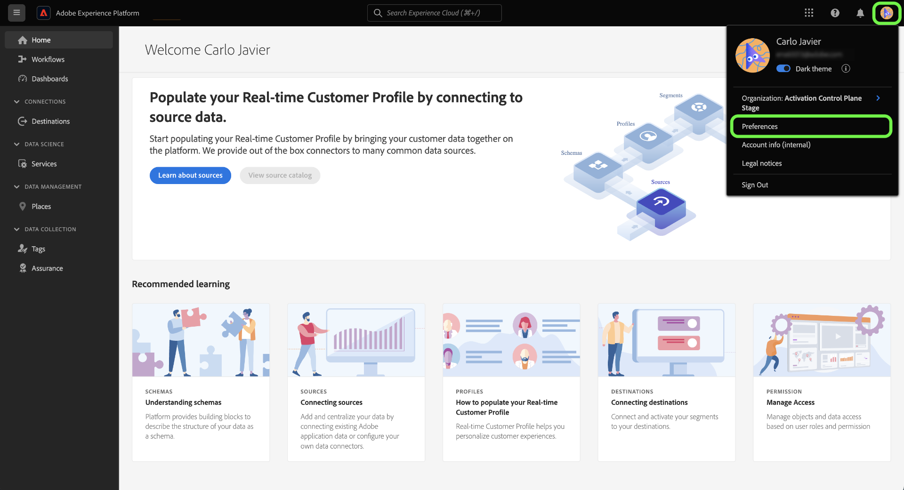

# 使用自我識別調查來建立您的Experience Platform個人設定檔

>[!NOTE]
>
>自我識別調查是測試版。 其功能和檔案可能會有所變更。

自我識別調查是在Adobe Experience Platform UI首頁中提供的簡短問卷。 您可以填寫調查，以提供您的工作職能和一般目標的相關資訊。 然後，這些資訊將用於更好地協調產品內指南，並最終提供與您的目標更相關的內容。

本檔案提供相關資訊，說明如何根據您的目標和任務，使用Platform UI中的自我識別調查來接收相關內容，以及如何使用UI重新設定您的個人設定檔屬性。

若要進一步了解Adobe Experience Platform，請閱讀 [Experience Platform概述](home.md).

## Platform UI中的自我識別調查

登入時，自我識別調查提示會出現在Platform UI首頁的右下方。

若要開始調查，請選取 **[!UICONTROL 開始]**.

針對第一個調查問題，選取最能說明您工作的函式。

可使用的選項包括：

* 管理
* 工程
* 隱私權與控管
* 行銷
* 其他

>[!NOTE]
>
>您可以從選項清單中選取多個函式。 如果您選取 [!UICONTROL 其他]，系統會提示您提供目標的詳細資訊。

若要繼續，請選取最能說明目前工作的函式，然後選取 **[!UICONTROL 下一個]**.

接下來，選取最適合您工作的特定目標。

可用目標清單包括：

* 建立和管理使用者
* 指派角色、權限和產品設定檔
* 管理授權使用、沙箱和警報
* 設定資料擷取系統
* 模型我組織的資料結構
* 查詢、篩選和最佳化資料，以產生深入分析
* 設定同意和資料原則
* 資料控管與隱私權法規遵循
* 制定行銷策略
* 建立、管理和區隔對象
* 設定控制面板以分析業務影響
* 將資料啟用至下游目標的目的地

完成後，請選取 **[!UICONTROL 提交]**.

完成自我識別調查後，請選取 **[!UICONTROL 完成]**.

>[!NOTE]
>
>目標和建議（如果存在）將根據選定的工作職能進行更改。

## 更新調查回應

使用「Experience Cloud首選項」菜單更新作業函式和對象。 若要存取偏好設定功能表，請在頂端導覽列中選取您的設定檔圖示，然後選取 **[!UICONTROL 偏好設定]**.

接下來，在 [!UICONTROL 一般] 「配置檔案首選項」菜單的部分，請選擇 **[!UICONTROL 更新您的職能和目標]**.

此時會出現自我識別調查，讓您重新設定回應並更新設定檔。

## 後續步驟

閱讀本檔案後，您現在已提交及更新有關工作功能和目標的資訊，以便在使用Platform UI時接收更相關的內容。 如需Platform UI的詳細資訊，請參閱 [Experience Platform概述](home.md).