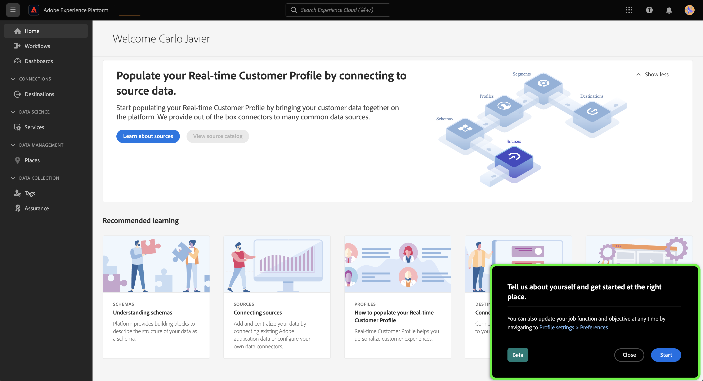

# 使用自我識別調查來構建您的Experience Platform個人配置檔案

>[!NOTE]
>
>自我鑑定調查是β 其功能和文檔可能會更改。

自我識別調查是Adobe Experience Platform用戶介面首頁上提供的一份簡短問卷。 您可以填寫調查，以提供有關工作職能和一般目標的資訊。 然後，此資訊用於更好地協調產品內指南，並最終提供與您的目標更相關的內容。

本文檔提供了有關如何使用平台UI中的自我識別調查來根據您的目標和任務接收相關內容的資訊，以及如何使用UI重新配置您的個人配置檔案屬性。

要瞭解有關Adobe Experience Platform的更多資訊，請閱讀 [Experience Platform概述](home.md)。

## 平台UI中的自身識別調查

登錄時，自身識別調查提示出現在平台UI首頁的右下角。

要開始調查，請選擇 **[!UICONTROL 開始]**。

對於第一個調查問題，選擇最能說明您工作的函式。

可使用的選項包括：

* 管理
* 工程
* 隱私和治理
* 營銷
* 其他

>[!NOTE]
>
>可以從選項清單中選擇多個函式。 如果選擇 [!UICONTROL 其他]，系統將提示您提供有關目標的詳細資訊。

要繼續，請選擇最能描述當前工作的函式，然後選擇 **[!UICONTROL 下一個]**。

接下來，選擇最適合您的工作的特定目標。

可用目標清單包括：

* 建立和管理用戶
* 分配角色、權限和產品配置檔案
* 管理許可證使用、沙箱和警報
* 配置系統以接收資料
* 為我組織的資料結構建模
* 查詢、篩選和優化資料以生成洞察力
* 配置同意和資料策略
* 資料治理和隱私合規性
* 制定營銷策略
* 建立、管理和分段受眾
* 設定儀表板以分析業務影響
* 將資料激活到目標以進行下游目標

完成後，選擇 **[!UICONTROL 提交]**。

完成自我識別調查後，選擇 **[!UICONTROL 完成]**。

>[!NOTE]
>
>目標和建議（如果有）將根據選定的工作職能而改變。

## 更新調查響應

使用Experience Cloud首選項菜單更新作業函式和對象。 要訪問首選項菜單，請在頂部導航中選擇您的配置檔案表徵圖，然後選擇 **[!UICONTROL 首選項]**。

下一步，在 [!UICONTROL 常規] 「配置檔案首選項」菜單中的 **[!UICONTROL 更新您的工作職能和目標]**。

此時將顯示自我識別調查，允許您重新配置響應並更新配置檔案。

## 後續步驟

通過閱讀此文檔，您現在已提交並更新了有關您的工作職能和目標的資訊，以便在使用平台UI時接收更多相關內容。 有關平台UI的詳細資訊，請閱讀 [Experience Platform概述](home.md)。
