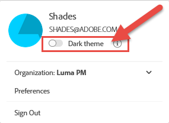

# Adobe Experience Platform UI指南

本指南旨在說明如何使用Adobe Experience Platform使用者介面(UI)、說明各種元件的用途，並提供進一步檔案的連結以取得詳細資訊。

若要進一步瞭解Adobe Experience Platform，請閱讀[Experience Platform概觀](home.md)。

## 主畫面

登入Adobe Experience Platform後，您位於[!UICONTROL 首頁]頁面，其中包含[量度儀表板](#metrics)、[最近使用的資料](#recent-data)和[建議的學習](#recommended-learning)區段。

### 量度

量度控制面板提供卡片，可讓您取得組織內資料集、設定檔、區段和目的地的相關資訊。

**[!UICONTROL 資料集]**&#x200B;區段會顯示貴組織內的資料集數目。 此數字會在建立新資料集時更新。 您可以在[資料集總覽](../catalog/datasets/overview.md)中找到更多有關資料集的資訊。

**[!UICONTROL 設定檔]**&#x200B;區段會顯示貴組織內具有設定檔的總人數，不包括設定檔片段。 此總人數代表可定址對象總數，每24小時更新一次。 您可以在[即時客戶個人檔案總覽](../profile/home.md)中找到更多個人檔案的相關資訊。

**[!UICONTROL 區段]**&#x200B;區段會顯示貴組織內建立的區段總數。 此數字會在建立新區段時更新。 您可以在[區段服務總覽](../segmentation/home.md)中找到更多有關區段的資訊。

**[!UICONTROL 目的地]**&#x200B;區段會顯示為組織建立的目的地總數。 此數字會在建立新目的地時更新。 您可以在[目的地概觀](../destinations/home.md)中找到有關目的地的詳細資訊。

### 最近的資料

最近的資料儀表板提供有關最近建立的資料集、來源、區段和目的地的資訊。

**[!UICONTROL 最近建立的資料集]**&#x200B;區段列出貴組織內最近建立的五個資料集。 每次建立新資料集時，此清單都會更新。 您可以從清單中選取要檢視的資料集您可以找到有關指定資料集的詳細資訊，或選取「檢視全部&#x200B;**[!UICONTROL 」]**&#x200B;檢視所有已建立資料集的清單。 您可以在[資料集總覽](../catalog/datasets/overview.md)中找到更多有關資料集的資訊。

**[!UICONTROL 最近來源]**&#x200B;區段列出貴組織內最近建立的五個來源聯結器。 每次建立新的來源聯結器時，此清單都會更新。 您可以從清單中選取要檢視的來源連線。您可以找到有關指定聯結器的詳細資訊，或選取[檢視全部] **[!UICONTROL 檢視所有已建立來源連線的清單。]**&#x200B;您可以在[來源概觀](../sources/home.md)中找到更多有關來源的資訊。

**[!UICONTROL 最近的區段]**&#x200B;區段列出貴組織內最近建立的五個區段定義。 每次建立新區段定義時，此清單都會更新。 您可以從清單中選取要檢視的區段定義。您可以找到有關指定區段定義的詳細資訊，或選取[檢視全部] **&#x200B;**&#x200B;檢視所有已建立區段定義的清單。 您可以在[區段服務總覽](../segmentation/home.md)中找到更多有關區段的資訊。

**[!UICONTROL 最近建立的目的地]**&#x200B;區段列出貴組織內最近建立的五個目的地。 每次建立新目的地時，此清單都會更新。 您可以從清單中選取要檢視的目的地。您可以找到有關指定目的地的詳細資訊，或選取[檢視全部] **[!UICONTROL 檢視所有已建立目的地的清單。]**&#x200B;您可以在[目的地概觀](../destinations/home.md)中找到有關目的地的詳細資訊。

### 建議學習

**[!UICONTROL 建議的學習]**&#x200B;區段提供實用檔案的連結，以便開始使用Adobe Experience Platform。

## 頂端導覽列

Experience Platform UI的頂端導覽列會顯示您目前登入的組織，並提供數個重要控制項。

導覽列的左側是Adobe Experience Platform標誌。 您隨時都可以選取此標誌，返回Experience Platform UI首頁畫面。

### 組織切換器

上方導覽列右側的第一個專案是&#x200B;**組織切換器**。

選取切換器會開啟您有權存取的組織的下拉式選單（如果有的話）。 若要切換至其他組織，請選取列出的選項。

### 切換應用程式

頂端導覽列右側的下一個專案是&#x200B;**應用程式切換器**，由圖示表示。 選取此圖示時，您可以在組織有權存取的Adobe應用程式(例如Experience Platform、Analytics、Assets和其他應用程式)之間切換。

### 說明

應用程式切換器右側是&#x200B;**說明與支援功能表**，以圖示表示。 當您選取此圖示時，會顯示一個彈出選單，其中包含數個說明和支援資源。 **[!UICONTROL 說明]**&#x200B;索引標籤會顯示您目前所在頁面的相關檔案清單。 **[!UICONTROL 支援]**&#x200B;索引標籤可讓您與Adobe支援團隊建立支援票證。 **[!UICONTROL 意見反應]**&#x200B;索引標籤可讓您將有關Experience Platform的意見反應提交至Adobe。

### 通知和公告

在&#x200B;**通知區段**&#x200B;中，以圖示表示。 **[!UICONTROL 通知]**&#x200B;索引標籤顯示產品的重要資訊以及其他相關更新，而&#x200B;**[!UICONTROL 公告]**&#x200B;索引標籤顯示服務維護的相關資訊。

### 使用者設定檔

頂端導覽列上的最後一個專案是&#x200B;**使用者設定**，以圖示表示。 選取此圖示可編輯您的偏好設定或登出。

您可以使用位於您名稱和電子郵件正下方的開關，在Experience Platform介面的淺色和深色主題之間切換。 選取您偏好的主題。

### 沙箱

沙箱列緊鄰頂端導覽列下方。 此列會顯示您目前用於Experience Platform的沙箱。 您可以在[沙箱總覽](../sandboxes/home.md)中找到更多有關沙箱的資訊。

## 左側導覽 {#left-nav}

畫面左側的導覽會列出Experience Platform UI支援的所有不同服務。

按一下功能表圖示以顯示或隱藏左側導覽面板。

您可以在顯示面板後按一下，將導覽鎖定在開啟位置。

>[!IMPORTANT]
>
>左側導覽列僅顯示您可以存取的功能。 在舊版Adobe Experience Platform中，無法使用的專案已停用。 如果您認為您應該擁有未出現之區段的存取權，請聯絡您的系統管理員。

**[!UICONTROL 首頁]**&#x200B;區段可讓您返回Experience Platform UI首頁。

**[!UICONTROL 工作流程]**&#x200B;區段會顯示在Experience Platform中執行作業的多步驟工作流程清單。 您可以在[工作流程概觀](./workflows.md)中找到工作流程的詳細資訊。

### [!UICONTROL 連線]

**[!UICONTROL 來源]**&#x200B;區段可讓您建立、更新及刪除來源連線，讓您將資料從外部來源擷取到Experience Platform。 您可以在[來源概觀](../sources/home.md)中找到更多有關來源的資訊。

**[!UICONTROL 目的地]**&#x200B;區段可讓您建立、更新和刪除目的地，讓您將資料從Experience Platform匯出至許多外部目的地。 您可以在[目的地概觀](../destinations/home.md)中找到有關目的地的詳細資訊。

### [!UICONTROL 客戶]

**[!UICONTROL 設定檔]**&#x200B;區段可讓您瀏覽客戶設定檔、檢視設定檔量度、建立和管理合併原則，以及檢視聯合結構描述。 若要進一步瞭解如何使用[!UICONTROL 設定檔]區段，請閱讀[[!DNL Profile] 使用手冊](../profile/ui/user-guide.md)。 您可以在[即時客戶個人檔案總覽](../profile/home.md)中找到有關即時客戶個人檔案的更多資訊。

**[!UICONTROL 對象]**&#x200B;區段可讓您建立和管理區段定義。 若要進一步瞭解如何使用[!UICONTROL 對象]區段，請閱讀[分段使用手冊](../segmentation/ui/overview.md)。 您可以在[細分服務總覽](../segmentation/home.md)中找到更多有關細分服務的資訊。

**[!UICONTROL 身分]**&#x200B;區段可讓您建立和管理身分名稱空間。 如需[!UICONTROL 身分]區段的詳細資訊，包括身分名稱空間以及如何在Experience Platform UI中使用身分的資訊，請參閱[身分名稱空間概觀](../identity-service/features/namespaces.md)。

### [!UICONTROL 隱私]

**[!UICONTROL 原則]**&#x200B;區段可讓您建立和管理資料使用原則。 若要進一步瞭解如何使用原則區段，請參閱[資料使用原則使用手冊](../data-governance/policies/user-guide.md)。 您可以在[資料使用原則概觀](../data-governance/policies/overview.md)中找到更多有關資料使用原則的資訊。

**[!UICONTROL 要求]**&#x200B;區段可讓您建立和管理隱私權要求。 請注意，您必須加入允許清單才能存取Privacy Service UI。 若要進一步瞭解如何使用請求區段，請參閱[Privacy Service使用手冊](../privacy-service/ui/user-guide.md)。 您可以在[Privacy Service概觀](../privacy-service/home.md)中找到更多有關Privacy Service的資訊。

### [!UICONTROL 資料科學]

**[!UICONTROL Notebooks]**&#x200B;區段提供JupyterLab的存取權，此互動式開發環境可讓您探索、分析您的資料並將其模型化。 若要進一步瞭解如何使用Notebooks區段，請閱讀[JupyterLab使用手冊](../data-science-workspace/jupyterlab/overview.md)。 您可以在[資料科學Workspace概觀](../data-science-workspace/home.md)中找到更多有關Workspace的資訊

**[!UICONTROL 模型]**&#x200B;區段可讓您使用機器學習和人工智慧來建立、開發、訓練及調整模型以進行預測。 您可以在有關[訓練與評估模型](../data-science-workspace/models-recipes/train-evaluate-model-ui.md)的教學課程中，找到有關「模型」區段的詳細資訊。

**[!UICONTROL 服務]**&#x200B;區段可讓您管理已發佈的模型，以進行排程的訓練和評分，或使用Adobe的Intelligent Services （一組提供即時、個人化客戶體驗的AI服務）。 您可以在[將模型發佈為服務教學課程](../data-science-workspace/models-recipes/publish-model-service-ui.md)中找到有關「服務」區段的詳細資訊。

### [!UICONTROL 資料管理]

「**[!UICONTROL 結構描述]**」區段可讓您建立和管理Experience Data Model (XDM)結構描述。 若要深入瞭解結構描述，請閱讀有關[建立結構描述](../xdm/tutorials/create-schema-ui.md)的教學課程。 您可以在[XDM系統總覽](../xdm/home.md)中找到更多有關XDM的資訊。

**[!UICONTROL 資料集]**&#x200B;區段可讓您建立和管理資料集。 您可以在[資料集使用手冊](../catalog/datasets/user-guide.md)中找到更多有關資料集的資訊。

**[!UICONTROL 查詢]**&#x200B;區段可讓您建立和管理查詢、記錄Adobe Experience Platform查詢服務所進行的SQL查詢，以及檢視您的[!DNL PostgreSQL]認證。 您可以在[查詢服務使用手冊](../query-service/ui/overview.md)中找到更多關於查詢的資訊。

**[!UICONTROL 監視]**&#x200B;區段可讓您監視批次和串流擷取。 您可以在[監視資料擷取使用手冊](../ingestion/quality/monitor-data-ingestion.md)中找到更多有關監視的資訊。

### [!UICONTROL 同盟資料]

**[!UICONTROL 模型]**&#x200B;區段可讓您設計和建立定義資料結構、關係和限制的資料模型和結構描述。 您可以在[同盟對象構成使用手冊](https://experienceleague.adobe.com/en/docs/federated-audience-composition/using/config/datamodel/schemas)中找到有關資料模型和結構描述的詳細資訊。

**[!UICONTROL 稽核軌跡]**&#x200B;區段提供已即時對您的環境進行的所有動作和事件的詳細時間順序記錄。 您可以在[同盟對象組合使用手冊](https://experienceleague.adobe.com/en/docs/federated-audience-composition/using/audit-trail/audit-trail)中找到更多有關稽核軌跡的資訊。

**[!UICONTROL 同盟資料庫]**&#x200B;區段可讓您將Adobe Experience Platform連線至您的企業資料倉儲。 您可以在[同盟對象組合使用手冊](https://experienceleague.adobe.com/en/docs/federated-audience-composition/using/config/federated-db)中找到有關連線到同盟資料庫的詳細資訊。

### [!UICONTROL Decisioning]

Adobe Journey Optimizer是以Experience Platform為建置基礎的應用程式服務。 它可讓您使用強大的決策技術，在適當的時間為所有接觸點的客戶提供最佳優惠和體驗。 若要進一步瞭解Journey Optimizer，包括使用[!UICONTROL 選件]和[!UICONTROL 活動]，請造訪[Journey Optimizer檔案](https://experienceleague.adobe.com/docs/journey-optimizer.html?lang=zh-Hant)。

### [!UICONTROL 管理]

Experience Platform使用者介面(UI)提供了一個儀表板，您可以通過該儀表板檢視有關您組織的授權使用的重要資訊，如每日快照期間所擷取。 在導覽中選取&#x200B;**[!UICONTROL 授權使用情況]**，即可存取此儀表板。 若要深入瞭解授權使用儀表板，請造訪[授權使用儀表板指南](./license-usage-and-guardrails/license-usage-dashboard.md)。

>[!IMPORTANT]
>
>授權使用儀表板功能目前為Alpha版，並非所有使用者都可使用。 文件和功能可能會有所變更。

## 後續步驟

閱讀本指南後，您將瞭解Experience Platform UI的首頁和主要導覽元素。 如需在使用使用者介面時的詳細資訊，請參閱各個Experience Platform服務的檔案。 此檔案的[左側導覽](#left-nav)區段提供連結，該區段在此檔案的較早章節中找到。
