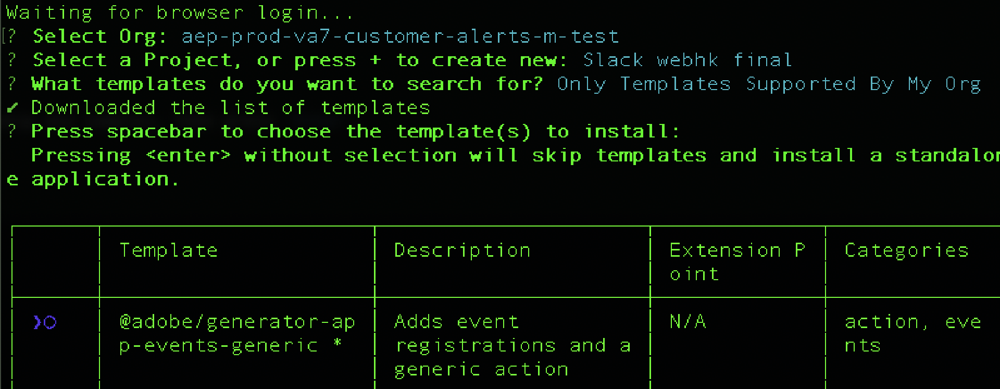
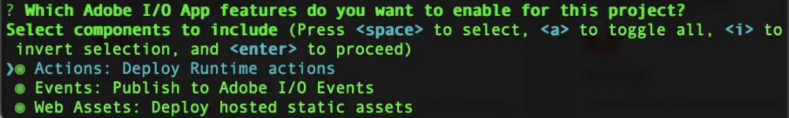
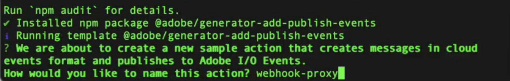

# 針對客戶警示的Slack整合

Adobe Experience Platform可讓您在[Adobe App Builder](https://developer.adobe.com/app-builder/docs/get_started/app_builder_get_started/first-app)上使用webhook proxy在[中接收](https://developer.adobe.com/events/docs/guides/)Adobe I/O Events[!DNL Slack]。 Proxy會處理Adobe的驗證交握，並將事件裝載轉換為[!DNL Slack]則訊息，這樣您便可取得傳送至您工作區的客戶通知。

## 先決條件 {#prerequisites}

開始之前，請確定您具備下列條件：

* **Adobe Developer Console存取**：已啟用App Builder的組織中的系統管理員或開發人員角色。
* **Node.js和npm**： Node.js （建議使用LTS），其中包含安裝Adobe CLI和專案相依性的npm。 如需詳細資訊，請參閱[下載Node.js](https://nodejs.org/)和[npm快速入門手冊](https://docs.npmjs.com/getting-started)。
* **Adobe I/O CLI**：從您的終端機安裝Adobe I/O CLI： `npm install -g @adobe/aio-cli`。
* **具有傳入Webhook的Slack應用程式**：工作區中啟用&#x200B;**傳入Webhook**&#x200B;的Slack應用程式。 請參閱[建立Slack應用程式](https://api.slack.com/apps)和[Slack傳入Webhook指南](https://api.slack.com/messaging/webhooks)，以建立應用程式並取得webhook URL （格式： `https://hooks.slack.com/...`）。

## 設定樣板化專案 {#templated-project}

若要設定樣板化專案，請登入Adobe Developer Console，然後從&#x200B;**[!UICONTROL Create project from template]**&#x200B;索引標籤中選取&#x200B;**[!UICONTROL Home]**。

![Developer Console醒目提示[首頁]索引標籤和[從範本建立專案]。](../images/alerts/slack-integration/developer-console-home.png)

選取&#x200B;**[!UICONTROL App Builder]**&#x200B;範本，然後輸入&#x200B;**[!UICONTROL Project Title]**&#x200B;並選取&#x200B;**[!UICONTROL Add workspace]**。 最後，選取&#x200B;**[!UICONTROL Save]**。


您將會收到專案已建立且已移至「**[!UICONTROL Project overview]**」索引標籤的確認。 您可以在此處新增&#x200B;**[!UICONTROL Project description]**。


## 初始化專案 {#initialize-project}

設定好樣板化專案後，請初始化專案。

1. 開啟您的終端機，然後輸入以下命令以登入Adobe I/O。

   ```bash
   aio login
   ```

1. 初始化應用程式並提供名稱。

   ```bash
   aio app init slack-webhook-proxy
   ```

1. 使用方向鍵選取您的`Organization`，然後選取您先前在Developer Console中建立的`Project`。 選取`Only Templates Supported By My Org`以搜尋範本。

   

1. 接著，按&#x200B;**Enter**&#x200B;跳過範本並安裝獨立的應用程式。

   

1. 指定您要為此專案啟用的Adobe I/O應用程式功能。 使用方向鍵捲動並選取`Actions: Deploy Runtime actions`。

   

1. 使用方向鍵捲動並選取`Adobe Experience Platform: Realtime Customer Profile`作為您要建立的範例動作型別。

   

1. 捲動並選取`Pure HTML/JS`以取得您要新增至範本的UI。 按&#x200B;**Enter**&#x200B;保留範例動作為預設值，然後再次按&#x200B;**Enter**&#x200B;保留名稱為預設值。

   

   您會收到應用程式初始化完成的確認。

1. 導覽至專案目錄。

   ```bash
   cd slack-webhook-proxy
   ```

1. 新增Web動作。

   ```bash
   aio app add action
   ```

1. 選取 `Only Action Templates Supported By My Org`。範本清單隨即顯示。

   

1. 按空格鍵來選取範本，然後使用您的`@adobe/generator-add-publish-events`向上&#x200B;**和**&#x200B;向下&#x200B;**箭頭導覽至**。 最後，按&#x200B;**空格鍵**&#x200B;並按&#x200B;**Enter**&#x200B;以選取範本。

   

   顯示已安裝`npm package @adobe/generator-add-publish-events`的確認。

1. 為動作`webhook-proxy`命名。

   

   此時會顯示已安裝範本的確認。

## 建立檔案動作並部署 {#create-file-actions}

新增Proxy程式碼、設定環境變數，然後部署。 之後，您便可在Developer Console中使用該動作進行註冊。

### 實作執行階段Proxy {#runtime-proxy}

>[!NOTE]
>
>使用執行階段動作註冊時，會自動進行簽章驗證和挑戰處理。

瀏覽至專案資料夾，並開啟檔案`actions/webhook-proxy/index.js`。 刪除內容並以下列內容取代：

```
const fetch = require("node-fetch");
const { Core } = require("@adobe/aio-sdk");
 
/**
 * Adobe I/O Events to Slack Runtime Proxy
 *
 * Receives events from Adobe I/O Events and forwards them to Slack.
 * Signature verification and challenge handling are automatic when
 * using Runtime Action registration (non-web action).
 */
async function main(params) {
  const logger = Core.Logger("runtime-proxy", { level: params.LOG_LEVEL || "info" });
 
  try {
    logger.info(`Event received: ${JSON.stringify(params)}`);
 
    // Forward to Slack
    return forwardToSlack(params, params.SLACK_WEBHOOK_URL, logger);
 
  } catch (error) {
    logger.error(`Error: ${error.message}`);
    return { statusCode: 500, body: { error: "Internal server error" } };
  }
}
 
/**
 * Forwards the event payload to Slack
 */
async function forwardToSlack(payload, webhookUrl, logger) {
  if (!webhookUrl) {
    logger.error("SLACK_WEBHOOK_URL not configured");
    return { statusCode: 500, body: { error: "Server configuration error" } };
  }
 
  // Extract Adobe headers passed to runtime action
  const headers = {
    "x-adobe-event-code": payload["x-adobe-event-code"],
    "x-adobe-event-id": payload["x-adobe-event-id"],
    "x-adobe-provider": payload["x-adobe-provider"]
  };
 
  const slackMessage = buildSlackMessage(payload, headers);
 
  const response = await fetch(webhookUrl, {
    method: "POST",
    headers: { "Content-Type": "application/json" },
    body: JSON.stringify(slackMessage)
  });
 
  if (!response.ok) {
    const errorText = await response.text();
    logger.error(`Slack API error: ${response.status} - ${errorText}`);
    return { statusCode: response.status, body: { error: errorText } };
  }
 
  logger.info("Event forwarded to Slack");
  return { statusCode: 200, body: { success: true } };
}
 
/**
 * Builds a Slack Block Kit message from the event payload
 */
function buildSlackMessage(payload, headers) {
  // Adobe passes event code as x-adobe-event-code header (available in params for runtime actions)
  const eventType = headers["x-adobe-event-code"] ||
                    payload["x-adobe-event-code"] ||
                    payload.event_code ||
                    payload.type ||
                    payload.event_type ||
                    "Adobe Event";
  const eventId = headers["x-adobe-event-id"] || payload["x-adobe-event-id"] || payload.event_id || payload.id || "N/A";
  const eventData = payload.data || payload.event || payload;
 
  return {
    blocks: [
      {
        type: "header",
        text: { type: "plain_text", text: `Event: ${eventType}`, emoji: true }
      },
      {
        type: "section",
        fields: formatDataFields(eventData)
      },
      { type: "divider" },
      {
        type: "context",
        elements: [{
          type: "mrkdwn",
          text: `*Event ID:* ${eventId}  |  *Time:* ${new Date().toISOString()}`
        }]
      }
    ]
  };
}
 
/**
 * Formats event data as Slack mrkdwn fields
 */
function formatDataFields(data, maxFields = 10) {
  if (typeof data !== "object" || data === null) {
    return [{ type: "mrkdwn", text: `*Payload:*\n${String(data)}` }];
  }
 
  const entries = Object.entries(data);
  if (entries.length === 0) {
    return [{ type: "mrkdwn", text: "_No data provided_" }];
  }
 
  return entries.slice(0, maxFields).map(([key, value]) => ({
    type: "mrkdwn",
    text: `*${key}:*\n${typeof value === "object" ? `\`\`\`${JSON.stringify(value)}\`\`\`` : value}`
  }));
}
 
exports.main = main;
```

### 在app.config.yaml中設定動作 {#app-config}

>[!IMPORTANT]
>
>`app.config.yaml`中的動作設定是關鍵的。 您必須使用`web: no`來建立可在Developer Console中註冊為執行階段動作的非Web動作。

瀏覽至專案資料夾並開啟`app.config.yaml`。 以下列專案取代內容：

```
application:
  runtimeManifest:
    packages:
      slack-webhook-proxy:
        license: Apache-2.0
        actions:
          webhook-proxy:
            function: actions/webhook-proxy/index.js
            web: no
            runtime: nodejs:22
            inputs:
              LOG_LEVEL: info
              SLACK_WEBHOOK_URL: $SLACK_WEBHOOK_URL
            annotations:
              require-adobe-auth: false
              final: true
```

### 環境變數 {#environment-variables}

>[!IMPORTANT]
>
>若沒有正確設定的.env檔案，應用程式將無法執行。

若要安全地管理認證，請使用環境變數。 修改專案根目錄中的`.env`檔案並新增：

```
SLACK_WEBHOOK_URL=https://hooks.slack.com/services/YOUR/WEBHOOK/URL
```

### 部署動作 {#deploy-action}

設定環境變數後，請部署動作。 在終端機中執行此命令時，請確定您位於專案的根目錄中(`slack-webhook-proxy`)：

```bash
aio app deploy
```

此時會顯示部署成功的確認。

>[!IMPORTANT]
>
>您的動作已部署至Adobe I/O Runtime。 此動作現在可在Developer Console中取得註冊。

## 向Adobe I/O Events註冊動作 {#register-events}

部署您的動作後，請將其註冊為Adobe I/O Events的目的地。

在Developer Console中，開啟您的App Builder專案，然後選取您的&#x200B;**[!UICONTROL Workspace]**。

在Workspace概觀頁面上，選取&#x200B;**[!UICONTROL Add service]**&#x200B;和&#x200B;**[!UICONTROL Event]**。


在[新增事件]頁面上，選取&#x200B;**[!UICONTROL Experience Platform]**&#x200B;和&#x200B;**[!UICONTROL Platform notifications]**，然後選取&#x200B;**[!UICONTROL Next]**。

![顯示已選取Experience Platform和Platform通知的[新增事件]頁面。](../images/alerts/slack-integration/add-events.png)

選取您要接收通知的事件，然後選取&#x200B;**[!UICONTROL Next]**。

![[新增事件]頁面顯示要訂閱的事件清單。](../images/alerts/slack-integration/select-events.png)

選取您的伺服器對伺服器驗證認證，然後選取&#x200B;**[!UICONTROL Next]**。

![顯示伺服器對伺服器驗證認證選取專案的[新增事件]頁面。](../images/alerts/slack-integration/add-events-credentials.png)

輸入註冊的&#x200B;**[!UICONTROL Event registration name]**&#x200B;與清除&#x200B;**[!UICONTROL Event registration description]**，然後選取&#x200B;**[!UICONTROL Next]**。

![顯示事件註冊名稱與事件註冊描述欄位的[新增事件]頁面。](../images/alerts/slack-integration/add-events-registration.png)

選取&#x200B;**[!UICONTROL Runtime Action]**&#x200B;作為傳遞方式以及您建立的`slack-webhook-proxy/runtime-proxy`動作，然後選取&#x200B;**[!UICONTROL Save configured events]**。

![顯示[執行階段動作]傳遞方法與[儲存已設定的事件]的[新增事件]頁面。](../images/alerts/slack-integration/add-events-runtime.png)

現在已設定您的webhook Proxy。 您會返回Webhook Proxy頁面。 您可以選取任何已設定事件旁的&#x200B;**[!UICONTROL Send sample event]**&#x200B;圖示，以端對端測試整個流程。


