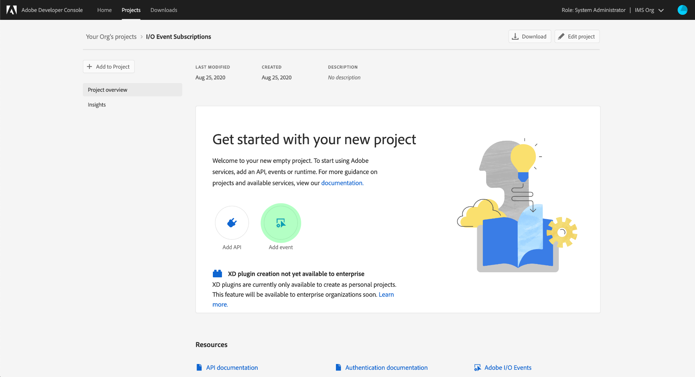

# 訂閱Adobe I/O事件通知

[!DNL Observability Insights]可讓您訂閱有關Adobe Experience Platform活動的Adobe I/O事件通知。 這些事件會傳送至已設定的webhook，以促進活動監控的有效自動化。

本檔案提供如何訂閱Adobe Experience Platform服務Adobe I/O事件通知的步驟。 也提供有關可用事件型別的參考資訊，以及有關如何解譯每個適用[!DNL Platform]服務之傳回事件資料的進一步檔案連結。

## 快速入門

本檔案需要實際瞭解Webhook以及如何將Webhook從一個應用程式連線到另一個應用程式。 如需Webhook的簡介，請參閱[[!DNL I/O Events] 檔案](https://www.adobe.io/apis/experienceplatform/events/docs.html#!adobedocs/adobeio-events/master/intro/webhook_docs_intro.md)。

## 建立webhook

為了接收[!DNL I/O Event]通知，您必須透過指定唯一的webhook URL作為事件註冊詳細資料的一部分來註冊webhook。

您可以使用所選的使用者端來設定webhook。 若要使用暫時webhook位址做為本教學課程的一部分，請造訪[Webhook.site](https://webhook.site/)，並複製提供的唯一URL。

在初始驗證程式期間，[!DNL I/O Events]會在GET要求中將`challenge`查詢引數傳送至webhook。 您必須設定webhook，以在回應裝載中傳回此引數的值。 如果您正在使用Webhook.site，請在右上角選取&#x200B;**[!DNL Edit]**，然後在&#x200B;**[!DNL Response body]**&#x200B;下輸入`$request.query.challenge$`，然後再選取&#x200B;**[!DNL Save]**。

## 在Adobe Developer Console中建立新專案

移至[Adobe Developer Console](https://www.adobe.com/go/devs_console_ui)並使用您的Adobe ID登入。 接下來，請依照教學課程中概述的步驟，在Adobe Developer Console檔案中建立[空白專案](https://developer.adobe.com/developer-console/docs/guides/projects/projects-empty/)。

## 訂閱事件

>[!NOTE]
>
>Adobe I/O已棄用資料擷取通知事件。您應該改用&#x200B;**來源資料流執行資訊** I/O事件。

建立新專案後，導覽至該專案的概觀畫面。 從這裡，選取&#x200B;**[!UICONTROL 新增事件]**。

會出現一個對話方塊，讓您新增事件提供者至專案：

* 如果您正在訂閱Experience Platform警示，請選取&#x200B;**[!UICONTROL 平台通知]**
* 如果您正在訂閱Adobe Experience Platform [!DNL Privacy Service]通知，請選取&#x200B;**[!UICONTROL Privacy Service事件]**

選擇事件提供者後，請選取&#x200B;**[!UICONTROL 下一步]**。

下一個畫面會顯示要訂閱的事件型別清單。 選取您要訂閱的事件，然後選取&#x200B;**[!UICONTROL 下一步]**。

>[!NOTE]
>
>如果您不確定要訂閱目前使用之服務的哪些事件，請參閱下列檔案：
>
>* [平台通知](./rules.md)
>* [Privacy Service通知](../../privacy-service/privacy-events.md)

下一個畫面會提示您建立JSON Web權杖(JWT)。 您可以選擇自動產生金鑰組，或上傳您在終端機中產生的公開金鑰。

在本教學課程中，會說明第一個選項。 選取&#x200B;**[!UICONTROL 產生金鑰組]**&#x200B;的選項方塊，然後選取右下角的&#x200B;**[!UICONTROL 產生金鑰組]**&#x200B;按鈕。

當金鑰組產生時，瀏覽器會自動下載金鑰。 您必須自行儲存此檔案，因為它並未儲存在Developer Console中。

下一個畫面可讓您檢閱新產生的金鑰組的詳細資訊。 選取&#x200B;**[!UICONTROL 「下一步」]**&#x200B;以繼續。

在下一個畫面中，在[!UICONTROL 事件註冊詳細資料]區段中提供事件註冊的名稱和描述。 最佳實務是建立唯一、易於識別的名稱，以協助將此事件註冊與相同專案中的其他事件註冊區分開來。

在[!UICONTROL 如何接收事件]區段的相同畫面中，您可以選擇設定如何接收事件。 **[!UICONTROL Webhook]**&#x200B;可讓您提供自訂webhook位址來接收事件，而&#x200B;**[!UICONTROL 執行階段動作]**&#x200B;則可讓您使用[Adobe I/O Runtime](https://www.adobe.io/apis/experienceplatform/runtime/docs.html)執行相同的動作。

在本教學課程中，請選取&#x200B;**[!UICONTROL Webhook]**，並提供您先前建立之webhook的URL。 完成後，請選取&#x200B;**[!UICONTROL 儲存已設定的事件]**&#x200B;以完成事件註冊。

此時會顯示新建立之事件註冊的詳細資訊頁面，您可以在此頁面編輯其組態、複查已接收的事件、執行偵錯追蹤，以及新增事件提供者。

## 後續步驟

依照此教學課程，您已註冊webhook以接收[!DNL Experience Platform]和/或[!DNL Privacy Service]的[!DNL I/O Event]通知。 有關可用事件以及如何解讀每個服務通知裝載的詳細資訊，請參閱以下檔案：

* [[!DNL Privacy Service] 通知](../../privacy-service/privacy-events.md)
* [[!DNL Data Ingestion] 通知](../../ingestion/quality/subscribe-events.md)
* [[!DNL Flow Service] （來源）通知](../../sources/notifications.md)

如需如何監視[!DNL Experience Platform]和[!DNL Privacy Service]上的活動的詳細資訊，請參閱[[!DNL Observability Insights] 總覽](../home.md)。
