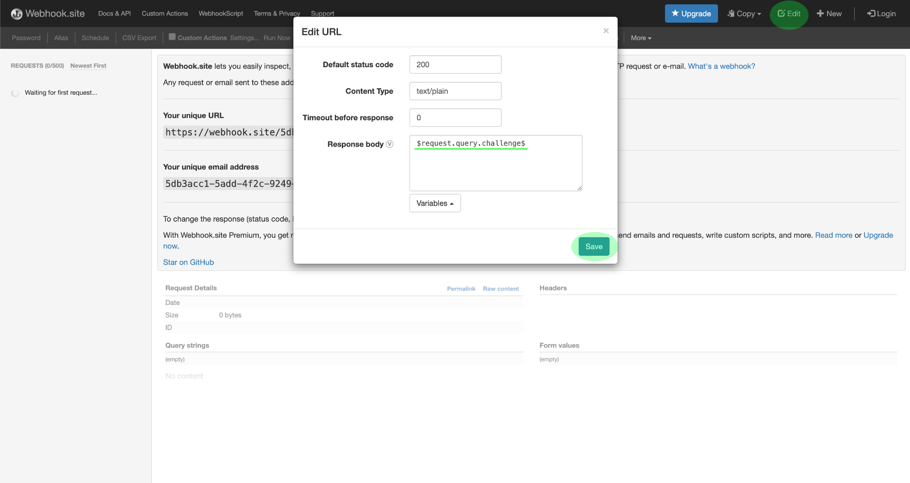

# 訂閱Adobe I/O事件通知

[!DNL Observability Insights] 可讓您訂閱有關Adobe Experience Platform活動的Adobe I/O事件通知。 這些事件會傳送至已設定的webhook，以促進活動監控的有效自動化。

本檔案提供如何訂閱Adobe Experience Platform服務Adobe I/O事件通知的步驟。 另外還提供了有關可用事件型別的參考資訊，以及有關如何解譯每個適用之傳回事件資料的更多檔案連結 [!DNL Platform] 服務。

## 快速入門

本檔案需要實際瞭解Webhook以及如何將Webhook從一個應用程式連線到另一個應用程式。 請參閱 [[!DNL I/O Events] 檔案](https://www.adobe.io/apis/experienceplatform/events/docs.html#!adobedocs/adobeio-events/master/intro/webhook_docs_intro.md) 以瞭解webhook。

## 建立webhook

為了接收 [!DNL I/O Event] 通知，您必須透過指定唯一的webhook URL來註冊webhook，作為事件註冊詳細資料的一部分。

您可以使用所選的使用者端來設定webhook。 如需暫時的webhook位址，請造訪 [Webhook.site](https://webhook.site/) 並複製提供的唯一URL。

在初始驗證程式中， [!DNL I/O Events] 傳送 `challenge` 向webhook發出的GET請求中的查詢引數。 您必須設定webhook，以在回應裝載中傳回此引數的值。 如果您正在使用Webhook.site，請選取 **[!DNL Edit]** 然後在右上角輸入 `$request.query.challenge$` 在 **[!DNL Response body]** 在選取之前 **[!DNL Save]**.

## 在Adobe Developer Console中建立新專案

前往 [Adobe Developer Console](https://www.adobe.com/go/devs_console_ui) 並使用您的Adobe ID登入。 接下來，請依照教學課程中概述的步驟進行 [建立空白專案](https://developer.adobe.com/developer-console/docs/guides/projects/projects-empty/) 在Adobe Developer Console檔案中。

## 訂閱事件

>[!NOTE]
>
>Adobe I/O已棄用資料擷取通知事件。您應該改用 **來源資料流執行資訊** I/O事件。

建立新專案後，導覽至該專案的概觀畫面。 從這裡，選擇 **[!UICONTROL 新增事件]**.

會出現一個對話方塊，讓您新增事件提供者至專案：

* 如果您訂閱Experience Platform警示，請選取 **[!UICONTROL 平台通知]**
* 如果您正在訂閱Adobe Experience Platform [!DNL Privacy Service] 通知，選取 **[!UICONTROL Privacy Service事件]**

選擇事件提供者後，請選取 **[!UICONTROL 下一個]**.

下一個畫面會顯示要訂閱的事件型別清單。 選取您要訂閱的事件，然後選取「 」 **[!UICONTROL 下一個]**.

>[!NOTE]
>
>如果您不確定要訂閱目前使用之服務的哪些事件，請參閱下列檔案：
>
>* [平台通知](./rules.md)
>* [Privacy Service通知](../../privacy-service/privacy-events.md)

下一個畫面會提示您建立JSON Web權杖(JWT)。 您可以選擇自動產生金鑰組，或上傳您在終端機中產生的公開金鑰。

在本教學課程中，會說明第一個選項。 選取的選項方塊 **[!UICONTROL 產生金鑰組]**，然後選取 **[!UICONTROL 產生金鑰組]** 按鈕。

當金鑰組產生時，瀏覽器會自動下載金鑰。 您必須自行儲存此檔案，因為它並未儲存在開發人員主控台中。

下一個畫面可讓您檢閱新產生的金鑰組的詳細資訊。 選取&#x200B;**[!UICONTROL 「下一步」]**&#x200B;以繼續。

在下一個畫面中，為中的事件註冊提供名稱和說明 [!UICONTROL 活動註冊細節] 區段。 最佳實務是建立唯一、易於識別的名稱，以協助將此事件註冊與相同專案中的其他事件註冊區分開來。

在底下的相同畫面上 [!UICONTROL 如何接收事件] 區段，您可以選擇設定接收事件的方式。 **[!UICONTROL Webhook]** 可讓您提供自訂webhook位址來接收事件，而 **[!UICONTROL 執行階段動作]** 可讓您透過以下方式執行相同操作： [Adobe I/O Runtime](https://www.adobe.io/apis/experienceplatform/runtime/docs.html).

在本教學課程中，選取 **[!UICONTROL Webhook]** 並提供您先前建立的webhook的URL。 完成後，選取 **[!UICONTROL 儲存已設定的事件]** 以完成事件註冊。

此時會顯示新建立之事件註冊的詳細資訊頁面，您可以在此頁面編輯其組態、複查已接收的事件、執行偵錯追蹤，以及新增事件提供者。

## 後續步驟

依照本教學課程所述，您已註冊一個webhook以接收 [!DNL I/O Event] 以下專案的通知 [!DNL Experience Platform] 和/或 [!DNL Privacy Service]. 有關可用事件以及如何解讀每個服務通知裝載的詳細資訊，請參閱以下檔案：

* [[!DNL Privacy Service] 通知](../../privacy-service/privacy-events.md)
* [[!DNL Data Ingestion] 通知](../../ingestion/quality/subscribe-events.md)
* [[!DNL Flow Service] （來源）通知](../../sources/notifications.md)

請參閱 [[!DNL Observability Insights] 概述](../home.md) 以取得如何監視活動的詳細資訊， [!DNL Experience Platform] 和 [!DNL Privacy Service].
