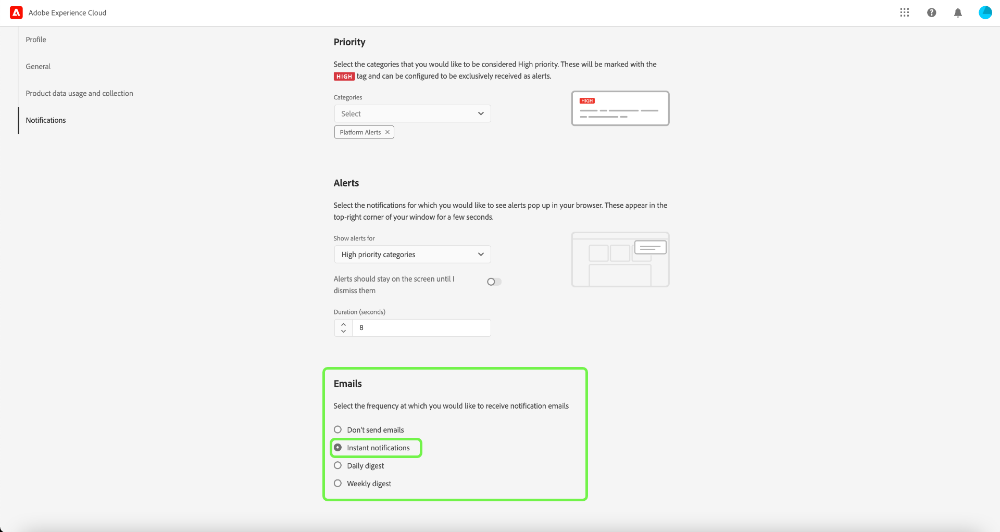

# 警報UI指南

Adobe Experience Platform使用者介面可讓您根據Adobe Experience Platform可觀察性深入分析所揭示的量度，檢視收到警報的歷史記錄。 UI也可讓您檢視、啟用、停用和訂閱可用的警報規則。

>[!NOTE]
>
>如需Experience Platform警報的簡介，請參閱 [警報概觀](./overview.md).

若要開始，請選取 **[!UICONTROL 警報]** 的下一頁。

## 管理警報規則

此 **[!UICONTROL 瀏覽]** 索引標籤會列出可觸發警報的可用規則。

從清單中選取規則，以在右側邊欄中檢視其說明及其設定參數，包括臨界值和嚴重性。

選取省略號(**...**)旁邊，下拉式清單會顯示控制項，用以啟用或停用警報（視其目前狀態而定），以及訂閱或取消訂閱警報的電子郵件通知。

## 啟用電子郵件警報

警報通知可直接傳送至您的電子郵件。

選取鈴聲圖示()，位於顯示通知和公告的右上方功能區。 在隨即顯示的下拉式清單中，選取齒輪圖示()以存取「Experience Cloud偏好設定」頁面。

此 **設定檔** 標籤。 選取 **[!UICONTROL 通知]** 在左側導覽中，存取電子郵件警報偏好設定。

捲動至 **電子郵件** 區段，然後選取 **[!UICONTROL 即時通知]**

您訂閱的任何警報現在都會傳送至與您Adobe ID帳戶連線的電子郵件地址。

## 查看警報歷史記錄

此 **[!UICONTROL 歷史記錄]** 索引標籤會顯示貴組織接收警報的歷史記錄，包括觸發警報、觸發日期和解析日期的規則（若適用）。

選取列出的警報，右側邊欄會顯示更多詳細資料，包括觸發警報之事件的簡短摘要。

## 後續步驟

本檔案概述如何在Platform UI中檢視及管理警報。 請參閱 [可觀察性深入分析](../home.md) 以取得服務功能的詳細資訊。
