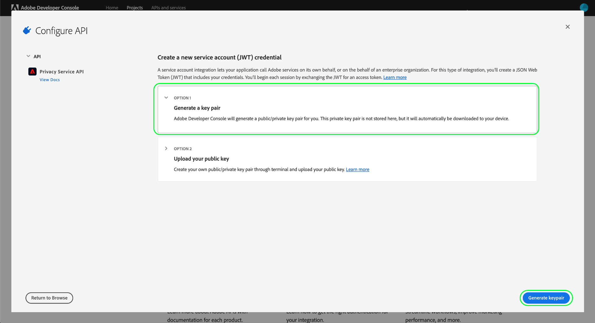

# [!DNL Privacy Service] API指南

Adobe Experience Platform[!DNL Privacy Service]提供REST風格的API和使用者介面，可讓您跨Adobe Experience Cloud應用程式管理（存取和刪除）資料主體（客戶）的個人資料。 [!DNL Privacy Service] 還提供了集中審計和記錄機制，允許您訪問涉及應用程式的作業的狀態和 [!DNL Experience Cloud] 結果。

本指南介紹如何使用[!DNL Privacy Service] API。 如需如何使用UI的詳細資訊，請參閱[Privacy ServiceUI概觀](../ui/overview.md)。 有關[!DNL Privacy Service] API中所有可用端點的完整清單，請參閱[API參考](https://www.adobe.io/apis/experienceplatform/home/api-reference.html#!acpdr/swagger-specs/privacy-service.yaml)。

## 快速入門 {#getting-started}

本指南需要有效瞭解下列[!DNL Experience Platform]功能：

* [[!DNL Privacy Service]](../home.md):提供REST風格的API和使用者介面，讓您管理跨Adobe Experience Cloud應用程式的資料主體（客戶）的存取和刪除要求。

以下各節提供您必須知道的其他資訊，以便成功呼叫Privacy ServiceAPI。

### 讀取範例API呼叫

本教學課程提供範例API呼叫，以示範如何設定請求的格式。 這些包括路徑、必要標題和正確格式化的請求負載。 也提供API回應中傳回的範例JSON。 如需範例API呼叫檔案中所用慣例的詳細資訊，請參閱[!DNL Experience Platform]疑難排解指南中[如何讀取範例API呼叫](../../landing/troubleshooting.md)一節。

## 收集必要標題的值

若要呼叫[!DNL Privacy Service] API，您必須先收集要用於必要標題的存取認證：

* `Authorization: Bearer {ACCESS_TOKEN}`
* `x-api-key: {API_KEY}`
* `x-gw-ims-org-id: {IMS_ORG}`

這包括在Adobe Admin Console取得[!DNL Experience Platform]的開發人員權限，然後在Adobe開發人員主控台中產生認證。

### 取得[!DNL Experience Platform]的開發人員存取權

若要取得[!DNL Platform]的開發人員存取權，請依照[Experience Platform驗證教學課程](https://www.adobe.com/go/platform-api-authentication-en)的開始步驟進行。 進入步驟「在Adobe開發人員控制台中生成訪問憑據」後，請返回本教程以生成特定於[!DNL Privacy Service]的憑據。

### 生成訪問憑據

使用Adobe開發人員主控台，您必須產生下列三種存取憑證：

* `{IMS_ORG}`
* `{API_KEY}`
* `{ACCESS_TOKEN}`

您的`{IMS_ORG}`和`{API_KEY}`只需產生一次，就可在未來的API呼叫中重複使用。 但是，您的`{ACCESS_TOKEN}`是暫時的，必須每24小時重新產生一次。

產生這些值的步驟詳細說明如下。

#### 一次性設定

前往[Adobe開發人員主控台](https://www.adobe.com/go/devs_console_ui)並使用您的Adobe ID登入。 接下來，請依照[教學課程中描述的步驟，在「Adobe開發人員主控台」檔案中建立空白專案](https://www.adobe.io/apis/experienceplatform/console/docs.html#!AdobeDocs/adobeio-console/master/projects-empty.md)。

建立新專案後，請在&#x200B;**[!UICONTROL Project Overview]**&#x200B;畫面上選取&#x200B;**[!UICONTROL Add API]**。

出現&#x200B;**[!UICONTROL Add an API]**&#x200B;螢幕。 在選擇&#x200B;**[!UICONTROL Next]**&#x200B;之前，從可用API的清單中選擇&#x200B;**[!UICONTROL Privacy Service API]**。

出現&#x200B;**[!UICONTROL Configure API]**&#x200B;螢幕。 選擇&#x200B;**[!UICONTROL Generate a key pair]**&#x200B;選項，然後在右下角選擇&#x200B;**[!UICONTROL Generate keypair]**。

系統會自動產生金鑰對，並將包含私密金鑰和公用憑證的ZIP檔案下載至您的本機電腦（稍後的步驟將會使用）。 選擇&#x200B;**[!UICONTROL Save configured API]**&#x200B;以完成配置。

將API新增至專案後，專案頁面會重新顯示在&#x200B;**Privacy ServiceAPI概觀**&#x200B;頁面上。 從這裡，向下滾動到&#x200B;**[!UICONTROL Service Account (JWT)]**&#x200B;部分，該部分提供了對[!DNL Privacy Service] API的所有調用所需的以下訪問憑據：

* **[!UICONTROL CLIENT ID]**:必須在x-api-key標 `{API_KEY}` 題中提供用戶端ID。
* **[!UICONTROL ORGANIZATION ID]**:組織ID是必 `{IMS_ORG}` 須用在x-gw-ims-org-id標題中的值。

#### 每個會話的驗證

您必須收集的最終必要憑證是`{ACCESS_TOKEN}`，它用於「授權」標題中。 與`{API_KEY}`和`{IMS_ORG}`的值不同，必須每24小時產生一個新Token，才能繼續使用[!DNL Platform] API。

要生成新的`{ACCESS_TOKEN}`，請開啟先前下載的私鑰，然後在選擇&#x200B;**[!UICONTROL Generate access token]**&#x200B;之前將其內容貼上到&#x200B;**[!UICONTROL Generate Token]**&#x200B;旁邊的文本框中。

產生新的存取Token，並提供將Token複製至剪貼簿的按鈕。 此值用於所需的「授權」標頭，且必須以`Bearer {ACCESS_TOKEN}`格式提供。

## 後續步驟

現在您已瞭解要使用哪些標題，可以開始呼叫[!DNL Privacy Service] API。 有關[隱私權工作](privacy-jobs.md)的檔案會逐步說明您可使用[!DNL Privacy Service] API進行的各種API呼叫。 每個範例呼叫都包含一般API格式、顯示必要標題的範例要求，以及範例回應。
