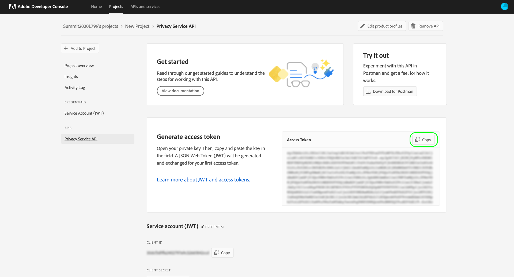

# [!DNL Privacy Service] API指南

Adobe Experience Platform [!DNL Privacy Service]提供RESTful API和使用者介面，可讓您跨Adobe Experience Cloud應用程式管理（存取和刪除）資料主體（客戶）的個人資料。 [!DNL Privacy Service] 還提供中央審核和日誌記錄機制，允許您訪問涉及應用程式的作業的狀態和 [!DNL Experience Cloud] 結果。

本指南說明如何使用[!DNL Privacy Service] API。 如需如何使用UI的詳細資訊，請參閱[Privacy ServiceUI概述](../ui/overview.md)。 如需[!DNL Privacy Service] API中所有可用端點的完整清單，請參閱[ API參考](https://www.adobe.io/experience-platform-apis/references/privacy-service/)。

## 快速入門 {#getting-started}

本指南需要認真了解下列[!DNL Experience Platform]功能：

* [[!DNL Privacy Service]](../home.md):提供RESTful API和使用者介面，可讓您管理Adobe Experience Cloud應用程式中資料主體（客戶）的存取和刪除請求。

以下小節提供您需要知道的其他資訊，以便成功呼叫Privacy ServiceAPI。

### 讀取範例API呼叫

本教學課程提供範例API呼叫，以示範如何設定要求格式。 這些功能包括路徑、必要標題和格式正確的請求裝載。 也提供API回應中傳回的範例JSON。 如需範例API呼叫檔案中所使用慣例的資訊，請參閱[!DNL Experience Platform]疑難排解指南中[如何讀取範例API呼叫](../../landing/troubleshooting.md)一節。

## 收集必要標題的值

若要呼叫[!DNL Privacy Service] API，您必須先收集要用於必要標題的存取憑證：

* `Authorization: Bearer {ACCESS_TOKEN}`
* `x-api-key: {API_KEY}`
* `x-gw-ims-org-id: {IMS_ORG}`

這包括在Adobe Admin Console中取得[!DNL Experience Platform]的開發人員權限，然後在Adobe開發人員控制台中產生認證。

### 獲得[!DNL Experience Platform]的開發人員訪問權

若要取得[!DNL Platform]的開發人員存取權，請遵循[Experience Platform驗證教學課程](https://www.adobe.com/go/platform-api-authentication-en)中的開始步驟。 進入「在Adobe開發人員控制台中生成訪問憑據」步驟後，請返回本教程以生成[!DNL Privacy Service]的特定憑據。

### 生成訪問憑據

使用Adobe開發人員控制台，您必須產生下列三個存取憑證：

* `{IMS_ORG}`
* `{API_KEY}`
* `{ACCESS_TOKEN}`

您的`{IMS_ORG}`和`{API_KEY}`只需產生一次，即可在未來的API呼叫中重複使用。 但是，您的`{ACCESS_TOKEN}`是臨時的，必須每24小時重新生成一次。

以下詳細說明產生這些值的步驟。

#### 一次性設定

前往[Adobe開發人員控制台](https://www.adobe.com/go/devs_console_ui)並使用您的Adobe ID登入。 接下來，請依照「Adobe開發人員控制台」檔案中[建立空白專案](https://www.adobe.io/apis/experienceplatform/console/docs.html#!AdobeDocs/adobeio-console/master/projects-empty.md)教學課程中概述的步驟操作。

建立新專案後，請在&#x200B;**[!UICONTROL 專案概述]**&#x200B;畫面上選取&#x200B;**[!UICONTROL 新增API]** 。

出現「**[!UICONTROL 新增API]**」畫面。 在選擇&#x200B;**[!UICONTROL Next]**&#x200B;之前，從可用API清單中選擇&#x200B;**[!UICONTROL Privacy ServiceAPI]**。

此時會出現「**[!UICONTROL 設定API]**」畫面。 選擇&#x200B;**[!UICONTROL 生成鍵對]**&#x200B;選項，然後在右下角選擇&#x200B;**[!UICONTROL 生成鍵對]**。

系統會自動產生金鑰組，而包含私密金鑰和公開憑證的ZIP檔案會下載至您的本機電腦（以便稍後步驟使用）。 選擇&#x200B;**[!UICONTROL 保存配置的API]**&#x200B;以完成配置。

將API新增至專案後，專案頁面會重新顯示在&#x200B;**Privacy ServiceAPI概覽**&#x200B;頁面上。 從此處，向下捲動至&#x200B;**[!UICONTROL 服務帳戶(JWT)]**&#x200B;區段，該區段提供對[!DNL Privacy Service] API的所有呼叫中所需的下列存取憑證：

* **[!UICONTROL 用戶端ID]**:必須在x-api- `{API_KEY}` key標題中提供的用戶端ID。
* **[!UICONTROL 組織ID]**:組織ID是 `{IMS_ORG}` 必須用於x-gw-ims-org-id標題的值。

#### 每個會話的驗證

您必須收集的最終必要憑證是`{ACCESS_TOKEN}`，該憑證用於「授權」標題中。 與`{API_KEY}`和`{IMS_ORG}`的值不同，必須每24小時產生一個新代號，才能繼續使用[!DNL Platform] API。

若要產生新的`{ACCESS_TOKEN}`，請開啟先前下載的私密金鑰，並將其內容貼到&#x200B;**[!UICONTROL 產生存取權杖]**&#x200B;旁的文字方塊中，再選取&#x200B;**[!UICONTROL 產生權杖]**。

系統會產生新的存取權杖，並提供將權杖複製到剪貼簿的按鈕。 此值用於所需的授權標頭，且必須以`Bearer {ACCESS_TOKEN}`格式提供。

## 後續步驟

現在您已了解要使用的標題，可以開始呼叫[!DNL Privacy Service] API。 [隱私權工作](privacy-jobs.md)的檔案會逐步說明您可使用[!DNL Privacy Service] API進行的各種API呼叫。 每個範例呼叫都包含一般API格式、顯示必要標題的範例要求，以及範例回應。
