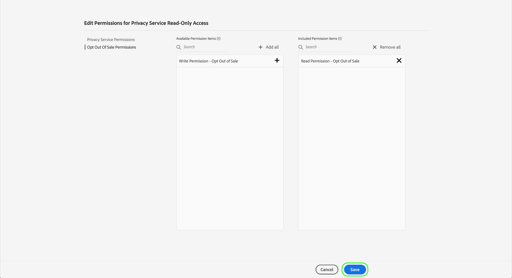
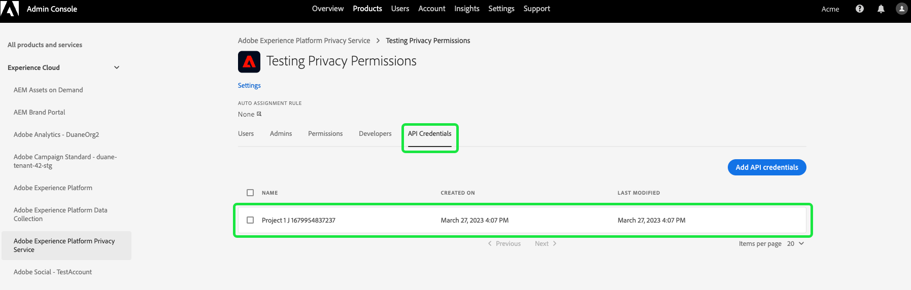

# 管理「Privacy Service」的權限

>[!IMPORTANT]
>
>Adobe Experience Platform Privacy Service 的權限已提升，以提高其精細度層級。這些變更使得組織管理員能夠授予更多使用者所需角色和權限層級的存取權。技術帳戶使用者必須更新其 Privacy Service 的權限，因為此即將發生的更新會對他們造成重大變更。此權限變更的強制執行於 **2023 年 4 月 13 日**&#x200B;發生。如需有關解決此問題的指引，請參閱有關[移轉舊版 API 認證](#migrate-tech-accounts)的文件。
>
>技術帳戶可供企業客戶使用，並會透過 Adobe Developers Console 建立。技術帳戶持有者的 Adob&#x200B;&#x200B;e ID 末尾為 `@techacct.adobe.com`。如果您不確定自己是否為技術帳戶持有者，請和您的組織管理員聯絡。

對 [Adobe Experience Platform Privacy Service](./home.md) 的存取權會透過 Adob&#x200B;&#x200B;e Admin Console 中的精細角色型權限控制。若能建立指派權限給使用者群組的產品設定檔，您即可決定誰擁有對於 Privacy Service [UI](./ui/overview.md) 和 [API](./api/overview.md) 中哪些功能的存取權。

>[!NOTE]
>
>建立 Privacy Service API 的整合時，為了決定該整合擁有哪些功能或動作的權限，您必須選取一個現有的產品設定檔。如需詳細資訊，請至「[Privacy Service API 入門](./api/getting-started.md)」詳閱指南。

本指南會向您說明如何管理 Privacy Service 的權限。

## 快速入門

為了設定「Privacy Service」的存取控制，您必須在有產品和 Adobe Experience Platform Privacy Service 整合的組織中擁有管理員權限。若要能授予或撤回權限，至少要擁有&#x200B;**產品設定檔管理員**&#x200B;的角色。其他可管理權限的管理員角色為&#x200B;**產品管理員** (可管理產品內的所有設定檔) 和&#x200B;**系統管理員** (沒有任何限制)。如需詳細資訊，請參閱 Adobe 企業版管理指南中有關[管理角色](https://helpx.adobe.com/enterprise/using/admin-roles.html)的文章。

本指南假設您熟悉基本的 Admin Console 概念，例如產品設定檔以及它們如何授予個別使用者和群組產品權限。如需詳細資訊，請參閱 [Admin Console 使用手冊](https://helpx.adobe.com/tw/enterprise/using/admin-console.html)。

## 可用權限

下表會概述 Privacy Service 的可用權限，並說明其授予對哪些特定功能的存取權：

>[!NOTE]
>
>所有 Privacy Service 和[!UICONTROL 選擇退出銷售]權限完全不同且彼此獨立，沒有功能重疊。由於 Privacy Service API 被視為冪等，因此這是可能的。

| 類別 | 權限 | 說明 |
| --- | --- | --- |
| [!UICONTROL Privacy Service 權限] | [!UICONTROL 隱私讀取權限] | 決定使用者是否能檢視現有存取權並刪除要求及其詳細資料。 |
| [!UICONTROL Privacy Service 權限] | [!UICONTROL 隱私寫入權限] | 決定使用者是否能建立新的存取權並刪除要求。 |
| [!UICONTROL Privacy Service 權限] | [!UICONTROL 讀取 (存取) 內容傳遞權限] | Privacy Service 處理存取要求時，會將包含客戶資料的 ZIP 檔傳送給該客戶。查詢存取要求的詳細資料時，此權限會決定使用者是否能存取要求的 ZIP 檔的下載連結。 |
| [!UICONTROL 選擇退出銷售權限] | [!UICONTROL 讀取權限 - 選擇退出銷售] | 決定使用者是否能檢視現有的選擇退出銷售要求及其詳細資料。 |
| [!UICONTROL 選擇退出銷售權限] | [!UICONTROL 寫入權限 - 選擇退出銷售] | 決定使用者是否能建立新的選擇退出銷售要求。 |

{style="table-layout:auto"}

## 管理權限 {#manage}

若要管理 Privacy Service 的權限，請登入 [Admin Console](https://adminconsole.adobe.com/)，並在頂端導覽區域選取&#x200B;**[!UICONTROL 產品]**。從這裡選取 **[!UICONTROL Adobe Experience Platform Privacy Service]**。

### 選取或建立產品設定檔

下一個畫面會顯示貴組織的 Privacy Service 可使用之產品設定檔的清單。如果不存在任何產品設定檔，請選取&#x200B;**[!UICONTROL 新的設定檔]**&#x200B;建立一個。如果您在貴組織中有多個角色或使用者群組，而這些需要不同層級的存取權限，則應為每個角色或使用者建立單獨的產品設定檔。

選取產品設定檔後，您可以使用「**[!UICONTROL 權限]**」索引標籤開始針對設定檔[編輯權限](#edit-permissions)，或選取「**[!UICONTROL 使用者]**」索引標籤，開始對設定檔[指派使用者](#assign-users)。

### 編輯設定檔的權限 {#edit-permissions}

在「**[!UICONTROL 權限]**」索引標籤上，選取任何顯示的權限類別即可存取權限編輯檢視。

編輯設定檔的權限時，可用權限會顯示在左欄的清單中，而設定檔中包含的權限則會顯示在右欄的清單中。選取清單中的權限在任一欄之間移動。

將權限歸類到不同類別。若要在類別之間切換，請從左側導覽中選取所需的類別。

![顯示權限下[!UICONTROL 選擇退出銷售]章節的影像](./images/permissions/switch-category.png)

完成設定權限後，即可選取「**[!UICONTROL 儲存]**」。

產品設定檔檢視會重新顯示，並新增所反映的權限。

### 將使用者指派至設定檔 {#assign-users}

若要將使用者指派至產品設定檔 (並授予他們設定檔的設定權限)，請選取「**[!UICONTROL 使用者]**」索引標籤，接著選取「**[!UICONTROL 新增使用者]**」。

如需有關如何管理產品設定檔的使用者的詳細資訊，請參閱 [Admin Console 文件](https://helpx.adobe.com/tw/enterprise/using/manage-product-profiles.html)。

### 將舊版 API 認證移轉至設定檔 {#migrate-tech-accounts}

>[!NOTE]
>
>本節僅適用於將 Privacy Service 權限整合到 Adob&#x200B;&#x200B;e Admin Console 之前建立的現有 API 認證。若為新認證，則會改為透過 [Adobe Developer Console 專案](https://developer.adobe.com/developer-console/docs/guides/projects/)指派產品設定檔 (及其權限)。如需詳細資訊，  請參閱 Privacy Service API 入門指南中有關[將產品設定檔指派至專案](./api/getting-started.md#product-profiles)的章節。

技術帳戶之前並不需要產品設定檔即可進行整合並取得權限。但是，由於最近對 Privacy Service 權限進行了一些改良，現在需要將舊版 API 認證移轉到產品設定檔。由於此更新，因此可授予技術帳戶持有者精細權限。請依以下提供的步驟更新 Privacy Service 的技術帳戶權限。

#### 更新技術帳戶權限 {#update-tech-account-permissions}

為您的技術帳戶指派權限集的第一步是瀏覽至 [Adobe Admin Console](https://adminconsole.adobe.com/)，並為 Privacy Service 建立新的產品設定檔。

在 Admin Console UI 中，從導覽列中選取「**產品**」，然後在左側邊欄中選取 **[!UICONTROL Experience Cloud]** 和 **[!UICONTROL Adobe Experience Platform Privacy Service]**。「[!UICONTROL 產品設定檔]」索引標籤會隨即顯示。選取&#x200B;**新建設定檔**，即可建立 Privacy Service 的新產品設定檔。

「[!UICONTROL 建立新的產品設定檔]」對話框會隨即顯示。如需有關如何建立產品設定檔的完整說明，可參閱「[建立設定檔的 UI 指南](../access-control/ui/create-profile.md)」。

儲存新的產品設定檔後，請瀏覽至 [Adobe Developer Console](https://developer.adobe.com/console/home)，並登入該產品或該專案。在頂端導覽區域中選取「**[!UICONTROL 專案]**」，然後選取您的專案的卡片。

>[!NOTE]
>
>您可能必須清除快取和/或等待一段時間，新專案才會在 Developer Console 專案的清單中顯示。

登入您的專案後，請從左側邊欄選取 **[!UICONTROL Privacy Service API]**。

Privacy Service API 整合儀表板隨即顯示。您可以在這個儀表板中編輯與該專案相關聯的產品設定檔。選取「**[!UICONTROL 編輯產品設定檔]**」，即可開始進行該流程。「[!UICONTROL 設定 API]」對話框會隨即顯示。

「[!UICONTROL 設定 API]」對話框會顯示服務中目前存在的可用產品設定檔。這些設定檔會和在 Admin Console 中建立的產品設定檔相關聯。從可用產品設定檔清單中，選取您在 Admin Console 中為技術帳戶建立的新產品設定檔的核取方塊。這會自動將此技術帳戶和選取的產品設定檔中的權限建立關聯。選取「**[!UICONTROL 儲存已設定的 API]**」，即可確認您的設定。

>[!NOTE]
>
>如果技術帳戶已和產品設定檔相關聯，則可用產品設定檔清單中會有一個核取方塊已經選取。

#### 確認已套用您的設定 {#confirm-applied-settings}

若要確認已將您的設定套用至該帳戶。請返回 [Admin Console](https://adminconsole.adobe.com/)，並瀏覽至您新建立的產品設定檔。選取「**[!UICONTROL API 認證]**」索引標籤，即可查看關聯專案的清單。在您將產品設定檔指派至技術帳戶的 Developer Console 中所使用的專案會顯示在認證清單中。每個 API 認證的名稱會由專案名稱以及隨機產生數字的尾碼所組成。選取一個認證，即可開啟「[!UICONTROL 詳細資料]」面板。

此「[!UICONTROL 詳細資料]」面板包含有關 API 認證的資訊，其中包括相關聯的技術 ID、API 金鑰、建立日期和上次修改日期以及相關聯的 Adob&#x200B;&#x200B;e 產品。

## 後續步驟

本指南會介紹 Privacy Service 的可用權限以及如何透過 Admin Console 進行管理。

如需有關如何在設定產品設定檔之後建立新的 API 整合的步驟，請參閱 [Privacy Service API 入門指南](./api/getting-started.md)。如需有關如何管理其他 Adob&#x200B;&#x200B;e Experience Platform 功能的權限的詳細資訊，請參閱[存取控制文件](../access-control/home.md)。
