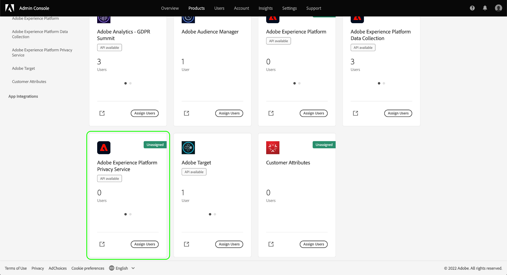

# 管理Privacy Service權限

>[!IMPORTANT]
>
>Adobe Experience Platform Privacy Service的權限已經改進，以提高其粒度級別。 這些更改使組織管理員能夠授予更多用戶以所需的角色和權限級別的訪問權限。 技術帳戶用戶必須更新其Privacy Service權限，因為此即將進行的更新對他們來說是突破性的更改。 此權限更改的強制實施將在 **2023年4月13日**。 請參閱 [遷移舊式API憑據](#migrate-tech-accounts) 以指導解決這個問題。
>
>技術帳戶可供企業客戶使用，並通過Adobe開發者控制台建立。 技術賬戶持有人的Adobe ID `@techacct.adobe.com`。 如果您不確定您是否是技術帳戶持有人，請與組織管理員聯繫。

訪問 [Adobe Experience Platform Privacy Service](./home.md) 通過在Adobe Admin Console的基於角色的細粒度權限控制。 通過建立將權限分配給用戶組的產品配置檔案，可以確定誰有權訪問Privacy Service中的哪些功能 [UI](./ui/overview.md) 和 [API](./api/overview.md)。

>[!NOTE]
>
>為Privacy ServiceAPI建立整合時，必須選擇現有產品配置檔案，以確定整合對哪些功能或操作具有權限。 請參閱上的指南 [Privacy ServiceAPI入門](./api/getting-started.md) 的子菜單。

本指南說明如何管理Privacy Service權限。

## 快速入門

為配置Privacy Service的訪問控制，您必須對與Adobe Experience Platform Privacy Service進行產品整合的組織具有管理員權限。 可授予或撤消權限的最小角色是 **產品配置檔案管理員**。 可管理權限的其他管理員角色包括 **產品管理員** （可以管理產品中的所有配置檔案）和 **系統管理員** （無限制）。 請參閱 [管理角色](https://helpx.adobe.com/enterprise/using/admin-roles.html) 的子菜單。

本指南假定您熟悉基本的Admin Console概念，如產品配置檔案，以及它們如何將產品權限授予各個用戶和組。 有關詳細資訊，請參見 [Admin Console使用手冊](https://helpx.adobe.com/tw/enterprise/using/admin-console.html)。

## 可用權限

下表概述了Privacy Service的可用權限，並說明了這些權限授予訪問權限的特定權能：

>[!NOTE]
>
>所有Privacy Service和 [!UICONTROL 退出銷售] 權限是不同的，並且彼此之間沒有功能重疊。 這是可能的，因為Privacy ServiceAPI被視為冪等。

| 類別 | 權限 | 說明 |
| --- | --- | --- |
| [!UICONTROL Privacy Service權限] | [!UICONTROL 隱私讀取權限] | 確定用戶是否可以查看現有訪問和刪除請求及其詳細資訊。 |
| [!UICONTROL Privacy Service權限] | [!UICONTROL 隱私寫入權限] | 確定用戶是否可以建立新訪問和刪除請求。 |
| [!UICONTROL Privacy Service權限] | [!UICONTROL 讀取（訪問）內容傳遞權限] | 當Privacy Service處理訪問請求時，將向該客戶發送包含客戶資料的ZIP檔案。 在查找訪問請求的詳細資訊時，此權限確定用戶是否可以訪問請求的ZIP檔案的下載連結。 |
| [!UICONTROL 選擇退出銷售權限] | [!UICONTROL 讀取權限 — 選擇不銷售] | 確定用戶是否可以查看現有的選擇退出銷售請求及其詳細資訊。 |
| [!UICONTROL 選擇退出銷售權限] | [!UICONTROL 寫權限 — 選擇不銷售] | 確定用戶是否可以建立新的選擇退出銷售請求。 |

{style="table-layout:auto"}

## 管理權限 {#manage}

要管理Privacy Service權限，請登錄到 [Admin Console](https://adminconsole.adobe.com/) 選擇 **[!UICONTROL 產品]** 的上界。 從此處，選擇 **[!UICONTROL Adobe Experience Platform Privacy Service]**。

### 選擇或建立產品配置檔案

下一螢幕顯示組織下Privacy Service的可用產品配置檔案清單。 如果不存在產品配置檔案，請選擇 **[!UICONTROL 新建配置檔案]** 建立一個。 如果您的組織中有多個需要不同訪問級別的角色或用戶組，則應為每個角色或用戶組建立單獨的產品配置檔案。

選擇產品配置檔案後，您可以使用 **[!UICONTROL 權限]** 頁籤 [編輯權限](#edit-permissions) 或選擇 **[!UICONTROL 用戶]** 頁籤 [分配用戶](#assign-users) 到配置檔案。

### 編輯配置檔案的權限 {#edit-permissions}

在 **[!UICONTROL 權限]** 頁籤，選擇任何顯示的權限類別以訪問權限編輯視圖。

編輯配置檔案的權限時，可用權限將列在左列中，而包含在配置檔案中的可用權限將列在右列中。 選擇列出的權限以在任一列之間移動它們。

權限按類別進行組織。 要在類別之間切換，請從左側導航中選擇所需的類別。

![顯示 [!UICONTROL 退出銷售] 權限部分](./images/permissions/switch-category.png)

選擇 **[!UICONTROL 保存]** 完成權限配置後。

產品配置檔案視圖將重新顯示，並反映添加的權限。

### 將用戶分配到配置檔案 {#assign-users}

要將用戶分配給產品配置檔案（並授予他們配置檔案的配置權限），請選擇 **[!UICONTROL 用戶]** 頁籤，後跟 **[!UICONTROL 添加用戶]**。

有關管理產品配置檔案的用戶的詳細資訊，請參閱 [Admin Console文檔](https://helpx.adobe.com/tw/enterprise/using/manage-product-profiles.html)。

### 將舊API憑據遷移到配置檔案 {#migrate-tech-accounts}

>[!NOTE]
>
>本節僅適用於在將Privacy Service權限整合到Adobe Admin Console之前建立的現有API憑據。 對於新憑據，產品配置檔案（及其權限）將通過 [Adobe Developer控制台項目](https://developer.adobe.com/developer-console/docs/guides/projects/) 的雙曲餘切值。  請參閱 [將產品配置檔案分配給項目](./api/getting-started.md#product-profiles) Privacy ServiceAPI入門指南中的。

以前，技術帳戶不需要產品配置檔案進行整合和權限。 但是，由於最近Privacy Service權限的改進，現在有必要將舊API憑據遷移到產品配置檔案。 此更新允許向技術帳戶持有人授予細粒度權限。 按照下面提供的步驟更新技術帳戶權限以進行Privacy Service。

#### 更新技術帳戶權限 {#update-tech-account-permissions}

為技術帳戶分配權限集的第一步是導航到 [Adobe Admin Console](https://adminconsole.adobe.com/) 並為Privacy Service建立新產品配置檔案。

從Admin ConsoleUI中，選擇 **產品** 從導航欄中，然後 **[!UICONTROL Experience Cloud]** 和 **[!UICONTROL Adobe Experience Platform Privacy Service]** 的下界。 的 [!UICONTROL 產品配置檔案] 按鈕 選擇 **新建配置檔案** 建立新產品配置檔案以進行Privacy Service。

的 [!UICONTROL 建立新產品配置檔案] 對話框。 有關如何建立產品配置檔案的完整說明，請參見 [建立配置檔案的UI指南](../access-control/ui/create-profile.md)。

保存新產品配置檔案後，導航到 [Adobe Developer控制台](https://developer.adobe.com/console/home) 登錄到那個產品或那個項目。 選擇 **[!UICONTROL 項目]** 從頂部導航，然後是項目的卡。

>[!NOTE]
>
>您可能必須清除快取和/或等待一段時間，以便新項目出現在開發人員控制台項目清單中。

登錄項目後，選擇 **[!UICONTROL Privacy ServiceAPI]** 從左側欄整合。

出現Privacy ServiceAPI整合儀表板。 在此儀表板中，可以編輯與該項目關聯的產品配置檔案。 選擇 **[!UICONTROL 編輯產品配置檔案]** 來開始處理。 的 [!UICONTROL 配置API] 對話框。

的 [!UICONTROL 配置API] 對話框顯示服務中當前存在的可用產品配置檔案。 它們與在管理控制台中建立的產品配置檔案相關。 從可用產品配置檔案清單中，選中為管理控制台中的技術帳戶建立的新產品配置檔案的複選框。 這會自動將此技術帳戶與所選產品配置檔案中的權限相關聯。 選擇 **[!UICONTROL 保存已配置的API]** 確認設定。

>[!NOTE]
>
>如果技術帳戶已與產品配置檔案關聯，則將選中可用產品配置檔案清單中的複選框之一。

#### 確認已應用您的設定 {#confirm-applied-settings}

確認已將您的設定應用於帳戶。 返回到 [Admin Console](https://adminconsole.adobe.com/) 並導航至新建立的產品配置檔案。 選擇 **[!UICONTROL API憑據]** 的子菜單。 在Developer Console中使用的項目（將產品配置檔案分配給技術帳戶）顯示在憑據清單中。 每個API憑據的名稱由項目名稱組成，項目名稱的尾碼是隨機生成的編號。 選擇要開啟的憑據 [!UICONTROL 詳細資訊] 的子菜單。

的 [!UICONTROL 詳細資訊] 面板包含有關API憑據的資訊，包括關聯的技術ID、API密鑰、建立日期和上次修改日期以及關聯的Adobe產品。

## 後續步驟

本指南介紹了Privacy Service的可用權限以及如何通過Admin Console管理這些權限。

有關如何在設定產品配置檔案後建立新API整合的步驟，請參閱 [Privacy ServiceAPI入門指南](./api/getting-started.md)。 有關管理其他Adobe Experience Platform功能權限的詳細資訊，請參閱 [訪問控制文檔](../access-control/home.md)。
